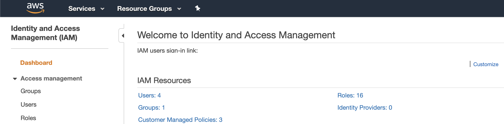
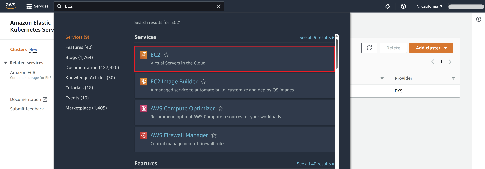
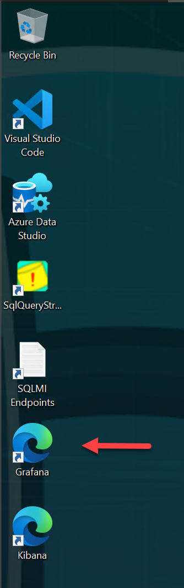
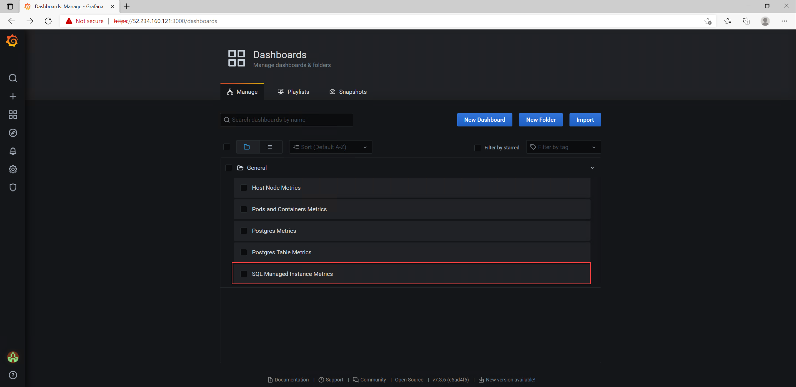
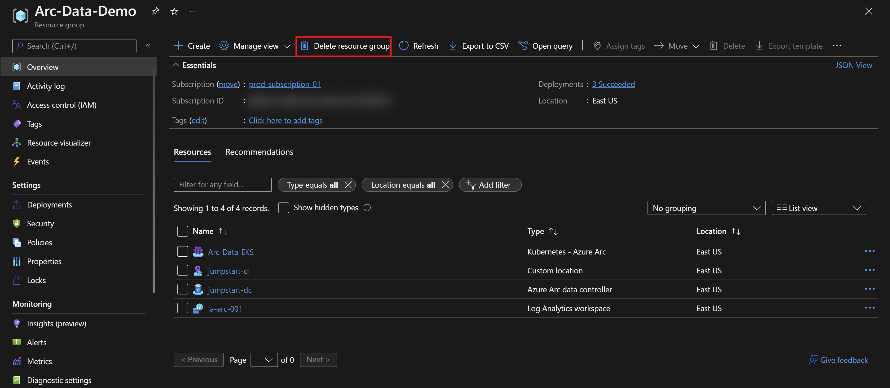
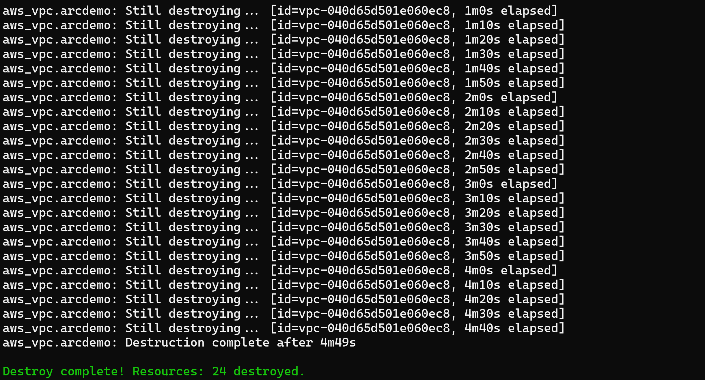
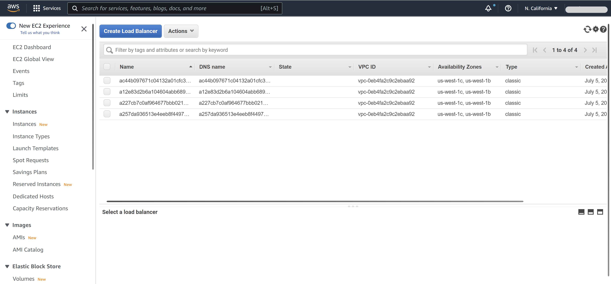
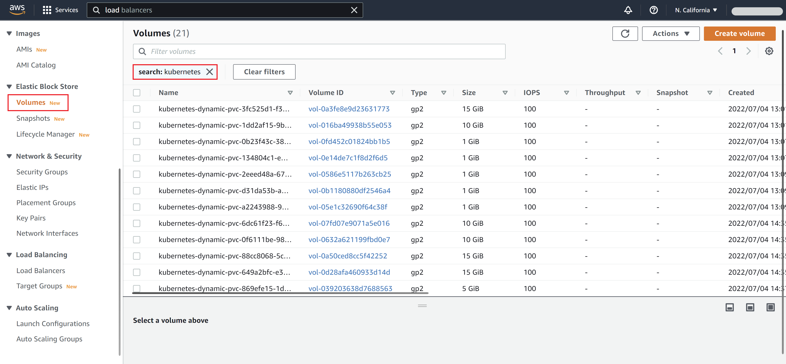

## Deploy Azure SQL Managed Instance in directly connected mode on EKS using a Terraform

The following Jumpstart scenario will guide you on how to deploy a "Ready to Go" environment so you can start using [Azure Arc-enabled data services](https://docs.microsoft.com/azure/azure-arc/data/overview) and [SQL Managed Instance](https://docs.microsoft.com/azure/azure-arc/data/managed-instance-overview) deployed on [Elastic Kubernetes Service (EKS)](https://aws.amazon.com/eks/) cluster using [Terraform](https://www.terraform.io/)

By the end of this scenario, you will have an EKS cluster deployed with an Azure Arc Data Controller, SQL Managed Instance, and a Microsoft Windows Server 2022 (Datacenter) Azure client VM, installed & pre-configured with all the required tools needed to work with Azure Arc-enabled data services.

## Prerequisites

- Clone the Azure Arc Jumpstart repository

  ```shell
  git clone https://github.com/microsoft/azure_arc.git
  ```

- [Install or update Azure CLI to version 2.49.0 and above](https://docs.microsoft.com/cli/azure/install-azure-cli?view=azure-cli-latest). Use the below command to check your current installed version.

  ```shell
  az --version
  ```

- [Install](https://docs.aws.amazon.com/cli/latest/userguide/cli-chap-install.html) and [Configure](https://docs.aws.amazon.com/cli/latest/userguide/cli-chap-configure.html#cli-quick-configuration) AWS CLI.

- [Create a free Amazon Web Services account](https://aws.amazon.com/free/) if you don't already have one.

- [Install Terraform >=1.0](https://learn.hashicorp.com/terraform/getting-started/install.html)

- Create Azure service principal (SP). To deploy this scenario, an Azure service principal assigned with multiple Role-based access control (RBAC) roles is required:

  - "Contributor" - Required for provisioning Azure resources
  - "Security admin" - Required for installing Cloud Defender Azure-Arc enabled Kubernetes extension and dismiss alerts
  - "Security reader" - Required for being able to view Azure-Arc enabled Kubernetes Cloud Defender extension findings
  - "Monitoring Metrics Publisher" - Required for being Azure Arc-enabled data services billing, monitoring metrics, and logs management

    To create it login to your Azure account run the below command (this can also be done in [Azure Cloud Shell](https://shell.azure.com/).

    ```shell
    az login
    subscriptionId=$(az account show --query id --output tsv)
    az ad sp create-for-rbac -n "<Unique SP Name>" --role "Contributor" --scopes /subscriptions/$subscriptionId
    az ad sp create-for-rbac -n "<Unique SP Name>" --role "Security admin" --scopes /subscriptions/$subscriptionId
    az ad sp create-for-rbac -n "<Unique SP Name>" --role "Security reader" --scopes /subscriptions/$subscriptionId
    az ad sp create-for-rbac -n "<Unique SP Name>" --role "Monitoring Metrics Publisher" --scopes /subscriptions/$subscriptionId
    ```

    For example:

    ```shell
    az login
    subscriptionId=$(az account show --query id --output tsv)
    az ad sp create-for-rbac -n "JumpstartArcDataSvc" --role "Contributor" --scopes /subscriptions/$subscriptionId
    az ad sp create-for-rbac -n "JumpstartArcDataSvc" --role "Security admin" --scopes /subscriptions/$subscriptionId
    az ad sp create-for-rbac -n "JumpstartArcDataSvc" --role "Security reader" --scopes /subscriptions/$subscriptionId
    az ad sp create-for-rbac -n "JumpstartArcDataSvc" --role "Monitoring Metrics Publisher" --scopes /subscriptions/$subscriptionId
    ```

    Output should look like this:

    ```json
    {
    "appId": "XXXXXXXXXXXXXXXXXXXXXXXXXXXX",
    "displayName": "JumpstartArcDataSvc",
    "password": "XXXXXXXXXXXXXXXXXXXXXXXXXXXX",
    "tenant": "XXXXXXXXXXXXXXXXXXXXXXXXXXXX"
    }
    ```

    > **NOTE: If you create multiple subsequent role assignments on the same service principal, your client secret (password) will be destroyed and recreated each time. Therefore, make sure you grab the correct password**.

    > **NOTE: The Jumpstart scenarios are designed with as much ease of use in-mind and adhering to security-related best practices whenever possible. It is optional but highly recommended to scope the service principal to a specific [Azure subscription and resource group](https://docs.microsoft.com/cli/azure/ad/sp?view=azure-cli-latest) as well considering using a [less privileged service principal account](https://docs.microsoft.com/azure/role-based-access-control/best-practices)**

- Follow the steps [here](https://docs.microsoft.com/azure/azure-arc/kubernetes/custom-locations#enable-custom-locations-on-cluster) or run the command below to retrieve your AAD Tenant Specific ObjectID for the "Custom Locations RP" Enterprise Application needed to onboard Custom Locations on EKS:
  
  ```shell
  # Note that the APPLICATION ID: bc313c14-388c-4e7d-a58e-70017303ee3b is constant across all tenants
  az ad sp show --id 'bc313c14-388c-4e7d-a58e-70017303ee3b' --query id -o tsv
  ```
- Create a resource group

   ```shell
   az group create --name "Arc-Data-Demo" --location "eastus"
   ```
### Create a new AWS IAM Role & Key

Create AWS User IAM Key. An access key grants programmatic access to your resources which we will be using later in this scenario.

- Navigate to the [IAM Access page](https://console.aws.amazon.com/iam/home#/home).

    

- Select the **Users** from the side menu.

    

- Select the **User** you want to create the access key for.

    

- Select **Security credentials** of the **User** selected.

    

- Under **Access Keys** select **Create Access Keys**.

    

- In the popup window it will show you the ***Access key ID*** and ***Secret access key***. Save both of these values to configure the **Terraform plan** variables later.

    

- In order to open a RDP session to the Windows Client EC2 instance, an EC2 Key Pair is required. From the *Services* menu, click on *"EC2"*, enter the *Key Pairs* settings from the left sidebar (under the *Network & Security* section) and click on *"Create key pair"* (top-right corner) to create a new key pair.

  

  

  

- Provide a meaningful name, for example *terraform*, and click on *"Create key pair"* which will then automatically download the created *pem* file.

  

  

  

- Copy the downloaded *pem* file to where the terraform binaries are located (in your cloned repository directory).

  

  > **NOTE: EC2 Key Pairs are regional.**

## Automation Flow

For you to get familiar with the automation and deployment flow, below is an explanation.

- User is editing the Terraform runtime environment variables in the _terraform.tfvars_ file (1-time edit). The variables are being used throughout the deployment.

- [Screenshot showing creating the main Terraform plan](https://github.com/microsoft/azure_arc/tree/main/azure_arc_data_jumpstart/eks/terraform/main.tf) will initiate the deployment of the other modules:

  - [_clientVM_](https://github.com/microsoft/azure_arc/tree/main/azure_arc_data_jumpstart/eks/terraform/modules/clientVM/main.tf) - Deploys the client Windows VM. This is where all user interactions with the environment are made from.
  - [_cluster_](https://github.com/microsoft/azure_arc/tree/main/azure_arc_data_jumpstart/eks/terraform/modules/cluster/main.tf) - Deploys the EKS cluster where all the Azure Arc data services will be deployed.
  - [workers](https://github.com/microsoft/azure_arc/tree/main/azure_arc_data_jumpstart/eks/terraform/modules/workers/main.tf) - Deploys the EKS cluster's worker nodes.

- User remotes into client Windows VM, which automatically kicks off the DataServicesLogonScript PowerShell script that deploy and configure Azure Arc-enabled data services on the EKS cluster including the data controller and SQL Managed Instance.

- In addition to deploying the data controller and SQL Managed Instance, the sample [_AdventureWorks_](https://docs.microsoft.com/sql/samples/adventureworks-install-configure?view=sql-server-ver15&tabs=ssms) database will restored automatically for you as well.

## Deployment

As mentioned, the Terraform plan will deploy an EKS cluster, the Azure Arc Data Controller and the SQL Managed Instance on that cluster and an EC2 Windows Server 2022 Client instance.

- Before running the Terraform plan, create a terraform.tfvars file in the root of the terraform folder and supply some values for your environment.

   ```HCL
    AWS_ACCESS_KEY_ID      = "ZFTIFC443FTFDEZ5TKNR"
    AWS_SECRET_ACCESS_KEY  = "fakeSecretValue1dfd343sd5712adfddjh"
    AWS_DEFAULT_REGION     = "us-west-1"
    azureLocation          = "eastus"
    spnClientId            = "1414133c-9786-53a4-b231-f87c143ebdb1"
    spnClientSecret        = "fakeSecretValue123458125712ahjeacjh"
    spnTenantId            = "33572583-d294-5b56-c4e6-dcf9a297ec17"
    subscriptionId         = "33987583-A984-5C87-T4e3-POf7a397ec17"
    resourceGroup          = "Arc-Data-Demo"
    workspaceName          = "la-arc-001"
    deploySQLMI            = true
    SQLMIHA                = false
    deployPostgreSQL       = false
    customLocationObjectId = "649cb28f-bc13-492a-9470-c8bf01fa8eeb"
  ```

- Variable reference:

  - **_`AWS_ACCESS_KEY_ID`_** - Your AWS access key.
  - **_`AWS_SECRET_ACCESS_KEY`_** - Your AWS secret access key.
  - **_`AWS_DEFAULT_REGION`_** - AWS location code (e.g. 'us-west-1', 'us-east-2', etc.).
  - **_`azureLocation`_** - Azure location code (e.g. 'eastus', 'westus2', etc.).
  - **_`spnClientId`_** - Your Azure service principal id.
  - **_`spnClientSecret`_** - Your Azure service principal secret.
  - **_`spnTenantId`_** - Your Azure tenant id.
  - **_`subscriptionId`_** - Your Azure subscription Id.
  - **_`resourceGroup`_** - Resource group which will contain all of the Azure Arc data services resources.
  - **_`workspaceName`_** - Unique name for the ArcBox Log Analytics workspace.
  - _`deploySQLMI`_ - Boolean that sets whether or not to deploy SQL Managed Instance, for this data controller vanilla scenario we leave it set to _**false**_.
  - _`SQLMIHA`_ - Boolean that sets whether or not to deploy SQL Managed Instance with high-availability (business continuity) configurations, for this data controller vanilla scenario we leave it set to _**false**_.
  - _`deployPostgreSQL`_ - Boolean that sets whether or not to deploy PostgreSQL, for this data controller vanilla scenario we leave it set to _**false**_.
  - **_`customLocationObjectId`_** - The Azure AD application used by Azure Arc service retrieved in the prerequisites section.

> **NOTE: Any variables in bold are required. If any optional parameters are not provided, defaults will be used.**

> **Note:** In case you decided to deploy SQL Managed Instance in an highly-available fashion, refer to the ["Perform database failover with SQL Managed Instance Availability Groups"](../../day2/aks/aks_mssql_ha/_index.md) Jumpstart scenario as well as the ["High Availability with Azure Arc-enabled SQL Managed Instance"](https://learn.microsoft.com/azure/azure-arc/data/managed-instance-high-availability) product documentation.

- Now you will deploy the Terraform file. Navigate to the local cloned [deployment folder](https://github.com/microsoft/azure_arc/tree/main/azure_arc_data_jumpstart/eks/terraform) and run the commands below:

  ```shell
  terraform init
  terraform plan -out=infra.out
  terraform apply "infra.out"
  ```

> **NOTE: The deployment time for this scenario can take ~20-35min**

- Example output from `terraform init`:

  

- Example output from `terraform plan -out=infra.out`:

  

- Once completed, the plan will output a decrypted password for your Windows Client instance that you will use to RDP into it. Before connecting to the Client instance, you can review the EKS cluster and the EC2 instances created. Notice how 4 instances were created; 3 EKS nodes and the Client instance.

  

  

  

  

  

  

## Windows Login & Post Deployment

- Now that the first phase of the automation is completed, it is time to RDP to the client VM. Select the Windows instance, click *"Connect"* and download the Remote Desktop file.

  

  

- Using the decrypted password generated from the plan output, RDP the Windows instance. In case you need to get the password later, use the ```terraform output``` command to re-present the plan output.

- At first login, as mentioned in the "Automation Flow" section above, the [_DataServicesLogonScript_](https://github.com/microsoft/azure_arc/tree/main/azure_arc_data_jumpstart/eks/terraform/artifacts/DataServicesLogonScript.ps1) PowerShell logon script will start it's run.

- Let the script to run its course and **do not close** the PowerShell session, this will be done for you once completed. Once the script will finish it's run, the logon script PowerShell session will be closed, the Windows wallpaper will change and the Azure Arc Data Controller will be deployed on the cluster and be ready to use.


    

    

    

    

    

    

    

    

    

    

    

    

    

- Since this scenario is deploying the Azure Arc Data Controller and SQL Managed Instance, you will also notice additional newly deployed Azure resources in the resources group (at this point you should have **5 various Azure resources deployed**.

  - _Azure Arc-enabled Kubernetes cluster_ - Azure Arc-enabled data services deployed in directly connected are using this type of resource in order to deploy the data services [cluster extension](https://docs.microsoft.com/azure/azure-arc/kubernetes/conceptual-extensions) as well as for using Azure Arc [Custom locations](https://docs.microsoft.com/azure/azure-arc/kubernetes/conceptual-custom-locations).

  - _Custom location_ - Provides a way for tenant administrators to use their Azure Arc-enabled Kubernetes clusters as target locations for deploying Azure services instances.

  - _Azure Arc Data Controller_ - The data controller that is now deployed on the Kubernetes cluster.

  - _Azure Arc-enabled SQL Managed Instance_ - The SQL Managed Instance that is now deployed on the Kubernetes cluster.

    

- As part of the automation, Azure Data Studio is installed along with the _Azure Data CLI_, _Azure CLI_, _Azure Arc_ and the _PostgreSQL_ extensions. Using the Desktop shortcut created for you, open Azure Data Studio and click the Extensions settings to see the installed extensions.

  

  

- Additionally, the SQL Managed Instance connection will be configured automatically for you. As mentioned, the sample _AdventureWorks_ database was restored as part of the automation.

  

## Cluster extensions

In this scenario, two Azure Arc-enabled Kubernetes cluster extensions were installed:

- _azuremonitor-containers_ - The Azure Monitor Container Insights cluster extension. To learn more about it, you can check our Jumpstart ["Integrate Azure Monitor for Containers with GKE as an Azure Arc Connected Cluster using Kubernetes extensions](https://azurearcjumpstart.io/azure_arc_jumpstart/azure_arc_k8s/day2/gke/gke_monitor_extension/) scenario.

- _arc-data-services_ - The Azure Arc-enabled data services cluster extension that was used throughout this scenario in order to deploy the data services infrastructure.

In order to view these cluster extensions, click on the Azure Arc-enabled Kubernetes resource Extensions settings.

  

  

## High Availability with SQL Always-On availability groups

Azure Arc-enabled SQL Managed Instance is deployed on Kubernetes as a containerized application and uses kubernetes constructs such as stateful sets and persistent storage to provide built-in health monitoring, failure detection, and failover mechanisms to maintain service health. For increased reliability, you can also configure Azure Arc-enabled SQL Managed Instance to deploy with extra replicas in a high availability configuration.

For showcasing and testing SQL Managed Instance with [Always On availability groups](https://docs.microsoft.com/azure/azure-arc/data/managed-instance-high-availability#deploy-with-always-on-availability-groups), a dedicated [Jumpstart scenario](https://azurearcjumpstart.io/azure_arc_jumpstart/azure_arc_data/day2/aks/aks_mssql_ha/) is available to help you simulate failures and get hands-on experience with this deployment model.

## Operations

### Azure Arc-enabled SQL Managed Instance stress simulation

Included in this scenario, is a dedicated SQL stress simulation tool named _SqlQueryStress_ automatically installed for you on the Client VM. _SqlQueryStress_ will allow you to generate load on the Azure Arc-enabled SQL Managed Instance that can be done used to showcase how the SQL database and services are performing as well to highlight operational practices described in the next section.

- To start with, open the _SqlQueryStress_ desktop shortcut and connect to the SQL Managed Instance **primary** endpoint IP address. This can be found in the _SQLMI Endpoints_ text file desktop shortcut that was also created for you alongside the username and password you used to deploy the environment.

  

  

> **NOTE: Secondary SQL Managed Instance endpoint will be available only when using the [HA deployment model ("Business Critical")](https://azurearcjumpstart.io/azure_arc_jumpstart/azure_arc_data/day2/cluster_api/capi_azure/capi_mssql_ha/).**

- To connect, use "SQL Server Authentication" and select the deployed sample _AdventureWorks_ database (you can use the "Test" button to check the connection).

  

- To generate some load, we will be running a simple stored procedure. Copy the below procedure and change the number of iterations you want it to run as well as the number of threads to generate even more load on the database. In addition, change the delay between queries to 1ms for allowing the stored procedure to run for a while.

    ```sql
    exec [dbo].[uspGetEmployeeManagers] @BusinessEntityID = 8
    ```

- As you can see from the example below, the configuration settings are 100,000 iterations, five threads per iteration, and a 1ms delay between queries. These configurations should allow you to have the stress test running for a while.

  

  

### Azure Arc-enabled SQL Managed Instance monitoring using Grafana

When deploying Azure Arc-enabled data services, a [Grafana](https://grafana.com/) instance is also automatically deployed on the same Kubernetes cluster and include built-in dashboards for both Kubernetes infrastructure as well SQL Managed Instance monitoring (PostgreSQL dashboards are included as well but we will not be covering these in this section).

- Now that you have the _SqlQueryStress_ stored procedure running and generating load, we can look how this is shown in the the built-in Grafana dashboard. As part of the automation, a new URL desktop shortcut simply named "Grafana" was created.

  

- [Optional] The IP address for this instance represents the Kubernetes _LoadBalancer_ external IP that was provision as part of Azure Arc-enabled data services. Use the _`kubectl get svc -n arc`_ command to view the _metricsui_ external service IP address.

  

- To log in, use the same username and password that is in the _SQLMI Endpoints_ text file desktop shortcut.

  

- Navigate to the built-in "SQL Managed Instance Metrics" dashboard.

  

  

- Change the dashboard time range to "Last 5 minutes" and re-run the stress test using _`SqlQueryStress`_ (in case it was already finished).

  

- You can now see how the SQL graphs are starting to show increased activity and load on the database instance.

  

  

## Delete the deployment

- If you want to delete the entire Azure environment, simply delete the deployment resource group from the Azure portal.

    

- If you want to delete the entire environment, use the _`terraform destroy`_ to delete all of the AWS resources.

  ```shell
  terraform destroy --auto-approve
  ```

  

  > **NOTE: Because the following resources were created by EKS that creates internal AWS dependencies that Terraform has no knowledge of from our plan, we need to delete the resources from AWS console as `terraform destroy` is cleaning up - this allows us to avoid dependency conflicts and ongoing billing from orphaned resources such as EKS Volumes.**

- While the `destroy` command is running, delete any new Load Balancers created as EKS Services (`EC2 > Load Balancing > Load Balancers`) that are deployed in AWS from the Console:

  

- While the `destroy` command is running, delete any new Elastic Block Stores, created as EKS Persistent Volumes (`EC2 > Elastic Block Store > Volumes`) that are deployed in AWS from the Console:

  