## Deploy a SQL Managed Instance on EKS using Terraform

The following README will guide you on how to deploy a "Ready to Go" environment so you can start using Azure Arc Data Services and deploy Azure data services with SQL Managed Instance on an [Elastic Kubernetes Service (EKS)](https://aws.amazon.com/eks/) cluster using [Terraform](https://www.terraform.io/).

By the end of this guide, you will have an EKS cluster deployed with an Azure Arc Data Controller running a SQL Managed Instance, and a Microsoft Windows Server 2019 (Datacenter) AWS EC2 instance VM, installed and pre-configured with all the required tools needed to work with Azure Arc Data Services:


> **Note: Currently, Azure Arc-enabled data services with PostgreSQL Hyperscale is in [public preview](https://docs.microsoft.com/en-us/azure/azure-arc/data/release-notes)**.

## Deployment Process Overview

* Create AWS IAM Role
* Create & download AWS Key Pair
* Clone the Azure Arc Jumpstart repository
* Edit *TF_VAR* variables values
* *terraform init*
* *terraform apply*
* Automation scripts run in Client VM
* EKS cleanup
* *terraform destroy*

## Prerequisites

* Clone the Azure Arc Jumpstart repository

  ```shell
  git clone https://github.com/microsoft/azure_arc.git
  ```

* [Install AWS IAM Authenticator](https://docs.aws.amazon.com/eks/latest/userguide/install-aws-iam-authenticator.html)

* [Install or update Azure CLI to version 2.25.0 and above](https://docs.microsoft.com/en-us/cli/azure/install-azure-cli?view=azure-cli-latest). Use the below command to check your current installed version.

  ```shell
  az --version
  ```

* [Create a free Amazon Web Services account](https://aws.amazon.com/free/) if you don't already have one.

* [Install Terraform >=1.0](https://learn.hashicorp.com/terraform/getting-started/install.html)

* Create Azure service principal (SP). To deploy this scenario, an Azure service principal assigned with multiple RBAC roles is required:

  * "Contributor" - Required for provisioning Azure resources
  * "Security admin" - Required for installing Cloud Defender Azure-Arc enabled Kubernetes extension and dismiss alerts
  * "Security reader" - Required for being able to view Azure-Arc enabled Kubernetes Cloud Defender extension findings
  * "Monitoring Metrics Publisher" - Required for being Azure Arc-enabled data services billing, monitoring metrics, and logs management

    To create it login to your Azure account run the below command (this can also be done in [Azure Cloud Shell](https://shell.azure.com/).

    ```shell
    az login
    az ad sp create-for-rbac -n "<Unique SP Name>" --role "Contributor"
    az ad sp create-for-rbac -n "<Unique SP Name>" --role "Security admin"
    az ad sp create-for-rbac -n "<Unique SP Name>" --role "Security reader"
    az ad sp create-for-rbac -n "<Unique SP Name>" --role "Monitoring Metrics Publisher"
    ```

    For example:

    ```shell
    az ad sp create-for-rbac -n "JumpstartArcDataSvc" --role "Contributor"
    az ad sp create-for-rbac -n "JumpstartArcDataSvc" --role "Security admin"
    az ad sp create-for-rbac -n "JumpstartArcDataSvc" --role "Security reader"
    az ad sp create-for-rbac -n "JumpstartArcDataSvc" --role "Monitoring Metrics Publisher"
    ```

    Output should look like this:

    ```json
    {
    "appId": "XXXXXXXXXXXXXXXXXXXXXXXXXXXX",
    "displayName": "AzureArcData",
    "name": "http://AzureArcData",
    "password": "XXXXXXXXXXXXXXXXXXXXXXXXXXXX",
    "tenant": "XXXXXXXXXXXXXXXXXXXXXXXXXXXX"
    }
    ```

  > **Note: The Jumpstart scenarios are designed with as much ease of use in-mind and adhering to security-related best practices whenever possible. It is optional but highly recommended to scope the service principal to a specific [Azure subscription and resource group](https://docs.microsoft.com/en-us/cli/azure/ad/sp?view=azure-cli-latest) as well considering using a [less privileged service principal account](https://docs.microsoft.com/en-us/azure/role-based-access-control/best-practices)**

* Follow the steps [here](https://docs.microsoft.com/en-us/azure/azure-arc/kubernetes/custom-locations#enable-custom-locations-on-cluster) or run the command below to retrieve your AAD Tenant Specific ObjectID for the "Custom Locations RP" Enterprise Application needed to onboard Custom Locations on EKS:
  
  ```shell
  # Note that the APPLICATION ID: bc313c14-388c-4e7d-a58e-70017303ee3b is constant across all tenants
  az ad sp show --id 'bc313c14-388c-4e7d-a58e-70017303ee3b' --query objectId -o tsv

  # 51dfe1e8-70c6-4de5-a08e-e18aff23d815 <-- This is the OBJECT ID specific to Microsoft's AAD Tenant
  # This output will be different for your tenant - use this

  ```

## Create a new AWS IAM Role & Key

Create AWS User IAM Key. An access key grants programmatic access to your resources which we will be using later on in this guide.

* Navigate to the [IAM Access page](https://console.aws.amazon.com/iam/home#/home).

    

* Select the **Users** from the side menu.

    

* Select the **User** you want to create the access key for.

    

* Select **Security credentials** of the **User** selected.

    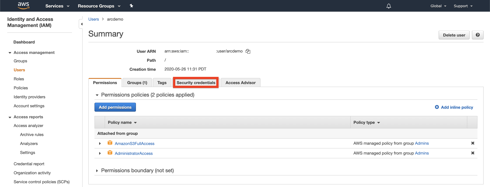

* Under **Access Keys** select **Create Access Keys**.

    

* In the popup window it will show you the ***Access key ID*** and ***Secret access key***. Save both of these values to configure the **Terraform plan** variables later.

    

* In order to open a RDP session to the Windows Client EC2 instance, an EC2 Key Pair is required. From the *Services* menu, click on *"EC2"*, enter the *Key Pairs* settings from the left sidebar (under the *Network & Security* section) and click on *"Create key pair"* (top-right corner) to create a new key pair.

  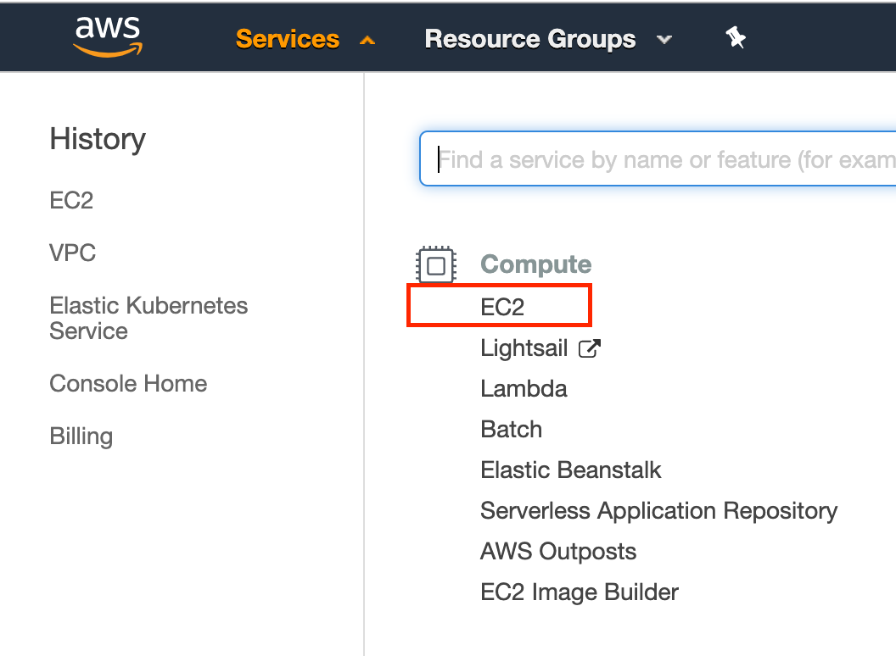

  

  

* Provide a meaningful name, for example *terraform*, and click on *"Create key pair"* which will then automatically download the created *pem* file.

  

  

  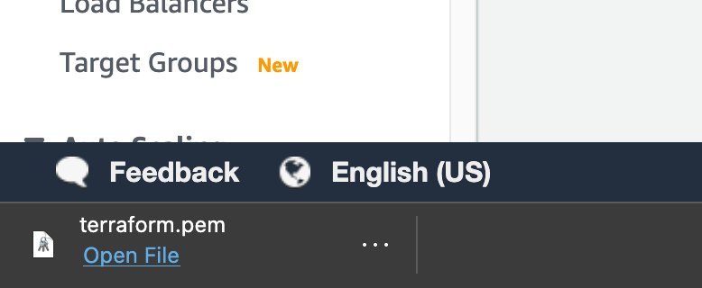

* Copy the downloaded *pem* file to where the terraform binaries are located (in your cloned repository directory).

  

  > **Note: EC2 Key Pairs are regional.**

## Automation Flow

Read the below explanation to get familiar with the automation and deployment flow.

* User edits and exports Terraform runtime environment variables, AKA *TF_VAR* (1-time edit). The variables are being used throughout the deployment.

* User deploys the Terraform plan which will deploy the EKS cluster and the AWS compute instance VM as well as an Azure resource group. The Azure resource group is required to host the Azure Arc services such as the Azure Arc-enabled Kubernetes cluster, the custom location, the Azure Arc data controller, and any database services you deploy on top of the data controller.

* In addition, the plan will copy the EKS *kubeconfig* file as well as the *configmap.yml* file (which is responsible for having the EKS nodes communicate with the cluster control plane) on to the Windows instance.

* As part of the Windows Server 2019 VM deployment, there are 3 script executions:

  1. *azure_arc.ps1* script will be created automatically as part of the Terraform plan runtime and is responsible on injecting the *TF_VAR* variables values on to the Windows instance which will then be used in both the *ClientTools* and the *LogonScript* scripts.

  2. *Bootstrap.ps1* script will run at the Terraform plan runtime Runtime and will:
      * Create the *Bootstrap.log* file  
      * Install the required tools – az cli, az cli Powershell module, kubernetes-cli, Visual C++ Redistributable, helm, vscode, etc. (Chocolaty packages)
      * Download Azure Data Studio & Azure Data CLI
      * Disable Windows Server Manager, remove Internet Explorer, disable Windows Firewall
      * Download the DataServicesLogonScript.ps1 PowerShell script
      * Create the Windows schedule task to run the DataServicesLogonScript at first login

  3. *DataServicesLogonScript.ps1* script will run on user first logon to Windows and will:
      * Create the *DataServicesLogonScript.log* file
      * Install the Azure Data Studio Azure Data CLI, Azure Arc & PostgreSQL extensions
      * Create the Azure Data Studio desktop shortcut
      * Apply the *configmap.yml* file on the EKS cluster
      * Use Azure CLI to connect the EKS cluster to Azure as an Azure Arc-enabled Kubernetes cluster
      * Create a custom location for use with the Azure Arc-enabled Kubernetes cluster
      * Deploy ARM templates that will deploy the Azure Arc data controller and SQL Managed Instance on the EKS cluster
      * Open another Powershell session which will execute a command to watch the deployed Azure Arc Data Controller Kubernetes pods
      * Unregister the logon script Windows schedule task so it will not run after first login

## Deployment

As mentioned, the Terraform plan will deploy an EKS cluster, the Azure Arc Data Controller on that cluster and an EC2 Windows Server 2019 Client instance.

* Before running the Terraform plan, edit the below *TF_VAR* values and export it (simply copy/paste it after you finished edit these). An example *TF_VAR* shell script file is located [here](https://github.com/microsoft/azure_arc/blob/main/azure_arc_data_jumpstart\eks\terraform\example\TF_VAR_datacontroller_only_example.sh)

  

  * *export TF_VAR_aws_region*='Your AWS region where resources will get deployed' (Since key pairs are regional, make sure both AWS region and availability zone matches the ones where the key pair was created)
  * *export TF_VAR_aws_availabilityzone*='Your AWS availability zone' (Since key pairs are regional, make sure both AWS region and availability zone matches the ones where the key pair was created)
  * *export TF_VAR_key_name*='Your AWS Key Pair name (Created in the prerequisites section)'
  * *export TF_VAR_key_pair_filename*='Your AWS Key Pair *.pem filename (Created in the prerequisites section)'
  * *export TF_VAR_AWS_ACCESS_KEY_ID*='Your AWS Access Key ID (Created in the prerequisites section)'
  * *export TF_VAR_AWS_SECRET_ACCESS_KEY*='Your AWS Secret Key (Created in the prerequisites section)'
  * *export TF_VAR_hostname*='Your Windows Client EC2 instance name'
  * *export TF_VAR_cluster_name*='Your EKS cluster name'
  * *export TF_VAR_eks_instance_types*='Your EKS cluster instance type'
  * *export TF_VAR_windows_instance_types*='Your Windows Client EC2 instance type'
  * *export TF_VAR_AZDATA_USERNAME*='Azure Arc Data Controller admin username'
  * *export TF_VAR_AZDATA_PASSWORD*='Azure Arc Data Controller admin password' (The password must be at least 8 characters long and contain characters from three of the following four sets: uppercase letters, lowercase letters, numbers, and symbols)
  * *export TF_VAR_ACCEPT_EULA*='Accepting End User License Agreement for azdata
  * *export TF_VAR_ARC_DC_NAME*='Azure Arc Data Controller name’ (The name must consist of lowercase alphanumeric characters or ‘-', and must start and end with a alphanumeric character. This name will be used for k8s namespace as well)
  * *export TF_VAR_ARC_DC_SUBSCRIPTION*='Azure Arc Data Controller Azure subscription ID'
  * *export TF_VAR_ARC_DC_RG*='Azure resource group where all future Azure Arc resources will be deployed'
  * *export TF_VAR_ARC_DC_REGION*='Azure location where the Azure Arc Data Controller resource will be created in Azure' (Currently, supported regions supported are eastus, eastus2, centralus, westus2, westeurope, southeastasia)
  * *export TF_VAR_SPN_CLIENT_ID*='Your Azure service principal name'
  * *export TF_VAR_SPN_CLIENT_SECRET*='Your Azure service principal password'
  * *export TF_VAR_SPN_TENANT_ID*='Your Azure tenant ID'
  * *export TF_VAR_CUSTOM_LOCATION_OID*='Your AAD tenant specific Custom Locations RP Object ID'
  * *export TF_VAR_SPN_AUTHORITY*=*https://login.microsoftonline.com* **Do not change**
  * *export TF_VAR_deploy_SQLMI*=*'Boolean that sets whether or not to deploy SQL Managed Instance, for this scenario we set to true’
  * *export TF_VAR_deploy_PostgreSQL*=*'Boolean that sets whether or not to deploy PostgreSQL Hyperscale, for this scenario we set to false'
  * *export TF_VAR_templateBaseUrl*=*'GitHub URL to the deployment template - filled in by default to point to Microsoft/Azure Arc repository, but you can point this to your forked repo as well - e.g. `https://raw.githubusercontent.com/your--github--account/azure_arc/your--branch/azure_arc_data_jumpstart/eks/terraform/.`'
  
    > **Note: If you are running in a Windows environment and need a Linux shell, check out Ubuntu from the Microsoft Store [here](https://www.microsoft.com/en-us/p/ubuntu/9nblggh4msv6#activetab=pivot:overviewtab) to get a Linux terminal on your Windows Machine.**

* Navigate to the folder that has Terraform binaries.

  ```shell
  cd azure_arc_data_jumpstart/eks/mssql_mi/terraform/
  ```

* Run the ```terraform init``` command which is used to initialize a working directory containing Terraform configuration files and load the required Terraform providers.

  

* (Optional but recommended) Run the ```terraform plan``` command to make sure everything is configured properly.

  

* Run the ```terraform apply --auto-approve``` command and wait for the plan to finish. **Runtime for deploying all the AWS resources for this plan is ~30min.**

* Once completed, the plan will output a decrypted password for your Windows Client instance. Before connecting to the Client instance, you can review the EKS cluster and the EC2 instances created. Notice how 3 instances were created; 2 EKS nodes and the Client instance.

  

  

  

  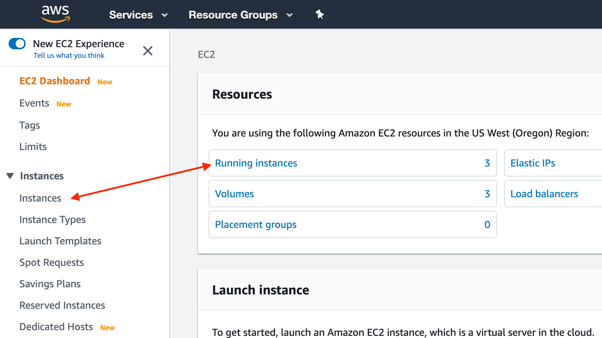

  

  

* In the Azure Portal, a new empty Azure resource group was created which will be used for Azure Arc Data Controller and the other data services you will be deploying in the future.

  

## Windows Login & Post Deployment

Now that we have both the EKS cluster and the Windows Server Client instance created, it is time to login to the Client VM.

* Select the Windows instance, click *"Connect"* and download the Remote Desktop file.

  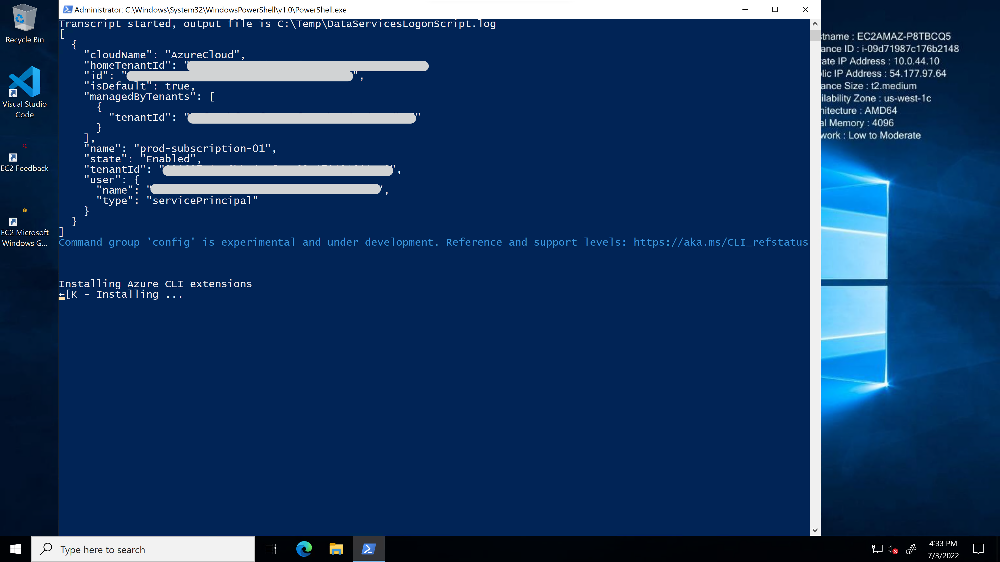

  

  

* Using the decrypted password, RDP the Windows instance. In case you need to get the password later, use the ```terraform output``` command to re-present the plan output.

* At first login, as mentioned in the "Automation Flow" section, a logon script will get executed. This script was created as part of the automated deployment process.

* Let the script to run it's course and **do not close** the PowerShell session, this will be done for you once completed. You will notice that the Azure Arc Data Controller gets deployed on the EKS cluster. **The logon script run time is approximately 10min long**.

    Once the script will finish it's run, the logon script PowerShell session will be close and the Azure Arc Data Controller and SQL Managed Instance will be deployed on the EKS cluster and be ready to use.

    

    

    

    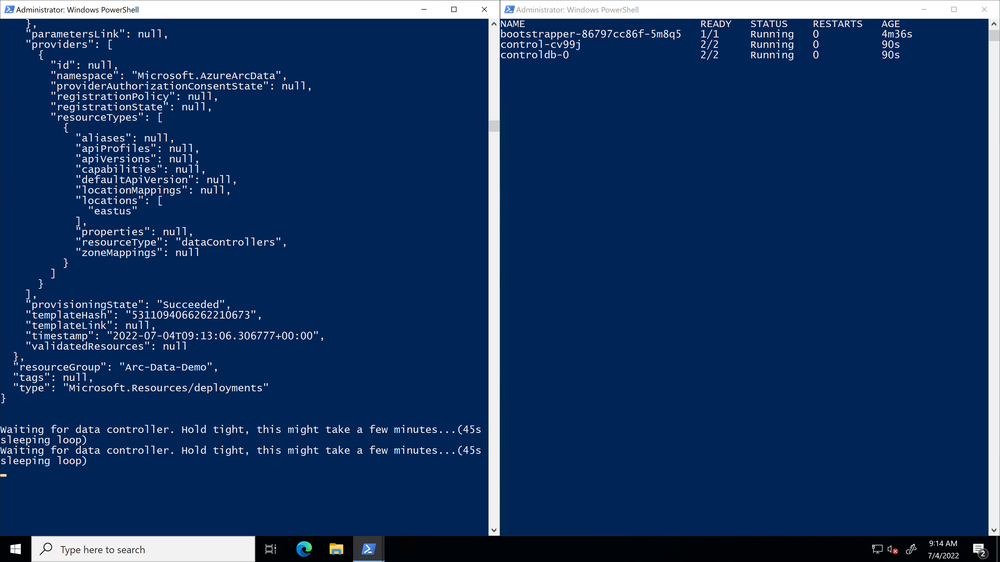

    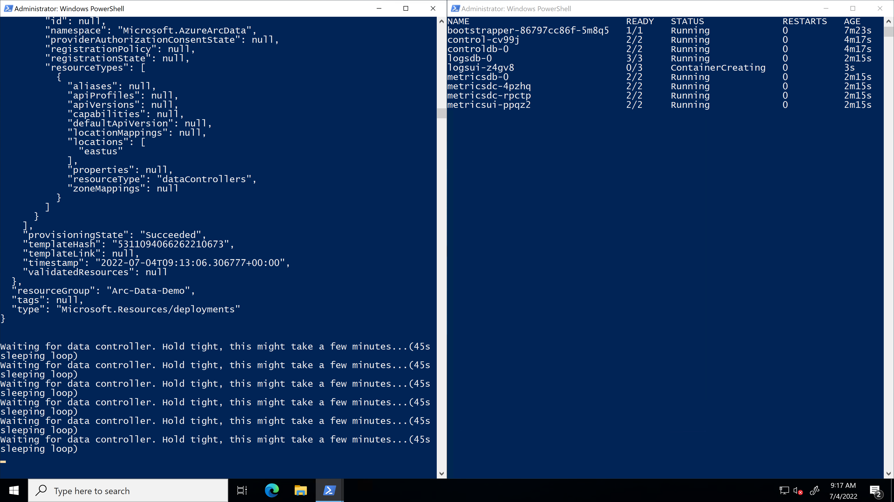

    

    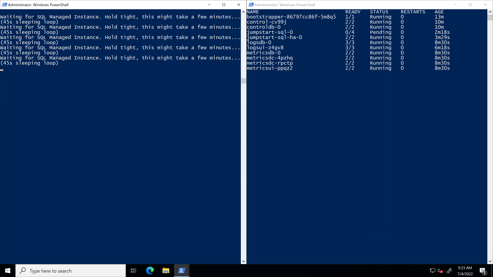

* Another tool automatically deployed is Azure Data Studio along with the *Azure Data CLI*, the *Azure Arc* and the *PostgreSQL* extensions. Azure Data Studio is automatically opened after the deployment finishes.

* From Azure Data Studio, click on the MSSQL_MI instance and view the sample AdventureWorks database.

  

  

## Operations

### Azure Arc-enabled SQL Managed Instance Stress Simulation

Included in this scenario, is a dedicated SQL stress simulation tool named _SqlQueryStress_ automatically installed for you on the Client VM. _SqlQueryStress_ will allow you to generate load on the Azure Arc-enabled SQL Managed Instance that can be done used to showcase how the SQL database and services are performing as well to highlight operational practices described in the next section.

* To start with, open the _SqlQueryStress_ desktop shortcut and connect to the SQL Managed Instance **primary** endpoint IP address. This can be found in the _SQLMI Endpoints_ text file desktop shortcut that was also created for you alongside the username and password you used to deploy the environment.

  

  

> **Note: Secondary SQL Managed Instance endpoint will be available only when using the HA deployment model ("Business Critical").**

* To connect, use "SQL Server Authentication" and select the deployed sample _AdventureWorks_ database (you can use the "Test" button to check the connection).

  

* To generate some load, we will be running a simple stored procedure. Copy the below procedure and change the number of iterations you want it to run as well as the number of threads to generate even more load on the database. In addition, change the delay between queries to 1ms for allowing the stored procedure to run for a while.

    ```sql
    exec [dbo].[uspGetEmployeeManagers] @BusinessEntityID = 8
    ```

* As you can see from the example below, the configuration settings are 100,000 iterations, five threads per iteration, and a 1ms delay between queries. These configurations should allow you to have the stress test running for a while.

  

  

### Azure Arc-enabled SQL Managed Instance monitoring using Grafana

When deploying Azure Arc-enabled data services, a [Grafana](https://grafana.com/) instance is also automatically deployed on the same Kubernetes cluster and include built-in dashboards for both Kubernetes infrastructure as well SQL Managed Instance monitoring (PostgreSQL dashboards are included as well but we will not be covering these in this section).

* Now that you have the _SqlQueryStress_ stored procedure running and generating load, we can look how this is shown in the the built-in Grafana dashboard. As part of the automation, a new URL desktop shortcut simply named "Grafana" was created.

  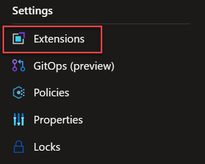

* [Optional] The IP address for this instance represents the Kubernetes _LoadBalancer_ external IP that was provision as part of Azure Arc-enabled data services. Use the _```kubectl get svc -n arc```_ command to view the _metricsui_ external service IP address.

  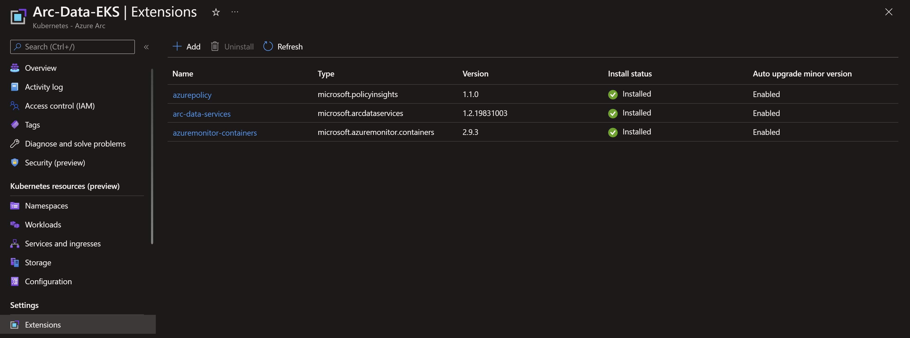

* To log in, use the same username and password that is in the _SQLMI Endpoints_ text file desktop shortcut.

  

* Navigate to the built-in "SQL Managed Instance Metrics" dashboard.

  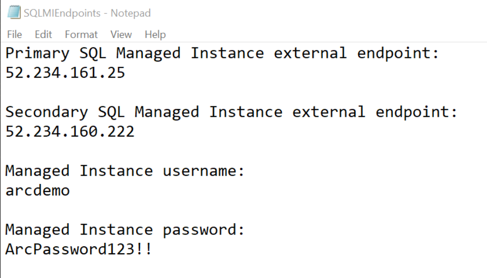

  

* Change the dashboard time range to "Last 5 minutes" and re-run the stress test using _SqlQueryStress_ (in case it was already finished).

  

* You can now see how the SQL graphs are starting to show increased activity and load on the database instance.

  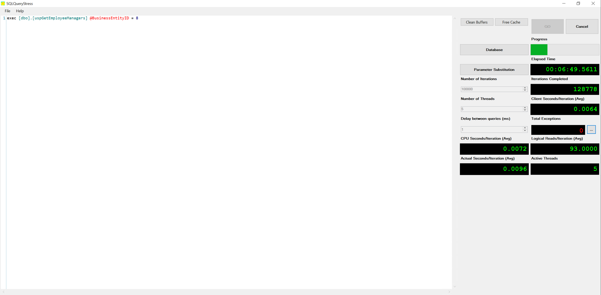

  

## Delete the deployment

To completely delete the environment, follow the below steps.

* Delete any Database resources (e.g. SQL Managed Instance, PostgreSQL Hyperscale), followed by the Data Controller Resource from the Azure Resource Group (i.e. via the Portal)
* Delete any remaining resources (Custom Location, Kubernetes - Azure Arc) from the Azure Resource Group (i.e. via the Portal)
* Use terraform to delete all of the AWS resources as well as the Azure resource group. **The `terraform destroy` run time is approximately ~5-6min long**.

  ```shell
  terraform destroy --auto-approve
  ```

  

  > **Note: Because the following resources were created by EKS that creates internal AWS dependencies that Terraform has no knowledge of from our plan, we need to delete the resources from AWS console as `terraform destroy` is cleaning up - this allows us to avoid dependency conflicts and ongoing billing from orphaned resources such as EKS Volumes.**

* While the `destroy` command is running, delete any new Load Balancers created as EKS Services (`EC2 > Load Balancing > Load Balancers`) that are deployed in AWS from the Console:

  

* While the `destroy` command is running, delete any new Elastic Block Stores created as EKS Persistent Volumes (`EC2 > Elastic Block Store > Volumes`) that are deployed in AWS from the Console:

  

* While the `destroy` command is running, delete any new Security Groups created (`EC2 > Network & Security > Security Groups`) that are deployed in AWS from the Console

  

<!-- ## Known Issues -->
