## Deploy an Azure Arc Data Controller (Vanilla) on GKE using Terraform

The following scanario will guide you on how to deploy a "Ready to Go" environment so you can deploy Azure Arc Data Services on a [Google Kubernetes Engine (GKE)](https://cloud.google.com/kubernetes-engine) cluster using [Terraform](https://www.terraform.io/).

By the end of this guide, you will have a GKE cluster deployed with an Azure Arc Data Controller and a Microsoft Windows Server 2019 (Datacenter) GKE compute instance VM installed and pre-configured with all the required tools needed to work with Azure Arc Data Services:

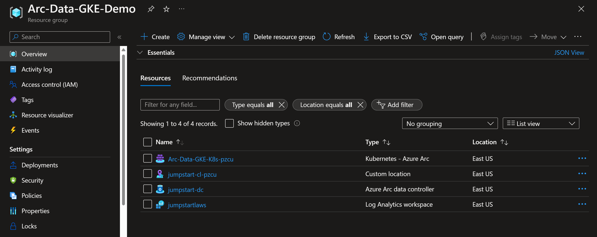

> **Note: Currently, Azure Arc-enabled data services with PostgreSQL Hyperscale is in [public preview](https://docs.microsoft.com/en-us/azure/azure-arc/data/release-notes)**.

## Deployment Process Overview

* Create a Google Cloud Platform (GCP) project, IAM Role & Service Account
* Download credentials file
* Clone the Azure Arc Jumpstart repository
* Edit *TF_VAR* variables values
* Export *TFVAR* values
* *terraform init*
* *terraform apply*
* User remotes into sidecar Windows VM, which automatically kicks off the [DataServicesLogonScript](https://github.com/microsoft/azure_arc/blob/main/azure_arc_data_jumpstart/gke/terraform/artifacts/DataServicesLogonScript.ps1) PowerShell script that deploys and configures Azure Arc-enabled data services on the GKE cluster.
* *kubectl delete namespace arc*
* *terraform destroy*

## Prerequisites

* Clone the Azure Arc Jumpstart repository

  ```shell
  git clone https://github.com/microsoft/azure_arc.git
  ```

* [Install or update Azure CLI to version 2.20.0 or higher](https://docs.microsoft.com/en-us/cli/azure/install-azure-cli?view=azure-cli-latest). Use the below command to check your current installed version.

  ```shell
  az --version
  ```

* Google Cloud account with billing enabled - [Create a free trial account](https://cloud.google.com/free). To create Windows Server virtual machines, you must upgraded your account to enable billing. Click Billing from the menu and then select Upgrade in the lower right.

    

    

    

    ***Disclaimer*** - **To prevent unexpected charges, please follow the "Delete the deployment" section at the end of this README**

* [Install Terraform 1.0 or higher](https://learn.hashicorp.com/terraform/getting-started/install.html)

* Create Azure service principal (SP)

  To be able to complete the scenario and its related automation, Azure service principal assigned with the “Contributor” role is required. To create it, login to your Azure account run the below command (this can also be done in [Azure CloudShell](https://shell.azure.com/))

  ```shell
  az login
  az ad sp create-for-rbac -n "<Unique SP Name>" --role contributor
  ```

  For example:

  ```shell
  az ad sp create-for-rbac -n "http://AzureArcK8s" --role contributor
  ```

  Output should look like this:

  ```json
  {
  "appId": "XXXXXXXXXXXXXXXXXXXXXXXXXXXX",
  "displayName": "AzureArcK8s",
  "name": "http://AzureArcK8s",
  "password": "XXXXXXXXXXXXXXXXXXXXXXXXXXXX",
  "tenant": "XXXXXXXXXXXXXXXXXXXXXXXXXXXX"
  }
  ```

  > **Note: It is optional, but highly recommended, to scope the SP to a specific [Azure subscription](https://docs.microsoft.com/en-us/cli/azure/ad/sp?view=azure-cli-latest).**

* Create a new GCP Project, IAM Role & Service Account. In order to deploy resources in GCP, we will create a new GCP Project as well as a service account to allow Terraform to authenticate against GCP APIs and run the plan to deploy resources.

* Browse to <https://console.cloud.google.com/> and login with your Google Cloud account. Once logged in, [create a new project](https://cloud.google.com/resource-manager/docs/creating-managing-projects) named "Azure Arc Demo". After creating it, be sure to copy down the project id as it is usually different then the project name.

  

  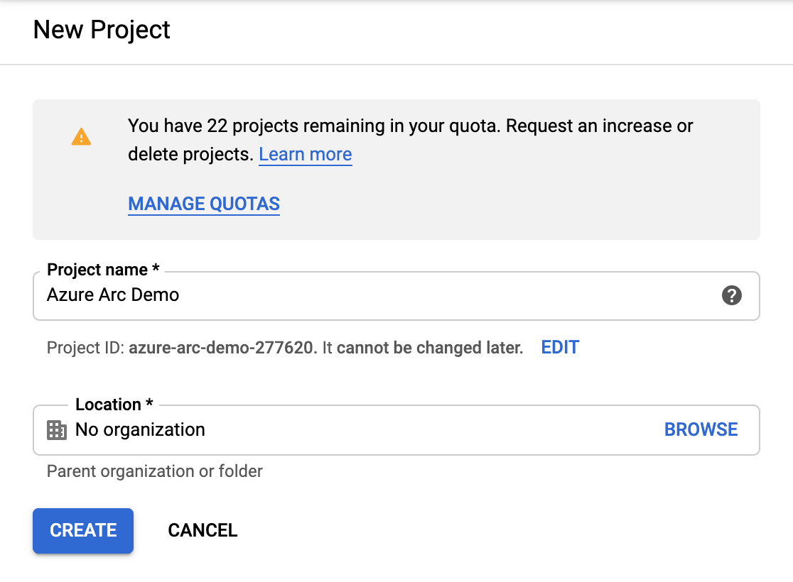

  

* Enable the Compute Engine API for the project, create a project Owner service account credentials and download the private key JSON file and copy the file to the directory where Terraform files are located. Change the JSON file name (for example *account.json*). The Terraform plan will be using the credentials stored in this file to authenticate against your GCP project.

  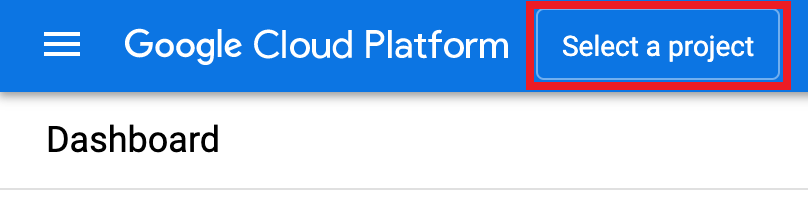

  

  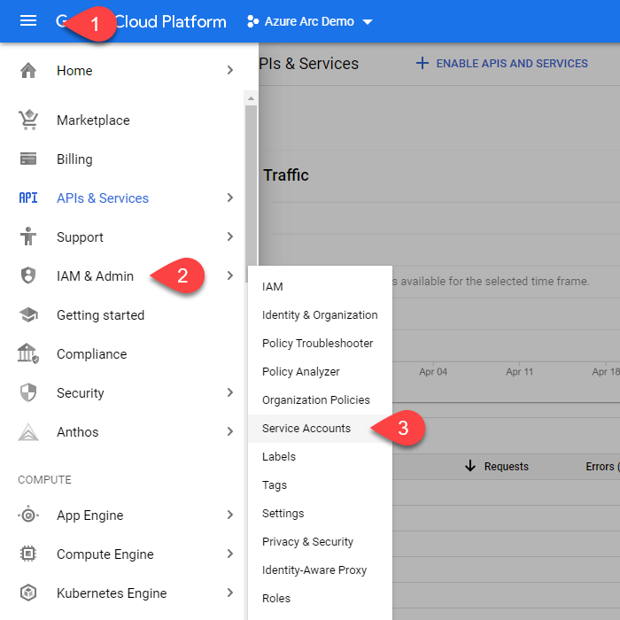

  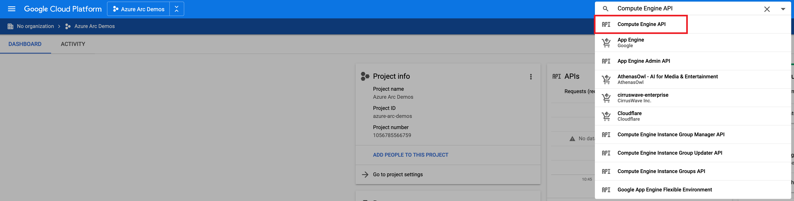

  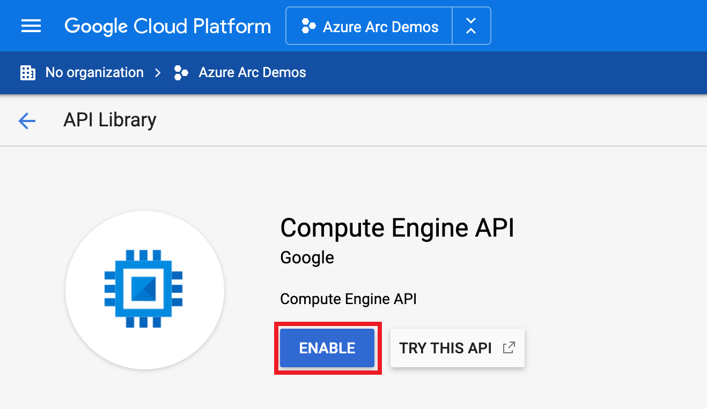

  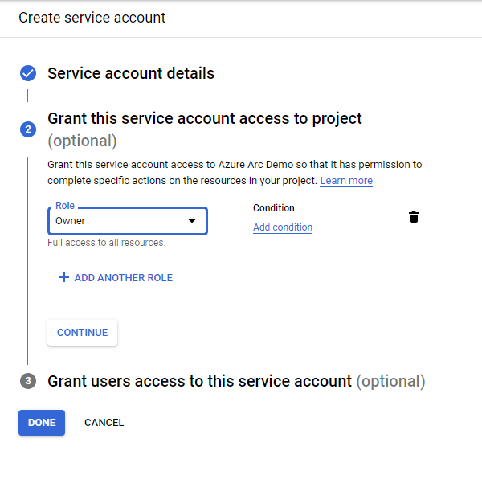

  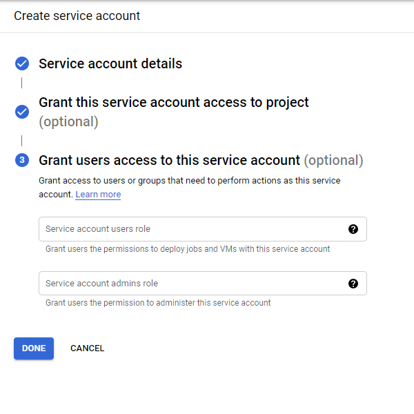

  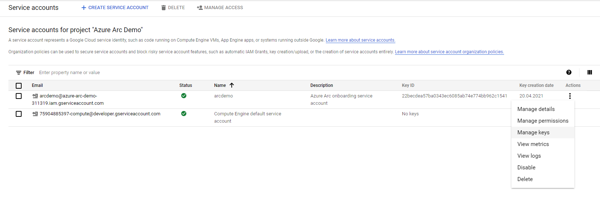

  

  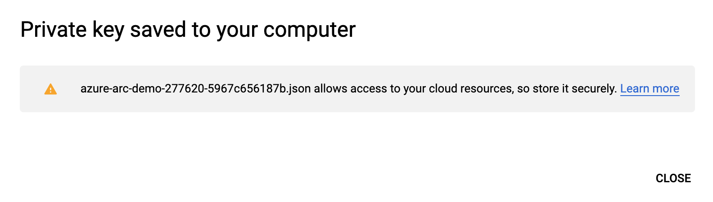

  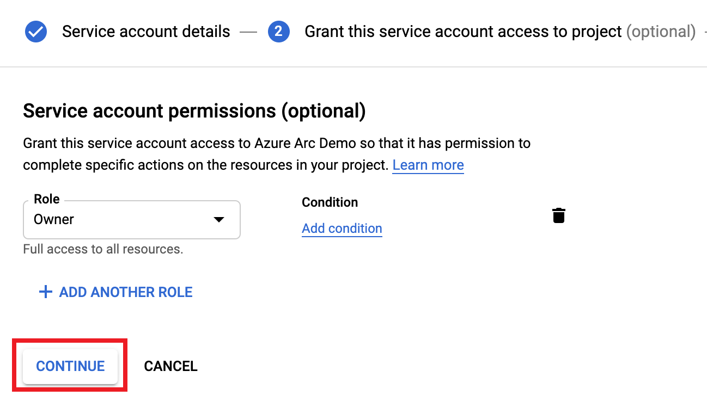

  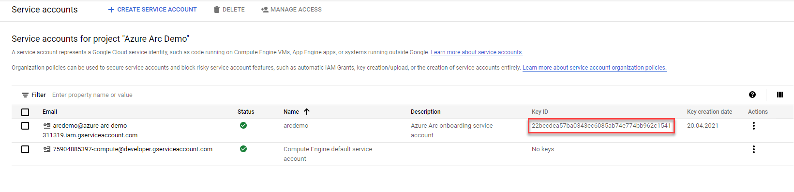

* Enable the Kubernetes Engine API for the project

  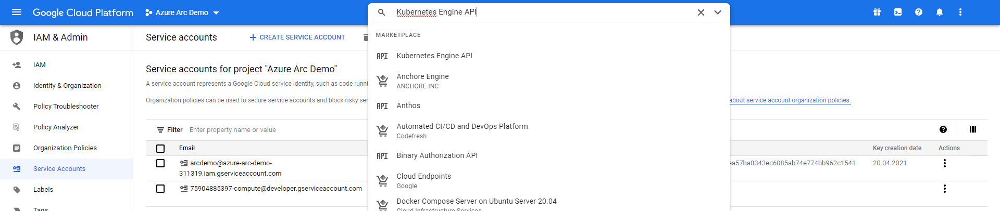

  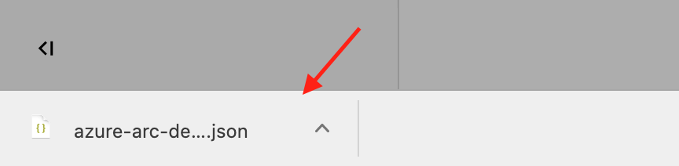

## Automation Flow

Read the below explanation to get familiar with the automation and deployment flow.

* User edits and exports Terraform runtime environment variables, AKA *TF_VAR* (1-time edit). The variables are being used throughout the deployment.

* User deploys the Terraform plan which will deploy the GKE cluster and the GCP compute instance VM as well as an Azure resource group. The Azure resource group is required to host the Azure Arc services such as the Azure Arc-enabled Kubernetes cluster, the custom location, the Azure Arc data controller, and any database services you deploy on top of the data controller.

* In addition, the plan will copy the *local_ssd_sc.yaml* file which will be used to create a Kubernetes Storage Class backed by SSD disks that will be used by Arc Data Controller to create [persistent volume claims (PVC)](https://kubernetes.io/docs/concepts/storage/persistent-volumes/).

  > **Note: Depending on the GCP region, make sure you do not have any [SSD quota limit in the region](https://cloud.google.com/compute/quotas), otherwise, the Azure Arc Data Controller kubernetes resources will fail to deploy.**

* As part of the Windows Server 2019 VM deployment, there are 4 script executions:

  1. *azure_arc.ps1* script will be created automatically as part of the Terraform plan runtime and is responsible on injecting the *TF_VAR* variables values on to the Windows instance which will then be used in both the *ClientTools* and the *LogonScript* scripts.

  2. *password_reset.ps1* script will be created automatically as part of the Terraform plan runtime and is responsible on creating the Windows username & password.

  3. *Bootstrap.ps1* script will run at the Terraform plan runtime Runtime and will:
      * Create the *Bootstrap.log* file  
      * Install the required tools – az cli, az cli Powershell module, kubernetes-cli, Visual C++ Redistributable, helm, vscode, etc. (Chocolaty packages)
      * Download Azure Data Studio & Azure Data CLI
      * Disable Windows Server Manager, remove Internet Explorer, disable Windows Firewall
      * Download the DataServicesLogonScript.ps1 PowerShell script
      * Create the Windows schedule task to run the DataServicesLogonScript at first login

  4. *DataServicesLogonScript.ps1* script will run on user first logon to Windows and will:
      * Create the *DataServicesLogonScript.log* file
      * Install the Azure Data Studio Azure Data CLI, Azure Arc & PostgreSQL extensions
      * Create the Azure Data Studio desktop shortcut
      * Apply the *local_ssd_sc.yaml* file on the GKE cluster
      * Use Azure CLI to connect the GKE cluster to Azure as an Azure Arc-enabled Kubernetes cluster
      * Create a custom location for use with the Azure Arc-enabled Kubernetes cluster
      * Deploy an ARM template that will deploy the Azure Arc data controller on the GKE cluster
      * Open another Powershell session which will execute a command to watch the deployed Azure Arc Data Controller Kubernetes pods
      * Unregister the logon script Windows schedule task so it will not run after first login

## Deployment

As mentioned, the Terraform plan and automation scripts will deploy a GKE cluster, the Azure Arc Data Controller on that cluster and a Windows Server 2019 Client GCP compute instance.

* Before running the Terraform plan, edit the below *TF_VAR* values and export it (simply copy/paste it into your shell after you finish editing these). An example *TF_VAR* shell script file is located [here](https://github.com/microsoft/azure_arc/blob/main/azure_arc_data_jumpstart/gke/terraform/example/TF_VAR_datacontroller_only_example.sh)

  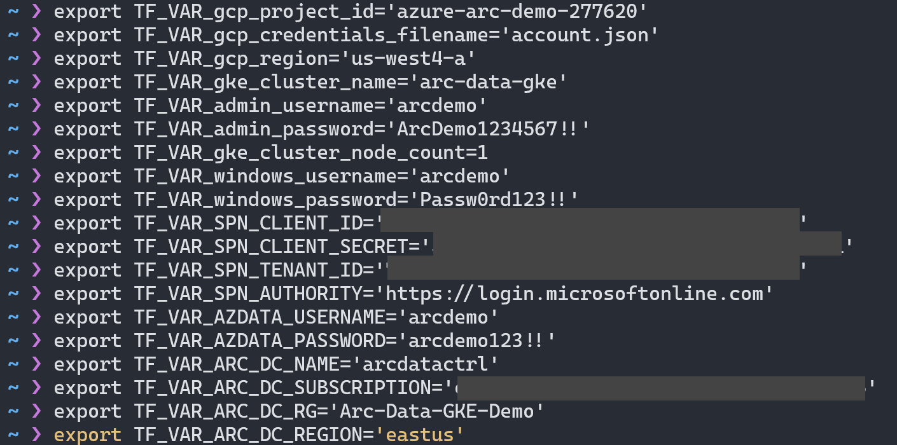

  * *export TF_VAR_gcp_project_id*='Your GCP Project ID (Created in the prerequisites section)'
  * *export TF_VAR_gcp_credentials_filename*='Your GCP Credentials JSON filename (Created in the prerequisites section)'
  * *export TF_VAR_gcp_region*='GCP region where resource will be created'
  * *export TF_VAR_gcp_zone*='GCP zone where resource will be created'
  * *export TF_VAR_gke_cluster_name*='GKE cluster name'
  * *export TF_VAR_admin_username*='GKE cluster administrator username'
  * *export TF_VAR_admin_password*='GKE cluster administrator password'
  * *export TF_VAR_gke_cluster_node_count*='GKE cluster number of worker nodes'
  * *export TF_VAR_windows_username*='Windows Server Client compute instance VM administrator username'
  * *export TF_VAR_windows_password*='Windows Server Client compute instance VM administrator password' (The password must be at least 8 characters long and contain characters from three of the following four sets: uppercase letters, lowercase letters, numbers, and symbols as well as **not containing** the user's account name or parts of the user's full name that exceed two consecutive characters)
  * *export TF_VAR_SPN_CLIENT_ID*='Your Azure service principal name'
  * *export TF_VAR_SPN_CLIENT_SECRET*='Your Azure service principal password'
  * *export TF_VAR_SPN_TENANT_ID*='Your Azure tenant ID'
  * *export TF_VAR_SPN_AUTHORITY*=*https://login.microsoftonline.com* **Do not change**
  * *export TF_VAR_AZDATA_USERNAME*='Azure Arc Data Controller admin username'
  * *export TF_VAR_AZDATA_PASSWORD*='Azure Arc Data Controller admin password' (The password must be at least 8 characters long and contain characters from three of the following four sets: uppercase letters, lowercase letters, numbers, and symbols)
  * *export TF_VAR_ARC_DC_NAME*='Azure Arc Data Controller name' (The name must consist of lowercase alphanumeric characters or '-', and must start and end with a alphanumeric character. This name will be used for k8s namespace as well)
  * *export TF_VAR_ARC_DC_SUBSCRIPTION*='Azure Arc Data Controller Azure subscription ID'
  * *export TF_VAR_ARC_DC_RG*='Azure resource group where all future Azure Arc resources will be deployed'
  * *export TF_VAR_ARC_DC_REGION*='Azure location where the Azure Arc Data Controller resource will be created in Azure' (Currently, supported regions supported are eastus, eastus2, centralus, westus2, westeurope, southeastasia)
  * *export TF_VAR_deploy_SQLMI*='Boolean that sets whether or not to deploy SQL Managed Instance, for this data controller only scenario we leave it set to false'
  * *export TF_VAR_deploy_PostgreSQL*='Boolean that sets whether or not to deploy PostgreSQL Hyperscale, for this data controller only scenario we leave it set to false'
  * *export TF_VAR_templateBaseUrl*='GitHub URL to the deployment template - filled in by default to point to [Microsoft/Azure Arc](https://github.com/microsoft/azure_arc) repository, but you can point this to your forked repo as well - e.g. `https://raw.githubusercontent.com/your--github--account/azure_arc/your--branch/azure_arc_data_jumpstart/gke/terraform/`.'

    > **Note: If you are running in a PowerShell environment, to set the Terraform environment variables see example below**

    ```powershell
    $env:TF_VAR_gcp_project_id='azure-arc-demo-xxxxxx'
    ```

* Navigate to the folder that has Terraform binaries.

  ```shell
  cd azure_arc_data_jumpstart/gke/terraform/
  ```

* Run the ```terraform init``` command which is used to initialize a working directory containing Terraform configuration files and load the required Terraform providers.

  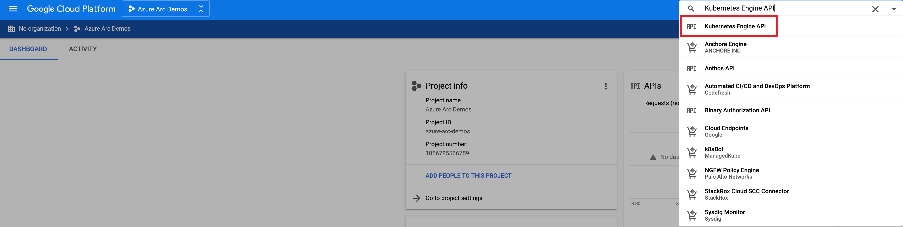

* (Optional but recommended) Run the ```terraform plan``` command to make sure everything is configured properly.

  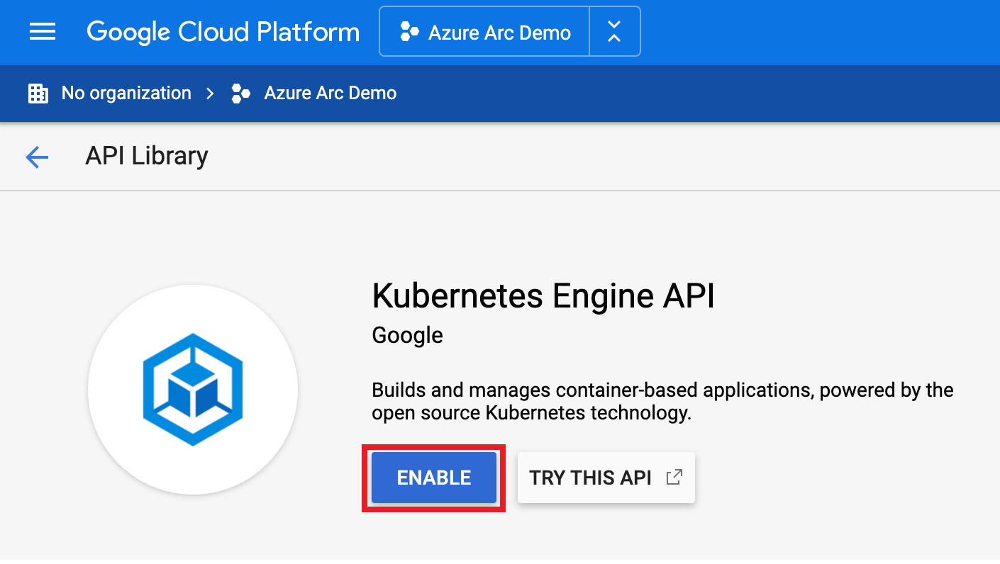

* Run the ```terraform apply --auto-approve``` command and wait for the plan to finish. **Runtime for deploying all the GCP resources for this plan is ~20-30min.**

* Once completed, you can review the GKE cluster and the worker nodes resources as well as the GCP compute instance VM created.

  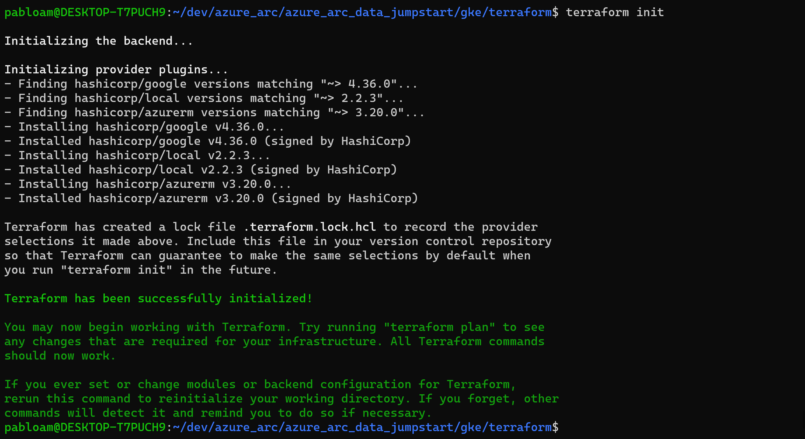

  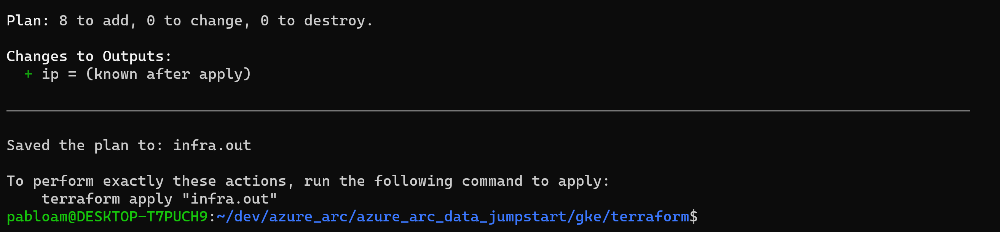

  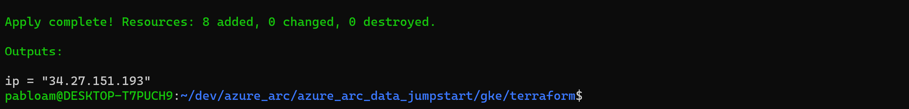

  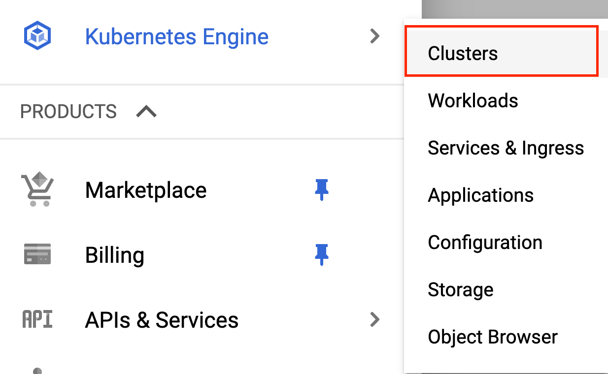

  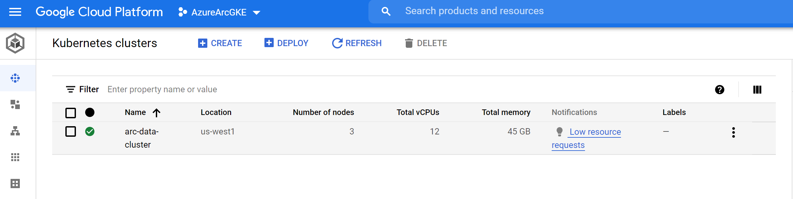

* In the Azure Portal, a new empty Azure resource group was created which will be used for Azure Arc Data Controller and the other data services you will be deploying in the future.

  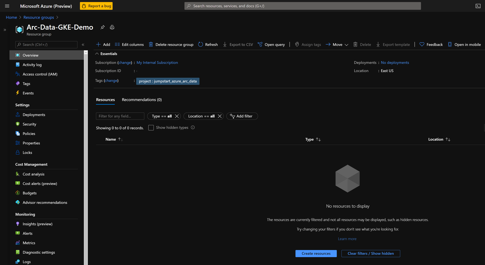

## Windows Login & Post Deployment

Now that we have both the GKE cluster and the Windows Server Client instance created, it is time to login to the Client VM.

* Select the Windows instance, click on the RDP dropdown and download the RDP file. Using your *windows_username* and *windows_password* credentials, log in to the VM.

  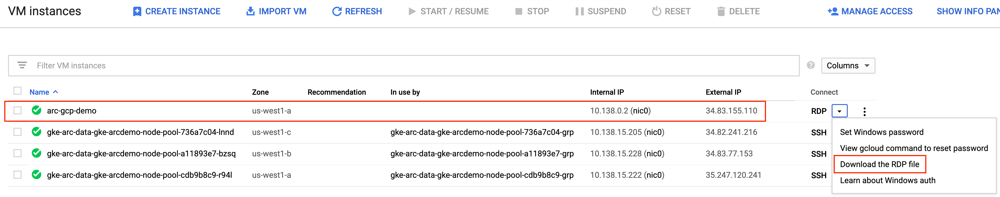

  

* At first login, as mentioned in the "Automation Flow" section, the DataServicesLogonScript.ps1 will get executed. This script was created as part of the automated deployment process.

    Let the script run its course and **do not close** the PowerShell session, this will be done for you once completed. You will notice that the Azure Arc Data Controller gets deployed on the GKE cluster. **The logon script run time is approximately 10min long**.

    Once the script finishes, the logon script PowerShell session will be close and the Azure Arc Data Controller will be deployed on the GKE cluster and be ready to use.

  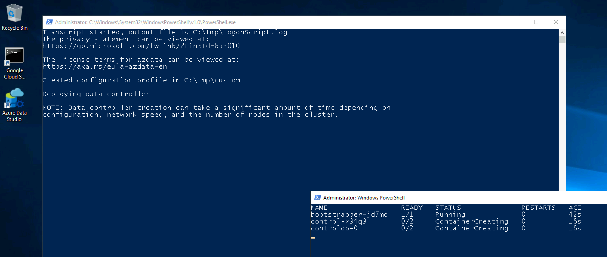

  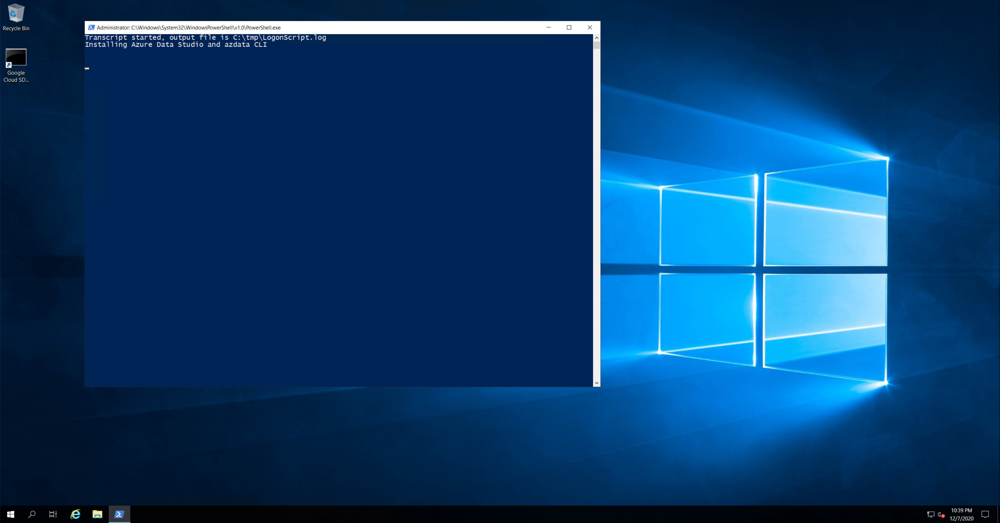

  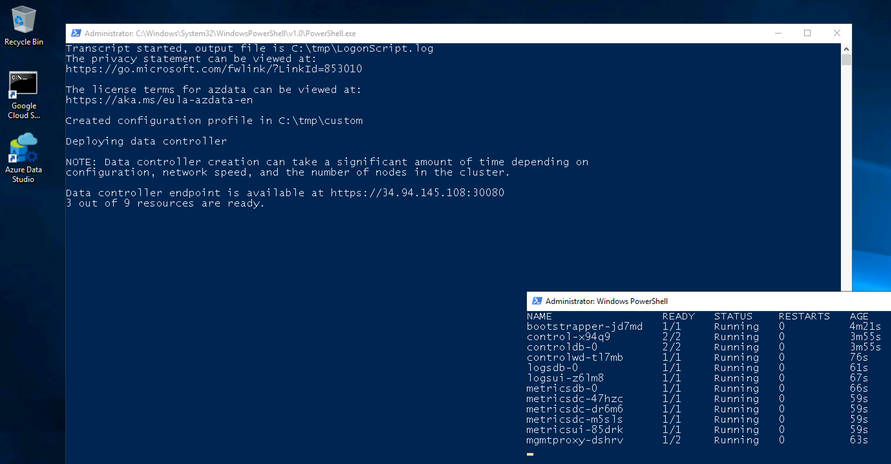

  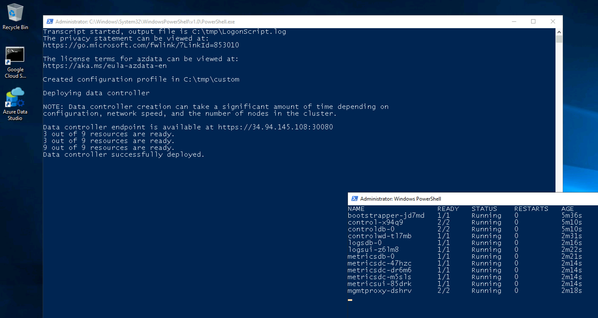

  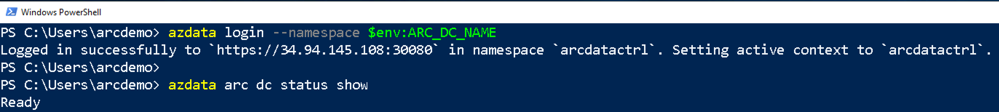

* When the scripts are complete, all PowerShell windows will close.

  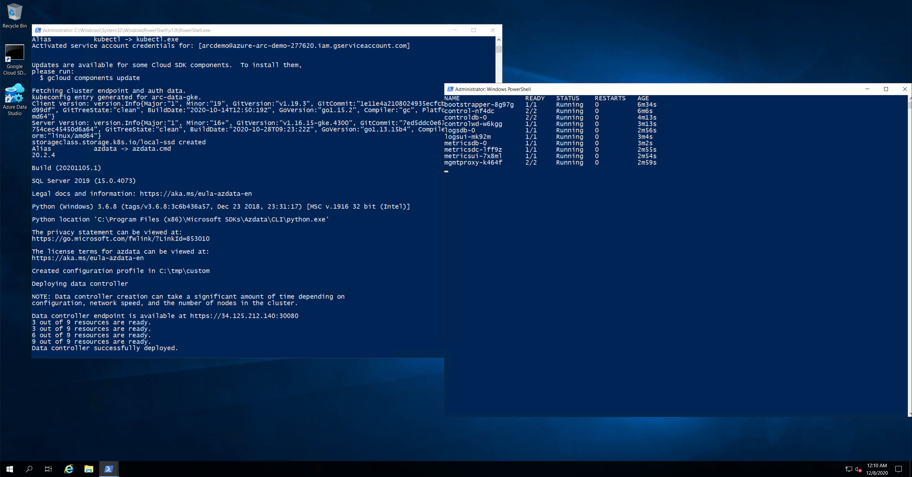

* From Azure Portal, navigate to the resource group and confirm that the Azure Arc-enabled Kubernetes cluster, the Azure Arc data controller resource and the Custom Location resource are present.

  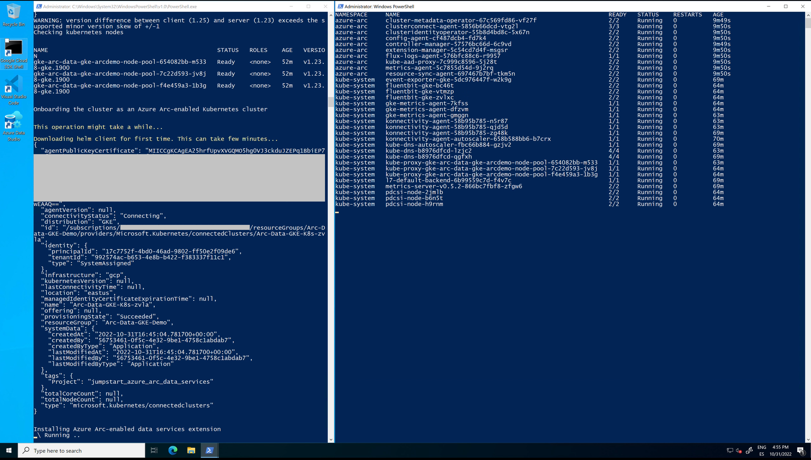

* Another tool automatically deployed is Azure Data Studio along with the *Azure Data CLI*, the *Azure Arc* and the *PostgreSQL* extensions. Using the Desktop shortcut created for you, open Azure Data Studio and click the Extensions settings to see both extensions.

  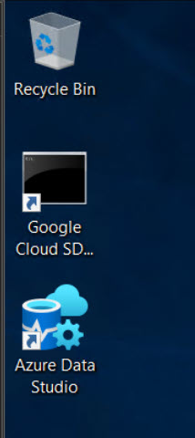

  

## Delete the deployment

To completely delete the environment, follow the below steps.

* Delete the data services resources by using kubectl. Run the below command from a PowerShell window on the client VM.

  ```shell
  kubectl delete namespace arc
  ```

  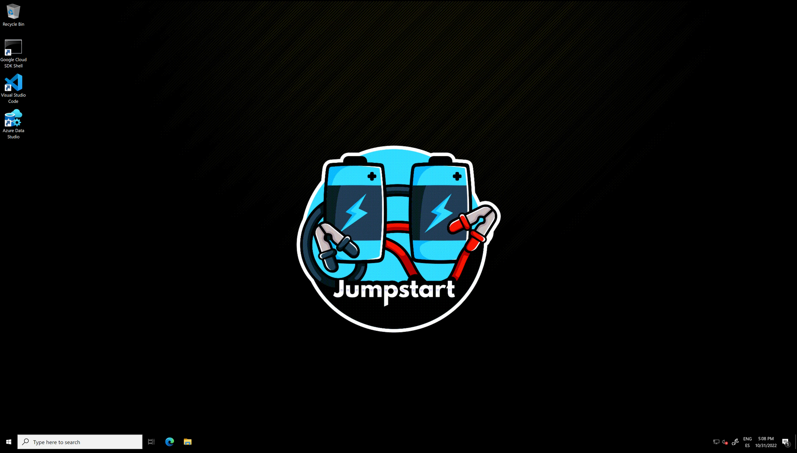

* Use terraform to delete all of the GCP resources as well as the Azure resource group. **The *terraform destroy* run time is approximately ~5-6min long**.

  ```shell
  terraform destroy --auto-approve
  ```

  

<!-- ## Known Issues -->
