## Deploy an Azure Arc-enabled SQL Managed Instance on GKE using a Terraform plan

The following scenario will guide you on how to deploy a "Ready to Go" environment so you can deploy Azure Arc-enabled data services on a [Google Kubernetes Engine (GKE)](https://cloud.google.com/kubernetes-engine) cluster using [Terraform](https://www.terraform.io/).

By the end of this scenario, you will have a GKE cluster deployed with an Azure Arc Data Controller ([in "Directly Connected" mode](https://docs.microsoft.com/azure/azure-arc/data/connectivity)), Azure SQL Managed Instance with a sample database and a Microsoft Windows Server 2022 (Datacenter) GKE compute instance VM installed and pre-configured with all the required tools needed to work with Azure Arc data services.

> **NOTE: Currently, Azure Arc-enabled data services with PostgreSQL is in [public preview](https://docs.microsoft.com/azure/azure-arc/data/release-notes)**.

## Deployment Process Overview

- Create a Google Cloud Platform (GCP) project, IAM Role & Service Account
- Download GCP credentials file
- Clone the Azure Arc Jumpstart repository
- Create the .tfvars file with your variables values
- Export the *TF_VAR_CL_OID* variable
- *terraform init*
- *terraform apply*
- User remotes into client Windows VM, which automatically kicks off the [DataServicesLogonScript](https://github.com/microsoft/azure_arc/blob/main/azure_arc_data_jumpstart/gke/terraform/artifacts/DataServicesLogonScript.ps1) PowerShell script that deploys and configures Azure Arc-enabled data services on the GKE cluster.
- Open Azure Data Studio and connect to SQL MI instance and sample database
- *kubectl delete namespace arc*
- *terraform destroy*

## Prerequisites

- Clone the Azure Arc Jumpstart repository

  ```shell
  git clone https://github.com/microsoft/azure_arc.git
  ```

- [Install or update Azure CLI to version 2.49.0 and above](https://docs.microsoft.com/cli/azure/install-azure-cli?view=azure-cli-latest). Use the below command to check your current installed version.

  ```shell
  az --version
  ```

- Google Cloud account with billing enabled - [Create a free trial account](https://cloud.google.com/free). To create Windows Server virtual machines, you must upgraded your account to enable billing. Click Billing from the menu and then select Upgrade in the lower right.

    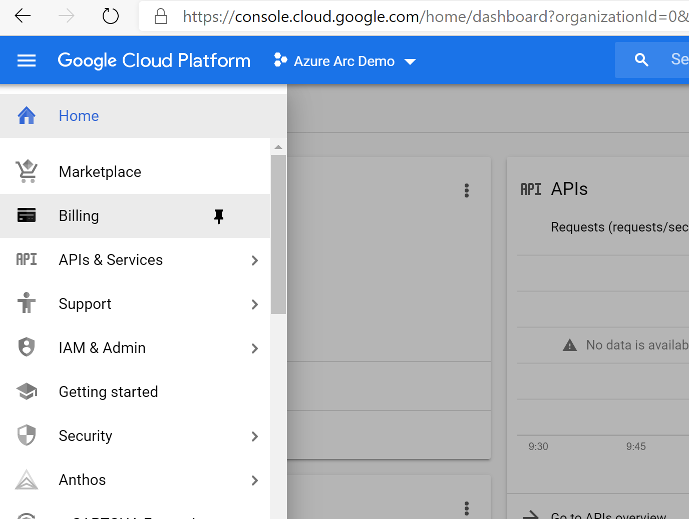

    

    

    ***Disclaimer*** - **To prevent unexpected charges, please follow the "Delete the deployment" section at the end of this README**

- [Install Terraform 1.0 or higher](https://learn.hashicorp.com/terraform/getting-started/install.html)

- Create Azure service principal (SP). To deploy this scenario, an Azure service principal Role-based access control (RBAC) is required:

  - "Owner" - Required for provisioning Azure resources, interact with Azure Arc-enabled data services billing, monitoring metrics, and logs management and creating role assignment for the Monitoring Metrics Publisher role.

    To create it login to your Azure account run the below command (this can also be done in [Azure Cloud Shell](https://shell.azure.com/)).

    ```shell
    az login
    subscriptionId=$(az account show --query id --output tsv)
    SP_CLIENT_ID=$(az ad sp create-for-rbac -n "<Unique SP Name>" --role "Owner" --scopes /subscriptions/$subscriptionId --query appId -o tsv)
    SP_OID=$(az ad sp show --id $SP_CLIENT_ID --query id -o tsv)

    ```

    For example:

    ```shell
    az login
    subscriptionId=$(az account show --query id --output tsv)
    SP_CLIENT_ID=$(az ad sp create-for-rbac -n "JumpstartArcDataSvc" --role "Owner" --scopes /subscriptions/$subscriptionId --query appId -o tsv)
    ```

    Output should look like this:

    ```json
    {
    "appId": "XXXXXXXXXXXXXXXXXXXXXXXXXXXX",
    "displayName": "JumpstartArcDataSvc",
    "password": "XXXXXXXXXXXXXXXXXXXXXXXXXXXX",
    "tenant": "XXXXXXXXXXXXXXXXXXXXXXXXXXXX"
    }
    ```

    > **NOTE: The Jumpstart scenarios are designed with as much ease of use in-mind and adhering to security-related best practices whenever possible. It is optional but highly recommended to scope the service principal to a specific [Azure subscription and resource group](https://docs.microsoft.com/cli/azure/ad/sp?view=azure-cli-latest) as well considering using a [less privileged service principal account](https://docs.microsoft.com/azure/role-based-access-control/best-practices)**

- Create a new GCP Project, IAM Role & Service Account. In order to deploy resources in GCP, we will create a new GCP Project as well as a service account to allow Terraform to authenticate against GCP APIs and run the plan to deploy resources.

  - Browse to <https://console.cloud.google.com/> and login with your Google Cloud account. Once logged in, click on Select a project

    

  - [Create a new project](https://cloud.google.com/resource-manager/docs/creating-managing-projects) named "Azure Arc Demo".

    

    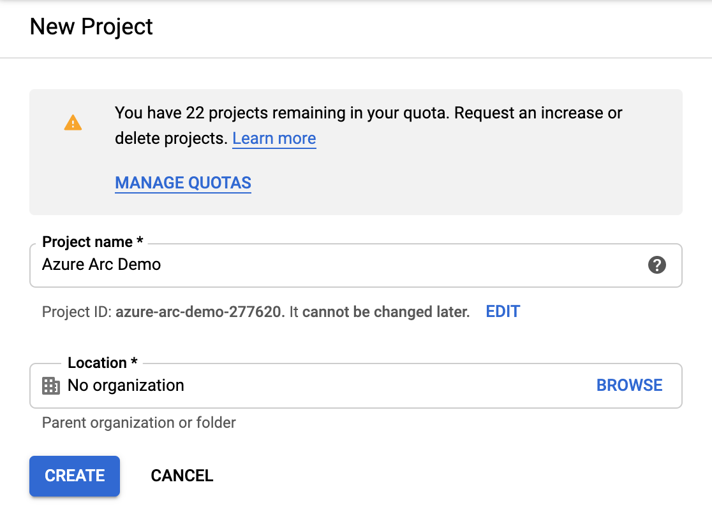

  - After creating it, be sure to copy down the project id as it is usually different then the project name.

    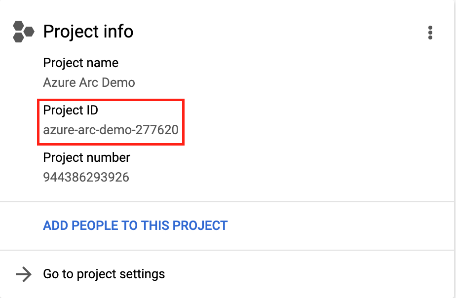

  - Search Compute Engine API for the project

    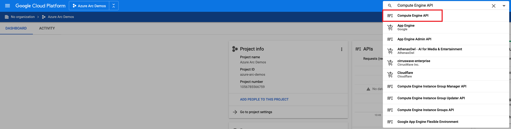

  - Enable Compute Engine API for the project

    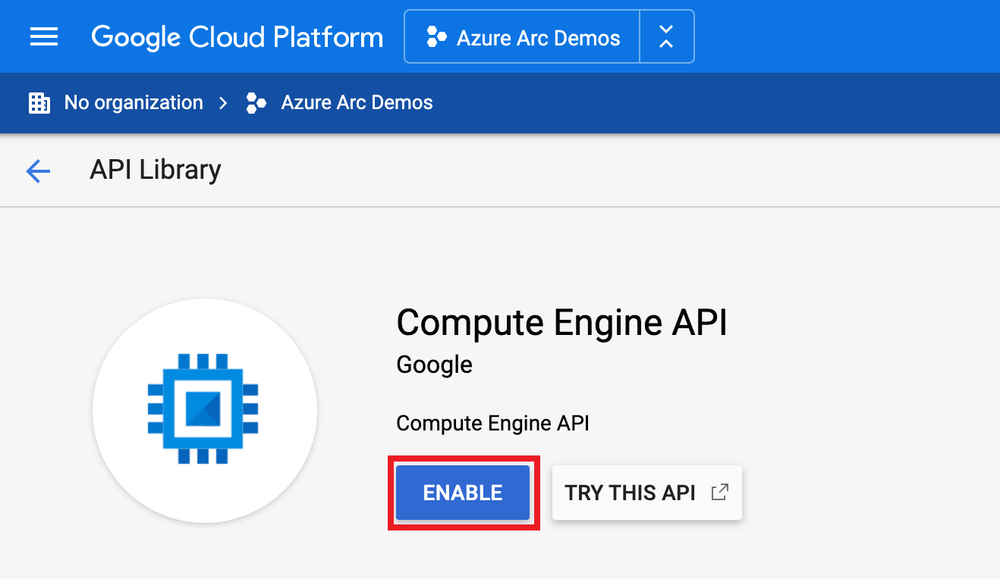

  - Create credentials for your project

    
  
  - Create a project Owner service account credentials and download the private key JSON file and copy the file to the directory where Terraform files are located. Change the JSON file name (for example *account.json*). The Terraform plan will be using the credentials stored in this file to authenticate against your GCP project.

    

    

    

    

    

    

    

    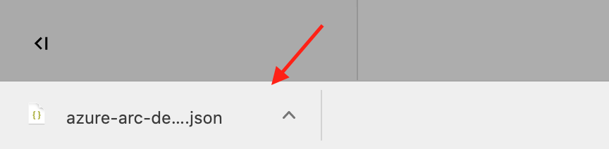

    

  - Search Kubernetes Engine API for the project

    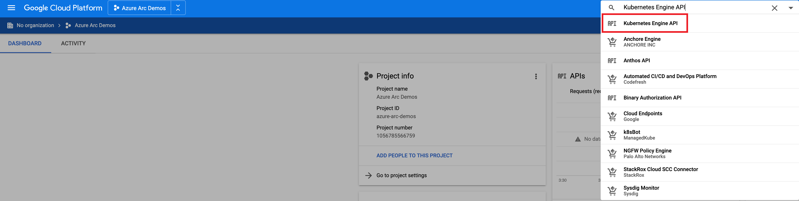

  - Enable Kubernetes Engine API for the project

    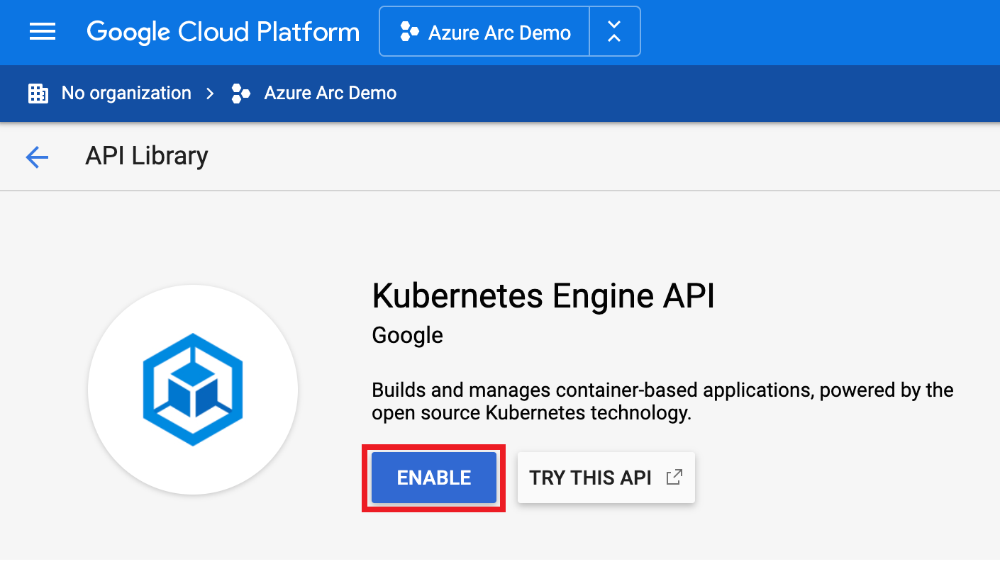

## Automation Flow

Read the below explanation to get familiar with the automation and deployment flow.

- User creates the terraform variables file (_terraform.tfvars_) and export the Azure Custom Location Resource Provider ([RP](https://learn.microsoft.com/azure/azure-resource-manager/management/resource-providers-and-types)) OID variable. The variable values are used throughout the deployment.

- User deploys the Terraform plan which will deploy a GKE cluster and compute instance VM as well as an Azure resource group. The Azure resource group is required to host the Azure Arc services such as the Azure Arc-enabled Kubernetes cluster, the custom location, the Azure Arc data controller, and the SQL MI database service.

  > **NOTE: Depending on the GCP region, make sure you do not have any [SSD quota limit in the region](https://cloud.google.com/compute/quotas), otherwise, the Azure Arc Data Controller kubernetes resources will fail to deploy.**

- As part of the Windows Server 2022 VM deployment, there are 4 script executions:

  1. *azure_arc.ps1* script will be created automatically as part of the Terraform plan runtime and is responsible for injecting the terraform variable values as environment variables on the Windows instance which will then be used in both the *ClientTools* and the *LogonScript* scripts.

  2. *password_reset.ps1* script will be created automatically as part of the Terraform plan runtime and is responsible for creating the Windows username and password.

  3. *Bootstrap.ps1* script will run during Terraform plan runtime and will:
      - Create the *Bootstrap.log* file  
      - Install the required tools – az cli, PowerShell module, kubernetes-cli, Visual C++ Redistributable (Chocolaty packages)
      - Download Azure Data Studio & Azure Data CLI
      - Disable Windows Server Manager, remove Internet Explorer, disable Windows Firewall
      - Download the DataServicesLogonScript.ps1 PowerShell script
      - Create the Windows schedule task to run the DataServicesLogonScript at first login

  4. *DataServicesLogonScript.ps1* script will run on first login to Windows and will:
      - Create the *DataServicesLogonScript.log* file
      - Install the Azure Data Studio Azure Data CLI, Azure Arc and PostgreSQL extensions
      - Create the Azure Data Studio desktop shortcut
      - Use Azure CLI to connect the GKE cluster to Azure as an Azure Arc-enabled Kubernetes cluster
      - Create a custom location for use with the Azure Arc-enabled Kubernetes cluster
      - Open another Powershell session which will execute a command to watch the deployed Azure Arc Data Controller Kubernetes pods
      - Deploy an ARM template that will deploy the Azure Arc data controller on the GKE cluster
      - Execute a secondary *DeploySQLMI.ps1* script which will configure the SQL MI instance, download and install the sample Adventureworks database, and configure Azure Data Studio to connect to the SQL MI database instance
      - Unregister the logon script Windows scheduler task so it will not run after first login

## Terraform variables

- Before running the Terraform plan, create the _terraform.tfvars_ file in the root of the terraform folder and supply some values for your environment.

   ```HCL
    gcp_project_id           = "azure-arc-demo-277620"
    gcp_credentials_filename = "account.json"
    gcp_region               = "us-west1"
    gcp_zone                 = "us-west1-a"
    gke_cluster_name         = "arc-data-gke"
    admin_username           = "arcdemo"
    admin_password           = "ArcDemo1234567!!"
    windows_username         = "arcdemo"
    windows_password         = "Passw0rd123!!"
    SPN_CLIENT_ID            = "33333333-XXXX-YYYY-XXXX-YTYTYTYT"
    SPN_CLIENT_SECRET        = "33333333-XXXX-YTYT-9c21-7777777777"
    SPN_TENANT_ID            = "33333333-XXXX-41af-1111-7777777777"
    SPN_AUTHORITY            = "https://login.microsoftonline.com"
    AZDATA_USERNAME          = "arcdemo"
    AZDATA_PASSWORD          = "Arcdemo123!!"
    ARC_DC_NAME              = "arcdatactrl"
    ARC_DC_SUBSCRIPTION      = "32323232-XXXXX-YYYYY-9e8f-88888888888"
    ARC_DC_RG                = "Arc-Data-GKE-Demo"
    ARC_DC_REGION            = "eastus"
    deploy_SQLMI             = true
    SQLMIHA                  = true
    deploy_PostgreSQL        = false
    templateBaseUrl          = "https://raw.githubusercontent.com/microsoft/azure_arc/main/azure_arc_data_jumpstart/gke/terraform/"
    MY_IP                    = "192.168.10.10"
  ```

- Variable reference:

  - **_`gcp_project_id`_** - Your GCP Project ID (Created in the prerequisites section)
  - **_`gcp_credentials_filename`_** - Your GCP Credentials JSON filename (Created in the prerequisites section)
  - **_`gcp_region`_** - GCP region where resource will be created
  - **_`gcp_zone`_** - GCP zone where resource will be created
  - **_`gke_cluster_name`_** - GKE cluster name
  - **_`admin_username`_** - GKE cluster administrator username
  - **_`admin_password`_** - GKE cluster administrator password
  - **_`windows_username`_** - Windows Server Client compute instance VM administrator username
  - **_`windows_password`_** - Windows Server Client compute instance VM administrator password (The password must be at least 8 characters long and contain characters from three of the following four sets: uppercase letters, lowercase letters, numbers, and symbols as well as **not containing** the user's account name or parts of the user's full name that exceed two consecutive characters)
  - **_`SPN_CLIENT_ID`_** - Your Azure service principal name
  - **_`SPN_CLIENT_SECRET`_** - Your Azure service principal password
  - **_`SPN_TENANT_ID`_** - Your Azure tenant ID
  - **_`SPN_AUTHORITY`_** - _https://login.microsoftonline.com_ **Do not change**
  - **_`AZDATA_USERNAME`_** - Azure Arc Data Controller admin username
  - **_`AZDATA_PASSWORD`_** - Azure Arc Data Controller admin password (The password must be at least 8 characters long and contain characters from the following four sets: uppercase letters, lowercase letters, numbers, and symbols)
  - **_`ARC_DC_NAME`_** - Azure Arc Data Controller name (The name must consist of lowercase alphanumeric characters or '-', and must start and end with a alphanumeric character. This name will be used for k8s namespace as well)
  - **_`ARC_DC_SUBSCRIPTION`_** - Azure Arc Data Controller Azure subscription ID
  - **_`ARC_DC_RG`_** - Azure resource group where all future Azure Arc resources will be deployed
  - **_`ARC_DC_REGION`_** - Azure location where the Azure Arc Data Controller resource will be created in Azure (Currently, supported regions supported are eastus, eastus2, centralus, westus2, westeurope, southeastasia)
  - **_`deploy_SQLMI`_** - Boolean that sets whether or not to deploy SQL Managed Instance, for this scenario we leave it set to true
  - **_`SQLMIHA`_** - Boolean that sets whether or not to deploy SQL Managed Instance with high-availability (business continuity) configurations, set this to either true or false
  - **_`deploy_PostgreSQL`_** - Boolean that sets whether or not to deploy PostgreSQL, for this data controller only scenario we leave it set to false
  - **_`templateBaseUrl`_** - GitHub URL to the deployment template - filled in by default to point to [Microsoft/Azure Arc](https://github.com/microsoft/azure_arc) repository, but you can point this to your forked repo as well - e.g. `https://raw.githubusercontent.com/your--github--account/azure_arc/your--branch/azure_arc_data_jumpstart/gke/terraform/`
  - **_`MY_IP`_** - Your Client IP

### Azure Custom Location Resource Provider (RP) and the Object ID (OID) environment variable

- You also need to get the Azure Custom Location Resource Provider ([RP](https://learn.microsoft.com/azure/azure-resource-manager/management/resource-providers-and-types)) OID to export it as an environment variable:

  > **NOTE: You need permissions to list all the service principals.**

  #### Option 1: Bash

  ```bash
  export TF_VAR_CL_OID=$(az ad sp list --filter "displayname eq 'Custom Locations RP'" --query "[?appDisplayName=='Custom Locations RP'].id" -o tsv)
  ```

  #### Option 2: PowerShell

  ```powershell
  $Env:TF_VAR_CL_OID=(az ad sp list --filter "displayname eq 'Custom Locations RP'" --query "[?appDisplayName=='Custom Locations RP'].id" -o tsv)
  ```

## Deployment

> **NOTE: The GKE cluster will use 3 nodes of SKU "n1-standard-8".**

As mentioned, the Terraform plan and automation scripts will deploy a GKE cluster, the Azure Arc Data Controller on that cluster, a SQL Managed Instance with sample database, and a Windows Server 2022 Client GCP compute instance.

- Navigate to the folder that has Terraform binaries.

  ```shell
  cd azure_arc_data_jumpstart/gke/terraform
  ```

- Run the ```terraform init``` command which is used to initialize a working directory containing Terraform configuration files and load the required Terraform providers.

  

- Run the ```terraform plan -out=infra.out``` command to make sure everything is configured properly.

  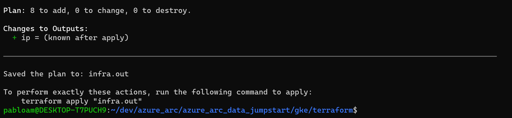

- Run the ```terraform apply "infra.out"``` command and wait for the plan to finish. **Runtime for deploying all the GCP resources for this plan is ~20-30min.**

  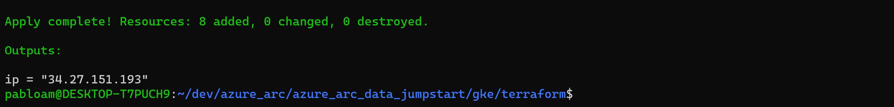

- Once completed, you can review the GKE cluster and the worker nodes resources as well as the GCP compute instance VM created.

  

  

  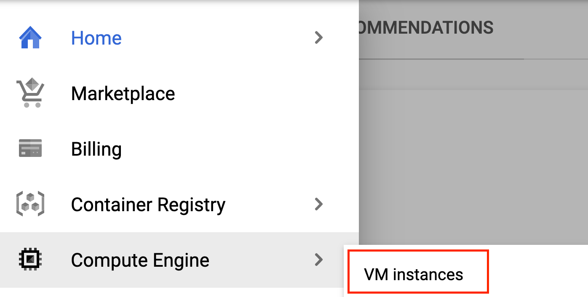

  

- In the Azure Portal, a new empty Azure resource group was created which will be used for Azure Arc Data Controller and the other data services you will be deploying in the future.

  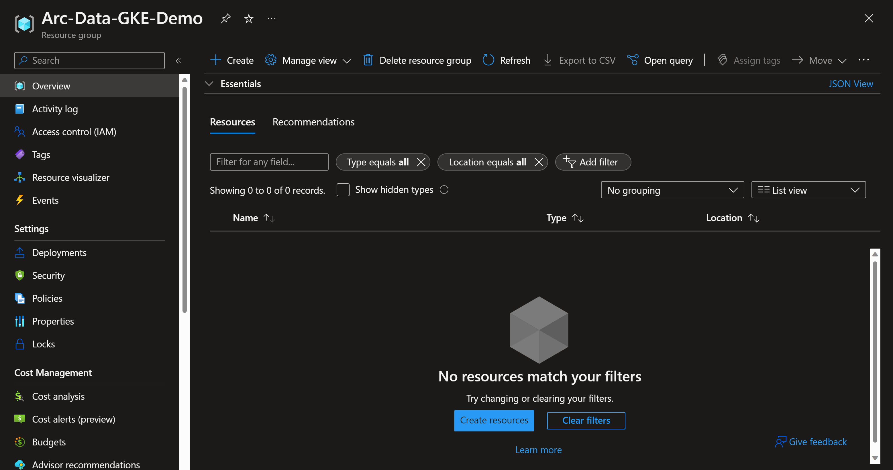

## Windows Login & Post Deployment

Now that we have both the GKE cluster and the Windows Server Client instance created, it is time to login to the Client VM.

- Select the Windows instance, click on the RDP dropdown and download the RDP file. Using your *windows_username* and *windows_password* credentials, log in to the VM.

  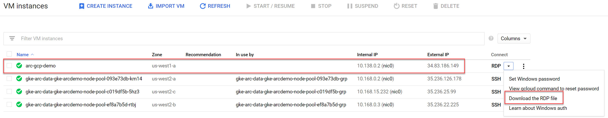

  

- At first login, as mentioned in the "Automation Flow" section, a logon script will get executed. This script was created as part of the automated deployment process.

    Let the script run its course and **do not close** the PowerShell session, this will be done for you once completed. You will notice that the Azure Arc Data Controller gets deployed on the GKE cluster. **The logon script run time is approximately 1h long**.

    Once the script finishes its run, the logon script PowerShell session will be closed and the Azure Arc Data Controller will be deployed on the GKE cluster and be ready to use.

  

  

  

  

  

  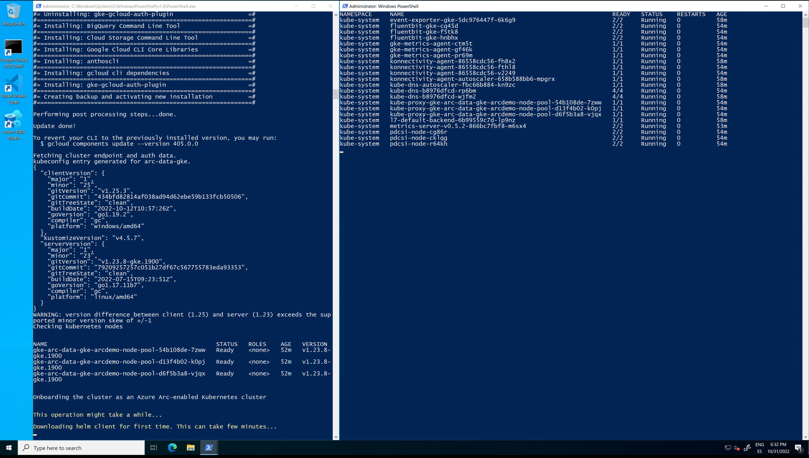

  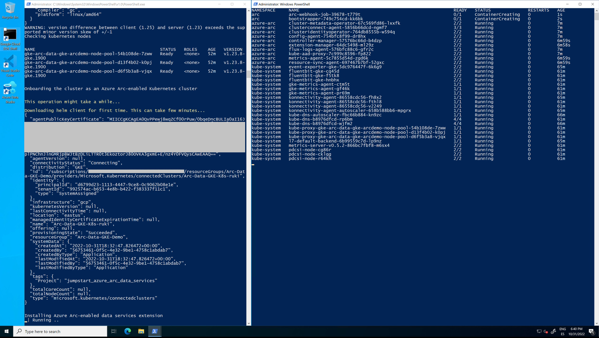

  

  

  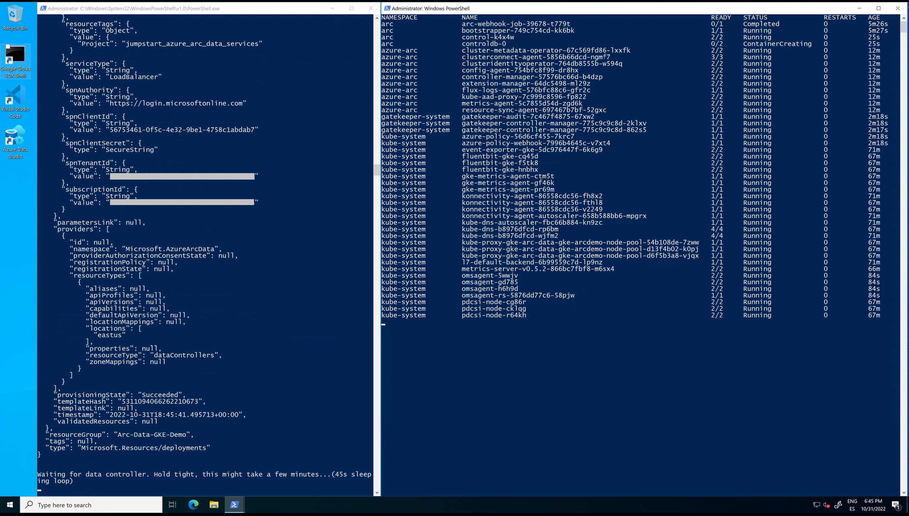

  

  

  

  

  

- When the scripts are complete, all PowerShell windows will close.

  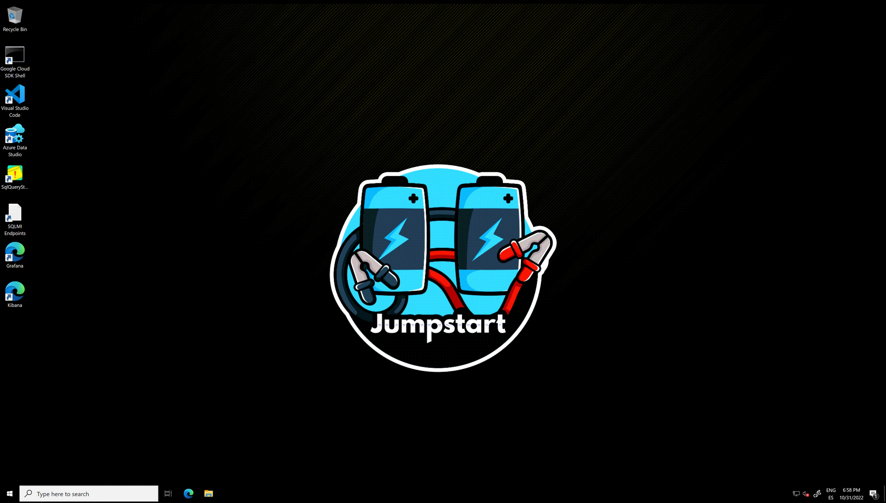

- From Azure Portal, navigate to the resource group and confirm that the Azure Arc-enabled Kubernetes cluster, the Azure Arc data controller resource and the Custom Location resource are present.

  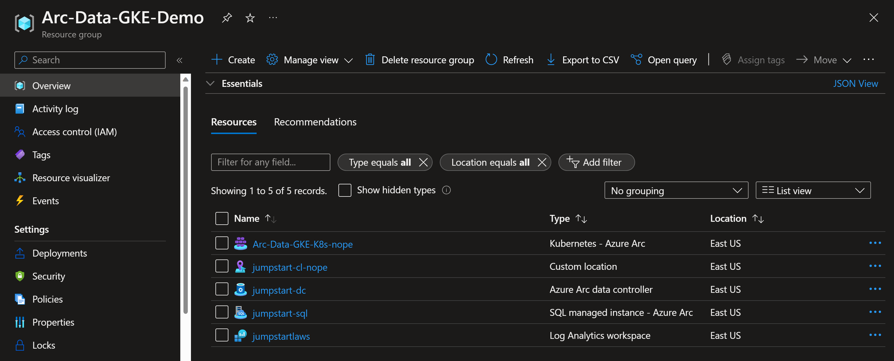

- Another tool automatically deployed is Azure Data Studio along with the *Azure Data CLI*, the *Azure Arc* and the *PostgreSQL* extensions. Using the Desktop shortcut created for you, open Azure Data Studio and expand the SQL MI connection to see the Adventureworks sample database.

  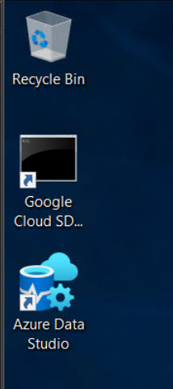

  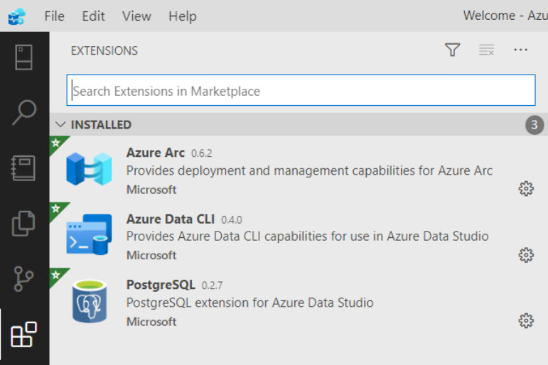

  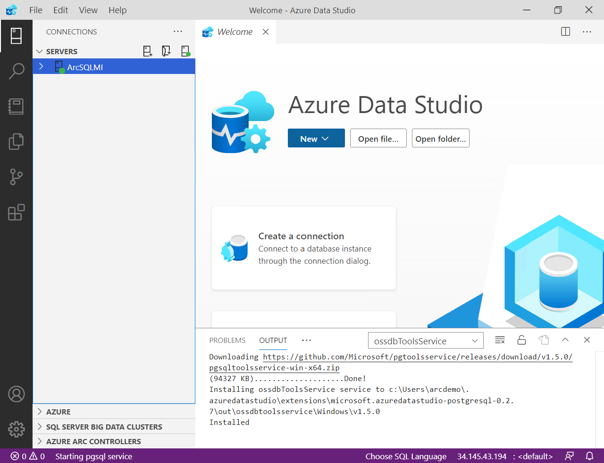

  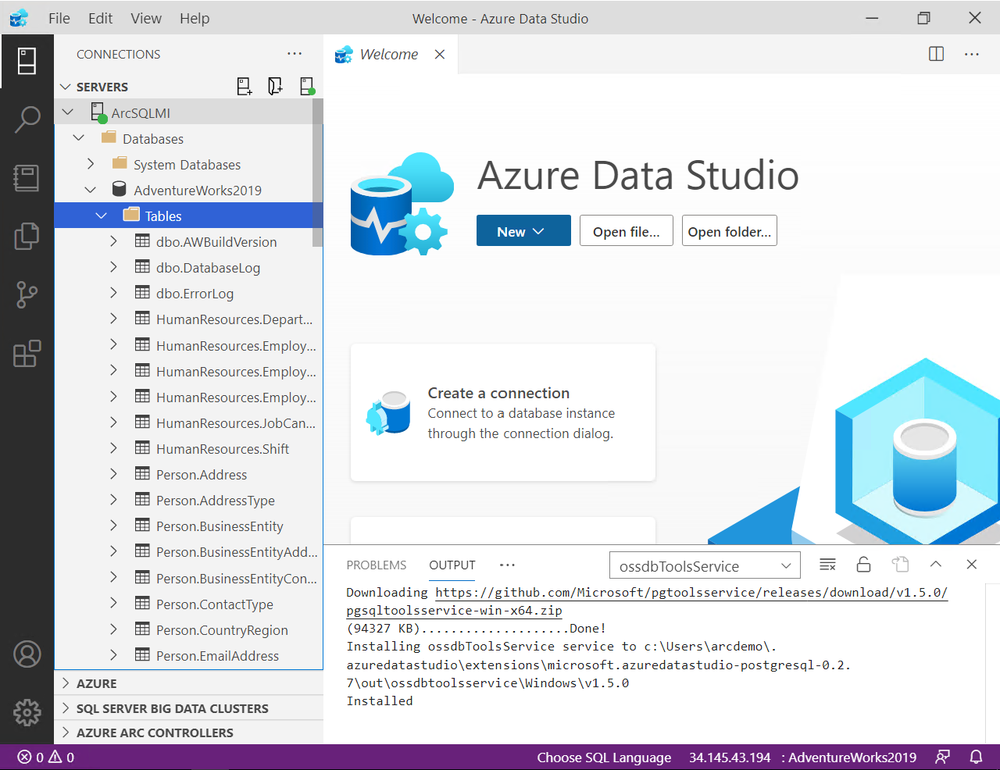

## Operations

### Azure Arc-enabled SQL Managed Instance Stress Simulation

Included in this scenario, is a dedicated SQL stress simulation tool named _SqlQueryStress_ automatically installed for you on the Client VM. _SqlQueryStress_ will allow you to generate load on the Azure Arc-enabled SQL Managed Instance that can be done used to showcase how the SQL database and services are performing as well to highlight operational practices described in the next section.

- To start with, open the _SqlQueryStress_ desktop shortcut and connect to the SQL Managed Instance **primary** endpoint IP address. This can be found in the _SQLMI Endpoints_ text file desktop shortcut that was also created for you alongside the username and password you used to deploy the environment.

  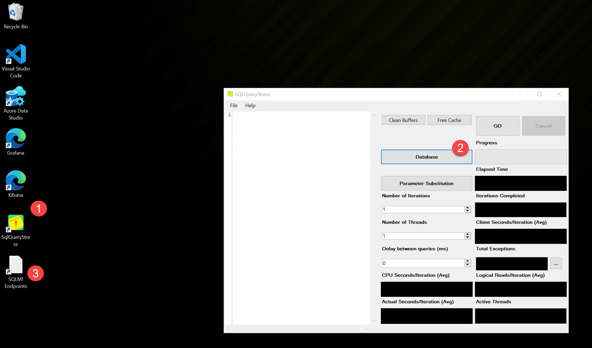

  

> **NOTE: Secondary SQL Managed Instance endpoint will be available only when using the HA deployment model ("Business Critical").**

- To connect, use "SQL Server Authentication" and select the deployed sample _AdventureWorks_ database (you can use the "Test" button to check the connection).

  

- To generate some load, we will be running a simple stored procedure. Copy the below procedure and change the number of iterations you want it to run as well as the number of threads to generate even more load on the database. In addition, change the delay between queries to 1ms for allowing the stored procedure to run for a while.

    ```sql
    exec [dbo].[uspGetEmployeeManagers] @BusinessEntityID = 8
    ```

- As you can see from the example below, the configuration settings are 100,000 iterations, five threads per iteration, and a 1ms delay between queries. These configurations should allow you to have the stress test running for a while.

  

  

### Azure Arc-enabled SQL Managed Instance monitoring using Grafana

When deploying Azure Arc-enabled data services, a [Grafana](https://grafana.com/) instance is also automatically deployed on the same Kubernetes cluster and include built-in dashboards for both Kubernetes infrastructure as well SQL Managed Instance monitoring (PostgreSQL dashboards are included as well but we will not be covering these in this section).

- Now that you have the _SqlQueryStress_ stored procedure running and generating load, we can look how this is shown in the the built-in Grafana dashboard. As part of the automation, a new URL desktop shortcut simply named "Grafana" was created.

  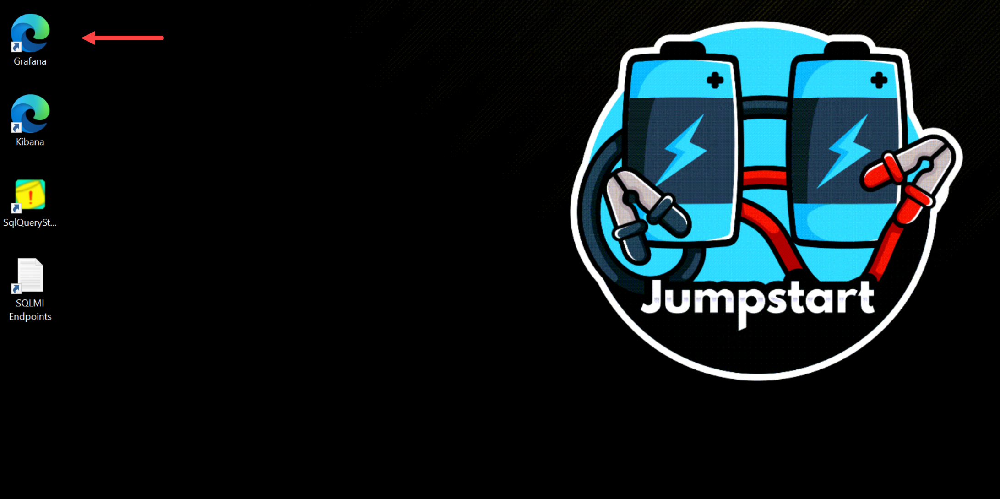

- [Optional] The IP address for this instance represents the Kubernetes _LoadBalancer_ external IP that was provision as part of Azure Arc-enabled data services. Use the _```kubectl get svc -n arc```_ command to view the _metricsui_ external service IP address.

  

- To log in, use the same username and password that is in the _SQLMI Endpoints_ text file desktop shortcut.

  

- Navigate to the built-in "SQL Managed Instance Metrics" dashboard.

  

  

- Change the dashboard time range to "Last 5 minutes" and re-run the stress test using _SqlQueryStress_ (in case it was already finished).

  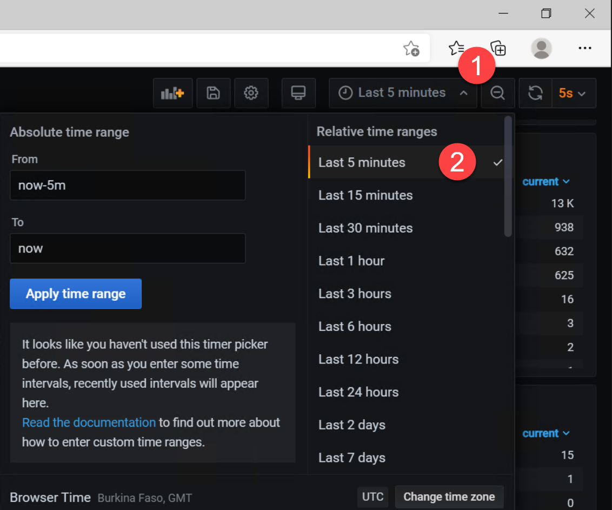

- You can now see how the SQL graphs are starting to show increased activity and load on the database instance.

  

  

## Delete the deployment

To completely delete the environment, follow the below steps.

- Delete the data services resources by using kubectl. Run the below command from a PowerShell window on the client VM.

  ```shell
  kubectl delete namespace arc
  ```

  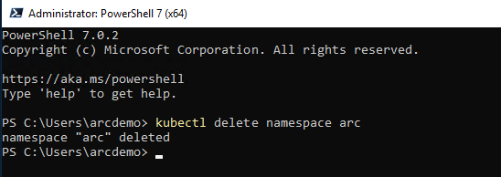

- Use terraform to delete all of the GCP resources as well as the Azure resource group. **The *terraform destroy* run time is approximately ~5-6min long**.

  ```shell
  terraform destroy --auto-approve
  ```

  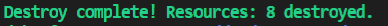
  
<!-- ## Known Issues -->
