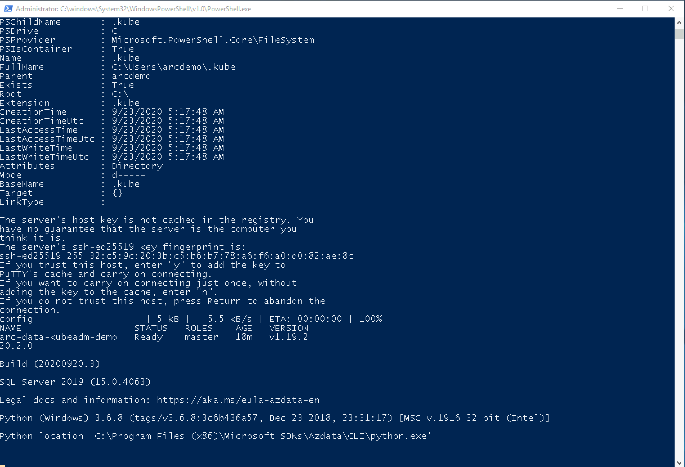

> **ADVISORY: An known issue affecting Azure CLI Kubernetes extensions is causing problems with automation in Jumpstart Kubernetes scenarios, data and app services scenarios, and ArcBox where the Azure CLI Kubernetes extensions are used. This issue will result result in incomplete or failed deployments. Thank you for your patience as the teams work to address the issue.**

## Deploy an Azure Arc Data Controller (Vanilla) on Kubeadm cluster in an Azure VM using ARM Template

The following README will guide you on how to deploy a "Ready to Go" environment so you can start using Azure Arc Data Services and deploy Azure data services on single-node Kubernetes cluster deployed with [Kubeadm](https://kubernetes.io/docs/setup/production-environment/tools/kubeadm/install-kubeadm/) in az Azure Ubuntu VM, using [Azure ARM Template](https://docs.microsoft.com/en-us/azure/azure-resource-manager/templates/overview).

By the end of this guide, you will an Ubuntu VM deployed with an Azure Arc Data Controller and a Microsoft Windows Server 2022 (Datacenter) Azure VM, installed & pre-configured with all the required tools needed to work with Azure Arc Data Services.

> **Note: Currently, Azure Arc-enabled data services with PostgreSQL Hyperscale is in [public preview](https://docs.microsoft.com/en-us/azure/azure-arc/data/release-notes)**.

## Prerequisites

* Clone the Azure Arc Jumpstart repository

    ```shell
    git clone https://github.com/microsoft/azure_arc.git
    ```

* [Install or update Azure CLI to version 2.25.0 and above](https://docs.microsoft.com/en-us/cli/azure/install-azure-cli?view=azure-cli-latest). Use the below command to check your current installed version.

  ```shell
  az --version
  ```

* Create Azure service principal (SP)

    To be able to complete the scenario and its related automation, Azure service principal assigned with the “Contributor” role is required. To create it, login to your Azure account run the below command (this can also be done in [Azure Cloud Shell](https://shell.azure.com/)).

    ```shell
    az login
    az ad sp create-for-rbac -n "<Unique SP Name>" --role contributor
    ```

    For example:

    ```shell
    az ad sp create-for-rbac -n "http://AzureArcData" --role contributor
    ```

    Output should look like this:

    ```json
    {
    "appId": "XXXXXXXXXXXXXXXXXXXXXXXXXXXX",
    "displayName": "AzureArcData",
    "name": "http://AzureArcData",
    "password": "XXXXXXXXXXXXXXXXXXXXXXXXXXXX",
    "tenant": "XXXXXXXXXXXXXXXXXXXXXXXXXXXX"
    }
    ```

    > **Note: It is optional but highly recommended to scope the SP to a specific [Azure subscription and resource group](https://docs.microsoft.com/en-us/cli/azure/ad/sp?view=azure-cli-latest).**

## Automation Flow

For you to get familiar with the automation and deployment flow, below is an explanation.

* User is editing the ARM template parameters file (1-time edit). These parameters values are being used throughout the deployment.

* Main ARM template will deploy an Ubuntu VM. The ARM template will call the the Azure [Linux Custom Script Extension](https://docs.microsoft.com/en-us/azure/virtual-machines/extensions/custom-script-linux) to:

* Deploy a single-node Kubernetes cluster using Kubeadm.
* Deploy the Azure Arc Data Controller on that cluster.
* Once Ubuntu VM deployment has finished, the main ARM template will call a secondary ARM template which is depended on a successful Ubuntu VM deployment.
* Secondary ARM template will deploy a client Windows Server 2019 VM.
* As part of the Windows Server 2019 VM deployment, there are 2 script executions; First PowerShell script [ClientTools.ps1](https://github.com/microsoft/azure_arc/blob/main/azure_arc_data_jumpstart/kubeadm/azure/arm_template/scripts/ClientTools.ps1) at deployment runtime using the ARM *CustomScriptExtension* module and the second PowerShell script *LogonScript.ps1* on user first logon to Windows.

* Runtime script will:

  * Inject user parameters values (from bullet point #1) to be used in both runtime and logon script
  * Install the required tools – az cli, az cli PowerShell module, kubernetes-cli and putty (Chocolaty packages)
  * Download & install the Azure Data Studio & azdata cli
  * Download the Azure Data Studio Azure Data CLI, Azure Arc & PostgreSQL extensions
  * Create the logon script
  * Create the Windows schedule task to run the logon script at first login
  * Disable Windows Server Manager from running at login

* Logon script will:

  * Create the *LogonScript.log* file
  * Connect to Azure using SPN credentials (from bullet point #1)
  * Copy the kubeconfig file from the Ubuntu (Kubeadm) VM to the local Windows user profile
  * Install the Azure Data Studio Azure Data CLI, Azure Arc & PostgreSQL extensions
  * Create the Azure Data Studio desktop shortcut
  * Unregister the logon script Windows schedule task so it will not run after first login

## Deployment

As mentioned, this deployment will leverage ARM templates. You will deploy a single template, responsible on deploying Ubuntu VM install with Kubernetes and the Data Controller. Once Ubuntu VM deployment has finished, the template will then automatically execute another template which will deploy the Windows Server Azure VM which will be automatically connected to the Kubernetes cluster.

* The deployment is using the ARM template parameters file. Before initiating the deployment, edit the [*azuredeploy.parameters.json*](https://github.com/microsoft/azure_arc/blob/main/azure_arc_data_jumpstart/kubeadm/azure/arm_template/azuredeploy.parameters.json) file located in your local cloned repository folder. An example parameters file is located [here](https://github.com/microsoft/azure_arc/blob/main/azure_arc_data_jumpstart/kubeadm/azure/arm_template/azuredeploy.parameters.example.json).

  * *K8svmName* - Kubeadm Ubuntu
  * *vmName* - Client Windows
  * *adminUsername* - Client Windows VM
  * *adminPassword* - Client Windows VM
  * *K8sVMSize* - Kubeadm Ubuntu
  * *vmSize* - Client Windows
  * *SPN_CLIENT_ID* - Your Azure service principal name
  * *SPN_CLIENT_SECRET* - Your Azure service principal password
  * *SPN_TENANT_ID* - Your Azure tenant ID
  * *SPN_AUTHORITY* - *https://login.microsoftonline.com* **Do not change**
  * *AZDATA_USERNAME* - Azure Arc Data Controller
  * *AZDATA_PASSWORD* - Azure Arc Data Controller admin password (The password must be at least 8 characters long and contain characters from three of the following four sets: uppercase letters, lowercase letters, numbers, and symbols.)
  * *ACCEPT_EULA* - "yes" **Do not change**
  * *ARC_DC_NAME* - Azure Arc Data Controller name. The name must consist of lowercase alphanumeric characters or '-', and must start and end with a alphanumeric character (This name will be used for *s namespace as well).
  * *ARC_DC_SUBSCRIPTION* - Azure Arc Data Controller Azure subscription ID
  * *ARC_DC_RG* - Azure resource group where all the resources get deploy
  * *ARC_DC_REGION* - Azure location where the Azure Arc Data Controller resource will be created in Azure (Currently, supported regions supported are eastus, eastus2, centralus, westus2, westeurope, southeastasia)
  * *deployBastion* - choice (true | false) to deploy Azure Bastion
  * *bastionHostName* - Azure Bastion host name

* To deploy the ARM template, navigate to the local cloned [deployment folder](https://github.com/microsoft/azure_arc/tree/main/azure_arc_data_jumpstart/kubeadm/azure/arm_template) and run the below command:

    ```shell
    az group create --name <Name of the Azure resource group> --location <Azure region>
    az deployment group create \
    --resource-group <Name of the Azure resource group> \
    --name <The name of this deployment> \
    --template-uri https://raw.githubusercontent.com/microsoft/azure_arc/main/azure_arc_data_jumpstart/kubeadm/azure/arm_template/azuredeploy.json \
    --parameters <The *azuredeploy.parameters.json* parameters file location>
    ```

    > **Note: Make sure that you are using the same Azure resource group name as the one you've just used in the *azuredeploy.parameters.json* file**

    For example:

    ```shell
    az group create --name rc-Data-Kubeadm-Demo --location "East US"
    az deployment group create \
    --resource-group Arc-Data-Kubeadm-Demo \
    --name arcdatakubeadmdemo \
    --template-uri https://raw.githubusercontent.com/microsoft/azure_arc/main/azure_arc_data_jumpstart/kubeadm/azure/arm_template/azuredeploy.json \
    --parameters azuredeploy.parameters.json
    ```

    > **Note: Deployment time of the Azure Resource (Ubuntu VM + Windows VM) can take ~15-20 minutes.**

* Once Azure resources have been provisioned, you will be able to see it in Azure portal with the Azure Arc Data Controller included. 

    

    

## Windows Login & Post Deployment

* Now that the first phase of the automation is completed, it is time to RDP to the client VM. If you have not chosen to deploy Azure Bastion in the ARM template, RDP to the VM using its public IP.

    

* If you have chosen to deploy Azure Bastion in the ARM template, use it to connect to the VM.

    

* At first login, as mentioned in the "Automation Flow" section, a logon script will get executed. This script was created as part of the automated deployment process.

    Let the script to run it's course and **do not close** the PowerShell session, this will be done for you once completed. **The logon script run time is approximately 30s long**.  

    Once the script will finish it's run, the logon script PowerShell session will be closed and the *kubeconfig* is copied to the *.kube* folder of the Windows user profile, the client VM will be ready to use.

    

    

    

* To start interacting with the Azure Arc Data Controller, Open PowerShell and use the log in command bellow.

    ```powershell
    azdata login --namespace $env:ARC_DC_NAME
    azdata arc dc status show
    ```

* Another tool automatically deployed is Azure Data Studio along with the *Azure Data CLI*, the *Azure Arc* and the *PostgreSQL* extensions. Using the Desktop shortcut created for you, open Azure Data Studio and click the Extensions settings to see both extensions.

    

    

## Using the Ubuntu Kubernetes VM

Even though everything you need is installed in the Windows client VM, it is possible, if you prefer, to use *azdata* CLI from within the Ubuntu VM.

* SSH to the Ubuntu VM using it public IP.

    

* To start interacting with the Azure Arc Data Controller, use the log in command bellow.

    ```shell
    azdata login --namespace $ARC_DC_NAME
    azdata arc dc status show
    ```

    

## Cleanup

* To delete the entire environment, simply delete the deployment resource group from the Azure portal.

    
