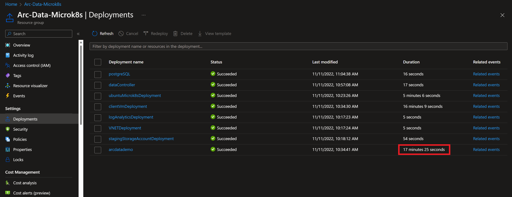

## Deploy Azure Arc enabled SQL Managed Instance in directly connected mode on a Microk8s Kubernetes cluster in an Azure VM using ARM Templates

The following README will guide you on how to deploy a "Ready to Go" environment so you can start using [Azure Arc enabled data services](https://docs.microsoft.com/en-us/azure/azure-arc/data/overview) and [SQL Managed Instance](https://docs.microsoft.com/en-us/azure/azure-arc/data/managed-instance-overview) deployed on a single-node [Microk8s](https://microk8s.io/) Kubernetes cluster.

By the end of this guide, you will have a Microk8s Kubernetes cluster deployed with an Azure Arc Data Controller & SQL Managed Instance (with a sample database), and a Microsoft Windows Server 2019 (Datacenter) Azure Client VM, installed & pre-configured with all the required tools needed to work with Azure Arc enabled data services:



> **Note: Currently, Azure Arc enabled data services is in [public preview](https://docs.microsoft.com/en-us/azure/azure-arc/data/release-notes)**.

## Prerequisites

- Clone the Azure Arc Jumpstart repository

  ```shell
  git clone https://github.com/microsoft/azure_arc.git
  ```

- [Install or update Azure CLI to version 2.15.0 and above](https://docs.microsoft.com/en-us/cli/azure/install-azure-cli?view=azure-cli-latest). Use the below command to check your current installed version.

  ```shell
  az --version
  ```

- [Generate SSH Key](https://docs.microsoft.com/en-us/azure/virtual-machines/linux/create-ssh-keys-detailed) (or use existing ssh key).

- Create Azure service principal (SP)

  To be able to complete the scenario and its related automation, Azure service principal assigned with the “Contributor” role is required. To create it, login to your Azure account run the below command (this can also be done in [Azure Cloud Shell](https://shell.azure.com/)).

  ```shell
  az login
  az ad sp create-for-rbac -n "<Unique SP Name>" --role contributor
  ```

  For example:

  ```shell
  az ad sp create-for-rbac -n "http://AzureArcData" --role contributor
  ```

  Output should look like this:

  ```json
  {
    "appId": "XXXXXXXXXXXXXXXXXXXXXXXXXXXX",
    "displayName": "AzureArcData",
    "name": "http://AzureArcData",
    "password": "XXXXXXXXXXXXXXXXXXXXXXXXXXXX",
    "tenant": "XXXXXXXXXXXXXXXXXXXXXXXXXXXX"
  }
  ```

  > **Note: It is optional, but highly recommended, to scope the SP to a specific [Azure subscription](https://docs.microsoft.com/en-us/cli/azure/ad/sp?view=azure-cli-latest).**

## Architecture (In a nutshell)

From the [Microk8s GitHub repo](https://github.com/ubuntu/microk8s):

_"Microk8s is a single-package, fully conformant, lightweight Kubernetes that works on 42 flavors of Linux. Perfect for Developer workstations, IoT, Edge & CI/CD. MicroK8s tracks upstream and releases beta, RC and final bits the same day as upstream K8s."_

In this guide, we automate the installation of Microk8s on an Ubuntu 18.04 VM running on Azure using a few simple commands to install from the [Snap Store](https://snapcraft.io/microk8s), before proceeding to onboard it as an Azure Arc enabled Kubernetes Cluster.

Once our K8s Cluster is onboarded, we proceed to create a [Custom Location](https://docs.microsoft.com/en-us/azure/azure-arc/kubernetes/custom-locations), and deploy an Azure Arc Data Controller in [Directly Connected mode](https://docs.microsoft.com/en-us/azure/azure-arc/data/connectivity#connectivity-modes).

## Automation Flow

For you to get familiar with the automation and deployment flow, below is an explanation.

- User is editing the ARM template parameters file (1-time edit). These parameters values are being used throughout the deployment.

- Main [_azuredeploy_](https://github.com/microsoft/azure_arc/blob/main/azure_arc_data_jumpstart/microk8s/azure/arm_template/azuredeploy.json) ARM template will initiate **five** linked ARM templates:

  - [_VNET_](https://github.com/microsoft/azure_arc/blob/main/azure_arc_data_jumpstart/microk8s/azure/arm_template/VNET.json) - Deploys a Virtual Network with a single subnet - used by our VMs.
  - [_ubuntuMicrok8s_](https://github.com/microsoft/azure_arc/blob/main/azure_arc_data_jumpstart/microk8s/azure/arm_template/ubuntuMicrok8s.json) - Deploys an Ubuntu Linux VM which will have Microk8s installed from the Snap Store.
  - [_clientVm_](https://github.com/microsoft/azure_arc/blob/main/azure_arc_data_jumpstart/microk8s/azure/arm_template/clientVm.json) - Deploys the Client Windows VM. This is where all user interactions with the environment are made from.
  - [_mgmtStagingStorage_](https://github.com/microsoft/azure_arc/blob/main/azure_arc_data_jumpstart/microk8s/azure/arm_template/mgmtStagingStorage.json) - Used for staging files in automation scripts and [kubeconfig](https://kubernetes.io/docs/concepts/configuration/organize-cluster-access-kubeconfig/).
  - [_logAnalytics_](https://github.com/microsoft/azure_arc/blob/main/azure_arc_data_jumpstart/microk8s/azure/arm_template/logAnalytics.json) - Deploys Azure Log Analytics workspace to support Azure Arc enabled data services logs upload.

- User remotes into Client Windows VM, which automatically kicks off the [_DataServicesLogonScript_](https://github.com/microsoft/azure_arc/blob/main/azure_arc_data_jumpstart/microk8s/azure/arm_template/artifacts/DataServicesLogonScript.ps1) PowerShell script that deploys and configure Azure Arc enabled data services on the Microk8s Kubernetes cluster - including the data controller.

## Deployment

As mentioned, this deployment will leverage ARM templates. You will deploy a single template that will initiate the entire automation for this scenario.

- The deployment is using the ARM template parameters file. Before initiating the deployment, edit the [_azuredeploy.parameters.json_](https://github.com/microsoft/azure_arc/blob/main/azure_arc_data_jumpstart/microk8s/azure/arm_template/azuredeploy.parameters.json) file located in your local cloned repository folder. An example parameters file is located [here](https://github.com/microsoft/azure_arc/blob/main/azure_arc_data_jumpstart/microk8s/azure/arm_template/artifacts/azuredeploy.parameters.example.json) (ensure to set `deploySQLMI` to _**true**_):

  - `sshRSAPublicKey` - Your SSH public key - sample syntax: `ssh-rsa AAAAB3N...NDOCE7U3DLBISw==\n`.
  - `spnClientId` - Your Azure service principal id.
  - `spnClientSecret` - Your Azure service principal secret.
  - `spnTenantId` - Your Azure tenant id.
  - `windowsAdminUsername` - Client Windows VM Administrator name.
  - `windowsAdminPassword` - Client Windows VM Password. Password must have 3 of the following: 1 lower case character, 1 upper case character, 1 number, and 1 special character. The value must be between 12 and 123 characters long.
  - `myIpAddress` - Your local IP address/CIDR range. This is used to allow remote RDP and SSH connections to the Client Windows VM and Microk8s VM.
  - `logAnalyticsWorkspaceName` - Unique name for log analytics workspace deployment.
  - `deploySQLMI` - Boolean that sets whether or not to deploy SQL Managed Instance, for this data controller and Azure SQL Managed Instance scenario, we will set it to _**true**_.
  - `deployPostgreSQL` - Boolean that sets whether or not to deploy PostgreSQL Hyperscale, for this data controller and Azure SQL Managed Instance scenario, we leave it set to _**false**_.
  - `templateBaseUrl` - GitHub URL to the deployment template - filled in by default to point to [Microsoft/Azure Arc](https://github.com/microsoft/azure_arc) repository, but you can point this to your forked repo as well.

- To deploy the ARM template, navigate to the local cloned [deployment folder](https://github.com/microsoft/azure_arc/tree/main/azure_arc_data_jumpstart/microk8s/azure/arm_template) and run the below command:

  ```shell
  az group create --name <Name of the Azure resource group> --location <Azure Region>
  az deployment group create \
  --resource-group <Name of the Azure resource group> \
  --name <The name of this deployment> \
  --template-uri https://raw.githubusercontent.com/microsoft/azure_arc/main/azure_arc_data_jumpstart/microk8s/azure/arm_template/azuredeploy.json \
  --parameters <The *azuredeploy.parameters.json* parameters file location>
  ```

  > **Note: Make sure that you are using the same Azure resource group name as the one you've just used in the `azuredeploy.parameters.json` file**

  For example:

  ```shell
  az group create --name Arc-Data-Microk8s --location "East US"
  az deployment group create \
  --resource-group Arc-Data-Microk8s \
  --name arcdatademo \
  --template-uri https://raw.githubusercontent.com/microsoft/azure_arc/main/azure_arc_data_jumpstart/microk8s/azure/arm_template/azuredeploy.json \
  --parameters azuredeploy.parameters.json
  --parameters templateBaseUrl="https://raw.githubusercontent.com/your--github--handle/azure_arc/microk8s-data/azure_arc_data_jumpstart/microk8s/azure/arm_template/"
  ```

  > **Note: The deployment time for this scenario can take ~15-20min**

  

- Once Azure resources have been provisioned, you will be able to see it in the Azure portal. At this point, the resource group should have **13 various Azure resources deployed**.

  

  

## Windows Login & Post Deployment

- Now that first phase of the automation is completed, it is time to RDP to the Client VM using it's public IP.

  

- At first login, as mentioned in the "Automation Flow" section above, the [_DataServicesLogonScript_](https://github.com/microsoft/azure_arc/blob/main/azure_arc_data_jumpstart/microk8s/azure/arm_template/artifacts/DataServicesLogonScript.ps1) PowerShell logon script will start it's run.

- Let the script run it's course and **do not close** the PowerShell session, this will be done for you once completed.

  

  Once the script will finish it's run, the logon script PowerShell session will be closed, the Windows wallpaper will change and both the Azure Arc Data Controller and the SQL Managed Instance will be deployed on the cluster and be ready to use:

  

- Since this scenario is deploying the Azure Arc Data Controller and SQL Managed Instance, you will also notice additional newly deployed Azure resources in the resources group (at this point you should have **17 various Azure resources deployed**. The important ones to notice are:

  - **Azure Arc enabled Kubernetes cluster** - Azure Arc enabled data services deployed in directly connected mode is using this resource to deploy the data services [cluster extension](https://docs.microsoft.com/en-us/azure/azure-arc/kubernetes/conceptual-extensions), as well as using Azure Arc [Custom locations](https://docs.microsoft.com/en-us/azure/azure-arc/kubernetes/conceptual-custom-locations).

  - **Custom location** - provides a way for tenant administrators to use their Azure Arc enabled Kubernetes clusters as a target location for deploying Azure services.

  - **Azure Arc Data Controller** - The data controller that is now deployed on the Kubernetes cluster.

  - **Azure Arc enabled SQL Managed Instance** - The SQL Managed Instance that is now deployed on the Kubernetes cluster.

  

- Another tool automatically deployed is Azure Data Studio along with the _Azure Data CLI_, the _Azure Arc_ and the _PostgreSQL_ extensions. Using the Desktop shortcut created for you, open Azure Data Studio and click the Extensions settings to see both extensions.

  

- Additionally, the SQL Managed Instance connection will be configured within Data Studio, as well as the sample [_AdventureWorks_](https://docs.microsoft.com/en-us/sql/samples/adventureworks-install-configure?view=sql-server-ver15&tabs=ssms) database will be restored automatically for you.

  

## Cluster extensions

In this scenario, **three** Azure Arc enabled Kubernetes cluster extensions were deployed:

- `microsoft.azuredefender.kubernetes` - The Azure Defender cluster extension. To learn more about it, you can check our Jumpstart ["Integrate Azure Defender with Cluster API as an Azure Arc Connected Cluster using Kubernetes extensions"](https://azurearcjumpstart.io/azure_arc_jumpstart/azure_arc_k8s/day2/cluster_api/cluster_api_defender_extension/#create-azure-defender-extensions-instance) scenario.

- `azuremonitor-containers` - The Azure Monitor for containers cluster extension. To learn more about it, you can check our Jumpstart ["Integrate Azure Monitor for Containers with GKE as an Azure Arc Connected Cluster using Kubernetes extensions](https://azurearcjumpstart.io/azure_arc_jumpstart/azure_arc_k8s/day2/gke/gke_monitor_extension/) scenario.

- `arc-data-services` - The Azure Arc enabled data services cluster extension that was used throughout this scenario in order to deploy the data services infrastructure.

  In order to view these cluster extensions, click on the Azure Arc enabled Kubernetes resource Extensions settings.

  

  And we see the installed extensions:
  

## Cleanup

- If you want to delete the entire environment, simply delete the deployed resource group from the Azure portal.

  
