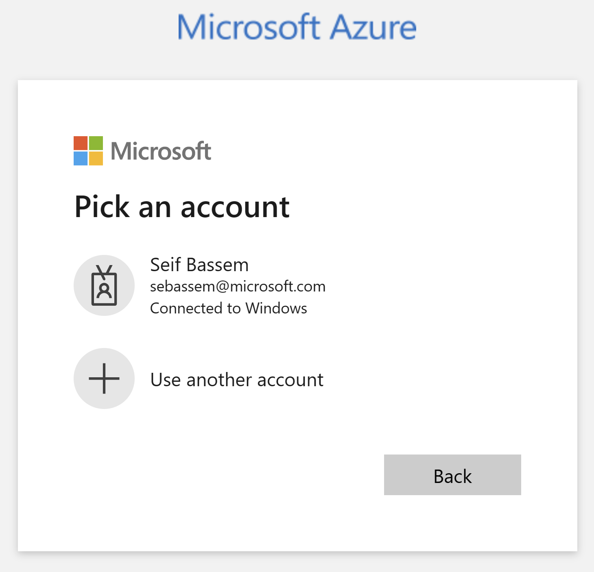

# ft1 deployment guide

## Overview

This Jumpstart scenario provides a simple deployment process using Azure Bicep and PowerShell that minimizes user interaction. This automation automatically configures the ft1 environment, including the infrastructure, the ft1 solution, Azure Arc integration, observability components and reporting. The diagram below details the high-level architecture that is deployed and configured as part of the automation.


Deploying the ft1 scenario consists of the following steps (once prerequisites are met).

  1. Deploy infrastructure - The user deploys a Bicep file that creates the infrastructure in an Azure resource group.
  2. Bicep template deploys multiple Azure resources including the Client virtual machine.
  3. Client VM uses a custom script extension to run the Bootstrap PowerShell script which initializes the environment.
  4. Bootstrap script injects the Logon script to the Client VM.
  5. User logs in to the ft1-VM-Client Azure virtual machine.
  6. After login the ft1-VM-Client PowerShell scripts automatically run that configure the configures and deplys all components. These scripts will take some time to run.

Once automation is complete, users can immediately start enjoying the ft1 experience.


## Prerequisites

- KeyVault delegation
- [Install or update Azure CLI to version 2.49.0 or above](https://docs.microsoft.com/cli/azure/install-azure-cli?view=azure-cli-latest). Use the following command to check your current installed version.

    ```shell
    az --version
    ```

- Login to Azure CLI using the ```az login``` command.

- Ensure that you have selected the correct subscription you want to deploy ft1 to by using the ```az account list --query "[?isDefault]"``` command. If you need to adjust the active subscription used by Az CLI, follow [this guidance](https://docs.microsoft.com/cli/azure/manage-azure-subscriptions-azure-cli#change-the-active-subscription).

- ft1 must be deployed to one of the following regions. __Deploying ft1 outside of these regions may result in unexpected results or deployment errors.__

  - East US
  - East US 2
  - West US 2
  - North Europe
  - West Europe

- __ft1 requires 8 Ds-series vCPUs__. Ensure you have sufficient vCPU quota available in your Azure subscription and the region where you plan to deploy ft1. You can use the below Az CLI command to check your vCPU utilization.

  ```shell
  az vm list-usage --location <your location> --output table
  ```

  

- __ft1 requires 1 Public IP addresses__. Ensure you have sufficient Public IP addresses available in your Azure subscription and the region where you plan to deploy ft1.

- Create Azure service principal (SP). An Azure service principal assigned with the _Owner_ Role-based access control (RBAC) role is required. You can use Azure Cloud Shell (or other Bash shell), or PowerShell to create the service principal.

  - (Option 1) Create service principal using [Azure Cloud Shell](https://shell.azure.com/) or Bash shell with Azure CLI:

    ```shell
    az login
    subscriptionId=$(az account show --query id --output tsv)
    az ad sp create-for-rbac -n "<Unique SP Name>" --role "Owner" --scopes /subscriptions/$subscriptionId
    ```

    For example:

    ```shell
    az login
    subscriptionId=$(az account show --query id --output tsv)
    az ad sp create-for-rbac -n "Jumpstartft1SPN" --role "Owner" --scopes /subscriptions/$subscriptionId
    ```

    Output should look similar to this:

    ```json
    {
    "appId": "XXXXXXXXXXXXXXXXXXXXXXXXXXXX",
    "displayName": "Jumpstartft1",
    "password": "XXXXXXXXXXXXXXXXXXXXXXXXXXXX",
    "tenant": "XXXXXXXXXXXXXXXXXXXXXXXXXXXX"
    }
    ```

  - (Option 2) Create service principal using PowerShell. If necessary, follow [this documentation](https://learn.microsoft.com/powershell/azure/install-az-ps?view=azps-8.3.0) to install or update Azure PowerShell to version 10.4.0 or above.

    ```PowerShell
    $account = Connect-AzAccount
    $spn = New-AzADServicePrincipal -DisplayName "<Unique SPN name>" -Role "Owner" -Scope "/subscriptions/$($account.Context.Subscription.Id)"
    echo "SPN App id: $($spn.AppId)"
    echo "SPN secret: $($spn.PasswordCredentials.SecretText)"
    echo "SPN tenant: $($account.Context.Tenant.Id)"
    ```

    For example:

    ```PowerShell
    $account = Connect-AzAccount
    $spn = New-AzADServicePrincipal -DisplayName "Jumpstartft1SPN" -Role "Owner" -Scope "/subscriptions/$($account.Context.Subscription.Id)"
    echo "SPN App id: $($spn.AppId)"
    echo "SPN secret: $($spn.PasswordCredentials.SecretText)"
    ```

    Output should look similar to this:

    

    > __NOTE: If you create multiple subsequent role assignments on the same service principal, your client secret (password) will be destroyed and recreated each time. Therefore, make sure you grab the correct secret.__
    > __NOTE: The Jumpstart scenarios are designed with as much ease of use in mind and adhering to security-related best practices whenever possible. It is optional but highly recommended to scope the service principal to a specific [Azure subscription and resource group](https://docs.microsoft.com/cli/azure/ad/sp?view=azure-cli-latest) as well as considering using a [less privileged service principal account](https://docs.microsoft.com/azure/role-based-access-control/best-practices)__

## Deployment: Bicep deployment via Azure CLI

- Upgrade to latest Bicep version

  ```shell
  az bicep upgrade
  ```

- Edit the [main.parameters.json](https://github.com/microsoft/azure_arc/blob/main/azure_jumpstart_ag/bicep/main.parameters.json) template parameters file and supply some values for your environment.
  - _`spnClientId`_ - Your Azure service principal application id
  - _`spnObjectId`_ Your Azure service principal object id
  - _`spnClientSecret`_ - Your Azure service principal secret
  - _`spnTenantId`_ - Your Azure tenant id
  - _`windowsAdminUsername`_ - Client Windows VM Administrator name
  - _`windowsAdminPassword`_ - Client Windows VM Password. Password must have 3 of the following: 1 lower case character, 1 upper case character, 1 number, and 1 special character. The value must be between 12 and 123 characters long.
  - _`deployBastion`_ - Option to deploy using Azure Bastion instead of traditional RDP. Set to true or false.

  

- You will also need to get the Azure Custom Location Resource Provider (RP) Object ID (OID) and export it as an environment variable. This is required to enable [Custom Location](https://learn.microsoft.com/azure/azure-arc/platform/conceptual-custom-locations) on your cluster.

> **NOTE: You need permissions to list all the service principals.**

#### Option 1: Bash

  ```bash
  customLocationRPOID=$(az ad sp list --filter "displayname eq 'Custom Locations RP'" --query "[?appDisplayName=='Custom Locations RP'].id" -o tsv)
  ```

#### Option 2: PowerShell

  ```powershell
  $customLocationRPOID=(az ad sp list --filter "displayname eq 'Custom Locations RP'" --query "[?appDisplayName=='Custom Locations RP'].id" -o tsv)
  ```

- Now you will deploy the Bicep file. Navigate to the local cloned [deployment folder](https://github.com/microsoft/azure_arc/tree/main/azure_jumpstart_ag/bicep) and run the below command:

  ```shell
  az login
  az group create --name "<resource-group-name>"  --location "<preferred-location>"
  az deployment group create -g "<resource-group-name>" -f "main.bicep" -p "main.parameters.json" -p customLocationRPOID="$customLocationRPOID"
  ```

    > __NOTE: If you see any failure in the deployment, please check the [troubleshooting guide](https://azurearcjumpstart.io/azure_jumpstart_ag/contoso_supermarket/troubleshooting/).__

## Deployment via Azure Developer CLI

Jumpstart ft1 provides a feature that allows users to deploy with the [Azure Developer CLI](https://learn.microsoft.com/azure/developer/azure-developer-cli/overview). Follow these steps to try this feature in your subscription.

- Follow to install guide for the [Azure Developer CLI](https://learn.microsoft.com/azure/developer/azure-developer-cli/install-azd?tabs=winget-windows%2Cbrew-mac%2Cscript-linux&pivots=os-linux) for your environment.

  > __NOTE: PowerShell is required for using azd with Jumpstart ft1. If you are running in a Linux environment be sure that you have [PowerShell for Linux](https://learn.microsoft.com/powershell/scripting/install/installing-powershell-on-linux?view=powershell-7.3) installed.__

- Login with azd using ```azd auth login``` which will open a browser for interactive login.

  

- Run the ```azd init``` command from your cloned repo _*azure_arc_jumpstart*_ folder.

  

- Run the ```azd up``` command to deploy the environment. Azd will prompt you to enter the target subscription, region and all required parameters.

  

## Start post-deployment automation

Once your deployment is complete, you can open the Azure portal and see the ft1 scenario resources inside your resource group. You will be using the _ft1-Client-VM_ Azure virtual machine to explore various capabilities of ft1. You will need to remotely access _ft1-Client-VM_.

  

   > __NOTE: For enhanced ft1 security posture, RDP (3389) and SSH (22) ports are not open by default in ft1 deployments. You will need to create a network security group (NSG) rule to allow network access to port 3389, or use [Azure Bastion](https://docs.microsoft.com/azure/bastion/bastion-overview) or [Just-in-Time (JIT)](https://docs.microsoft.com/azure/defender-for-cloud/just-in-time-access-usage?tabs=jit-config-asc%2Cjit-request-asc) access to connect to the VM.__

### Connecting to the ft1 Client virtual machine

Various options are available to connect to _ft1-Client-VM_, depending on the parameters you supplied during deployment.

- [RDP](https://azurearcjumpstart.io/azure_jumpstart_ag/contoso_supermarket/deployment/#connecting-directly-with-rdp) - available after configuring access to port 3389 on the _ft1-NSG-Prod_, or by enabling [Just-in-Time access (JIT)](https://azurearcjumpstart.io/azure_jumpstart_ag/contoso_supermarket/deployment/#connect-using-just-in-time-accessjit).
- [Azure Bastion](https://azurearcjumpstart.io/azure_jumpstart_ag/contoso_supermarket/deployment/#connect-using-azure-bastion) - available if ```true``` was the value of your _`deployBastion`_ parameter during deployment.

#### Connecting directly with RDP

By design, ft1 does not open port 3389 on the network security group. Therefore, you must create an NSG rule to allow inbound 3389.

- Open the _ft1-NSG-Prod_ resource in Azure portal and click "Add" to add a new rule.

  

- Select My IP address from the dropdown.

  
  
  <br/>
  
  

  

#### Connect using Azure Bastion

- If you have chosen to deploy Azure Bastion in your deployment, use it to connect to the VM.

  

  > __NOTE: When using Azure Bastion, the desktop background image is not visible. Therefore some screenshots in this guide may not exactly match your experience if you are connecting to _ft1-Client-VM_ with Azure Bastion.__

#### Connect using just-in-time access (JIT)

If you already have [Microsoft Defender for Cloud](https://docs.microsoft.com/azure/defender-for-cloud/just-in-time-access-usage?tabs=jit-config-asc%2Cjit-request-asc) enabled on your subscription and would like to use JIT to access the Client VM, use the following steps:

- In the Client VM configuration pane, enable just-in-time. This will enable the default settings.

  

  

  

### The Logon scripts

- Once you log into the _ft1-Client-VM_, multiple automated scripts will open and start running. These scripts usually take around thirty minutes to finish, and once completed, the script windows will close automatically. At this point, the deployment is complete.

  

- Deployment is complete! Let's begin exploring the features of Contoso Supermarket!

  

  

## Next steps

Once deployment is complete its time to start experimenting with the various scenarios under the “Contoso Supermarket” experience, starting with the [“Data pipeline and reporting across cloud and edge for store orders”](https://azurearcjumpstart.io/azure_jumpstart_ag/contoso_supermarket/data_pos/).
