## Deploy AKS cluster and connect it to Azure Arc using Terraform

The following README will guide you on how to use the provided [Terraform](https://www.terraform.io/) plan to deploy an [Azure Kubernetes Service (AKS)](https://docs.microsoft.com/en-us/azure/aks/intro-kubernetes) cluster and connected it as an Azure Arc-enabled Kubernetes resource.

  > **Note: Since AKS is a 1st-party Azure solution and natively supports capabilities such as [Azure Monitor](https://docs.microsoft.com/en-us/azure/azure-monitor/insights/container-insights-overview) integration as well as GitOps configurations (currently in preview), it is not expected for an AKS cluster to be projected as an Azure Arc-enabled Kubernetes cluster. The following scenario should ONLY be used for demo and testing purposes.**

## Prerequisites

* Clone the Azure Arc Jumpstart repository

    ```shell
    git clone https://github.com/microsoft/azure_arc.git
    ```

* [Install or update Azure CLI to version 2.15.0 and above](https://docs.microsoft.com/en-us/cli/azure/install-azure-cli?view=azure-cli-latest). Use the below command to check your current installed version.

  ```shell
  az --version
  ```

* [Install Terraform >=0.12](https://learn.hashicorp.com/terraform/getting-started/install.html)

* Create Azure service principal (SP)

    To be able to complete the scenario and its related automation, Azure service principal assigned with the “Contributor” role is required. To create it, login to your Azure account run the below command (this can also be done in [Azure Cloud Shell](https://shell.azure.com/)).

    ```shell
    az login
    az ad sp create-for-rbac -n "<Unique SP Name>" --role contributor
    ```

    For example:

    ```shell
    az ad sp create-for-rbac -n "http://AzureArcK8s" --role contributor
    ```

    Output should look like this:

    ```json
    {
    "appId": "XXXXXXXXXXXXXXXXXXXXXXXXXXXX",
    "displayName": "AzureArcK8s",
    "name": "http://AzureArcK8s",
    "password": "XXXXXXXXXXXXXXXXXXXXXXXXXXXX",
    "tenant": "XXXXXXXXXXXXXXXXXXXXXXXXXXXX"
    }
    ```

    > **Note: The Jumpstart scenarios are designed with as much ease of use in-mind and adhering to security-related best practices whenever possible. It is optional but highly recommended to scope the service principal to a specific [Azure subscription and resource group](https://docs.microsoft.com/en-us/cli/azure/ad/sp?view=azure-cli-latest) as well considering using a [less privileged service principal account](https://docs.microsoft.com/en-us/azure/role-based-access-control/best-practices)**

* [Enable subscription with](https://docs.microsoft.com/en-us/azure/azure-resource-manager/management/resource-providers-and-types#register-resource-provider) the two resource providers for Azure Arc-enabled Kubernetes. Registration is an asynchronous process, and registration may take approximately 10 minutes.

  ```shell
  az provider register --namespace Microsoft.Kubernetes
  az provider register --namespace Microsoft.KubernetesConfiguration
  ```

  You can monitor the registration process with the following commands:

  ```shell
  az provider show -n Microsoft.Kubernetes -o table
  az provider show -n Microsoft.KubernetesConfiguration -o table
  ```

## Deployment

The only thing you need to do before executing the Terraform plan is to export the environment variables which will be used by the plan. This is based on the Azure service principal you've just created and your subscription.  

In addition, validate that the AKS Kubernetes version is available in your region using the below Azure CLI command.

```shell
az aks get-versions -l "<Your Azure Region>"
```

In case the AKS service is not available in your region, you can change the AKS Kubernetes version in the [*variables.tf*](https://github.com/microsoft/azure_arc/blob/main/azure_arc_k8s_jumpstart/aks/terraform/variables.tf) file by searching for *kubernetes_version*.

* Export the environment variables needed for the Terraform plan.

    ```shell
    export TF_VAR_client_id=<Your Azure service principal App ID>
    export TF_VAR_client_secret=<Your Azure service principal App Password>
    ```

    > **Note: If you are running in a PowerShell environment, to set the Terraform environment variables, use the _Set-Item -Path env:_ prefix (see example below)**

    ```powershell
    Set-Item -Path env:TF_VAR_client_id
    ```

* Run the ```terraform init``` command which will download the Terraform AzureRM provider.

    

* Run the ```terraform apply --auto-approve``` command and wait for the plan to finish.

    Once the Terraform deployment is completed, a new AKS cluster in a new Azure resource group is created.

    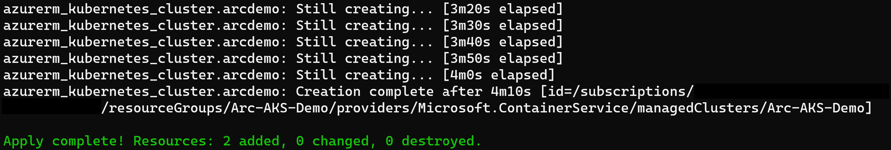

    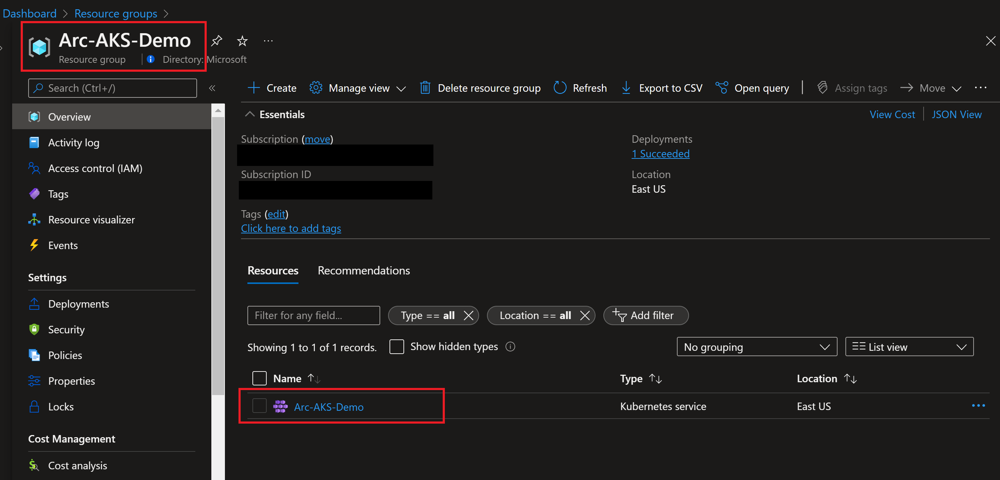

    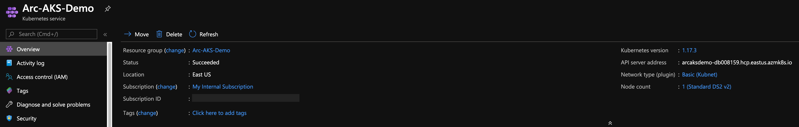

* Now that you have a running AKS cluster, edit the environment variables section in the included [az_connect_aks](https://github.com/microsoft/azure_arc/blob/main/azure_arc_k8s_jumpstart/aks/terraform/scripts/az_connect_aks.sh) shell script.

    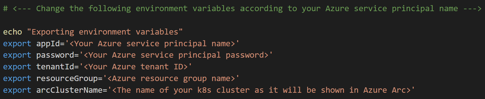

* In order to keep your local environment clean and untouched, we will use [Azure Cloud Shell](https://docs.microsoft.com/en-us/azure/cloud-shell/overview) (located in the top-right corner in the Azure portal) to run the *az_connect_aks* shell script against the AKS cluster. **Make sure Cloud Shell is configured to use Bash.**

    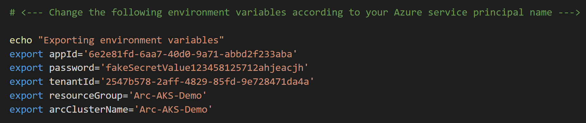

* Edit the environment variables in the [*az_connect_aks*](https://github.com/microsoft/azure_arc/blob/main/azure_arc_k8s_jumpstart/aks/terraform/scripts/az_connect_aks.sh) shell script to match your parameters, upload it to the Cloud Shell environment and run it using the ```. ./az_connect_aks.sh``` command.

    > **Note: The extra dot is due to the script has an *export* function and needs to have the vars exported in the same shell session as the rest of the commands.**

    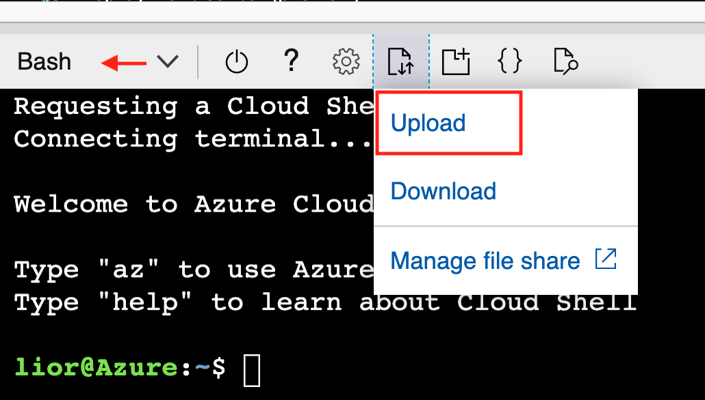

    

    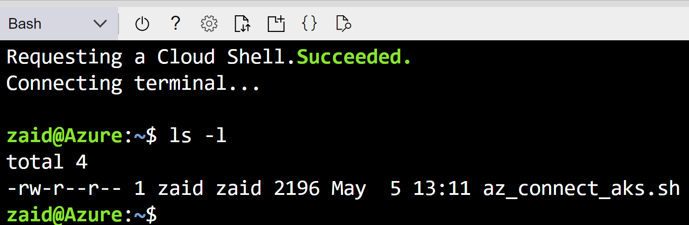

    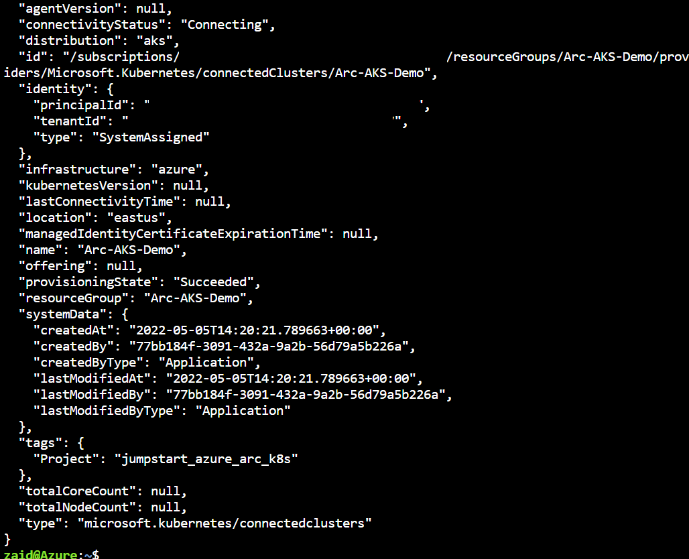

* Once the script run has finished, the AKS cluster will be projected as a new Azure Arc-enabled Kubernetes resource.

    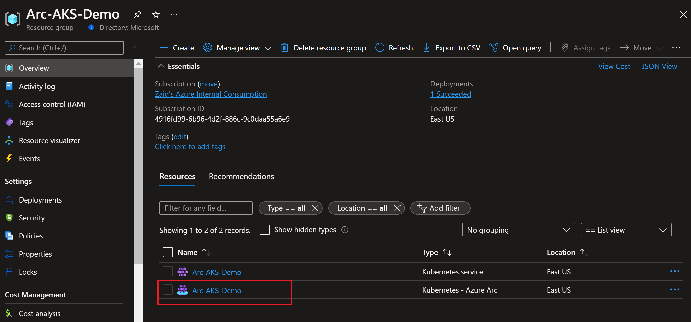

    

## Delete the deployment

The most straightforward way is to delete the Azure Arc-enabled Kubernetes resource via the Azure Portal, just select the cluster and delete it.

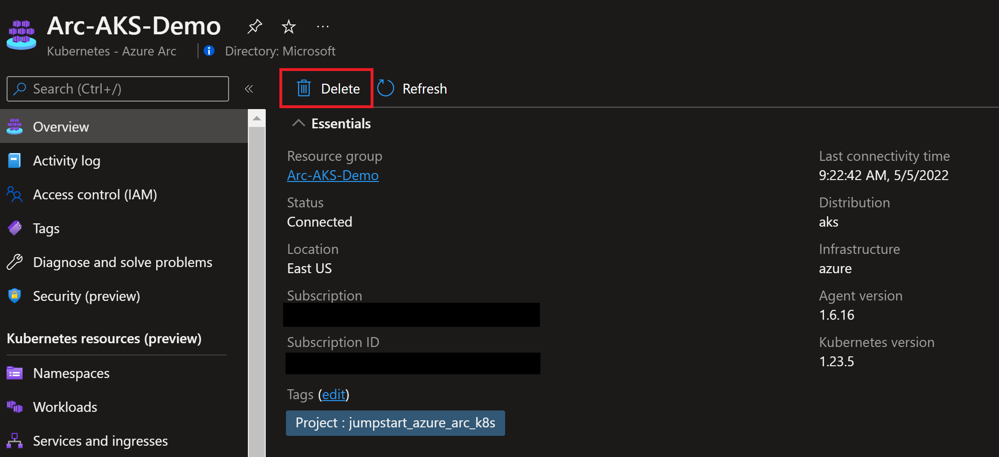

If you want to nuke the entire environment, delete both the AKS and the AKS resources resource groups or run the ```terraform destroy -auto-approve``` command.

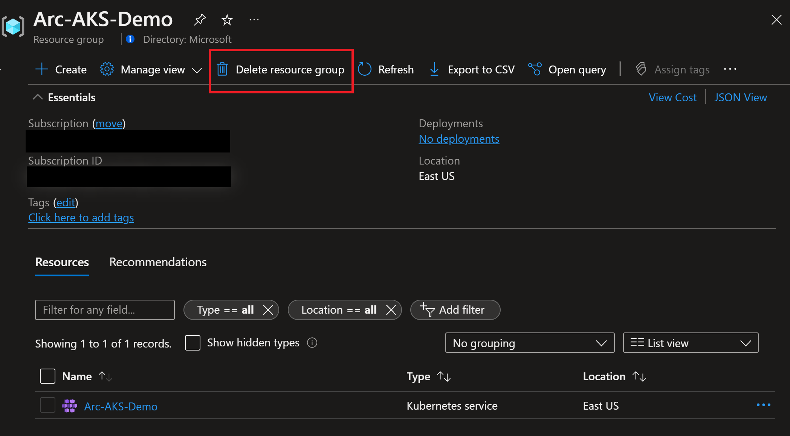

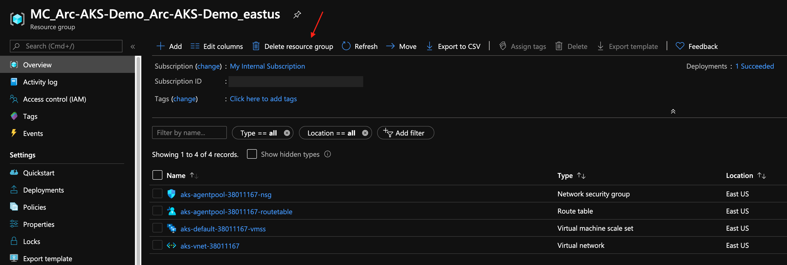
