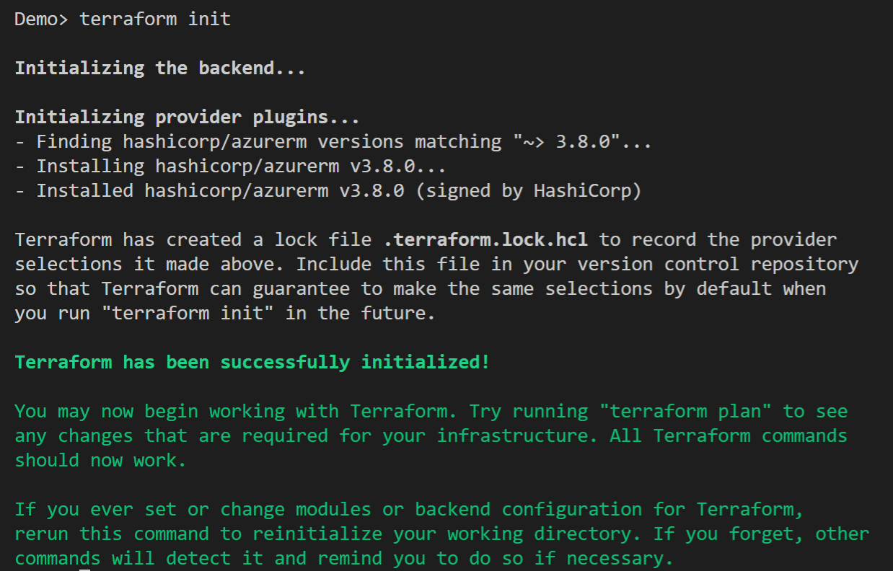

## Deploy AKS cluster and connect it to Azure Arc using Terraform

The following Jumpstart scenario will guide you on how to use the provided [Terraform](https://www.terraform.io/) plan to deploy an [Azure Kubernetes Service (AKS)](https://docs.microsoft.com/azure/aks/intro-kubernetes) cluster and connected it as an Azure Arc-enabled Kubernetes resource.

  > **NOTE: Since AKS is a 1st-party Azure solution and natively supports capabilities such as [Azure Monitor](https://docs.microsoft.com/azure/azure-monitor/insights/container-insights-overview) integration as well as GitOps configurations, it is not expected for an AKS cluster to be projected as an Azure Arc-enabled Kubernetes cluster. Connecting an Azure Kubernetes Service (AKS) cluster to Azure Arc is only required for running Arc enabled services like App Services and Data Services on the cluster.**

## Prerequisites

- Clone the Azure Arc Jumpstart repository

    ```shell
    git clone https://github.com/microsoft/azure_arc.git
    ```

- [Install or update Azure CLI to version 2.49.0 and above](https://docs.microsoft.com/cli/azure/install-azure-cli?view=azure-cli-latest). Use the below command to check your current installed version.

  ```shell
  az --version
  ```

- [Install Terraform >=1.1.9](https://learn.hashicorp.com/terraform/getting-started/install.html)

- Create Azure service principal (SP)

    To be able to complete the scenario and its related automation, Azure service principal assigned with the “Contributor” role is required. To create it, login to your Azure account run the below command (this can also be done in [Azure Cloud Shell](https://shell.azure.com/)).

    ```shell
    az login
    subscriptionId=$(az account show --query id --output tsv)
    az ad sp create-for-rbac -n "<Unique SP Name>" --role "Contributor" --scopes /subscriptions/$subscriptionId
    ```

    For example:

    ```shell
    az login
    subscriptionId=$(az account show --query id --output tsv)
    az ad sp create-for-rbac -n "JumpstartArcK8s" --role "Contributor" --scopes /subscriptions/$subscriptionId
    ```

    Output should look like this:

    ```json
    {
    "appId": "XXXXXXXXXXXXXXXXXXXXXXXXXXXX",
    "displayName": "JumpstartArcK8s",
    "password": "XXXXXXXXXXXXXXXXXXXXXXXXXXXX",
    "tenant": "XXXXXXXXXXXXXXXXXXXXXXXXXXXX"
    }
    ```

    > **NOTE: If you create multiple subsequent role assignments on the same service principal, your client secret (password) will be destroyed and recreated each time. Therefore, make sure you grab the correct password**.

    > **NOTE: The Jumpstart scenarios are designed with as much ease of use in-mind and adhering to security-related best practices whenever possible. It is optional but highly recommended to scope the service principal to a specific [Azure subscription and resource group](https://docs.microsoft.com/cli/azure/ad/sp?view=azure-cli-latest) as well considering using a [less privileged service principal account](https://docs.microsoft.com/azure/role-based-access-control/best-practices)**

## Automation Flow

For you to get familiar with the automation and deployment flow, below is an explanation.

1. User edits the tfvars to match the environment.
2. User runs ```terraform init``` to download the required terraform providers.
3. User is uploading the script to Azure Cloud Shell and running the shell script. The script will:

    - Connect to Azure using SPN credentials.
    - Get AKS credentials.
    - Install Azure Arc CLI extensions.
    - Connecting the cluster to Azure Arc.

4. User verifies the Arc-enabled Kubernetes cluster.

## Deployment

The only thing you need to do before executing the Terraform plan is to create the tfvars file which will be used by the plan. This is based on the Azure service principal you've just created and your subscription.

- Navigate to the [terraform folder](https://github.com/microsoft/azure_arc/tree/main/azure_arc_k8s_jumpstart/aks/terraform) and fill in the terraform.tfvars file with the values for your environment.

In addition, validate that the AKS Kubernetes version is available in your region using the below Azure CLI command.

```shell
az aks get-versions -l "<Your Azure Region>"
```

In case the AKS service is not available in your region, you can change the AKS Kubernetes version in the [*variables.tf*](https://github.com/microsoft/azure_arc/blob/main/azure_arc_k8s_jumpstart/aks/terraform/variables.tf) file by searching for *kubernetes_version*.

- Run the ```terraform init``` command which will download the required terraform providers.

    

- Run the *`terraform apply --auto-approve`* command and wait for the plan to finish.

    Once the Terraform deployment is completed, a new AKS cluster in a new Azure resource group is created.

    

    

    

## Connecting to Azure Arc

- Now that you have a running AKS cluster, edit the environment variables section in the included [az_connect_aks](https://github.com/microsoft/azure_arc/blob/main/azure_arc_k8s_jumpstart/aks/terraform/scripts/az_connect_aks.sh) shell script.

    

    For example:

    

- In order to keep your local environment clean and untouched, we will use [Azure Cloud Shell](https://docs.microsoft.com/azure/cloud-shell/overview) (located in the top-right corner of the Azure portal) to run the *az_connect_aks* shell script against the AKS cluster. **Make sure Cloud Shell is configured to use Bash.**

    

- Edit the environment variables in the [*az_connect_aks*](https://github.com/microsoft/azure_arc/blob/main/azure_arc_k8s_jumpstart/aks/terraform/scripts/az_connect_aks.sh) shell script to match your parameters, upload it to the Cloud Shell environment and run it using the *`. ./az_connect_aks.sh`* command.

    > **NOTE: The extra dot is due to the script having an _export_ function and needs to have the vars exported in the same shell session as the rest of the commands.**

    

    

- Once the script run has finished, the AKS cluster will be projected as a new Azure Arc-enabled Kubernetes resource.

    

    

    

## Delete the deployment

The most straightforward way is to delete the Azure Arc-enabled Kubernetes resource via the Azure portal, just select the cluster and delete it.


If you want to nuke the entire environment, delete the resource group.


