## Discover ONVIF cameras with Akri on AKS Edge Essentials multi-node deployment

The following Jumpstart scenario will show how to create an AKS Edge Essentials full deployment with two VMs in Hyper-V nested virtualization in an Azure Windows Server VM, and connect the Hyper-V VMs and AKS Edge Essentials cluster to Azure Arc using [Azure Bicep](https://learn.microsoft.com/azure/azure-resource-manager/bicep/overview). Once Edge Essentials is deployed [Akri](https://docs.akri.sh/) is installed as a Kubernetes resource interface that exposes an IP mock camera as resources in the Edge Essentials cluster.

Akri is an open-source project for a Kubernetes resource interface that lets you expose heterogenous leaf devices as resources in a Kubernetes cluster. It currently supports OPC UA, ONVIF, and udev protocols, but you can also implement custom protocol handlers provided by the template. In this scenario, Akri is used for handling the dynamic appearance and disappearance of an [ONVIF](https://wikipedia.org/wiki/ONVIF) mock camera as the Discovery Handler.

> **NOTE: It is not expected to use a nested virtualization in a production environment, let alone using an Azure VM to do so. The below scenario is unsupported and should ONLY be used for demo and testing purposes.**

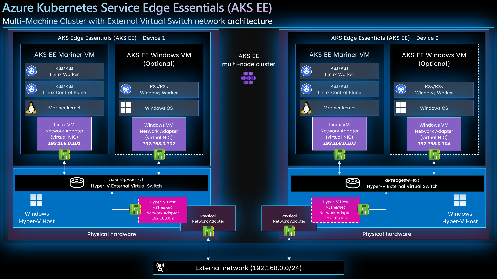

## Prerequisites

- [Install or update Azure CLI to version 2.42.0 and above](https://docs.microsoft.com/cli/azure/install-azure-cli?view=azure-cli-latest). Use the below command to check your current installed version.

  ```shell
  az --version
  ```

- In case you don't already have one, you can [Create a free Azure account](https://azure.microsoft.com/free/).

- Create Azure service principal (SP)

    To complete the scenario and its related automation, an Azure service principal with the “Contributor” role assigned is required. To create it, login to your Azure account and run the below command (this can also be done in [Azure Cloud Shell](https://shell.azure.com/)).

    ```shell
    az login
    subscriptionId=$(az account show --query id --output tsv)
    az ad sp create-for-rbac -n "<Unique SP Name>" --role "Contributor" --scopes /subscriptions/$subscriptionId
    ```

    For example:

    ```shell
    az login
    subscriptionId=$(az account show --query id --output tsv)
    az ad sp create-for-rbac -n "JumpstartArc" --role "Contributor" --scopes /subscriptions/$subscriptionId
    ```

    Output should look like this:

    ```json
    {
    "appId": "XXXXXXXXXXXXXXXXXXXXXXXXXXXX",
    "displayName": "JumpstartArc",
    "password": "XXXXXXXXXXXXXXXXXXXXXXXXXXXX",
    "tenant": "XXXXXXXXXXXXXXXXXXXXXXXXXXXX"
    }
    ```

    > **NOTE: If you create multiple subsequent role assignments on the same service principal, your client secret (password) will be destroyed and recreated each time. Therefore, make sure you grab the correct password**.
    > **NOTE: The Jumpstart scenarios are designed with ease of use in-mind and adhere to security-related best practices whenever possible. It is optional but highly recommended to scope the service principal to a specific [Azure subscription and resource group](https://docs.microsoft.com/cli/azure/ad/sp?view=azure-cli-latest) as well as considering use of a [less privileged service principal account](https://docs.microsoft.com/azure/role-based-access-control/best-practices)**

## Automation Flow

For you to get familiar with the automation and deployment flow, below is an explanation.

- User edits the Azure Bicep template parameters file (1-time edit). These parameter values are used throughout the deployment.

- Main [_main.bicep_](https://github.com/microsoft/azure_arc/blob/main/azure_arc_k8s_jumpstart/aks_hybrid/aks_edge_essentials_full_akri/bicep_template/main.bicep) will initiate the deployment of the following resources:

  - _Virtual Network_ - Virtual Network for Azure Windows Server VM.
  - _Network Interface_ - Network Interface for Azure Windows Server VM.
  - _Network Security Group_ - Network Security Group to allow RDP in Azure Windows Server VM.
  - _Virtual Machine_ - Azure Windows Server VM.
  - _Custom script_ - Configure the Azure Windows Server virtual machine to host the Hyper-V virtual machines that will act as AKS Edge Essentials nodes.

- User remotes into the Azure Windows Server VM, which automatically kicks off the [_LogonScript_](https://github.com/microsoft/azure_arc/blob/main/azure_arc_k8s_jumpstart/aks_hybrid/aks_edge_essentials_full_akri/bicep_template/artifacts/LogonScript.ps1) PowerShell script to create the Hyper-V virtual machines, AKS Edge Essentials cluster, onboard the Hyper-V VMs and AKS Edge Essentials cluster to Azure Arc, deploy Akri and the mock camera.

## Deployment

As mentioned, this deployment will leverage Azure Bicep templates. You will deploy a single template, responsible for creating all the Azure resources in a single resource group as well onboarding the created VM to Azure Arc.

- Clone the Azure Arc Jumpstart repository

    ```shell
    git clone https://github.com/microsoft/azure_arc.git
    ```

- Before deploying the Azure Bicep template, login to Azure using Azure CLI with the ```az login``` command.

- The deployment uses the Azure Bicep parameters file. Before initiating the deployment, edit the [_main.parameters.json_](https://github.com/microsoft/azure_arc/blob/main/azure_arc_k8s_jumpstart/aks_hybrid/aks_edge_essentials_full_akri/bicep_template/main.parameters.json) file located in your local cloned repository folder. An example parameters file is located [here](https://github.com/microsoft/azure_arc/blob/main/azure_arc_k8s_jumpstart/aks_hybrid/aks_edge_essentials_full_akri/bicep_template/main.parameters.example.json).

  - _`kubernetesDistribution`_ - Choice (k8s | k3s) kubernetes distribution.
  - _`spnClientId`_ - Your Azure service principal id.
  - _`spnClientSecret`_ - Your Azure service principal secret.
  - _`spnTenantId`_ - Your Azure tenant id.
  - _`windowsAdminUsername`_ - Azure Windows Server VM Administrator name.
  - _`windowsAdminPassword`_ - Azure Windows Server VM Password. Password must have 3 of the following: 1 lower case character, 1 upper case character, 1 number, and 1 special character. The value must be between 12 and 123 characters long.
  - _`deployBastion`_ - Choice (true | false) to deploy Azure Bastion or not to connect to the Azure Windows Server VM.

- To deploy the Azure Bicep template, navigate to the local cloned [deployment folder](https://raw.githubusercontent.com/microsoft/azure_arc/main/azure_arc_k8s_jumpstart/aks_hybrid/aks_edge_essentials_full_akri/bicep_template/main.parameters.json) and run the below command:

    ```shell
    az group create --name <Name of the Azure resource group> --location <Azure Region>
    az deployment group create \
    --resource-group <Name of the Azure resource group> \
    --name <The name of this deployment> \
    --template-file <The main.bicep file location> \
    --parameters <The main.parameters.json parameters file location>
    ```

    For example:

    ```shell
    az group create --name AKS-EE-Full-Akri-Demo --location "East US"
    az deployment group create \
    --resource-group AKS-EE-Full-Akri-Demo \
    --name akseefulldemo \
    --template-file main.bicep \
    --parameters main.parameters.json
    ```

- Once Azure resources have been provisioned, you will be able to see them in Azure portal.

    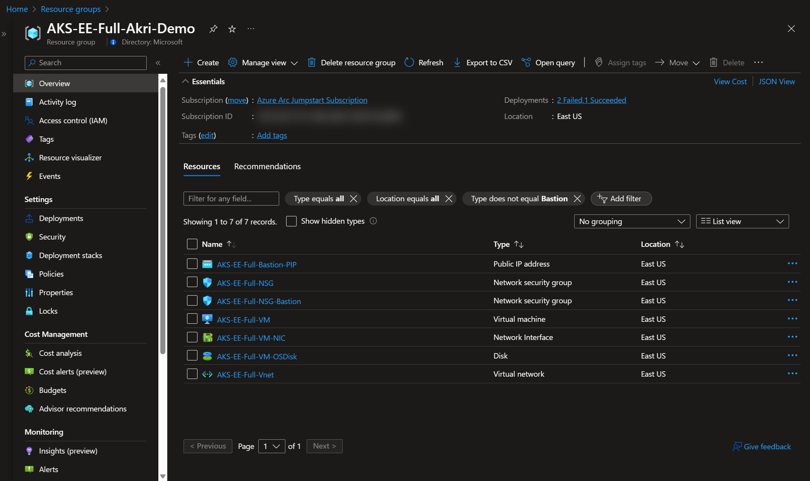

## Windows Login & Post Deployment

Various options are available to connect to the _AKS-EE-Full-VM_ Azure VM, depending on the parameters you supplied during deployment.

- [RDP](https://azurearcjumpstart.io/azure_arc_jumpstart/azure_arc_k8s/aks_hybrid/aks_edge_essentials_full/#connecting-directly-with-rdp) - available after configuring access to port 3389 on the _Arc-Win-Demo-NSG_, or by enabling [Just-in-Time access (JIT)](https://azurearcjumpstart.io/azure_arc_jumpstart/azure_arc_k8s/aks_hybrid/aks_edge_essentials_full/#connect-using-just-in-time-access-jit).
- [Azure Bastion](https://azurearcjumpstart.io/azure_arc_jumpstart/azure_arc_k8s/aks_hybrid/aks_edge_essentials_full/#connect-using-azure-bastion) - available if ```true``` was the value of your _`deployBastion`_ parameter during deployment.

### Connecting directly with RDP

By design, port 3389 is not allowed on the network security group. Therefore, you must create an NSG rule to allow inbound 3389.

- Open the _AKS-EE-Full-NSG_ resource in Azure portal and click "Add" to add a new rule.

  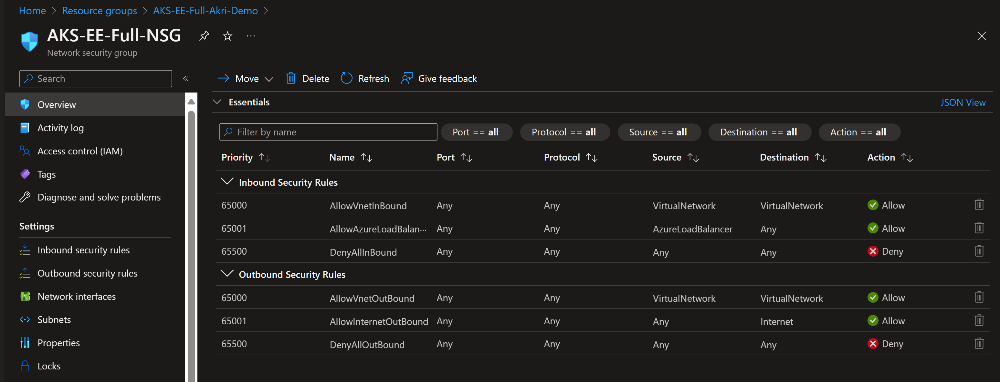

  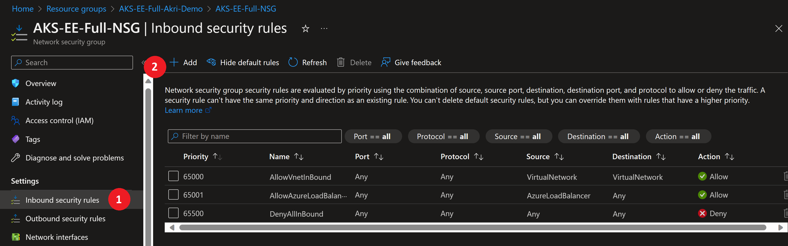

- Specify the IP address that you will be connecting from and select RDP as the service with "Allow" set as the action. You can retrieve your public IP address by accessing [https://icanhazip.com](https://icanhazip.com) or [https://whatismyip.com](https://whatismyip.com).

  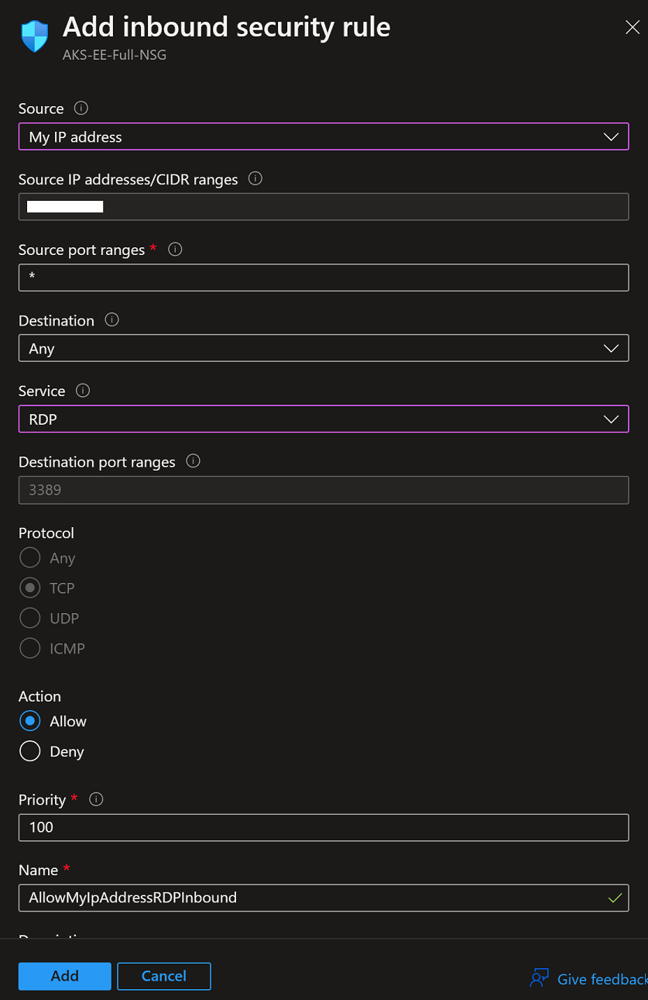

  

  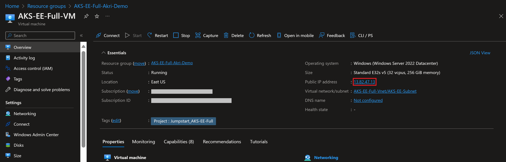

### Connect using just-in-time access (JIT)

If you already have [Microsoft Defender for Cloud](https://docs.microsoft.com/azure/defender-for-cloud/just-in-time-access-usage?tabs=jit-config-asc%2Cjit-request-asc) enabled on your subscription and would like to use JIT to access the Azure Windows Server VM, use the following steps:

- In the Azure Windows Server VM configuration pane, enable just-in-time. This will enable the default settings.

  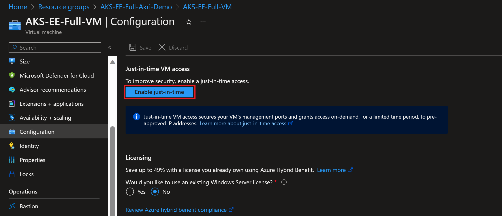

  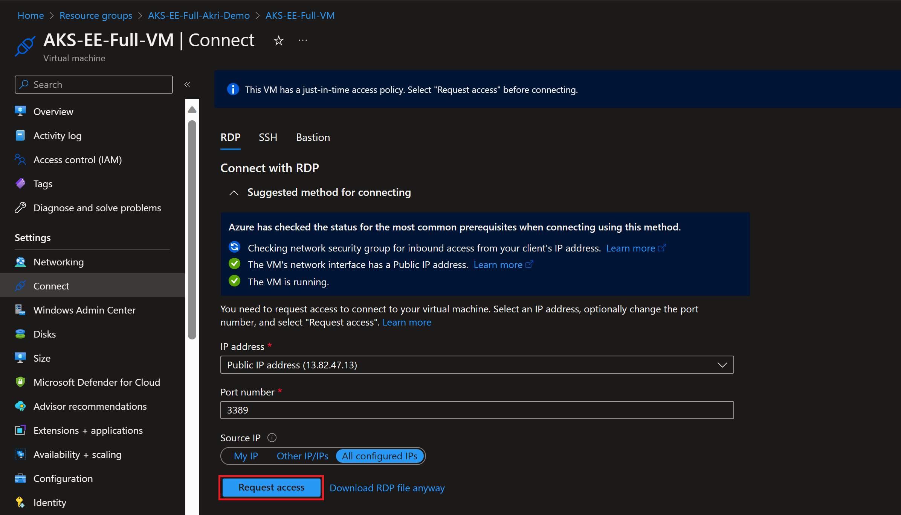

### Connect using Azure Bastion

- If you have chosen to deploy Azure Bastion in your deployment, use it to connect to the Azure VM.

  

  > **NOTE: When using Azure Bastion, the desktop background image is not visible. Therefore some screenshots in this guide may not exactly match your experience if you are connecting with Azure Bastion.**

### Post Deployment

- At first login, as mentioned in the "Automation Flow" section, a logon script will get executed. This script was created as part of the automated deployment process.

- Let the script to run its course and **do not close** the Powershell session, this will be done for you once completed.

    > **NOTE: The script run time is ~25min long.**

    

    

    

    

    

    

    

    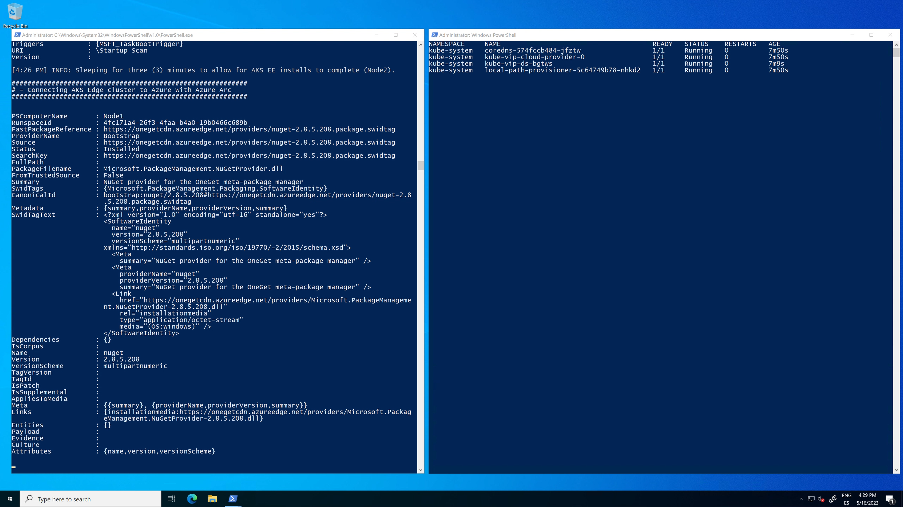

    

    

    

    

    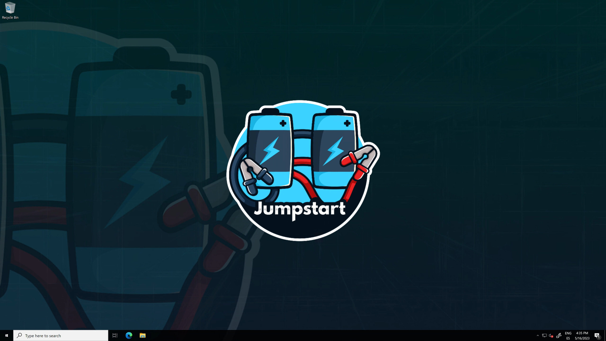

- Upon successful run, two new Azure Arc-enabled servers and an Azure Arc-enabled Kubernetes cluster will be added to the resource group.

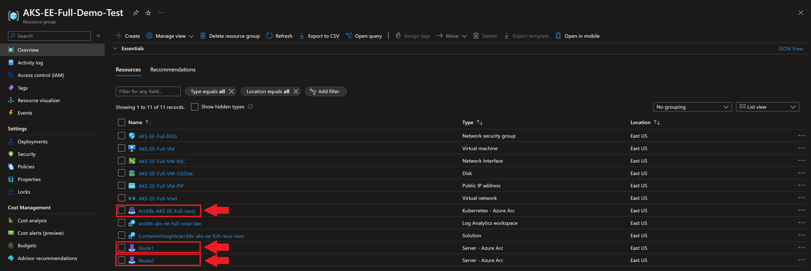

- You can also run _kubectl get nodes -o wide_ to check the cluster nodes status and _kubectl get pod -A_ to see that the cluster is running and all the needed pods (system, [Azure Arc](https://learn.microsoft.com/azure/azure-arc/kubernetes/overview) and [extension](https://learn.microsoft.com/azure/azure-arc/kubernetes/extensions) [Azure Monitor](https://learn.microsoft.com/azure/azure-monitor/containers/container-insights-overview)) are in running state.

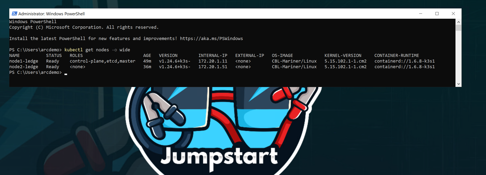

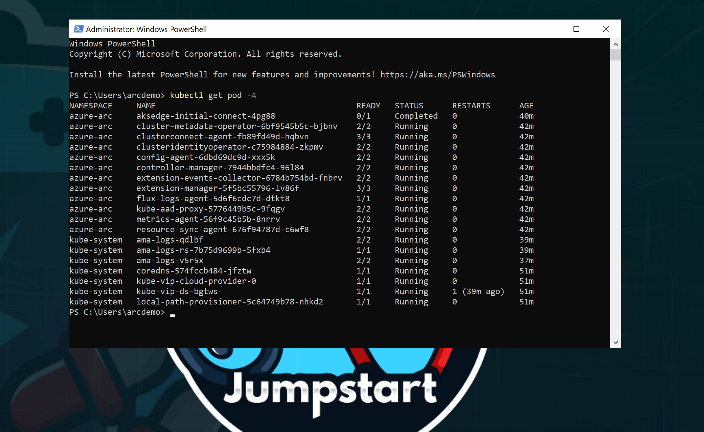

## Cluster extensions

In this scenario, Azure Arc-enabled Kubernetes cluster Azure Monitor extension was installed:

- _azuremonitor-containers_ - The Azure Monitor Container Insights cluster extension. To learn more about it, you can check our Jumpstart ["Integrate Azure Monitor for Containers with GKE as an Azure Arc Connected Cluster using Kubernetes extensions"](https://azurearcjumpstart.io/azure_arc_jumpstart/azure_arc_k8s/day2/gke/gke_monitor_extension/) scenario.

To view these cluster extensions, click on the Azure Arc-enabled Kubernetes resource Extensions settings.

  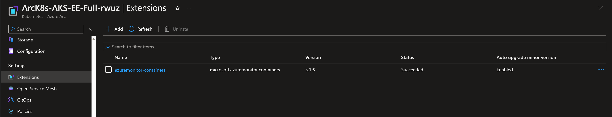

## Akri deployment

This scenario deploys Akri and it is used to discover ONVIF cameras that are connected to the same network as your AKS Edge Essentials cluster, in this instance a mock ONVIF camera is deployed as a container. These steps help you get started using Akri to discover IP cameras through the ONVIF protocol and use them via a video broker that enables you to consume the footage from the camera and display it in a web application.

First, verify that Akri can discover the camera, it should be seen as one Akri instance that represents the ONVIF camera:

  ```shell
    kubectl get akrii
  ```

  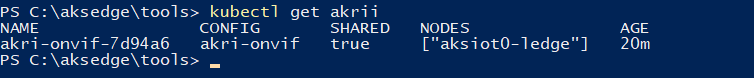

Next, you will need to receive the Linux node IP and the port of your web app service. First, get the port of the web app service by running:

  ```shell
    kubectl get svc
  ```

  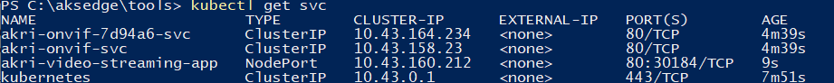

To get the IP address open Hyper-V manager and access the console of one of the Windows nodes.

  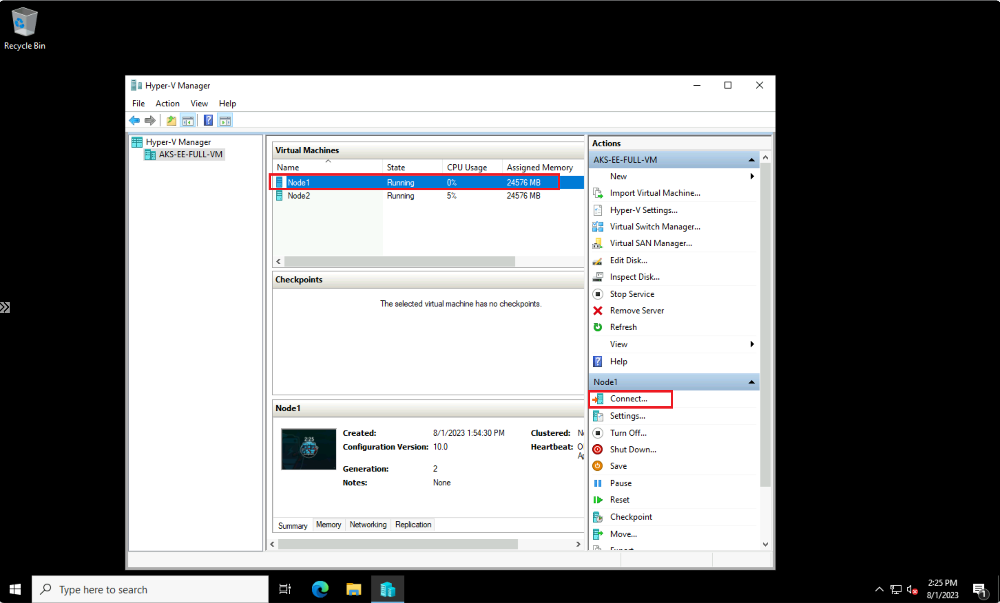

Once there, authenticate with:

  ```text
    - Username: Administrator
    - Password: JS123!!
  ```

Within the VM, open a PowerShell window and run:

  ```powershell
    Get-AksEdgeNodeAddr
  ```

  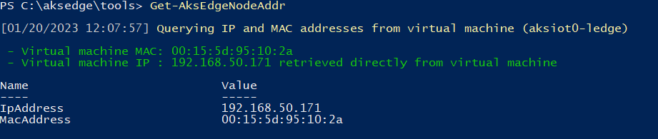

Also from the Windows Hyper-V VM, open the Edge browser and navigate to the service, you should see the video streaming

  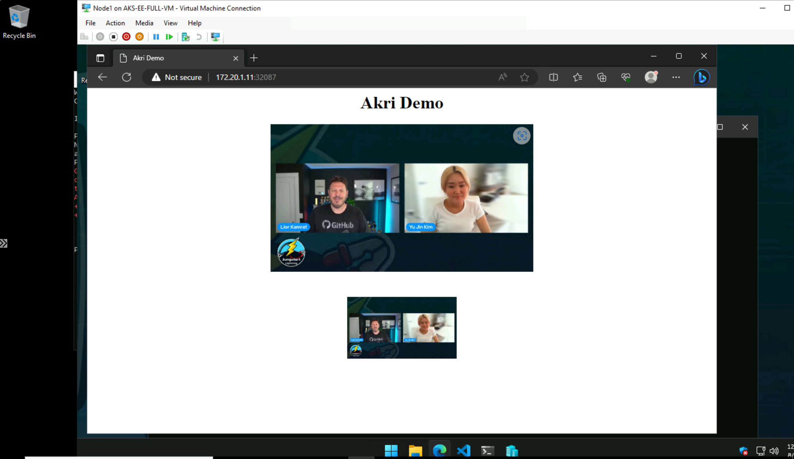

### Exploring logs from the Azure Windows Server VM

Occasionally, you may need to review log output from scripts that run on the _AKS-EE-Full-VM_ VM in case of deployment failures. To make troubleshooting easier, the scenario deployment scripts collect all relevant logs in the _C:\Temp_ folder on _AKS-EE-Full-VM_ Azure VM. A short description of the logs and their purpose can be seen in the list below:

| Log file | Description |
| ------- | ----------- |
| _C:\Temp\Bootstrap.log_ | Output from the initial _bootstrapping.ps1_ script that runs on _AKS-EE-Full-VM_ Azure VM. |
| _C:\Temp\LogonScript.log_ | Output of _LogonScript.ps1_ which creates the AKS Edge Essentials cluster, onboard it with Azure Arc creating the needed extensions as well as onboard the Hyper-V VMs. |
|

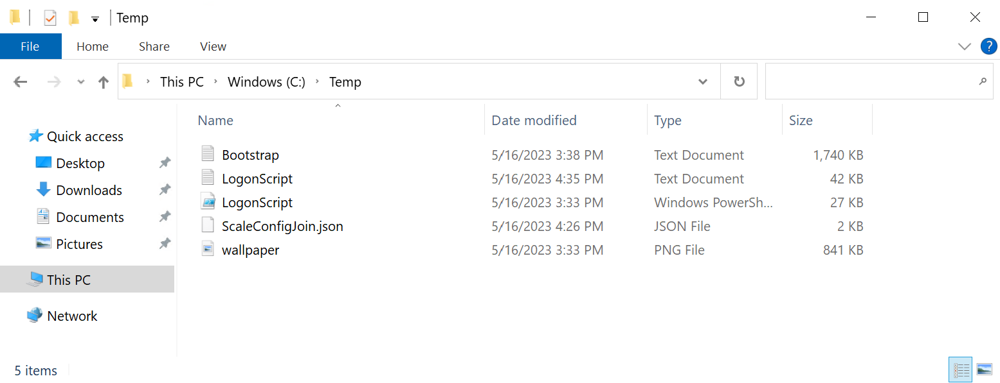

## Cleanup

- If you want to delete the entire environment, simply delete the deployment resource group from the Azure portal.

  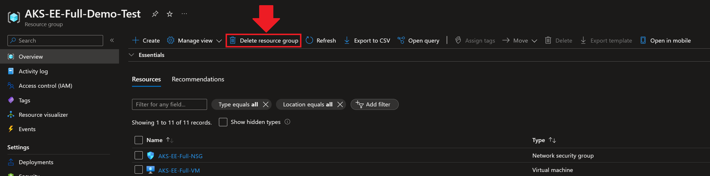
