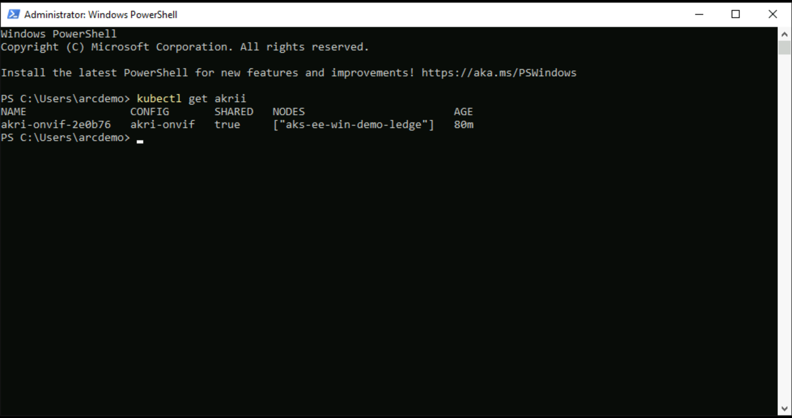

## Discover ONVIF cameras with Akri on AKS Edge Essentials single node deployment 

The following Jumpstart scenario will show how to create an AKS Edge Essentials single node deployment in an Azure Windows Server VM and connect the Azure VM and AKS Edge Essentials cluster to Azure Arc. The provided ARM template is responsible for creating the Azure resources as well as executing the LogonScript (AKS Edge Essentials cluster creation, Azure Arc onboarding (Azure VM and AKS Edge Essentials cluster) and Akri deployment) on the Azure VM. Once Edge Essentials is deployed [Akri](https://docs.akri.sh/) is installed as a Kubernetes resource interface that exposes an IP mock camera as resources in the Edge Essentials cluster.

Akri is an open-source project for a Kubernetes resource interface that lets you expose heterogenous leaf devices as resources in a Kubernetes cluster. It currently supports OPC UA, ONVIF, and udev protocols, but you can also implement custom protocol handlers provided by the template. In this scenario, Akri is used for handling the dynamic appearance and disappearance of an [ONVIF](https://wikipedia.org/wiki/ONVIF) mock camera as the Discovery Handler.

Azure VMs leverage the [Azure Instance Metadata Service (IMDS)](https://docs.microsoft.com/azure/virtual-machines/windows/instance-metadata-service) by default to provide information about the VMs, and to manage and configure the VMs. By projecting an Azure VM as an Azure Arc-enabled server, a "conflict" is created which will not allow the Azure Arc server resources to be represented as one resource when the IMDS is being used. Instead, the Azure Arc server will still "act" as a native Azure VM.

However, **for demo purposes only**, the below guide will allow you to use and onboard Azure VMs to Azure Arc. By doing so, you will be able to simulate a server that is deployed outside of Azure (i.e. "on-premises" or in other cloud platforms)

> **NOTE: It is not expected for an Azure VM to be projected as an Azure Arc-enabled server. The below scenario is unsupported and should ONLY be used for demo and testing purposes.**


## Prerequisites

- [Install or update Azure CLI to version 2.42.0 and above](https://docs.microsoft.com/cli/azure/install-azure-cli?view=azure-cli-latest). Use the below command to check your current installed version.

  ```shell
  az --version
  ```

- In case you don't already have one, you can [Create a free Azure account](https://azure.microsoft.com/free/).

- Create Azure service principal (SP)

    To complete the scenario and its related automation, an Azure service principal with the “Contributor” role assigned is required. To create it, login to your Azure account and run the below command (this can also be done in [Azure Cloud Shell](https://shell.azure.com/)).

    ```shell
    az login
    subscriptionId=$(az account show --query id --output tsv)
    az ad sp create-for-rbac -n "<Unique SP Name>" --role "Contributor" --scopes /subscriptions/$subscriptionId
    ```

    For example:

    ```shell
    az login
    subscriptionId=$(az account show --query id --output tsv)
    az ad sp create-for-rbac -n "JumpstartArc" --role "Contributor" --scopes /subscriptions/$subscriptionId
    ```

    Output should look like this:

    ```json
    {
    "appId": "XXXXXXXXXXXXXXXXXXXXXXXXXXXX",
    "displayName": "JumpstartArc",
    "password": "XXXXXXXXXXXXXXXXXXXXXXXXXXXX",
    "tenant": "XXXXXXXXXXXXXXXXXXXXXXXXXXXX"
    }
    ```

    > **NOTE: If you create multiple subsequent role assignments on the same service principal, your client secret (password) will be destroyed and recreated each time. Therefore, make sure you grab the correct password**.
    > **NOTE: The Jumpstart scenarios are designed with ease of use in-mind and adhere to security-related best practices whenever possible. It is optional but highly recommended to scope the service principal to a specific [Azure subscription and resource group](https://docs.microsoft.com/cli/azure/ad/sp?view=azure-cli-latest) as well as considering use of a [less privileged service principal account](https://docs.microsoft.com/azure/role-based-access-control/best-practices)**

## Automation Flow

For you to get familiar with the automation and deployment flow, below is an explanation.

- User edits the ARM template parameters file (1-time edit). These parameter values are used throughout the deployment.

- Main [_azuredeploy_ ARM template](https://github.com/microsoft/azure_arc/blob/main/azure_arc_k8s_jumpstart/aks_hybrid/aks_edge_essentials_single_akri/arm_template/azuredeploy.json) will initiate the deployment of the following resources:

  - _Virtual Network_ - Virtual Network for Azure Windows Server VM.
  - _Network Interface_ - Network Interface for Azure Windows Server VM.
  - _Network Security Group_ - Network Security Group to allow RDP in Azure Windows Server VM.
  - _Virtual Machine_ - Azure Windows Server VM.
  - _Custom script and Azure Desired State Configuration extensions_ - Configure the Azure Windows Server VM to host AKS Edge Essentials.

- User remotes into client Windows VM, which automatically kicks off the [_LogonScript_](https://github.com/microsoft/azure_arc/blob/main/azure_arc_k8s_jumpstart/aks_hybrid/aks_edge_essentials_single_akri/arm_template/artifacts/LogonScript.ps1) PowerShell script to:
  - Create the AKS Edge Essentials cluster in the Windows Server VM
  - Onboard the Azure VM and AKS Edge Essentials cluster to Azure Arc
  - Deploy Akri and ONVIF mock camera

## Deployment

As mentioned, this deployment will leverage ARM templates. You will deploy a single template, responsible for creating all the Azure resources in a single resource group as well onboarding the created VM to Azure Arc.

- Clone the Azure Arc Jumpstart repository

    ```shell
    git clone https://github.com/microsoft/azure_arc.git
    ```

- Before deploying the ARM template, login to Azure using Azure CLI with the ```az login``` command.

- The deployment uses the ARM template parameters file. Before initiating the deployment, edit the [_azuredeploy.parameters.json_](https://github.com/microsoft/azure_arc/blob/main/azure_arc_k8s_jumpstart/aks_hybrid/aks_edge_essentials_single_akri/arm_template/azuredeploy.parameters.json) file located in your local cloned repository folder. An example parameters file is located [here](https://github.com/microsoft/azure_arc/blob/main/azure_arc_k8s_jumpstart/aks_hybrid/aks_edge_essentials_single_akri/arm_template/azuredeploy.parameters.example.json).

  - _`vmSize`_ - Client Windows VM size.
  - _`vmName`_ - Client Windows VM name.
  - _`kubernetesDistribution`_ - Choice (k8s | k3s) kubernetes distribution.
  - _`windowsNode`_ - Choice (true | false) to deploy AKS Windows Node.
  - _`adminUsername`_ - Client Windows VM Administrator name.
  - _`adminPassword`_ - Client Windows VM Password. Password must have 3 of the following: 1 lower case character, 1 upper case character, 1 number, and 1 special character. The value must be between 12 and 123 characters long.
  - _`appId`_ - Your Azure service principal id.
  - _`password`_ - Your Azure service principal secret.
  - _`tenantId`_ - Your Azure tenant id.
  - _`subscriptionId`_ - Your Subscription ID.
  - _`location`_ - Azure location.
  - _`deployBastion`_ - Choice (true | false) to deploy Azure Bastion or not to connect to the client VM.
  - _`bastionHostName`_ - Azure Bastion name.

- To deploy the ARM template, navigate to the local cloned [deployment folder](https://github.com/microsoft/azure_arc/tree/main/azure_arc_k8s_jumpstart/aks_hybrid/aks_edge_essentials_single_akri/arm_template/) and run the below command:

    ```shell
    az group create --name <Name of the Azure resource group> --location <Azure Region>
    az deployment group create \
    --resource-group <Name of the Azure resource group> \
    --name <The name of this deployment> \
    --template-uri https://raw.githubusercontent.com/microsoft/azure_arc/main/azure_arc_k8s_jumpstart/aks_hybrid/aks_edge_essentials_single_akri/arm_template/azuredeploy.json \
    --parameters <The *azuredeploy.parameters.json* parameters file location>
    ```

    > **NOTE: Make sure that you are using the same Azure resource group name as the one you've just used in the _azuredeploy.parameters.json_ file**

    For example:

    ```shell
    az group create --name AKS-EE-Akri-Demo --location "East US"
    az deployment group create \
    --resource-group AKS-EE-Akri-Demo \
    --name akseedemo \
    --template-uri https://raw.githubusercontent.com/microsoft/azure_arc/main/azure_arc_k8s_jumpstart/aks_hybrid/aks_edge_essentials_single_akri/arm_template/azuredeploy.json \
    --parameters azuredeploy.parameters.json
    ```

- Once Azure resources have been provisioned, you will be able to see them in Azure portal.

    

    

## Windows Login & Post Deployment

Various options are available to connect to _AKS-EE-Demo_ Azure VM, depending on the parameters you supplied during deployment.

- [RDP](https://azurearcjumpstart.io/azure_arc_jumpstart/azure_arc_k8s/aks_hybrid/aks_edge_essentials_single_akri/#connecting-directly-with-rdp) - available after configuring access to port 3389 on the _Arc-Win-Demo-NSG_, or by enabling [Just-in-Time access (JIT)](https://azurearcjumpstart.io/azure_arc_jumpstart/azure_arc_k8s/aks_hybrid/aks_edge_essentials_single_akri/#connect-using-just-in-time-access-jit).
- [Azure Bastion](https://azurearcjumpstart.io/azure_arc_jumpstart/azure_arc_k8s/aks_hybrid/aks_edge_essentials_single_akri/#connect-using-azure-bastion) - available if ```true``` was the value of your _`deployBastion`_ parameter during deployment.

### Connecting directly with RDP

By design, port 3389 is not allowed on the network security group. Therefore, you must create an NSG rule to allow inbound 3389.

- Open the _AKS-EE-Demo-NSG_ resource in Azure portal and click "Add" to add a new rule.

  

  

- Specify the IP address that you will be connecting from and select RDP as the service with "Allow" set as the action. You can retrieve your public IP address by accessing [https://icanhazip.com](https://icanhazip.com) or [https://whatismyip.com](https://whatismyip.com).

  

  

  

### Connect using just-in-time access (JIT)

If you already have [Microsoft Defender for Cloud](https://docs.microsoft.com/azure/defender-for-cloud/just-in-time-access-usage?tabs=jit-config-asc%2Cjit-request-asc) enabled on your subscription and would like to use JIT to access the Azure Client VM, use the following steps:

- In the Client VM configuration pane, enable just-in-time. This will enable the default settings.

  

  

### Connect using Azure Bastion

- If you have chosen to deploy Azure Bastion in your deployment, use it to connect to the Azure VM.

  

  > **NOTE: When using Azure Bastion, the desktop background image is not visible. Therefore some screenshots in this guide may not exactly match your experience if you are connecting with Azure Bastion.**

### Post Deployment

- At first login, as mentioned in the "Automation Flow" section, a logon script will get executed. This script was created as part of the automated deployment process.

- Let the script to run its course and **do not close** the Powershell session, this will be done for you once completed.

    > **NOTE: The script run time is ~13min long.**

    

    

    

    

    

    

    

    

    

    

- Upon successful run, a new Azure Arc-enabled server and Azure Arc-enabled Kubernetes cluster will be added to the resource group.


- You can also run _kubectl get nodes -o wide_ to check the cluster node status and _kubectl get pod -A_ to see that the cluster is running and all the needed pods (system, [Azure Arc](https://learn.microsoft.com/azure/azure-arc/kubernetes/overview) and [extension](https://learn.microsoft.com/azure/azure-arc/kubernetes/extensions) [Azure Monitor](https://learn.microsoft.com/azure/azure-monitor/containers/container-insights-overview)) are in running state.


## Cluster extensions

In this scenario, Azure Arc-enabled Kubernetes cluster Azure Monitor extension was installed:

- _azuremonitor-containers_ - The Azure Monitor Container Insights cluster extension. To learn more about it, you can check our Jumpstart ["Integrate Azure Monitor for Containers with GKE as an Azure Arc Connected Cluster using Kubernetes extensions"](https://azurearcjumpstart.io/azure_arc_jumpstart/azure_arc_k8s/day2/gke/gke_monitor_extension/) scenario.

To view these cluster extensions, click on the Azure Arc-enabled Kubernetes resource Extensions settings.

  

## Akri deployment

This scenario deploys Akri and it is used to discover ONVIF cameras that are connected to the same network as your AKS Edge Essentials cluster, in this instance a mock ONVIF camera is deployed as a container. These steps help you get started using Akri to discover IP cameras through the ONVIF protocol and use them via a video broker that enables you to consume the footage from the camera and display it in a web application.

First, verify that Akri can discover the camera, it should be seen as one Akri instance that represents the ONVIF camera:

  ```shell
    kubectl get akrii
  ```

  

Next, you will need to receive the Linux node IP and the port of your web app service. First, get the port of the web app service by running:

  ```shell
    kubectl get svc
  ```

  

  ```powershell
    Get-AksEdgeNodeAddr
  ```

  

Open the Edge browser and navigate to the service, you should see the video streaming

  

### Exploring logs from the Client VM

Occasionally, you may need to review log output from scripts that run on the _AKS-EE-Demo_ VM in case of deployment failures. To make troubleshooting easier, the scenario deployment scripts collect all relevant logs in the _C:\Temp_ folder on _AKS-EE-Demo_ Azure VM. A short description of the logs and their purpose can be seen in the list below:

| Log file | Description |
| ------- | ----------- |
| _C:\Temp\Bootstrap.log_ | Output from the initial _bootstrapping.ps1_ script that runs on _AKS-EE-Demo_ Azure VM. |
| _C:\Temp\LogonScript.log_ | Output of _LogonScript.ps1_ which creates the AKS Edge Essentials cluster, onboard it with Azure Arc creating the needed extensions as well as onboard the Azure VM. |
|


## Cleanup

- If you want to delete the entire environment, simply delete the deployment resource group from the Azure portal.

    
