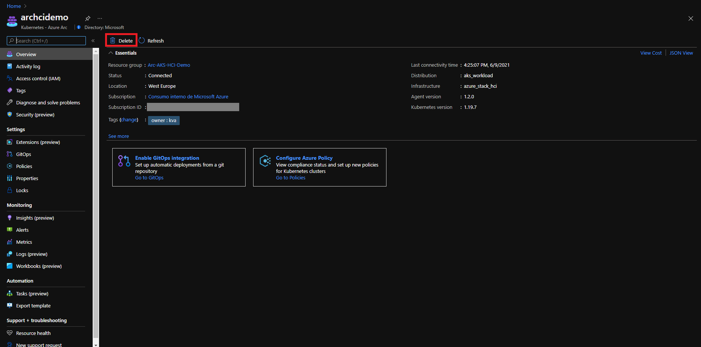

## Deploy AKS cluster on Azure Stack HCI and connect it to Azure Arc using PoweSh

The following README will guide you on how to use the provided PowerShell script to deploy an [Azure Kubernetes Service (AKS)](https://docs.microsoft.com/en-us/azure/aks/intro-kubernetes) cluster on [Azure Stack HCI](https://docs.microsoft.com/en-us/azure-stack/hci/overview) and connected it as an Azure Arc cluster resource.

Azure Kubernetes Service on Azure Stack HCI is an implementation of AKS on-premises using hyperconverged infrastructure operating system that is delivered as an Azure service.  

  > **Note: Azure Kubernetes Service is now in preview on Azure Stack HCI and on Windows Server 2019 Datacenter.**

  > **Note: Currently, Azure Arc enabled Kubernetes is in [public preview](https://docs.microsoft.com/en-us/azure/azure-arc/kubernetes/).**

This guide will not provide instructions on how to deploy and set up Azure Stack HCI, it assumes you already have a configured cluster. This README will guide you on how to create an AKS cluster on your HCI and onboard it to Azure Arc in an automated fashion using PowerShell. 

## Prerequisites

* Clone the Azure Arc Jumpstart repository

    ```shell
    git clone https://github.com/microsoft/azure_arc.git
    ```
  
* Create Azure service principal (SP)

    To be able to complete the scenario and its related automation, Azure service principal assigned with the “Contributor” role is required. To create it, login to your Azure account run the below command (this can also be done in [Azure Cloud Shell](https://shell.azure.com/)).

    ```powershell
    Connect-AzAccount
    $sp = New-AzADServicePrincipal -DisplayName "<Unique SP Name>" -Role 'Contributor'
   ```

    For example:

    ```powershell
    $sp = New-AzADServicePrincipal -DisplayName "<Unique SP Name>" -Role 'Contributor'
    ```

   This command will return a secure string as shown below: 

    ```poweshell
    Secret                : System.Security.SecureString
    ServicePrincipalNames : {XXXXXXXXXXXXXXXXXXXXXXXXXXXX, http://AzureArcK8s}
    ApplicationId         : XXXXXXXXXXXXXXXXXXXXXXXXXXXX
    ObjectType            : ServicePrincipal
    DisplayName           : AzureArcK8s
    Id                    : XXXXXXXXXXXXXXXXXXXXXXXXXXXX
    Type                  :
    ```

    To expose the generated password use this code to export the secret: 

    ```poweshell
    $BSTR = [System.Runtime.InteropServices.Marshal]::SecureStringToBSTR($sp.Secret)
    $UnsecureSecret = [System.Runtime.InteropServices.Marshal]::PtrToStringAuto($BSTR)
    ```

    > **Note: It is optional but highly recommended to scope the SP to a specific [Azure subscription and resource group](https://docs.microsoft.com/en-us/powershell/module/az.resources/new-azadserviceprincipal?view=azps-5.4.0)**

* Enable your subscription with the two resource providers for Azure Arc enabled Kubernetes. Registration is an asynchronous process, and registration may take approximately 10 minutes.

  ```powershell
  Register-AzResourceProvider -ProviderNamespace Microsoft.Kubernetes
  Register-AzResourceProvider -ProviderNamespace Microsoft.KubernetesConfiguration
  ```
* Since AKS on Azure Stack HCI is in public preview you will need to download the required software for evaluation from the [registration page](https://aka.ms/AKS-HCI-Evaluate). Complete the preview registration form and save the zip file to the "Downloads" folder.

* Perform a clean install of the AksHci PowerShell module. To install the AksHci Powershell module found in the zip file you just downloaded follow [this guide.](https://docs.microsoft.com/en-us/azure-stack/aks-hci/setup-powershell#step-1-download-and-install-the-akshci-powershell-module) or run the commands below: 

  ```powershell
  Set-ExecutionPolicy -Scope Process -ExecutionPolicy Bypass
  Install-Module -Name AksHci -Repository PSGallery -RequiredVersion 0.2.15
  Get-Command -Module AksHci
  Import-Module AksHci
  ```
 
## Automation Flow

For you to get familiar with the automation and deployment flow, below is an explanation.

* User is editing the PowerShell script environment variables (1-time edit). These variables values are being used throughout the deployment and Azure Arc onboarding. 

* User is running checks on every physical node of Azure Stack HCI to see if all the requirements are satisfied. 

* User is running the PowerShell script to deploy a basic DHCP AKS cluster on Azure Stack HCI and onboard onto Azure Arc. Runtime script will:

  * Configure the Azure Kubernetes Service cluster management services using Set-AksHciConfig cmdlet.
  * Start the deployment of the AKS cluster management services using the Install-AksHci cmdlet. 
  * Retrieve the Azure Kubernetes Service cluster credentials.  
  * Create a target cluster with the number Linux and Windows nodes specified. 
  * Onboard the AKS cluster on Azure Arc. 
  
## Deployment

* Before deploying AKS on Azure Stack HCI, you need to run checks on every physical node to see if all the requirements are satisfied. Open PowerShell as an administrator and run the following command.

  ```powershell
  Initialize-AksHciNode
  ```
* Now that all nodes are ready, you will deploy the AKS control management and the target cluster to your Azure Stack HCI using this [PowerShell script](https://github.com/microsoft/azure_arc/blob/main/azure_arc_k8s_jumpstart/aks_stack_hci/powershell/aks_hci_deploy.ps1). Edit the file to provide the environment variables that match the parameters of your environment: 
    - **imageDir:** path to the directory where AKS on Azure Stack HCI will store its VHD images, provide a shared path or SMB for multinode
    - **cloudConfigLocation:** path to the directory where the cloud agent will store its configuration, provide a shared path or SMB for multinode
    - **vnetName:** the name of the virtual switch to connect the virtual machines to. If you already have an external switch on the host, you should pass the name of the switch here. 
    - **clusterName:** a name for your AKS cluster, must be lowercase. 
    - **controlPlaneNodeCount:** number of nodes for your control plane, should be an odd number 1, 3 or 5.
    - **linuxNodeCount:** number of Linux node VMs for your cluster, if you do not need Linux nodes input 0.
    - **windowsNodeCount:** number of Windows node VMs for your cluster, if you do not need Windows nodes input 0.
    - **resourceGroup:** resource group to connect your Azure Arc enabled Kubernetes.
    - **location:** Azure region to connect your Azure Arc enabled Kubernetes.
    - **subscriptionId:** subscription to connect your Azure Arc enabled Kubernetes.
    - **appId:** the appID of the service principal created previously.
    - **password:** the password of the service principal created.
    - **tenant:** your tenantID.

As an example: 
    - **imageDir:** "V:\AKS-HCI\Images"
    - **cloudConfigLocation:** "V:\AKS-HCI\Images"
    - **vnetName:** "InternalNAT"
    - **clusterName:** "archcidemo"
    - **controlPlaneNodeCount:** 1
    - **linuxNodeCount:** 1
    - **windowsNodeCount:** 0
    - **resourceGroup:** "Arc-AKS-HCI-Demo"
    - **location:** westeurope
    - **subscriptionId:** "XXXXXXXX-XXXX-XXXX-XXXX-XXXXXXXX"
    - **appId:** "XXXXXXXX-XXXX-XXXX-XXXX-XXXXXXXX"
    - **password:** "XXXXXXXXXX"
    - **tenant:** "XXXXXXXX-XXXX-XXXX-XXXX-XXXXXXXX"

Note, that the script will deploy a simple DHCP based cluster on your Azure Stack HCI, there are additional optional parameters that you could use to customize the deployment to your own environment as described [here] (https://docs.microsoft.com/en-us/azure-stack/aks-hci/setup-powershell). 


* To run the script open PowerShell as an administrator, navigate to the [script folder](https://github.com/microsoft/azure_arc/blob/main/azure_arc_k8s_jumpstart/aks_stack_hci/powershell/) and run: 

  ```powershell
  .\aks_hci_deploy.ps1
  ```


  > **Note: the script may take around 30 minutes to run**


* You should also see the new AKS cluster on Windows Admin Center. 


* Once the script run has finished, the AKS cluster on HCI will be projected as a new Azure Arc cluster resource.


## Delete the deployment

The most straightforward way is to delete the Azure Arc cluster resource via the Azure Portal, just select the cluster and delete it.


If you want to delete the AKS cluster on HCI run the below command, this will delete all of your AKS clusters on HCI if any and the Azure Kubernetes Service host. It will also uninstall the Azure Kubernetes Service on Azure Stack HCI agents and services from the nodes. 

```powershell
Uninstall-AksHci
```
