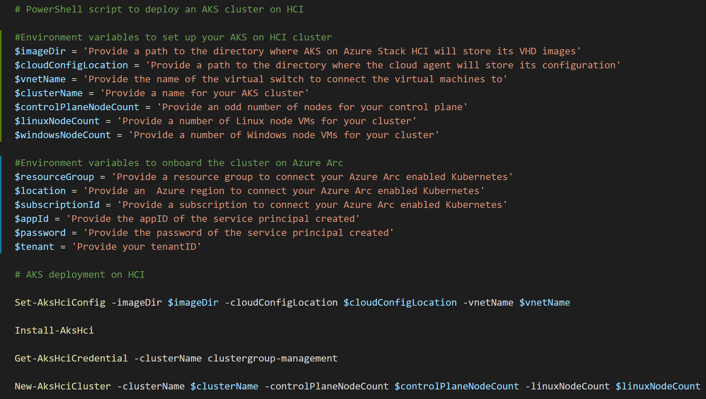
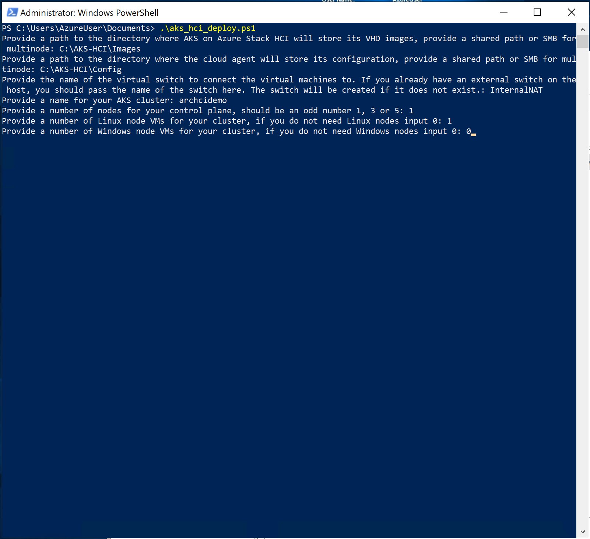
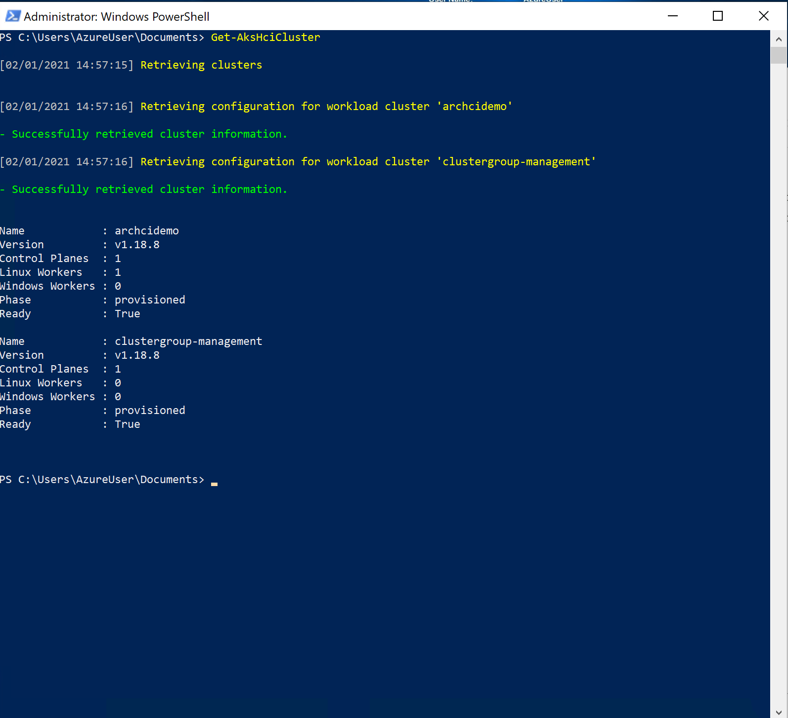
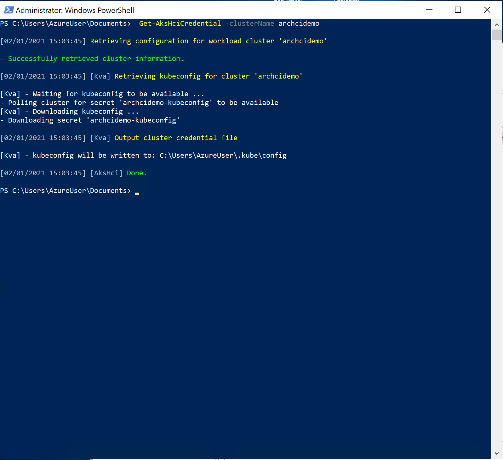
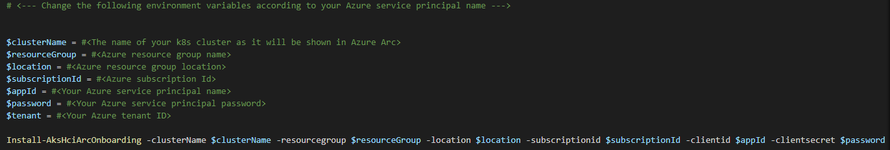
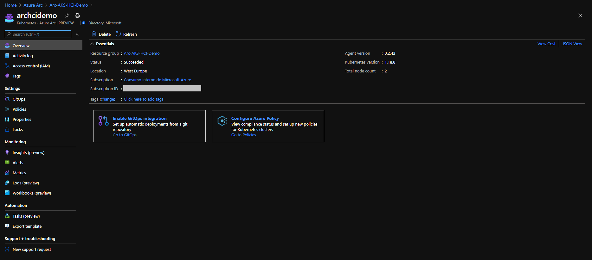

## Deploy AKS cluster on Azure Stack HCI and connect it to Azure Arc using PoweSh

The following README will guide you on how to use the provided PowerShell script to deploy an [Azure Kubernetes Service (AKS)](https://docs.microsoft.com/en-us/azure/aks/intro-kubernetes) cluster on [Azure Stack HCI](https://docs.microsoft.com/en-us/azure-stack/hci/overview) and connected it as an Azure Arc cluster resource.

Azure Kubernetes Service on Azure Stack HCI is an implementation of AKS on-premises using hyperconverged infrastructure operating system that is delivered as an Azure service.  

  > **Note: Azure Kubernetes Service is now in preview on Azure Stack HCI and on Windows Server 2019 Datacenter.**

  > **Note: Currently, Azure Arc enabled Kubernetes is in [public preview](https://docs.microsoft.com/en-us/azure/azure-arc/kubernetes/).**

This guide assumes you already have an existing 2-4 node Azure Stack HCI cluster and will leverage PowerShell to automate the AKS creation and onboarding process of the cluster to Azure Arc. 

## Prerequisites

* Clone the Azure Arc Jumpstart repository

    ```shell
    git clone https://github.com/microsoft/azure_arc.git
    ```
  
* Create Azure service principal (SP)

    To be able to complete the scenario and its related automation, Azure service principal assigned with the “Contributor” role is required. To create it, login to your Azure account run the below command (this can also be done in [Azure Cloud Shell](https://shell.azure.com/)).

    ```powershell
    Connect-AzAccount
    $sp = New-AzADServicePrincipal -DisplayName "<Unique SP Name>" -Role 'Contributor'
   ```

    For example:

    ```powershell
    $sp = New-AzADServicePrincipal -DisplayName "<Unique SP Name>" -Role 'Contributor'
    ```

   This command will return a secure string as shown below: 

    ```poweshell
    Secret                : System.Security.SecureString
    ServicePrincipalNames : {XXXXXXXXXXXXXXXXXXXXXXXXXXXX, http://AzureArcK8s}
    ApplicationId         : XXXXXXXXXXXXXXXXXXXXXXXXXXXX
    ObjectType            : ServicePrincipal
    DisplayName           : AzureArcK8s
    Id                    : XXXXXXXXXXXXXXXXXXXXXXXXXXXX
    Type                  :
    ```

    To expose the generated password use this code to export the secret: 

    ```poweshell
    $BSTR = [System.Runtime.InteropServices.Marshal]::SecureStringToBSTR($sp.Secret)
    $UnsecureSecret = [System.Runtime.InteropServices.Marshal]::PtrToStringAuto($BSTR)
    ```

    > **Note: It is optional but highly recommended to scope the SP to a specific [Azure subscription and resource group](https://docs.microsoft.com/en-us/powershell/module/az.resources/new-azadserviceprincipal?view=azps-5.4.0)**

* Enable your subscription with the two resource providers for Azure Arc enabled Kubernetes. Registration is an asynchronous process, and registration may take approximately 10 minutes.

  ```powershell
  Register-AzResourceProvider -ProviderNamespace Microsoft.Kubernetes
  Register-AzResourceProvider -ProviderNamespace Microsoft.KubernetesConfiguration
  ```
* Since AKS on Azure Stack HCI is in public preview you will need to download the required software for evaluation from the [registration page](https://aka.ms/AKS-HCI-Evaluate). Complete the preview registration form and safe the zip file to the "Downloads" folder.

* Perform a clean install of the AksHci PowerShell module. To install the AksHci Powershell module found in the zip file you just downloaded follow [this guide.](https://docs.microsoft.com/en-us/azure-stack/aks-hci/setup-powershell#step-1-download-and-install-the-akshci-powershell-module)

 
## Deployment

* Before running the PowerShell Script to deploy your AKS cluster, it is important to verify each physical node of your Azure Stack HCI to validate all of the requirements are satisfied. To do that, open PowerShell as an administrator and run:

  ```powershell
  Initialize-AksHciNode
  ```

* Now that all nodes are ready, you will deploy an AKS cluster to your Azure Stack HCI using this [PowerShell script](https://github.com/microsoft/azure_arc/blob/main/azure_arc_k8s_jumpstart/aks_stack_hci/powershell/aks_hci_deploy.ps1). Note, that the script will deploy a simple DHCP based cluster on your Azure Stack HCI, there are additional optional parameters that you could use to customize the deployment to your own environment as described [here] (https://docs.microsoft.com/en-us/azure-stack/aks-hci/setup-powershell). 



* To run the script open PowerShell as an administrator, navigate to the [script folder](https://github.com/microsoft/azure_arc/blob/main/azure_arc_k8s_jumpstart/aks_stack_hci/powershell/) and run: 

  ```powershell
  .\aks_hci_deploy.ps1
  ```


* The script will prompt to provide a set of parameters to configure your cluster: 
    - **imageDir:** path to the directory where AKS on Azure Stack HCI will store its VHD images, provide a shared path or SMB for multinode
    - **cloudConfigLocation:** path to the directory where the cloud agent will store its configuration, provide a shared path or SMB for multinode
    - **vnetName:** the name of the virtual switch to connect the virtual machines to. If you already have an external switch on the host, you should pass the name of the switch here. 
    - **clusterName:** a name for your AKS cluster, must be lowercase. 
    - **controlPlaneNodeCount:** number of nodes for your control plane, should be an odd number 1, 3 or 5.
    - **linuxNodeCount:** number of Linux node VMs for your cluster, if you do not need Linux nodes input 0.
    - **windowsNodeCount:** number of Windows node VMs for your cluster, if you do not need Windows nodes input 0.

    > **Note: the script may take upto 30 minutes to run**

* Once the script has completed its run, you will see an output as follows: 



* To be able to connect to the Azure Kubernetes Service cluster run the command: 

  ```powershell
  Get-AksHciCredential -clusterName <cluster_name>
  ```


## Connecting to Azure Arc

* Now that you have a running AKS cluster, edit the environment variables section in the included [az_connect_aks](https://github.com/microsoft/azure_arc/blob/main/azure_arc_k8s_jumpstart/aks_stack_hci/powershell/aks_hci_connect.ps1) shell script.



* After editing the environment variables in the aks_hci_connect PowerShell script to match your parameters, save the file and then run it using the .\aks_hci_connect.ps1 command.

* Once the script run has finished, the AKS cluster on HCI will be projected as a new Azure Arc cluster resource.



## Delete the deployment

The most straightforward way is to delete the Azure Arc cluster resource via the Azure Portal, just select the cluster and delete it.


If you want to delete the AKS cluster on HCI run the below command.

```powershell
Uninstall-AksHci -Force
```