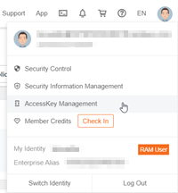
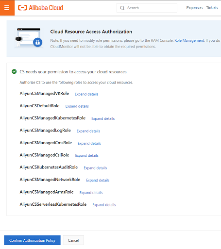
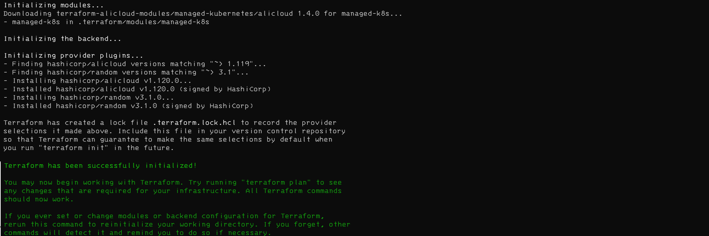
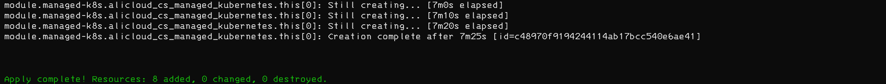

## Deploy Alibaba Cloud Container Service for Kubernetes cluster and connect it to Azure Arc using Terraform

The following README will guide you on how to use the provided [Terraform](https://www.terraform.io/) plan to deploy an Alibaba Cloud [Container Service for Kubernetes (ACK)](https://www.alibabacloud.com/product/kubernetes) and connect it as an Azure Arc cluster resource.

## Prerequisites

* Clone the Azure Arc Jumpstart repository

  ```shell
  git clone https://github.com/microsoft/azure_arc.git
  ```

* [Install or update Azure CLI to version 2.21.0 and above](https://docs.microsoft.com/en-us/cli/azure/install-azure-cli?view=azure-cli-latest). Use the below command to check your current installed version.

  ```shell
  az --version
  ```

* [Install or update Helm to version 3.5.3 and above](https://helm.sh/docs/intro/install/). Use the below command to check your current installed version.

  ```shell
  helm version
  ```

* (Optional) [Install or update Aliyun CLI to latest version 3.0.73 and above](https://github.com/aliyun/aliyun-cli). Use the below command to check your current installed version.

  > **Note: Ālǐyún or Aliyun is actually the chinese name for Alibaba Cloud**

  ```shell
  aliyun --version
  ```

* [Install Terraform >=0.12](https://learn.hashicorp.com/terraform/getting-started/install.html). Use the below command to check your current installed version.

  ```shell
  terraform -v
  ```

* [Enable Azure subscription with](https://docs.microsoft.com/en-us/azure/azure-resource-manager/management/resource-providers-and-types#register-resource-provider) the two resource providers for Azure Arc enabled Kubernetes. Registration is an asynchronous process, and registration may take approximately 10 minutes. Login with an identity with sufficient authorizations.

  ```shell
  az login
  az provider register --namespace Microsoft.Kubernetes
  az provider register --namespace Microsoft.KubernetesConfiguration
  ```

  You can monitor the registration process with the following commands:

  ```shell
  az provider show -n Microsoft.Kubernetes -o table
  az provider show -n Microsoft.KubernetesConfiguration -o table
  ```

* Install the Azure Arc for Kubernetes CLI extensions ***connectedk8s*** and ***k8s-configuration***:

  ```shell
  az extension add --name connectedk8s
  az extension add --name k8s-configuration
  ```

  > **Note: If you already used this guide before and/or have the extensions installed, use the bellow commands:**

  ```shell
  az extension update --name connectedk8s
  az extension update --name k8s-configuration
  ```

### Create a new Alibaba Cloud access key

* [Sign up to or have an Alibaba Cloud account](https://www.alibabacloud.com/) - domestic or international

  > **Note: The screenshots and sample outputs shown here are based on a domestic account.**

* Browse to <https://console.aliyun.com/> and login with your Alibaba Cloud account. Once logged in, create a new access key from your profile. After creating it, be sure to copy down the access and secret key.

  

  

  

* Navigate to product *Container Service - Kubernetes*, activate this service and if demanded **Confirm Cloud Resource Access Authorization**

  

## Deployment

The only thing you need to do before executing the Terraform plan is to export the environment variables which will be used by the plan. This is based on the Azure service principal you've just created and your subscription.  

* Export the environment variables needed for the Terraform plan.

  ```shell
  export ALICLOUD_ACCESS_KEY="<Your Alibaba Cloud access key>"
  export ALICLOUD_SECRET_KEY="<Your Alibaba Cloud secret key>"
  export ALICLOUD_REGION="<Alibaba Cloud region>"
  export ALICLOUD_PROFILE="<Aliyun CLI profile>"
  export AZURE_SUBSCRIPTION_ID="<Your Azure subscription id>"
  export AZURE_LOCATION="<Azure location>"
  export AZURE_RESOURCE_GROUP="<Azure resource group>"
  export AZURE_CLUSTER_NAME="<Azure Arc cluster name>"
  ```

  For example:

  ```shell
  export ALICLOUD_ACCESS_KEY="aBcDeFgHiJkLmNo"
  export ALICLOUD_SECRET_KEY="aBcDeFgHiJkLmNoPqRtUvWxYz"
  export ALICLOUD_REGION="cn-shanghai"
  export ALICLOUD_PROFILE="akProfile"
  export AZURE_SUBSCRIPTION_ID="XXXXXXXX-XXXX-XXXX-XXXX-XXXXXXXXXXXX"
  export AZURE_LOCATION="southeastasia"
  export AZURE_RESOURCE_GROUP="Azure-Arc-Aliyun-K8s"
  export AZURE_CLUSTER_NAME="azure-arc-aliyun"
  ```

  > **Note: If you are running in a PowerShell environment, to set the Terraform environment variables, use the _$env:variable-name=variable-value_ (see example below)**

  ```powershell
  $env:ALICLOUD_ACCESS_KEY="aBcDeFgHiJkLmNo"
  ```

* From folder `azure_arc_k8s_jumpstart/alibaba/terraform` run the ```terraform init``` command which will download the required terraform providers.

  

* Deploy cluster by running the below command and wait for the plan to finish.

  ```shell
  terraform apply --auto-approve
  ```

  
  


  Sample cluster in Alibaba Cloud Resource Management view:

  

* The plan will create the _kubeconfig_ file in the home directory `~/.kube/config_alicloudArc`. You can either use this directly or merge it into your _kubeconfig_ to be used with `kubectl` or `helm`.

   ```shell
   cp ~/.kube/config ~/.kube/config_old
   KUBECONFIG=~/.kube/config_old:~/.kube/config_alicloudArc kubectl config view --flatten > ~/.kube/config
   ```

  Get the name of your newly generated kubeconfig:
  ```shell
  kubectl config get-contexts
  ```
  Use the newly generated kubeconfig:
  ```shell
  kubectl config use-context <new config name>
  ```

## Connecting to Azure Arc

* Now that you have a running cluster, based on the environment variables set and Azure environment prepared above, you can connect the Alibaba Cloud cluster to Azure Arc:

  ```shell
  az login
  az account set -s $AZURE_SUBSCRIPTION_ID
  az group create --location $AZURE_LOCATION --name $AZURE_RESOURCE_GROUP
  ```

  Output should look like this:

  ```json
  {
    "id": "/subscriptions/XXXXXXXX-XXXX-XXXX-XXXX-XXXXXXXXXXXX/resourceGroups/Azure-Arc-Aliyun-K8S",
    "location": "southeastasia",
    "managedBy": null,
    "name": "Azure-Arc-Aliyun-K8S",
    "properties": {
      "provisioningState": "Succeeded"
    },
    "type": "Microsoft.Resources/resourceGroups"
  }
  ```

  connect the cluster:

  ```shell
  az connectedk8s connect --name $AZURE_CLUSTER_NAME --resource-group $AZURE_RESOURCE_GROUP --location $AZURE_LOCATION
  ```

  

  

## Delete the deployment

In Azure, the most straightforward way is to delete the resource group via the Azure Portal or through the CLI.

```shell
az --resource-group $AZURE_RESOURCE_GROUP -y
```


To delete the environment in Alibaba Cloud, use Terraform.

```shell
terraform refresh
terraform destroy --auto-approve
```

> **Note: `terraform refresh` will update the local state to that `terraform destroy` also handles automatically generated resources like _Elastic IP Address_ and/or _NAT Gateway_.**

output:

```text
Destroy complete! Resources: 8 destroyed.
```
