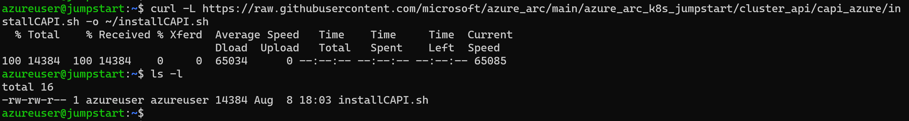
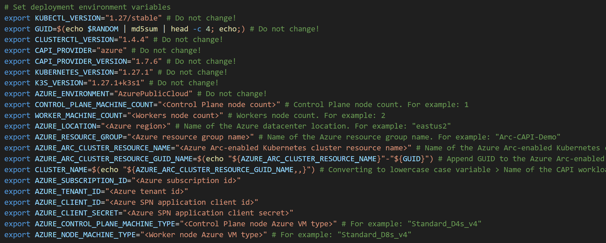
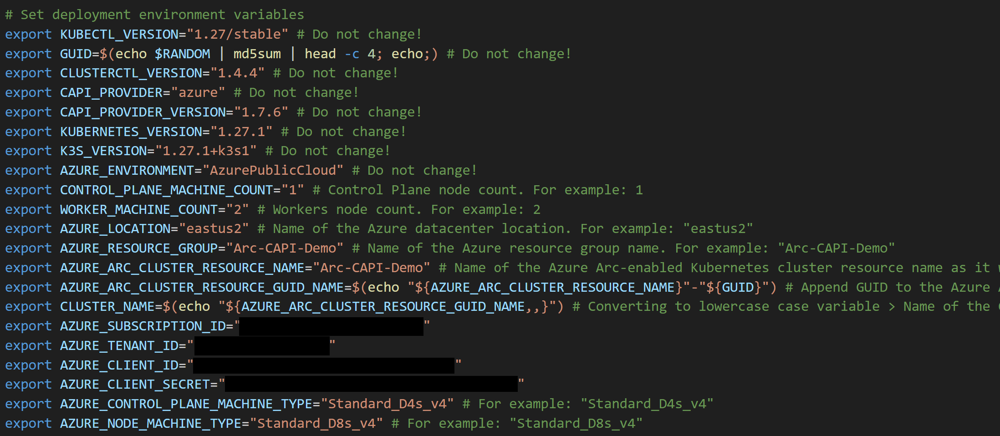
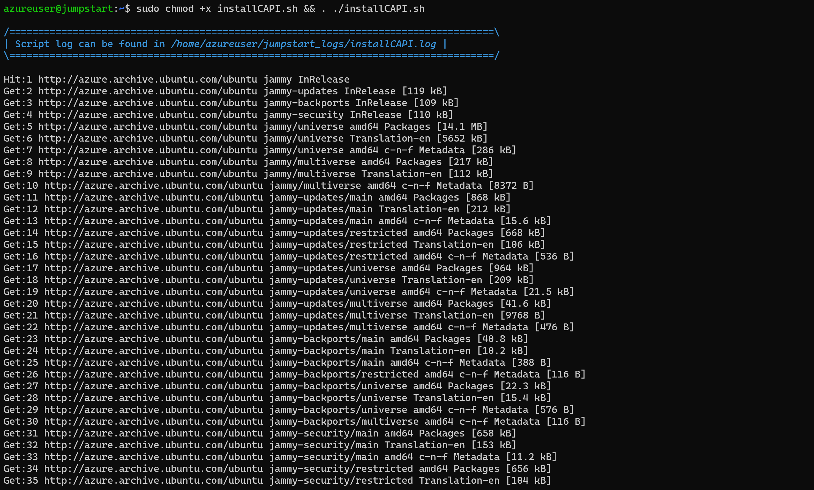
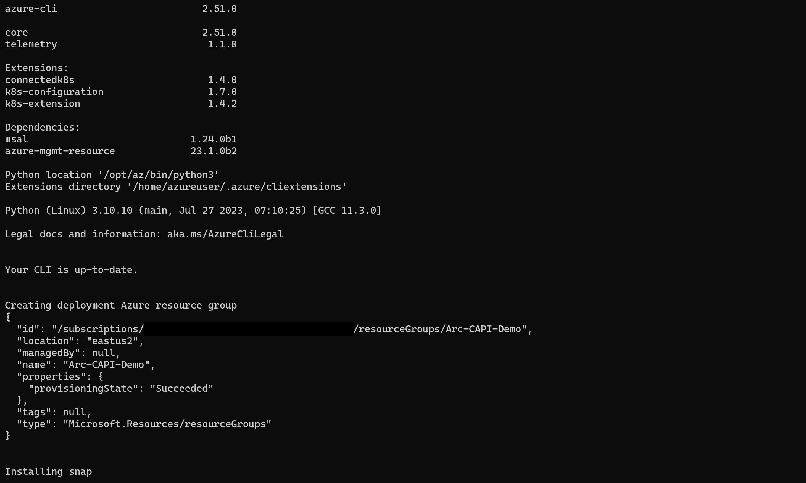
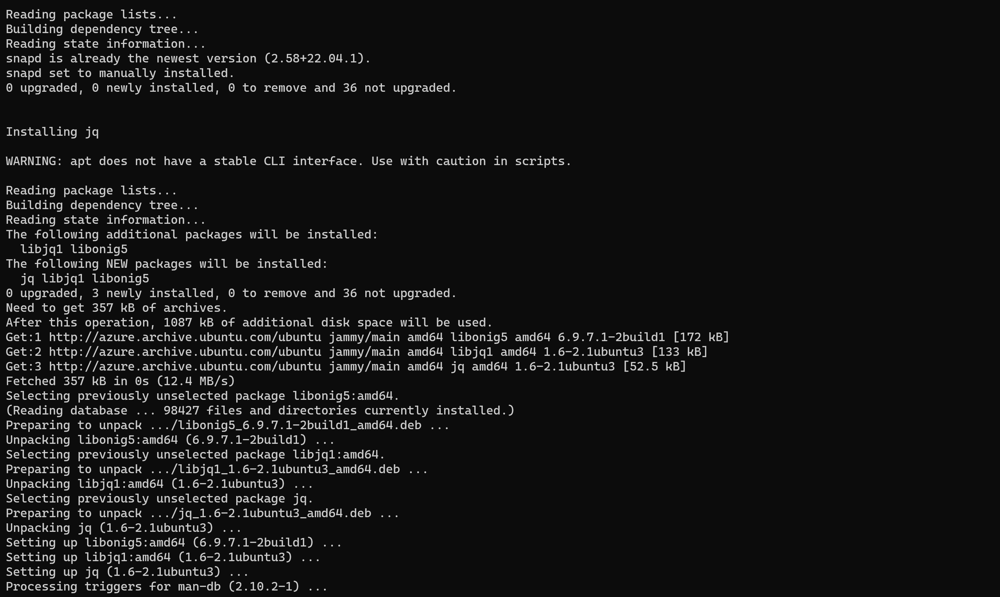
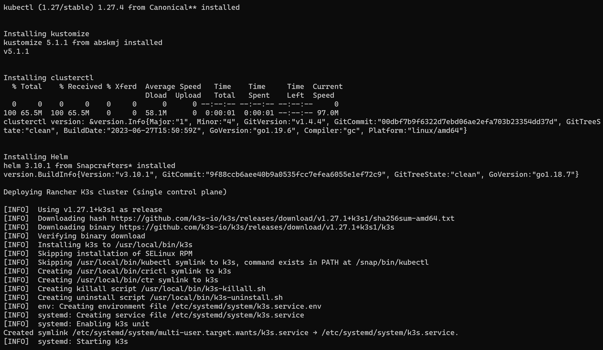

## Deploy Kubernetes cluster and connect it to Azure Arc using Cluster API Azure provider

The following README will guide you on to deploy an Kubernetes cluster in Azure virtual machines and connected it as an Azure Arc cluster resource by leveraging the [Kubernetes Cluster API (CAPI) project](https://cluster-api.sigs.k8s.io/introduction.html) and it's [Cluster API Azure provider (CAPZ)](https://cloudblogs.microsoft.com/opensource/2020/12/15/introducing-cluster-api-provider-azure-capz-kubernetes-cluster-management/).

## Architecture (In a nutshell)

From the Cluster API Book docs:

"Cluster API requires an existing Kubernetes cluster accessible via kubectl; during the installation process the Kubernetes cluster will be transformed into a management cluster by installing the Cluster API provider components, so it is recommended to keep it separated from any application workload."

In this guide (as explained in the CAPI Book docs), you will deploy a local [kind](https://kind.sigs.k8s.io/) cluster which will be used as the management cluster. This cluster will then be used to deploy the workload cluster using the Cluster API Azure provider (CAPZ).

## Prerequisites

- Clone the Azure Arc Jumpstart repository

    ```shell
    git clone https://github.com/microsoft/azure_arc.git
    ```
  
- [Install or update Azure CLI to version 2.25.0 and above](https://docs.microsoft.com/en-us/cli/azure/install-azure-cli?view=azure-cli-latest). Use the below command to check your current installed version.

  ```shell
  az --version
  ```

- Create Azure service principal (SP)

    To be able to complete the scenario and its related automation, Azure service principal assigned with the “Contributor” role is required. To create it, login to your Azure account run the below command (this can also be done in [Azure Cloud Shell](https://shell.azure.com/)).

    ```shell
    az login
    az ad sp create-for-rbac -n "<Unique SP Name>" --role contributor
    ```

    For example:

    ```shell
    az ad sp create-for-rbac -n "http://AzureArcK8s" --role contributor
    ```

    Output should look like this:

    ```json
    {
    "appId": "XXXXXXXXXXXXXXXXXXXXXXXXXXXX",
    "displayName": "AzureArcK8s",
    "name": "http://AzureArcK8s",
    "password": "XXXXXXXXXXXXXXXXXXXXXXXXXXXX",
    "tenant": "XXXXXXXXXXXXXXXXXXXXXXXXXXXX"
    }
    ```

    > **Note: The Jumpstart scenarios are designed with as much ease of use in-mind and adhering to security-related best practices whenever possible. It is optional but highly recommended to scope the service principal to a specific [Azure subscription and resource group](https://docs.microsoft.com/en-us/cli/azure/ad/sp?view=azure-cli-latest) as well considering using a [less privileged service principal account](https://docs.microsoft.com/en-us/azure/role-based-access-control/best-practices)**

- As mentioned, you will need to deploy a local, small footprint Kubernetes cluster using kind which will act the management/provisioner cluster. To install kind on your machine, use the below command.

  > **Note: In order for you to complete this scenario, either a Linux ([WSL incl.](https://docs.microsoft.com/en-us/windows/wsl/install-win10)) or MacOS is required. Currently, this scenario does not support Windows OS**

  On Linux:

  ```shell
  curl -Lo ./kind https://kind.sigs.k8s.io/dl/v0.11.1/kind-linux-amd64
  chmod +x ./kind
  sudo mv ./kind /usr/local/bin/kind
  ```
  
  On MacOS:

  ```shell
  brew install kind
  ```

  

## Deployment - Management Cluster

> **Disclaimer: The deployment process of a the management cluster and the *clusterctl* CLI tool described in below are taken straight from the ["Cluster API Book"](https://cluster-api.sigs.k8s.io/user/quick-start.html) and deserves it's writers all the credit for it!**
**The reason being for this process to be included is to provide you with the end-to-end user experience which also include the proprietary automation developed for this Jumpstart scenario and will be used later on in this guide.**

- Now that you have kind installed, deploy the local management cluster and test to ensure it's ready using the below commands:

  ```shell
  kind create cluster
  kubectl cluster-info
  ```

  

## Deployment - Workload Cluster

- In the your directory of the cloned Jumpstart repository, navigate to where the [*arc_capi_azure*](https://github.com/microsoft/azure_arc/blob/main/azure_arc_k8s_jumpstart/cluster_api/capi_azure/arc_capi_azure.sh) bash script is located.

  The script will transform the kind Kubernetes cluster to a CAPI management cluster with the Azure Cluster API provisioned (CAPZ) components that are needed. It will then deploy the workload cluster and it's Azure resources based on the environment variables as described in the next bullet. Upon deployment completion, the cluster will be onboard as an Azure Arc-enabled Kubernetes cluster.

- Edit the environment variables to match your Azure subscription and SPN details created in the prerequisites section in this guide as well as the required workload cluster details.

  - _`KUBERNETES_VERSION`_="Kubernetes version. For example: 1.22.1"
  - _`CONTROL_PLANE_MACHINE_COUNT`_="Control Plane node count. For example: 1"
  - _`WORKER_MACHINE_COUNT`_="Workers node count. For example: 2"
  - _`AZURE_LOCATION`_="Azure region. For example: eastus"
  - _`CAPI_WORKLOAD_CLUSTER_NAME`_="Workload cluster name. For example: arc-capi-azure". Must consist of lower case alphanumeric characters, '-' or '.', and must start and end with an alphanumeric character (e.g. 'example.com', regex used for validation is '[a-z0-9]([-a-z0-9]*[a-z0-9])?(\.[a-z0-9]([-a-z0-9]*[a-z0-9])?)*')
  - _`AZURE_SUBSCRIPTION_ID`_="Azure subscription id"
  - _`AZURE_TENANT_ID`_="Azure tenant id"
  - _`AZURE_CLIENT_ID`_="Azure SPN application client id"
  - _`AZURE_CLIENT_SECRET`_="Azure SPN application client secret"
  - _`AZURE_CONTROL_PLANE_MACHINE_TYPE`_="Control Plane node Azure VM type .For example: Standard_D2s_v3".
   _`AZURE_NODE_MACHINE_TYPE`_="Worker node Azure VM type .For example: Standard_D4s_v3"

  

  > **Note: CAPI-based Kubernetes cluster deployments are using a yaml file that holds the deployment parameters as a Kubernetes manifest. The script in this scenario [generates the default scheme](https://github.com/kubernetes-sigs/cluster-api-provider-azure/blob/cfdac96526e388eb6374cad5eef581fb1767627f/templates/cluster-template-external-cloud-provider.yaml#L131) that has Premium storage type VMs as it's default. When editing both the _AZURE_CONTROL_PLANE_MACHINE_TYPE_ and the _AZURE_NODE_MACHINE_TYPE_, use Premium storage supported type VMs**

- Execute the script using the below command. The script runtime can take ~10-20min, depends on the number of control plane and worker nodes you chose to deploy. In case you don't have the required Azure CLI extensions already installed or if they are requires an update, the script will either install it or perform an update. The script will also install helm and *clusterctl* CLI tool which handles the lifecycle of a Cluster API management cluster.

  ```shell
  . ./arc_capi_azure.sh
  ```

  > **Note: The extra dot is due to the script having an *export* function and needs to have the vars exported in the same shell session as the other commands.**

  

  

  

  

  

- Upon completion, you will have a new Kubernetes cluster deployed on top of Azure virtual machines  that is already onboard as an Azure Arc-enabled Kubernetes cluster.

  The script will generate the cluster definition *yaml* file which was used to deploy the workload cluster as will as the *kubeconfig* file. To test the cluster is up and running use the below command.

  ```shell
  kubectl get nodes --kubeconfig=<Name of your workload cluster>.kubeconfig
  ```

  

- In the Azure portal, you can see how all the resources were deployed in a new resource group as well as the Azure Arc-enabled Kubernetes cluster resource.

  

  

## Cleanup

- To delete only the workload cluster (and as a result, the Azure resources as well), run the below command. Deletion can take ~10-15 minutes, depends on the number of control plane and worker nodes you deployed.

  ```shell
  kubectl delete cluster "<Name of your cluster>"
  ```

  

- In addition, you can also delete the management cluster using the below command.

  ```shell
  kind delete cluster
  ```

  
