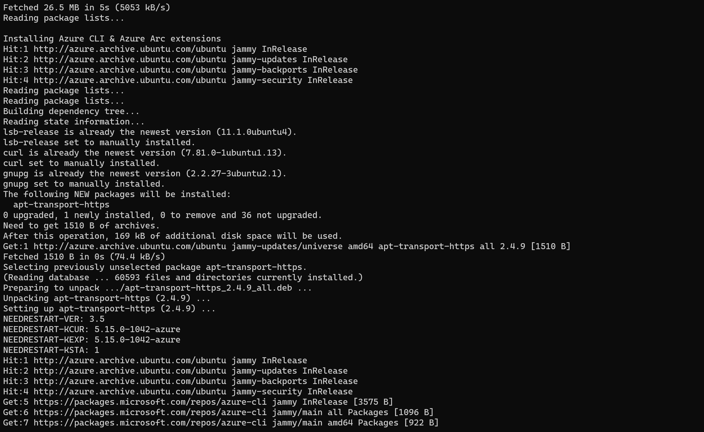
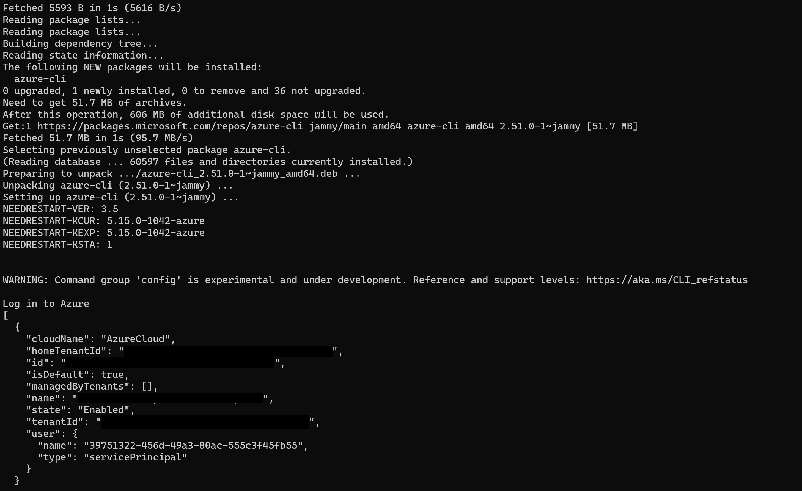

> **ADVISORY: An known issue affecting Azure CLI Kubernetes extensions is causing problems with automation in Jumpstart Kubernetes scenarios, data and app services scenarios, and ArcBox where the Azure CLI Kubernetes extensions are used. This issue will result result in incomplete or failed deployments. Thank you for your patience as the teams work to address the issue.**

## Deploy Kubernetes cluster and connect it to Azure Arc using Cluster API Azure provider

The following README will guide you on to deploy an Kubernetes cluster in Azure virtual machines and connected it as an Azure Arc cluster resource by using the [Kubernetes Cluster API (CAPI) project](https://cluster-api.sigs.k8s.io/introduction.html) and it's [Cluster API Azure provider (CAPZ)](https://cloudblogs.microsoft.com/opensource/2020/12/15/introducing-cluster-api-provider-azure-capz-kubernetes-cluster-management/).

## Architecture (In a nutshell)

From the Cluster API Book docs:

"Cluster API requires an existing Kubernetes cluster accessible via kubectl; during the installation process the Kubernetes cluster will be transformed into a management cluster by installing the Cluster API provider components, so it is recommended to keep it separated from any application workload."

In this guide, a [Rancher K3s](https://rancher.com/docs/k3s/latest/en/), single node cluster will be automatically deployed for you and will be used as the management cluster. This cluster will then be used to deploy the workload cluster using the Cluster API Azure provider (CAPZ).

## Prerequisites

- The automation for this scenario is designed with the assumption of an existing (brownfield) Ubuntu server is already deployed. This can achieved in multiple ways but we recommend using either an [Ubuntu Azure virtual machine](https://docs.microsoft.com/en-us/azure/virtual-machines/linux/quick-create-portal) or Ubuntu deployed [using Windows Subsystem for Linux (WSL)](https://docs.microsoft.com/en-us/windows/wsl/install).

- Clone the Azure Arc Jumpstart repository

    ```shell
    git clone https://github.com/microsoft/azure_arc.git
    ```
  
- [Install or update Azure CLI to version 2.25.0 and above](https://docs.microsoft.com/en-us/cli/azure/install-azure-cli?view=azure-cli-latest). Use the below command to check your current installed version.

  ```shell
  az --version
  ```

- Create Azure service principal (SP). To deploy this scenario, an Azure service principal assigned with "Contributor" RBAC role is required for provisioning Azure resources

    To create it, login to your Azure account run the below command (this can also be done in [Azure Cloud Shell](https://shell.azure.com/).

    ```shell
    az login
    az ad sp create-for-rbac -n "<Unique SP Name>" --role "Contributor"
    ```

    For example:

    ```shell
    az ad sp create-for-rbac -n "AzureArcK8s" --role "Contributor"
    ```

    Output should look like this:

    ```json
    {
    "appId": "XXXXXXXXXXXXXXXXXXXXXXXXXXXX",
    "displayName": "AzureArcK8s",
    "name": "http://AzureArcK8s",
    "password": "XXXXXXXXXXXXXXXXXXXXXXXXXXXX",
    "tenant": "XXXXXXXXXXXXXXXXXXXXXXXXXXXX"
    }
    ```

    > **Note: It is optional, but highly recommended, to scope the SP to a specific [Azure subscription](https://docs.microsoft.com/en-us/cli/azure/ad/sp?view=azure-cli-latest).**

    > **Note: The Jumpstart scenarios are designed with as much ease of use in-mind and adhering to security-related best practices whenever possible. It is optional but highly recommended to scope the service principal to a specific [Azure subscription and resource group](https://docs.microsoft.com/en-us/cli/azure/ad/sp?view=azure-cli-latest) as well considering using a [less privileged service principal account](https://docs.microsoft.com/en-us/azure/role-based-access-control/best-practices)**

## Automation Flow

For you to get familiar with the automation and deployment flow, below is an explanation.

- User is downloading the [provided deployment shell script file](https://github.com/microsoft/azure_arc/blob/main/azure_arc_k8s_jumpstart/cluster_api/capi_azure/installCAPI.sh)

- User is editing the environment variables section in the in the script file (1-time edit). These variables values will be used throughout the deployment.

- At a high level, the script will then perform the following tasks:
  - Download and install all the required artifacts
  - Install the required Azure Arc-enabled Kubernetes required Azure CLI extension
  - Automatically log in to Azure using the provided service principal credentials and will create the deployment Azure resource group
  - Deploy a single node Rancher K3s cluster and will convert it to a CAPI management cluster
  - Download the required [Kustomize](https://kustomize.io/) patch files from the Jumpstart repository for deploying the CAPI workload cluster using the Cluster API Azure provider
  - Onboard the cluster as an Azure Arc-enabled Kubernetes cluster

## Deployment

- As mentioned in the prerequisites section, an existing Ubuntu machine is required.

- In the your directory of the cloned Jumpstart repository, navigate to where the [*arc_capi_azure*](https://github.com/microsoft/azure_arc/blob/main/azure_arc_k8s_jumpstart/cluster_api/capi_azure/installCAPI.sh) bash script is located. Alternatively, you can also download just the script instead of cloning the entire repository.

  The script will transform the Rancher K3s Kubernetes cluster to a CAPI management cluster with the Azure Cluster API provisioned (CAPZ) components that are needed. It will then deploy the workload cluster and it's Azure resources based on the environment variables as described in the next bullet. Upon deployment completion, the cluster will be onboard as an Azure Arc-enabled Kubernetes cluster.

    > **Disclaimer: The CAPI/CAPZ *clusterctl* CLI tool commands used in the script are taken straight from the ["Cluster API Book"](https://cluster-api.sigs.k8s.io/user/quick-start.html) and deserves it's writers all the credit for it!**
    **The reason being for this process to be included is to provide you with the end-to-end user experience which also include the proprietary automation developed for this Jumpstart scenario.**

- To download the script from the Ubuntu machine, use the below command.

    ```shell
    curl -L https://raw.githubusercontent.com/microsoft/azure_arc/main/azure_arc_k8s_jumpstart/cluster_api/capi_azure/installCAPI.sh -o ~/installCAPI.sh
    ```

    

- Once downloaded, edit the environment variables to match your Azure subscription and service principal details created in the prerequisites section as well as the required workload cluster details. The following screenshots shows the downloaded/copied script before editing the environment variables.

    

    > **NOTE: Editing the script can be done either before copy/downloading it to the Ubuntu machine by using an your preferred IDE (for example, VSCode) or after, in the machine itself, using native Linux text editor such as vi or nano.**

- Edit ONLY the following environment variables:

    > **NOTE: Both the *`githubAccount`* and the *`githubBranch`* are used for testing purposes. Unless you are developing independent tests that are based on the script, there is no need to edit these variables.**

    

  - *`CONTROL_PLANE_MACHINE_COUNT`* - Control Plane node count. For example: 1
  - *`WORKER_MACHINE_COUNT`* - Workers node count. For example: 2
  - *`AZURE_LOCATION`* - Azure region. For example: eastus
  - *`AZURE_ARC_CLUSTER_RESOURCE_NAME`* - Name of the Azure Arc-enabled Kubernetes cluster resource name as it will shown in the Azure portal
  - *`AZURE_RESOURCE_GROUP`* - Name of the Azure resource group will be used for this deployment
  - *`AZURE_SUBSCRIPTION_ID`* - Azure subscription id
  - *`AZURE_TENANT_ID`* - Azure tenant id
  - *`AZURE_CLIENT_ID`* - Azure SPN application client id
  - *`AZURE_CLIENT_SECRET`* - Azure SPN application client secret
  - *`AZURE_CONTROL_PLANE_MACHINE_TYPE`* - Control Plane node Azure VM type .For example: "Standard_D4s_v4"
  - *`AZURE_NODE_MACHINE_TYPE`* - Worker node Azure VM type .For example: "Standard_D8s_v4"

    

- Execute the script using the below command. The script runtime can take ~10-20min, depends on the number of control plane and worker nodes you chose to deploy.

  ```shell
  sudo chmod +x installCAPI.sh && . ./installCAPI.sh
  ```

  > **NOTE: The extra dot is due to the script using the *export* command, used for exporting the environment variables in the same shell session as the other commands in the script.**

    

    

    

    

- Upon completion, you will have a new Cluster API Kubernetes cluster deployed on top of Azure virtual machines that is already onboard as an Azure Arc-enabled Kubernetes cluster.

  

  

## Logging

For ease of troubleshooting and tracking, a deployment log will be created automatically as part of the script runtime. To view the deployment log use the below command:

```shell
cat /home/<USER>/jumpstart_logs/installCAPI.log
```


## Cleanup

To cleanup the deployment, simply delete the Azure resource group.


