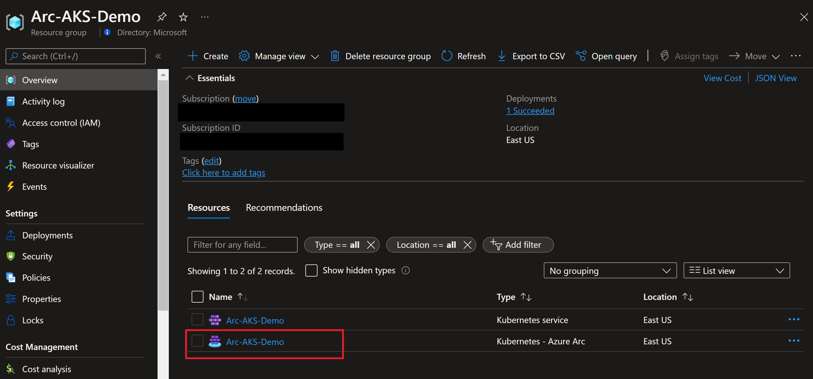
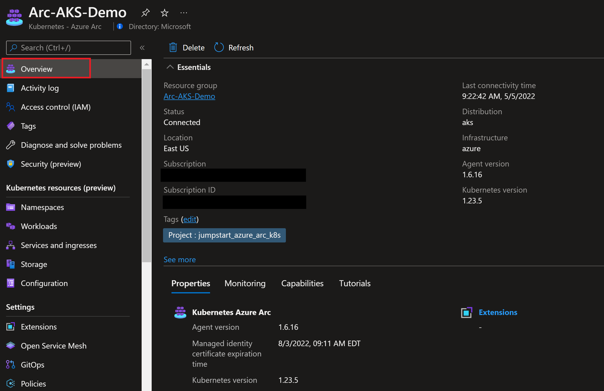
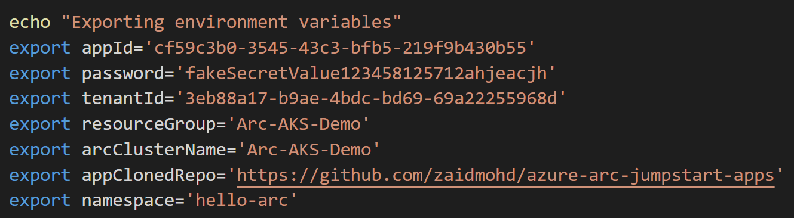

## Deploy GitOps configurations and perform basic GitOps flow on AKS as an Azure Arc Connected Cluster

The following README will guide you on how to create GitOps configuration on an Azure Kubernetes Service (AKS) cluster which is projected as an Azure Arc connected cluster resource.

In this guide, you will deploy & attach GitOps configuration to your cluster which will also include deploying an "Hello World" Azure Arc web application on your Kubernetes cluster. By doing so, you will be able to make real-time changes to the application and show how the GitOps flow takes effect.

> **Note: This guide assumes you already deployed an AKS cluster and connected it to Azure Arc. If you haven't, this repository offers you a way to do so in an automated fashion using either [ARM Template](https://azurearcjumpstart.io/azure_arc_jumpstart/azure_arc_k8s/aks/aks_arm_template/) or [Terraform](https://azurearcjumpstart.io/azure_arc_jumpstart/azure_arc_k8s/aks/aks_terraform/).**

## Prerequisites

* Clone the Azure Arc Jumpstart repository

    ```shell
    git clone https://github.com/microsoft/azure_arc.git
    ```

* Fork the ["Hello Arc"](https://github.com/likamrat/hello_arc) demo application repository.

* (Optional) Install the "Tab Auto Refresh" extension for your browser. This will help you to show the real-time changes on the application in an automated way.

  * [Microsoft Edge](https://microsoftedge.microsoft.com/addons/detail/odiofbnciojkpogljollobmhplkhmofe)

  * [Google Chrome](https://chrome.google.com/webstore/detail/tab-auto-refresh/jaioibhbkffompljnnipmpkeafhpicpd?hl=en)

  * [Mozilla Firefox](https://addons.mozilla.org/en-US/firefox/addon/tab-auto-refresh/)

* As mentioned, this guide starts at the point where you already have a connected AKS cluster to Azure Arc.

    

    

* [Install or update Azure CLI to version 2.25.0 and above](https://docs.microsoft.com/en-us/cli/azure/install-azure-cli?view=azure-cli-latest). Use the below command to check your current installed version.

  ```shell
  az --version
  ```

* Create Azure service principal (SP)

    To be able to complete the scenario and its related automation, Azure service principal assigned with the “Contributor” role is required. To create it, login to your Azure account run the below command (this can also be done in [Azure Cloud Shell](https://shell.azure.com/)).

    ```shell
    az login
    az ad sp create-for-rbac -n "<Unique SP Name>" --role contributor
    ```

    For example:

    ```shell
    az ad sp create-for-rbac -n "http://AzureArcK8s" --role contributor
    ```

    Output should look like this:

    ```json
    {
    "appId": "XXXXXXXXXXXXXXXXXXXXXXXXXXXX",
    "displayName": "AzureArcK8s",
    "name": "http://AzureArcK8s",
    "password": "XXXXXXXXXXXXXXXXXXXXXXXXXXXX",
    "tenant": "XXXXXXXXXXXXXXXXXXXXXXXXXXXX"
    }
    ```

    > **Note: The Jumpstart scenarios are designed with as much ease of use in-mind and adhering to security-related best practices whenever possible. It is optional but highly recommended to scope the service principal to a specific [Azure subscription and resource group](https://docs.microsoft.com/en-us/cli/azure/ad/sp?view=azure-cli-latest) as well considering using a [less privileged service principal account](https://docs.microsoft.com/en-us/azure/role-based-access-control/best-practices)**

## Azure Arc Kubernetes GitOps Configuration

* In order to keep your local environment clean and untouched, we will use [Azure Cloud Shell](https://docs.microsoft.com/en-us/azure/cloud-shell/overview) (located in the top-right corner in the Azure portal) to run the *az_k8sconfig_aks* shell script against the AKS connected cluster. **Make sure Cloud Shell is configured to use Bash.**

* Edit the environment variables in the [*az_k8sconfig_aks*](https://github.com/microsoft/azure_arc/blob/main/azure_arc_k8s_jumpstart/aks/gitops/basic/az_k8sconfig_aks.sh) shell script to match your parameters, upload it to the Cloud Shell environment and run it using the ```. ./az_k8sconfig_aks.sh``` command.

    > **Note: The extra dot is due to the script has an *export* function and needs to have the vars exported in the same shell session as the rest of the commands.**

    

    

    

    

    The script will:

  * Login to your Azure subscription using the SPN credentials
  * Retrieve the cluster credentials (KUBECONFIG)
  * Will use Helm to deploy NGINX ingress controller
  * Create the GitOps configurations and deploy the Flux operator and Memcached on the Azure Arc connected cluster
  * Deploy the ["Hello Arc"](https://github.com/likamrat/hello_arc) application along side an Ingress rule to make it available from outside the cluster

    > **Disclaimer: For the purpose of this guide, notice how the "*git-poll-interval 3s*" is set. The 3 seconds interval is useful for demo purposes since it will make the git-poll interval to rapidly track changes on the repository but it is recommended to have longer interval in your production environment (default value is 5min)**

* Once the script will complete it's run, you will have the GitOps configuration created and all the resources deployed in your Kubernetes cluster.

    > **Note: that it takes few min for the configuration change it's Operator state status from "Pending" to Install.**

    

    

    

## The "Hello Arc" Application & Components

* Before kicking the GitOps flow, let's verify and zoom-in to the Kubernetes resources deployed by running few *kubectl* commands.

  * ```kubectl get pods -n cluster-config``` - Will show the Flux operator and the Memcached pods.
    * ```kubectl get pods -n hello-arc``` - Will show 3 replicas of the "Hello Arc" application and the NGINX controller.
    * ```kubectl get svc -n hello-arc``` - Will show NGINX controller Kubernetes Service (Type LoadBalancer).
    * ```kubectl get ing -n hello-arc``` - Will show NGINX rule which will route the traffic to the "Hello Arc" application from outside the cluster.

    

    

    

    

* The GitOps flow works as follow:

    1. The Flux operator holds the "desired state" of the "Hello Arc" application, this are the configuration we deployed against the Azure Arc connected cluster. The operator "polls" the state of the of the ["Hello Arc"](https://github.com/likamrat/hello_arc) application repository.

    2. Changing the application which is consider to be a new version of it, will trigger the Flux operator to kick-in the GitOps flow.

    3. A new Kubernetes pod with the new version of the application will be deployed on the cluster. Once the new pods is successfully deployed, the old one will be terminated (rolling upgrade).

* To show the above flow, open 2 (ideally 3) side-by-side browser windows:

  * Azure Cloud Shell open running the ```kubectl get pods -n hello-arc -w``` command

    

  * Your fork of the "Hello Arc" application repository. Open the [*hello_arc.yaml*](https://github.com/likamrat/hello_arc/blob/master/yaml/hello_arc.yaml) file.

  * The external IP address of the Kubernetes Service seen using the ```kubectl get svc -n hello-arc``` command.

    

  * End result should look like that:

    

* As mentioned in the prerequisites section, it is optional but very recommended to configure the "Tab Auto Refresh" extension for your browser. If you did, in the "Hello Arc" application window, configure it to refresh every 2 seconds.

    

* In the repository window showing the *hello_arc.yaml* file, change the text under "MESSAGE" section commit the change. Alternatively, you can open the fork repository in your IDE, make the change, commit and push it.

    

    

* Upon committing the changes, notice how the Kubernetes Pod rolling upgrade starts. Once the Pod is up & running, the new "Hello Arc" application version window will show the new message, showing the rolling upgrade is completed and the GitOps flow is successful.

    
