## Integrate Azure Monitor for Containers with AKS as an Azure Arc Connected Cluster

The following README will guide you on how to onboard an Azure Kubernetes Service (AKS) cluster which is projected an Azure Arc connected cluster resource on to [Azure Monitor for Containers](https://docs.microsoft.com/en-us/azure/azure-monitor/insights/container-insights-overview).

In this guide, you will hook the AKS cluster to Azure Monitor by deploying the [OMS agent](https://docs.microsoft.com/en-us/azure/azure-monitor/platform/log-analytics-agent) on your Kubernetes cluster to start collecting telemetry.  

> **Note: This guide assumes you already deployed an AKS cluster and connected it to Azure Arc. If you haven't, this repository offers you a way to do so in an automated fashion using either [ARM Template](https://azurearcjumpstart.io/azure_arc_jumpstart/azure_arc_k8s/aks/aks_arm_template/) or [Terraform](https://azurearcjumpstart.io/azure_arc_jumpstart/azure_arc_k8s/aks/aks_terraform/).**

## Prerequisites

* Clone the Azure Arc Jumpstart repository

    ```console
    git clone https://github.com/microsoft/azure_arc.git
    ```

* [Install or update Azure CLI](https://docs.microsoft.com/en-us/cli/azure/install-azure-cli?view=azure-cli-latest). **Azure CLI should be running version 2.7** or later. Use ```az --version``` to check your current installed version.

* Create Azure service principal (SP)

    To connect a Kubernetes cluster to Azure Arc, Azure service principal assigned with the "Contributor" role is required. To create it, login to your Azure account run the below command (this can also be done in [Azure Cloud Shell](https://shell.azure.com/)).

    ```console
    az login
    az ad sp create-for-rbac -n "<Unique SP Name>" --role contributor
    ```

    For example:

    ```console
    az ad sp create-for-rbac -n "http://AzureArcK8s" --role contributor
    ```

    Output should look like this:

    ```json
    {
    "appId": "XXXXXXXXXXXXXXXXXXXXXXXXXXXX",
    "displayName": "AzureArcK8s",
    "name": "http://AzureArcK8s",
    "password": "XXXXXXXXXXXXXXXXXXXXXXXXXXXX",
    "tenant": "XXXXXXXXXXXXXXXXXXXXXXXXXXXX"
    }
    ```

    > **Note: It is optional but highly recommended to scope the SP to a specific [Azure subscription and resource group](https://docs.microsoft.com/en-us/cli/azure/ad/sp?view=azure-cli-latest)**

## Azure Monitor for Containers Integration

* In order to keep your local environment clean and untouched, we will use [Azure Cloud Shell](https://docs.microsoft.com/en-us/azure/cloud-shell/overview) (located in the top-right corner in the Azure portal) to run the *aks_monitor_onboarding* script against the AKS connected cluster. For your convenient, both shell and PowerShell scripts are [provided](https://github.com/microsoft/azure_arc/tree/main/azure_arc_k8s_jumpstart/aks/azure_monitor).

* Before integrating the cluster with Azure Monitor for Containers, click on the "Insights (preview)" blade for the connected Arc cluster to show how the cluster is not currently being monitored.

    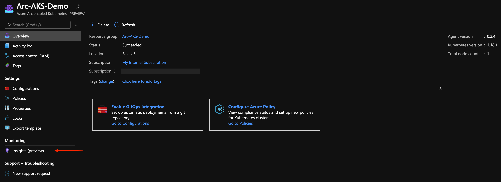

    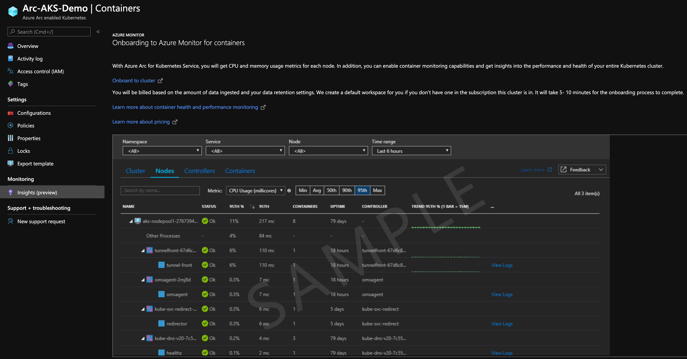

* Edit the environment variables in either of the scripts to match your environment parameters, upload it to the Cloud Shell environment and run it using the ```. ./aks_monitor_onboarding.sh``` (Bash) or ```./aks_monitor_onboarding.ps1``` (PowerShell) command.

    > **Note: The extra dot is due to the shell script has an *export* function and needs to have the vars exported in the same shell session as the rest of the commands.**

    

    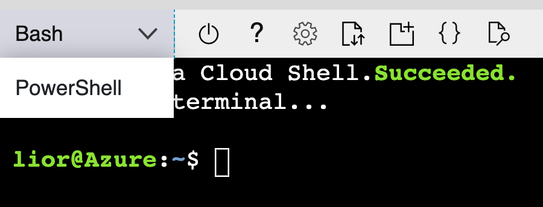

    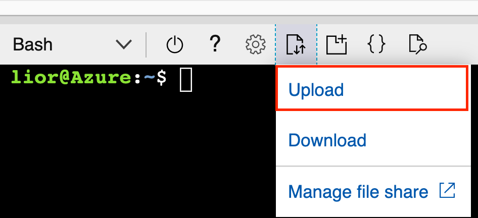

    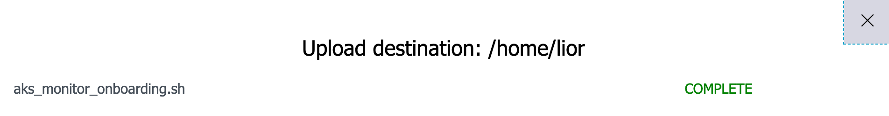

    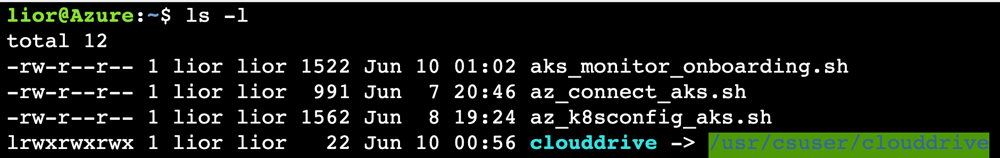

    The script will:

  * Login to your Azure subscription using the SPN credentials
  * Download the OMS script
  * Retrieve the Azure Arc Connected Cluster Azure Resource ID as well as the cluster credentials (KUBECONFIG)
  * Execute the script which will create Azure Log Analytics workspace, deploy the OMS agent on the Kubernetes cluster and tag the cluster
  * Delete the downloaded script

* Once the script will complete it's run, you will have an Azure Arc connected cluster integrated with Azure Monitor for Containers. At the end of it's run, the script generates URL for you to click on. This URL will open a new browser tab leading to the Azure Monitor for Containers Insights page.

    > **Note: As the OMS start collecting telemetry from the cluster nodes and pods, it will take 5-10min for data to start show up in the Azure Portal.**

    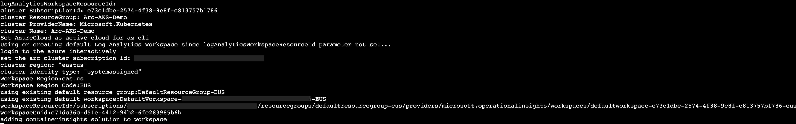

    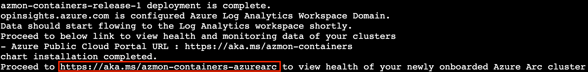

* Click the "Connected Clusters" tab and see the Azure Arc connected cluster was added. Now that your cluster is being monitored, navigate trough the different tabs and sections and watch the monitoring telemetry for the cluster nodes and pods.  

    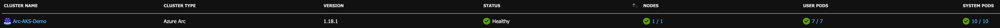

    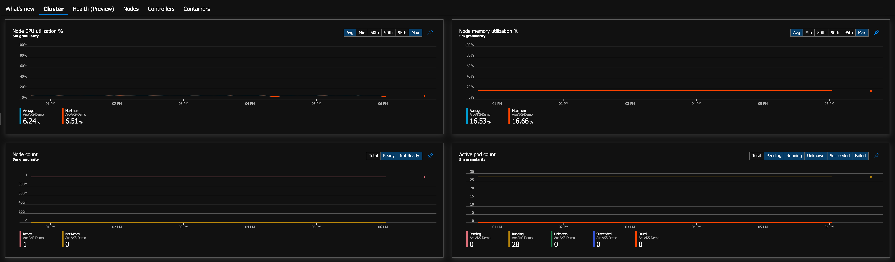

    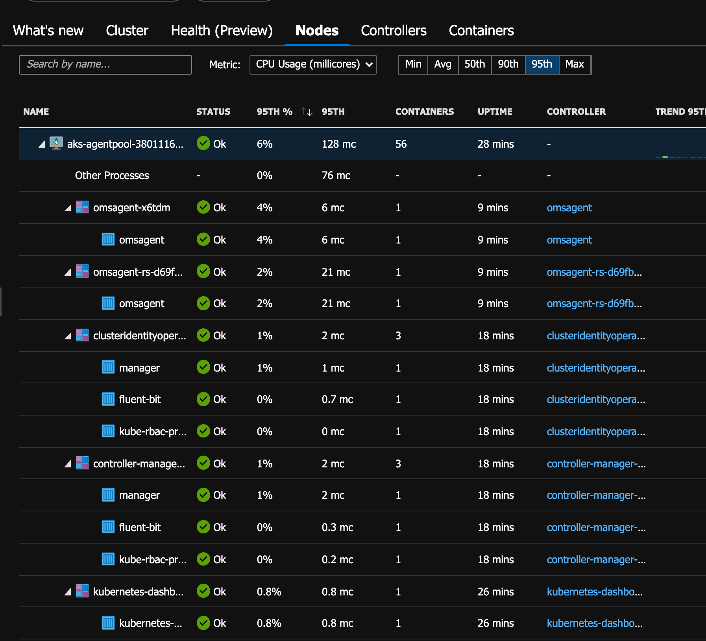

    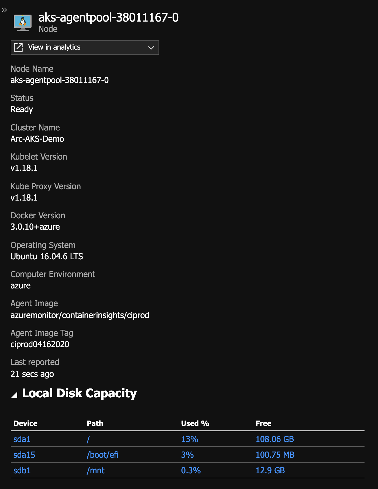

    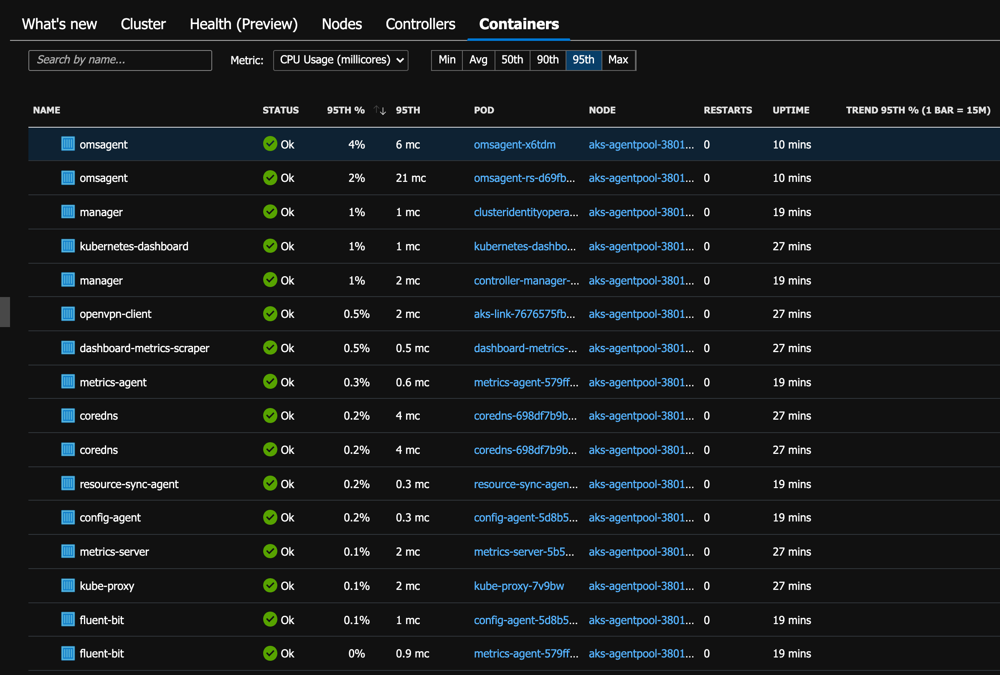
