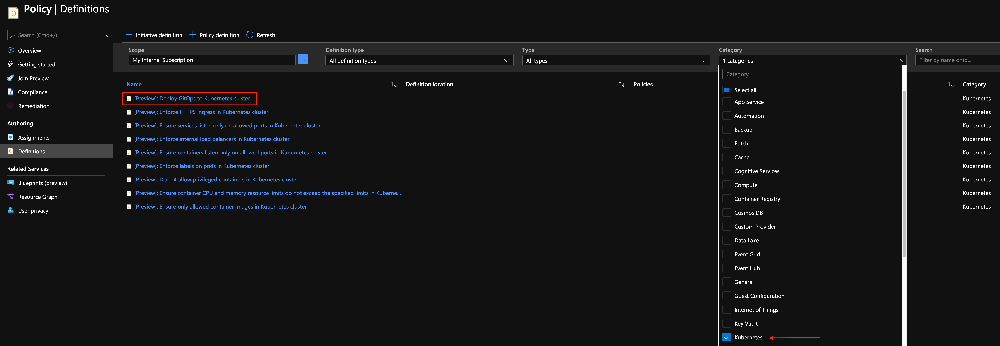
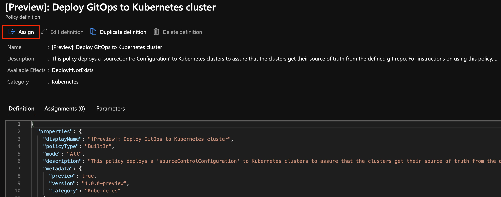
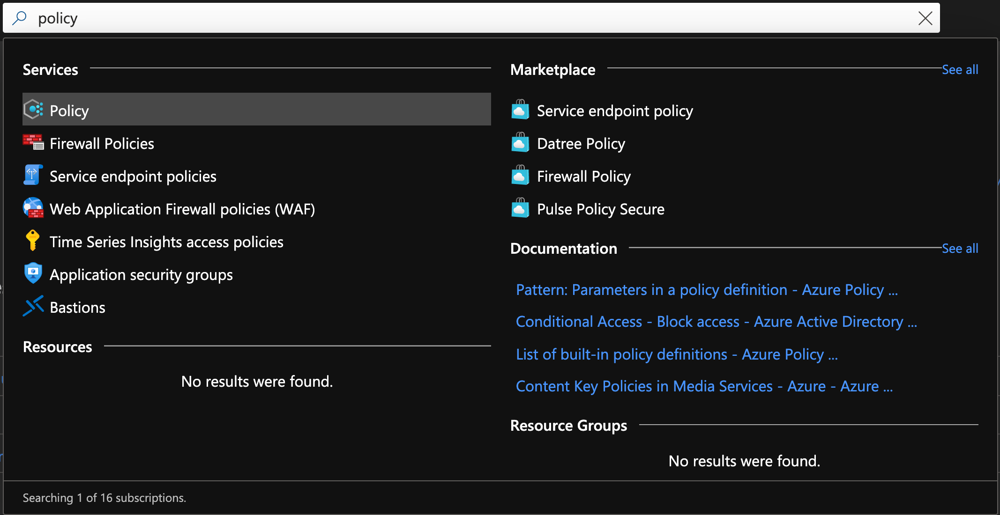

## Apply GitOps configurations on AKS as an Azure Arc Connected Cluster using Azure Policy for Kubernetes

The following README will guide you on how to enable [Azure Policy for Kubernetes](https://docs.microsoft.com/en-us/azure/governance/policy/concepts/policy-for-kubernetes#:~:text=Azure%20Policy%20extends%20Gatekeeper%20v3,Kubernetes%20clusters%20from%20one%20place.) on an Azure Kubernetes Service (AKS) cluster that is projected as an Azure Arc connected cluster as well as how to create GitOps policy to apply on the cluster.

> **Note: This guide assumes you already deployed an AKS cluster and connected it to Azure Arc. If you haven't, this repository offers you a way to do so in an automated fashion using either [ARM Template](https://azurearcjumpstart.io/azure_arc_jumpstart/azure_arc_k8s/aks/aks_arm_template/) or [Terraform](https://azurearcjumpstart.io/azure_arc_jumpstart/azure_arc_k8s/aks/aks_terraform/).**

## Prerequisites

* Clone the Azure Arc Jumpstart repository

    ```shell
    git clone https://github.com/microsoft/azure_arc.git
    ```

* Fork the ["Hello Arc"](https://github.com/likamrat/hello_arc) demo application repository.

* [Install or update Azure CLI to version 2.25.0 and above](https://docs.microsoft.com/en-us/cli/azure/install-azure-cli?view=azure-cli-latest). Use the below command to check your current installed version.

  ```shell
  az --version
  ```

* As mentioned, this guide starts at the point where you already have a connected AKS cluster to Azure Arc.

    

    

* Before installing the Azure Policy Add-on or enabling any of the service features, your subscription must enable the Microsoft.PolicyInsights resource provider and create a role assignment for the cluster service principal. To do that, open [Azure Cloud Shell](https://shell.azure.com/) and run either the Azure CLI or Azure PowerShell command.

    

    Azure CLI:

    ```shell
    az provider register --namespace 'Microsoft.PolicyInsights'
    ```

    Azure PowerShell:

    ```powershell
    Register-AzResourceProvider -ProviderNamespace 'Microsoft.PolicyInsights'
    ```

    To verify successful registration, run either the below Azure CLI or Azure PowerShell command.

    Azure CLI:

    ```shell
    az provider show --namespace 'Microsoft.PolicyInsights'
    ```

    Azure PowerShell:

    ```powershell
    Get-AzResourceProvider -ProviderNamespace 'Microsoft.PolicyInsights'
    ```

    

    

* Create Azure service principal (SP)

    > **Note: This guide assumes you will be working with a service principal assigned with the 'Contributor' role as described below. If you want to further limit the RBAC scope of your service Principal, you can assign it with the 'Policy Insights Data Writer (Preview)' role the Azure Arc-enabled Kubernetes cluster as described [here](https://github.com/MicrosoftDocs/azure-docs/edit/master/articles/governance/policy/concepts/policy-for-kubernetes#L247-L275).**

    To be able to complete the scenario and its related automation, Azure service principal assigned with the “Contributor” role is required. To create it, login to your Azure account run the below command (this can also be done in Azure Cloud Shell).

    ```shell
    az login
    az ad sp create-for-rbac -n "<Unique SP Name>" --role contributor
    ```

    For example:

    ```shell
    az ad sp create-for-rbac -n "http://AzureArcK8s" --role contributor
    ```

    Output should look like this:

    ```json
    {
    "appId": "XXXXXXXXXXXXXXXXXXXXXXXXXXXX",
    "displayName": "AzureArcK8s",
    "name": "http://AzureArcK8s",
    "password": "XXXXXXXXXXXXXXXXXXXXXXXXXXXX",
    "tenant": "XXXXXXXXXXXXXXXXXXXXXXXXXXXX"
    }
    ```

    > **Note: The Jumpstart scenarios are designed with as much ease of use in-mind and adhering to security-related best practices whenever possible. It is optional but highly recommended to scope the service principal to a specific [Azure subscription and resource group](https://docs.microsoft.com/en-us/cli/azure/ad/sp?view=azure-cli-latest) as well considering using a [less privileged service principal account](https://docs.microsoft.com/en-us/azure/role-based-access-control/best-practices)**

## Azure Policy for Azure Arc Connected Cluster Integration

* In order to keep your local environment clean and untouched, we will use [Azure Cloud Shell](https://docs.microsoft.com/en-us/azure/cloud-shell/overview) (located in the top-right corner in the Azure portal) to run the *aks_policy_onboarding* script against the AKS connected cluster. For your convenient, shell script is [provided to you](https://github.com/microsoft/azure_arc/blob/main/azure_arc_k8s_jumpstart/aks/azure_policy/aks_policy_onboarding.sh).

* Edit the environment variables in the script to match your environment parameters, upload it to the Cloud Shell environment and run it using the ```. ./aks_policy_onboarding.sh``` command. **If you decided to use the 'Policy Insights Data Writer (Preview)' role assignment as described in the perquisites section, make sure to use it's respective *appId*, *password* and *tenantId***

    > **Note: The extra dot is due to the shell script has an *export* function and needs to have the vars exported in the same shell session as the rest of the commands.**

    

    

    

The script will:

* Login to your Azure subscription using the SPN credentials
* Install NGINX Ingress Controller
* Retrieve the Azure Arc Connected Cluster Azure Resource ID
* Install the 'azure-policy-addon' helm chart & Gatekeeper

After few seconds, by running the the ```kubectl get pods -A``` command, you will notice all pods have been deployed.


## Deploy GitOps to Azure Arc Kubernetes cluster using Azure Policy

Although you can [deploy GitOps configuration individually](https://azurearcjumpstart.io/azure_arc_jumpstart/azure_arc_k8s/day2/aks/aks_gitops_helm/) on each of your Azure Arc connected clusters, Azure Policy for Kubernetes allows to do the same on a broader scope (i.e subscription or resource group). That way, you can guarantee existing and newly added Azure Arc connected clusters to all have the same GitOps configuration and as a result, the same cluster baseline and/or application version deployed.

* Before assigning the policy, in the Azure portal, click the *Configuration* setting in your AKS connected cluster. Notice how no GitOps configurations are deployed.

    

* In the Search bar, look for *Policy* and click on *Definitions* which will show you all of the available Azure policies.

    

    

* The "[Preview]: Deploy GitOps to Kubernetes cluster" policy is part of the Kubernetes policies. Once you filter to find these, click on the policy and the 'Assign' button.

    

    

* In the below example, the scope of the policy represent the resource group where the AKS connected cluster Azure Arc resource is located. Alternatively, the scope could have been the entire Azure subscription or a resource group with many Azure Arc connected clusters. Also, make sure *Policy enforcement* is set to *Enabled*.

    For this GitOps configuration policy, we will be using the ["Hello Arc"](https://github.com/likamrat/hello_arc) application repository which includes the Kubernetes Service for external access, Deployment as well as the ingress rule to be used by the NGINX ingress controller.

    

    

    

    

    

* Once the policy configuration deployed, after ~15-25min, the policy remediation task will start the evaluation against the Kubernetes cluster, recognize it as "Non-compliant" (since it's still does note have the GitOps configuration deployed) and lastly, after the configuration has been deployed the policy will move to a "Compliant" state. To check this, go back to the main Policy page in the Azure portal.

    > **Note: The process of evaluation all the way to the point that the GitOps configuration is deployed against the cluster can take ~15-30min.**

    

    

    

    

    

## Verify GitOps Configuration & App Deployment

* Now that the policy is in compliant state, let's first verify the GitOps configurations. In the Azure portal click the AKS connected Azure Arc cluster and open the Configurations settings.

    

    

    

* In order to verify the "Hello Arc" application and it's component has been deployed, In the Azure Cloud Shell, run the below commands.

    ```shell
    kubectl get pods -n hello-arc
    kubectl get ing -n hello-arc
    kubectl get svc -n hello-arc
    ```

    You can see how the Flux GitOps operator, Memcached, the "Hello Arc" application and the ingress rule now deployed on the cluster as well the Service with an external IP.

    

* Copy the Service external IP and paste in your browser.

    

## Clean up environment

Complete the following steps to clean up your environment.

* Delete the AKS cluster as described in the [ARM Template teardown instructions](https://azurearcjumpstart.io/azure_arc_jumpstart/azure_arc_k8s/aks/aks_arm_template/) or the [Terraform teardown instructions](https://azurearcjumpstart.io/azure_arc_jumpstart/azure_arc_k8s/aks/aks_terraform/).

* From the Policy page in the Azure portal, remove the "[Preview]: Deploy GitOps to Kubernetes cluster" policy assignment from the cluster.

    
