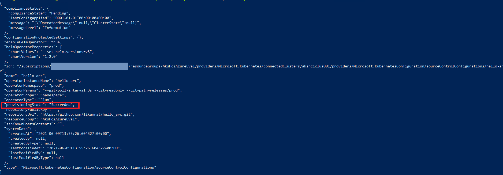
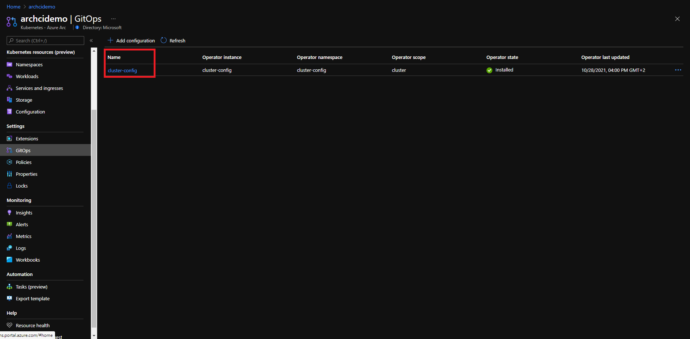
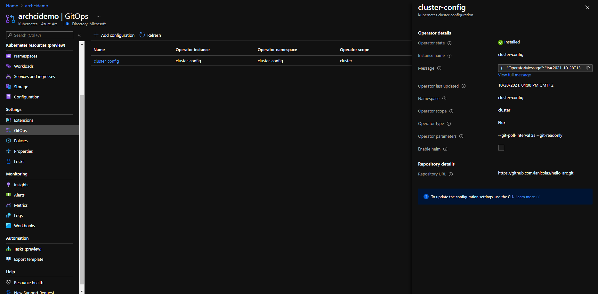
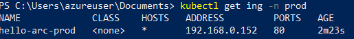
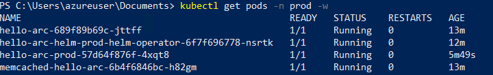
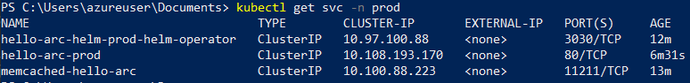
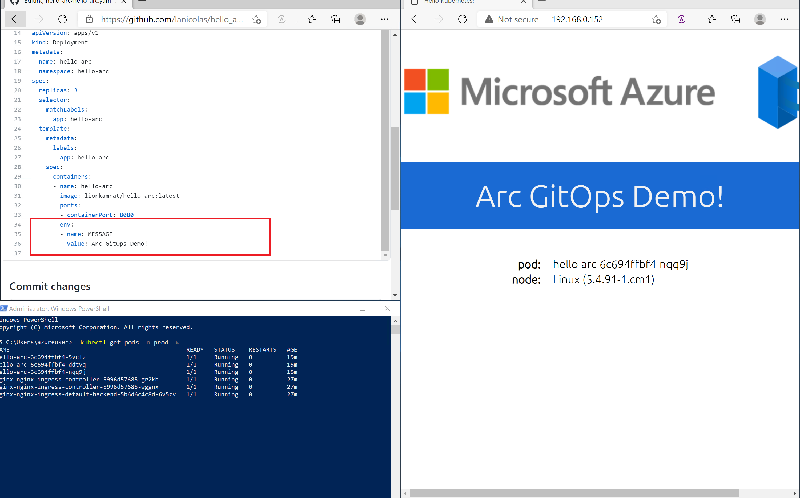

## Deploy GitOps configurations and perform basic GitOps flow on AKS on Azure Stack HCI as an Azure Arc Connected Cluster

The following README will guide you on how to create GitOps configuration on an Azure Kubernetes Service (AKS) cluster that is running on Azure Stack HCI and which is projected as an Azure Arc connected cluster resource.

In this guide, you will deploy & attach GitOps configuration to your cluster which will also include deploying an "Hello World" Azure Arc web application on your Kubernetes cluster. By doing so, you will be able to make real-time changes to the application and show how the GitOps flow takes effect.

> **Note: This guide assumes you already deployed an AKS cluster on Azure Stack HCI and connected it to Azure Arc. If you haven't, this repository offers you a way to do so in an automated fashion using [PowerShell](https://azurearcjumpstart.io/azure_arc_jumpstart/azure_arc_k8s/aks_stack_hci/aks_hci_powershell/).**

## Prerequisites

* Clone the Azure Arc Jumpstart repository

    ```shell
    git clone https://github.com/microsoft/azure_arc.git
    ```

* Fork the ["Hello Arc"](https://github.com/likamrat/hello_arc) demo application repository.

* (Optional) Install the "Tab Auto Refresh" extension for your browser. This will help you to show the real-time changes on the application in an automated way.

  * [Microsoft Edge](https://microsoftedge.microsoft.com/addons/detail/odiofbnciojkpogljollobmhplkhmofe)

  * [Google Chrome](https://chrome.google.com/webstore/detail/tab-auto-refresh/jaioibhbkffompljnnipmpkeafhpicpd?hl=en)

  * [Mozilla Firefox](https://addons.mozilla.org/en-US/firefox/addon/tab-auto-refresh/)

* As mentioned, this guide starts at the point where you already have a connected AKS cluster to Azure Arc that is running on Azure Stack HCI.

    

    

* [Install or update Azure PowerShell modules](https://docs.microsoft.com/en-us/powershell/azure/install-az-ps?view=azps-5.6.0). Use the below command to check your current installed version.

  ```PowerShell
  Get-InstalledModule -Name Az -AllVersions | select Name,Version
    ```

  > **Note: This guide combines automations that uses both Azure PowerShell Az modules as well as Azure CLI, however both of them can and will be run from a PowerShell window.**

* [Install or update Azure CLI to version 2.25.0 and above](https://docs.microsoft.com/en-us/cli/azure/install-azure-cli?view=azure-cli-latest). Use the below command to check your current installed version.

  ```shell
  az --version
  ```

* Enable subscription with the resource providers for Azure Arc-enabled Kubernetes. Registration is an asynchronous process, and registration may take approximately 10 minutes.

  ```PowerShell
  Register-AzResourceProvider -ProviderNamespace Microsoft.Kubernetes
  Register-AzResourceProvider -ProviderNamespace Microsoft.KubernetesConfiguration
  Register-AzResourceProvider -ProviderNamespace Microsoft.ExtendedLocation
  ```

  You can monitor the registration process with the following commands:

  ```PowerShell
  Get-AzResourceProvider -ProviderNamespace Microsoft.Kubernetes
  Get-AzResourceProvider -ProviderNamespace Microsoft.KubernetesConfiguration
  Get-AzResourceProvider -ProviderNamespace Microsoft.ExtendedLocation
  ```
  
* Create Azure service principal (SP)

    To be able to complete the scenario and its related automation, an Azure service principal assigned with the “Contributor” role is required. To create it, login to your Azure account run the below PowerShell command.

    ```powershell
    Connect-AzAccount
    $sp = New-AzADServicePrincipal -DisplayName "<Unique SP Name>" -Role 'Contributor'
    ```

    For example:

    ```powershell
    $sp = New-AzADServicePrincipal -DisplayName "<Unique SP Name>" -Role 'Contributor'
    ```

    This command will return a secure string as shown below:

    ```shell
    Secret                : System.Security.SecureString
    ServicePrincipalNames : {XXXXXXXXXXXXXXXXXXXXXXXXXXXX, http://AzureArcK8s}
    ApplicationId         : XXXXXXXXXXXXXXXXXXXXXXXXXXXX
    ObjectType            : ServicePrincipal
    DisplayName           : AzureArcK8s
    Id                    : XXXXXXXXXXXXXXXXXXXXXXXXXXXX
    Type                  :
    ```

    To expose the generated password use this code to export the secret:

    ```powershell
    $BSTR = [System.Runtime.InteropServices.Marshal]::SecureStringToBSTR($sp.Secret)
    $UnsecureSecret = [System.Runtime.InteropServices.Marshal]::PtrToStringAuto($BSTR)
    ```

    > **Note: It is optional but highly recommended to scope the SP to a specific [Azure subscription and resource group](https://docs.microsoft.com/en-us/powershell/module/az.resources/new-azadserviceprincipal?view=azps-5.4.0)**

* If you do not have the AksHci PowerShell module already, you will have to perform a clean installation. To install the AksHci PowerShell module remove any previous versions by running the below commands:

  ```powershell
  Install-Module -Name Az.Accounts -Repository PSGallery -RequiredVersion 2.2.4
  Install-Module -Name Az.Resources -Repository PSGallery -RequiredVersion 3.2.0
  Install-Module -Name AzureAD -Repository PSGallery -RequiredVersion 2.0.2.128
  Install-Module -Name AksHci -Repository PSGallery
  Import-Module Az.Accounts
  Import-Module Az.Resources
  Import-Module AzureAD
  Import-Module AksHci
  Exit
  ```

* After this is done, close all PowerShell windows and verify the installation by tunning the following:

  ```powershell
  Get-Command -Module AksHci
  ```

  

## Automation Flow

For you to get familiar with the automation and deployment flow, below is an explanation.

* User is editing the PowerShell script environment variables (1-time edit). These variables values are being used throughout the deployment of the Kubernetes GitOps configuration.

* User is running the PowerShell script to enable and set up a GitOps configuration. Runtime script will:
  * Login to your Azure subscription using the SPN credentials.
  * Retrieve the cluster credentials (KUBECONFIG).
  * Use Helm to deploy NGINX ingress controller.
  * Create the GitOps configurations and deploy the Flux operator and Memcached on the Azure Arc connected cluster.
  * Deploy the ["Hello Arc"](https://github.com/likamrat/hello_arc) application along side an Ingress rule to make it available from outside the cluster.

* User will kick the GitOps flow by making changes to the ["Hello Arc"](https://github.com/likamrat/hello_arc) application, this will be considered a new version by the Flux Operator.

* The GitOps flow will pull the new version of the application and deploy new pods, upon committing the changes.

* User will show rolling upgrade of the "Hello Arc" application as the GitOps flow is completed successfully.
  
## Azure Arc Kubernetes GitOps Configuration

* Edit the environment variables in the [*az_k8sconfig_aks_hci*](https://github.com/microsoft/azure_arc/blob/main/azure_arc_k8s_jumpstart/aks_stack_hci/gitops/basic/az_k8sconfig_aks_hci.ps1) PowerShell script to match your parameters and run it using the ```.\az_k8sconfig_aks_hci.ps1``` command.

    > **Disclaimer: For the purpose of this guide, notice how the "*git-poll-interval 3s*" is set. The 3 seconds interval is useful for demo purposes since it will make the git-poll interval to rapidly track changes on the repository but it is recommended to have longer interval in your production environment (default value is 5min)**

* Once the script will complete it's run, you will have the GitOps configuration created and all the resources deployed in your Kubernetes cluster running on Azure Stack HCI.

    > **Note: that it takes few min for the configuration change it's Operator state status from "Pending" to Install.**

    

    

    

## The "Hello Arc" Application & Components

* Before kicking the GitOps flow, let's review the Kubernetes resources deployed by running few *kubectl* commands.

  * ```kubectl get pods -n prod``` - Will show the Flux operator, the Memcached pods and the "Hello Arc" application pods.
    * ```kubectl get pods -n cluster-mgmt``` - Will show the NGINX controller.
    * ```kubectl get svc -n prod``` - Will show NGINX controller Kubernetes Service (Type LoadBalancer).
    * ```kubectl get ing -n prod``` - Will show NGINX rule which will route the traffic to the "Hello Arc" application from outside the cluster.

    

    

    

    

* The GitOps flow works as follow:

    1. The Flux operator holds the "desired state" of the "Hello Arc" application, this are the configuration we deployed against the Azure Arc connected cluster. The operator "pulls" the state of the ["Hello Arc"](https://github.com/likamrat/hello_arc) application repository.

    2. Changing the application which is consider to be a new version of it, will trigger the Flux operator to kick-in the GitOps flow.

    3. A new Kubernetes pod with the new version of the application will be deployed on the cluster. Once the new pods is successfully deployed, the old one will be terminated (rolling upgrade).

* To show the above flow, open 2 (ideally 3) side-by-side browser windows:

  * Run ```kubectl get pods -n prod -w``` command

    

  * Your fork of the "Hello Arc" application repository. Open the [*hello_arc.yaml*](https://github.com/likamrat/hello_arc/blob/master/yaml/hello_arc.yaml) file.

  * The IP address of the Kubernetes Service seen using the ```kubectl get svc -n prod``` command.

    

  * End result should look like that:

    

* As mentioned in the prerequisites section, it is optional but very recommended to configure the "Tab Auto Refresh" extension for your browser. If you did, in the "Hello Arc" application window, configure it to refresh every 2 seconds.

    

* In the repository window showing the *hello_arc.yaml* file, change the text under "MESSAGE" section commit the change. Alternatively, you can open the fork repository in your IDE, make the change, commit and push it.

    

    

* Upon committing the changes, notice how the Kubernetes Pod rolling upgrade starts. Once the Pod is up & running, the new "Hello Arc" application version window will show the new message, showing the rolling upgrade is completed and the GitOps flow is successful.

    
