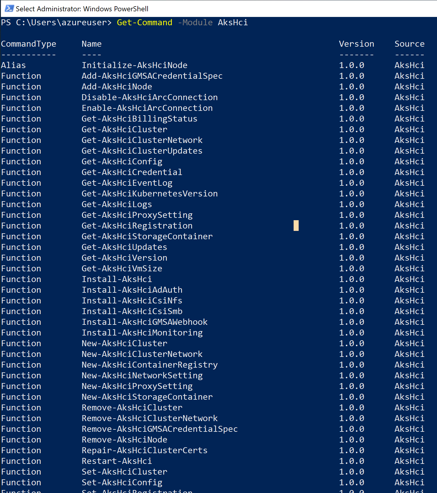
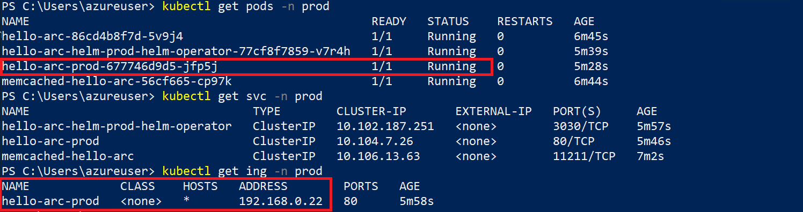

## Deploy GitOps configurations and perform Helm-based GitOps flow on AKS on Azure Stack HCI as an Azure Arc Connected Cluster

The following README will guide you on how to create [Helm](https://helm.sh/)-based GitOps configuration on an Azure Kubernetes Service (AKS) cluster running on Azure Stack HCI, which is projected as an Azure Arc connected cluster resource.

In this guide, you will deploy & attach 2 GitOps configuration to your cluster, a cluster-level config to deploy nginx-ingress controller and a namespace-level config to deploy the "Hello Arc" web application on your Kubernetes cluster.

By doing so, you will be able to make real-time changes to the application and show how the GitOps flow takes effect.

> **Note: This guide assumes you already deployed an AKS cluster on Azure Stack HCI and connected it to Azure Arc. If you haven't, this repository offers you a way to do so in an automated fashion using [PowerShell](https://azurearcjumpstart.io/azure_arc_jumpstart/azure_arc_k8s/aks_stack_hci/aks_hci_powershell/).**

## Prerequisites

* Clone the Azure Arc Jumpstart repository

    ```shell
    git clone https://github.com/microsoft/azure_arc.git
    ```

* Fork the ["Hello Arc"](https://github.com/likamrat/hello_arc) demo application repository.

* (Optional) Install the "Tab Auto Refresh" extension for your browser. This will help you to show the real-time changes on the application in an automated way.

  * [Microsoft Edge](https://microsoftedge.microsoft.com/addons/detail/odiofbnciojkpogljollobmhplkhmofe)

  * [Google Chrome](https://chrome.google.com/webstore/detail/tab-auto-refresh/jaioibhbkffompljnnipmpkeafhpicpd?hl=en)

  * [Mozilla Firefox](https://addons.mozilla.org/en-US/firefox/addon/tab-auto-refresh/)

* As mentioned, this guide starts at the point where you already have a connected AKS cluster to Azure Arc.

    

    

* [Install or update Azure PowerShell modules](https://docs.microsoft.com/en-us/powershell/azure/install-az-ps?view=azps-5.6.0). Use the below command to check your current installed version.

  ```PowerShell
  Get-InstalledModule -Name Az -AllVersions | select Name,Version
  ```

  > **Note: This guide combines automations that uses both Azure PowerShell Az modules as well as Azure CLI, however both of them can and will be run from a PowerShell window.**

  * [Install or update Azure CLI to version 2.15.0 and above](https://docs.microsoft.com/en-us/cli/azure/install-azure-cli?view=azure-cli-latest). Use the below command to check your current installed version.

  ```shell
  az --version
  ```

* Enable subscription with the two resource providers for Azure Arc-enabled Kubernetes. Registration is an asynchronous process, and registration may take approximately 10 minutes.

  ```PowerShell
  Register-AzResourceProvider -ProviderNamespace Microsoft.Kubernetes
  Register-AzResourceProvider -ProviderNamespace Microsoft.KubernetesConfiguration
  ```

  You can monitor the registration process with the following commands:

  ```PowerShell
  Get-AzResourceProvider -ProviderNamespace Microsoft.Kubernetes
  Get-AzResourceProvider -ProviderNamespace Microsoft.KubernetesConfiguration
  ```

* Create Azure service principal (SP)

    To be able to complete the scenario and its related automation, Azure service principal assigned with the “Contributor” role is required. To create it, login to your Azure account run the below command.

    ```powershell
    Connect-AzAccount
    $sp = New-AzADServicePrincipal -DisplayName "<Unique SP Name>" -Role 'Contributor'
    ```

    For example:

    ```powershell
    $sp = New-AzADServicePrincipal -DisplayName "<Unique SP Name>" -Role 'Contributor'
    ```

    This command will return a secure string as shown below:

    ```shell
    Secret                : System.Security.SecureString
    ServicePrincipalNames : {XXXXXXXXXXXXXXXXXXXXXXXXXXXX, http://AzureArcK8s}
    ApplicationId         : XXXXXXXXXXXXXXXXXXXXXXXXXXXX
    ObjectType            : ServicePrincipal
    DisplayName           : AzureArcK8s
    Id                    : XXXXXXXXXXXXXXXXXXXXXXXXXXXX
    Type                  :
    ```

    To expose the generated password use this code to export the secret:

    ```powershell
    $BSTR = [System.Runtime.InteropServices.Marshal]::SecureStringToBSTR($sp.Secret)
    $UnsecureSecret = [System.Runtime.InteropServices.Marshal]::PtrToStringAuto($BSTR)
    ```

    > **Note: It is optional but highly recommended to scope the SP to a specific [Azure subscription and resource group](https://docs.microsoft.com/en-us/powershell/module/az.resources/new-azadserviceprincipal?view=azps-5.4.0)**

* If you do not have the AksHci PowerShell module already, you will have to perform a clean installation. To install the AksHci PowerShell module remove any previous versions by running the below commands:

  ```powershell
  Install-PackageProvider -Name NuGet -Force 
  Install-Module -Name PowershellGet -Force -Confirm:$false -SkipPublisherCheck
  Uninstall-Module -Name AksHci -AllVersions -Force -ErrorAction:SilentlyContinue 
  Uninstall-Module -Name Kva -AllVersions -Force -ErrorAction:SilentlyContinue 
  Uninstall-Module -Name Moc -AllVersions -Force -ErrorAction:SilentlyContinue 
  Uninstall-Module -Name MSK8SDownloadAgent -AllVersions -Force -ErrorAction:SilentlyContinue 
  Unregister-PSRepository -Name WSSDRepo -ErrorAction:SilentlyContinue 
  Unregister-PSRepository -Name AksHciPSGallery -ErrorAction:SilentlyContinue 
  Unregister-PSRepository -Name AksHciPSGalleryPreview -ErrorAction:SilentlyContinue
  Exit
  ```

* Using a web browser navigate to https://aka.ms/AKS-HCI-Evaluate, complete the registration form, download and save AKS on Azure Stack HCI. Extract the contents of the zip file.

* Open PowerShell as administrator, navigate to the folder where you extracted the software and run the following commands:

  ```powershell
  Get-ChildItem -Path . -Recurse | Unblock-File -Verbose
  Import-Module AksHci
  Get-Command -Module AksHci
  ```

  

## Cluster-level Config vs. Namespace-level Config

### Cluster-level Config

With Cluster-level GitOps config, the goal is to have an "horizontal components" or "management components" deployed on your Kubernetes cluster which will then be used by your applications. Good examples are Service Meshes, Security products, Monitoring solutions, etc. A very popular example will also be Ingress Controller which is exactly the nginx-ingress controller we will deploy in the next section.

### Namespace-level Config

With Namespace-level GitOps config, the goal is to have Kubernetes resources deployed only in the namespace selected. The most obvious use-case here is simply your application and it's respective pods, services, ingress routes, etc. In the next section will have the "Hello Arc" application deployed on a dedicated namespace.

## Azure Arc Kubernetes GitOps Configuration with Helm

### The Mechanism (In a nutshell)

In the process of creating Azure Arc GitOps configuration, [Weaveworks Flux Kubernetes Operator](https://github.com/fluxcd/flux) is deployed on the cluster.

The Operator is aware of the "HelmRelease" Custom Resource Definition (CRD). This HelmRelease points to a helm chart in a git repo and can optionally contain specific values to input into the helm chart. Due to this configuration, a user can choose to leave the chart values intact or to have different values for different releases.

For example, an application (captured in an Helm chart) dev release can have no pod replication (single pod) while a production release, using the same chart can have 3 pod replicas.

In the next section will use the "Hello Arc" Helm chart to deploy a production release which we will then change and see the results in real-time.

### Automation Flow

For you to get familiar with the automation and deployment flow, below is an explanation.

* User is editing the PowerShell script environment variables (1-time edit). These variables values are being used throughout the deployment of the Kubernetes GitOps configuration.

* User is running the PowerShell script to enable and set up a GitOps configuration. Runtime script will:
  * Login to your Azure subscription using the SPN credentials.
  * Retrieve the cluster credentials (KUBECONFIG).
  * Create the GitOps configurations and deploy the Flux operator and Memcached on the Azure Arc connected cluster.
  * Deploy an Nginx ingress controller and the ["Hello Arc"](https://github.com/likamrat/hello_arc) application through a Helm-based GitOps flow. There are two Helm charts in the "Hello Arc" repository; one for nginx and one for the actual application as well as an Helm Release for each.


* The nginx-ingress controller (a Cluster-level component) will be deployed with 3 replicas to the *cluster-mgmt* namespace.

* The "Hello Arc" application (a Namespace-level component) will be deployed with 1 replica to the *prod* namespace.

* User will kick the GitOps flow by making changes to the ["Hello Arc"](https://github.com/likamrat/hello_arc) application, this will be considered a new version by the Flux Operator.

* The GitOps flow will pull the new version of the application and deploy new pods, upon committing the changes.

* User will show rolling upgrade of the "Hello Arc" application as the GitOps flow is completed successfully.

## Deployment

* Edit the environment variables in the [*az_k8sconfig_helm_aks*](https://github.com/microsoft/azure_arc/blob/main/azure_arc_k8s_jumpstart/aks_stack_hci/gitops/helm/az_k8sconfig_helm_aks.ps1) PowerShell script to match your parameters.

  The script will:

  * Login to your Azure subscription using the SPN credentials
  * Retrieve the cluster credentials (KUBECONFIG)
  * Create two GitOps configurations for the Azure Arc Connected Cluster. Both configurations will be using the Helm charts located in the "Hello Arc" repository.
  * Cluster-level config to deploy nginx-ingress controller Helm chart
  * Namespace-level config to deploy the "Hello Arc" application Helm chart

    > **Disclaimer: For the purpose of this guide, notice how the "*git-poll-interval 3s*" is set. The 3 seconds interval is useful for demo purposes since it will make the git-poll interval to rapidly track changes on the repository but it is recommended to have longer interval in your production environment (default value is 5min)**

* Once the script will complete its run, you will have 2 GitOps configuration created and all the resources deployed in your Kubernetes cluster. **Note:** that it takes few min for the configuration change it's Operator state status from "Pending" to Install.

    

    

* The Cluster-level config initiated the nginx-ingress Pods and Service resource deployment (along with the Flux operator and Memcached). To see it's resource, use the below *kubectl* commands.

    ```shell
    kubectl get pods -n cluster-mgmt
    kubectl get svc -n cluster-mgmt
    ```

    

* The Namespace-level config initiated the "Hello Arc" Pod (1 replica), Service and Ingress Route resource deployment.

    ```shell
    kubectl get pods -n prod
    kubectl get svc -n prod
    kubectl get ing -n prod
    ```

    

## Initiating "Hello Arc" Application GitOps

* The GitOps flow works as follow:

    1. The Flux operator holds the "desired state" for both the nginx-ingress and the "Hello Arc" Helm releases, this are the configuration we deployed against the Azure Arc connected cluster. The operator will pull every 3 seconds the state of the releases in the repository.

    2. Changing the application release will trigger the Flux operator to kick-in the GitOps flow.

    3. A new version of the application will be deployed on the cluster with more replicas as configured. Once the new pods is successfully deployed, the old ones will be terminated (rolling upgrade).

* To show the above flow, open 2 (ideally 3) side-by-side browser windows:

  * In PowerShell run ```kubectl get pods -n prod -w```

    

  * In your own repository fork, open the "Hello Arc" [*hello-arc.yaml*](https://github.com/likamrat/hello_arc/blob/master/releases/prod/hello-arc.yaml) Helm release file.

  * The external IP address of the Kubernetes Service seen using the ```kubectl get svc -n cluster-mgmt``` command.

    

  * End result should look like that:

    

* As mentioned in the prerequisites section, it is optional but very recommended to configure the "Tab Auto Refresh" extension for your browser. If you did, in the "Hello Arc" application window, configure it to refresh every 2 seconds.

    

* In the repository window showing the *hello-arc.yaml* file, change the number of *replicaCount* to 3 as well as the the message text and commit your changes. Alternatively, you can open the forked repository in your IDE, make the change, commit and push it.

    

* Upon committing the changes, notice how the rolling upgrade starts. Once the Pods are up & running, the new "Hello Arc" application version window will show the new messages as well as the additional pods replicas, showing the rolling upgrade is completed and the GitOps flow is successful.

    

    

    

## Cleanup

To delete the GitOps configuration and it's respective Kubernetes resources, edit the environment variables to match the Azure Arc Kubernetes cluster and Resources in the [az_k8sconfig_helm_cleanup](https://github.com/microsoft/azure_arc/blob/main/azure_arc_k8s_jumpstart/aks_stack_hci/gitops/helm/az_k8sconfig_helm_cleanup.sh) script, run it using the ```.\az_k8sconfig_helm_cleanup.ps1``` command.
