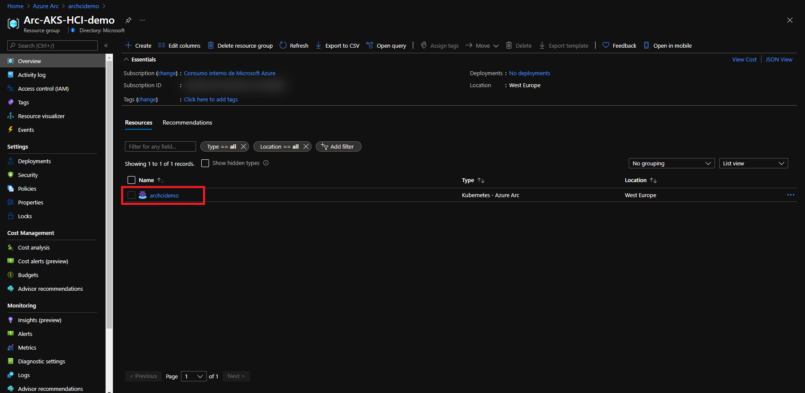
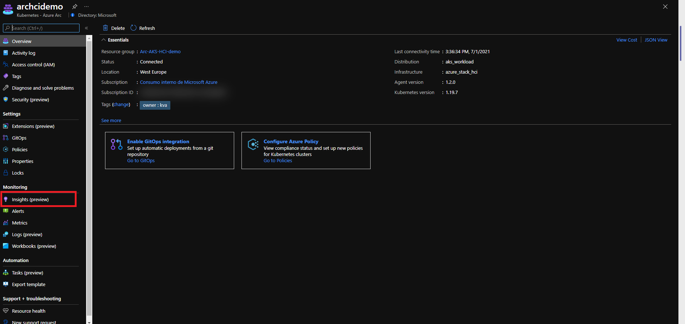
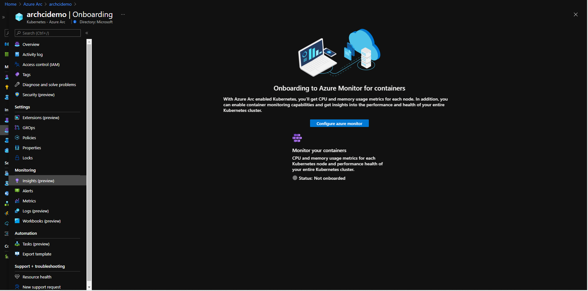
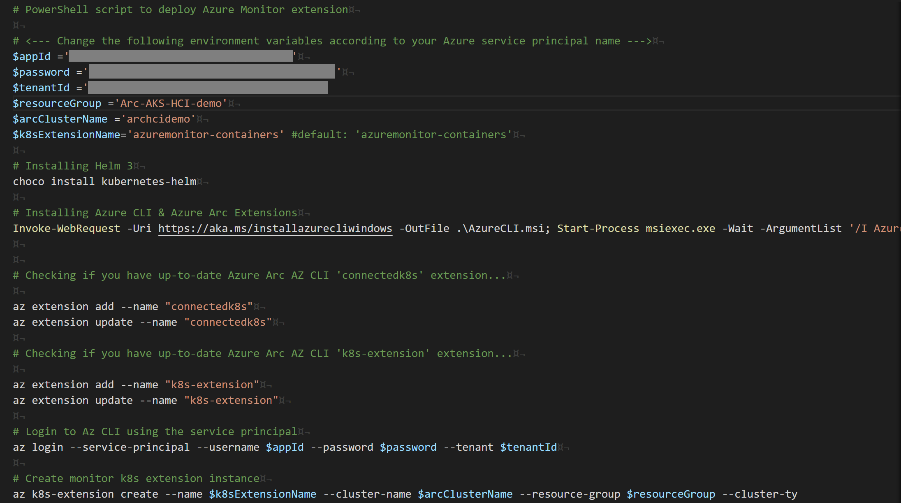
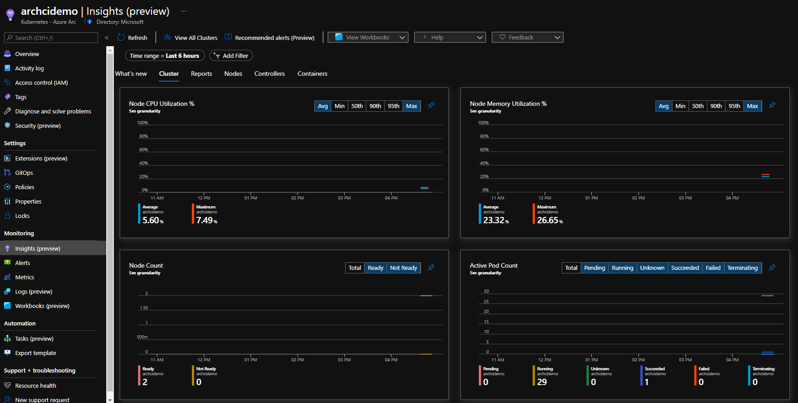

## Integrate Azure Monitor for Containers with AKS on Azure Stack HCI as an Azure Arc Connected Cluster using Kubernetes extensions

The following README will guide you on how to enable [Azure Monitor for Containers](https://docs.microsoft.com/en-us/azure/azure-monitor/insights/container-insights-overview) for an AKS cluster running on Azure Stack HCI that is projected as an Azure Arc connected cluster.

In this guide, you will hook the AKS cluster on HCI to Azure Monitor by deploying the [OMS agent](https://docs.microsoft.com/en-us/azure/azure-monitor/platform/log-analytics-agent) in order to start collecting telemetry.  

> **Note: This guide assumes you already deployed an AKS on HCI cluster and connected it to Azure Arc. If you haven't, this repository offers you a way to do so in an automated fashion using [PowerShell](https://azurearcjumpstart.io/azure_arc_jumpstart/azure_arc_k8s/aks_stack_hci/aks_hci_powershell/).**

Kubernetes extensions are add-ons for Kubernetes clusters. The extensions feature on Azure Arc-enabled Kubernetes clusters enables usage of Azure Resource Manager based APIs, CLI and portal UX for deployment of extension components (Helm charts in initial release) and will also provide lifecycle management capabilities such as auto/manual extension version upgrades for the extensions.

The commands below and the script described in this guide should be run on the management computer.

## Prerequisites

* Clone the Azure Arc Jumpstart repository

    ```shell
    git clone https://github.com/microsoft/azure_arc.git
    ```

* [Install or update Azure CLI to version 2.15.0 and above](https://docs.microsoft.com/en-us/cli/azure/install-azure-cli?view=azure-cli-latest). Use the below command to check your current installed version.

  ```shell
  az --version
  ```

* Create Azure service principal (SP)

    To be able to complete the scenario and its related automation, Azure service principal assigned with the “Contributor” role is required. To create it, login to your Azure account run the below command (this can also be done in [Azure Cloud Shell](https://shell.azure.com/)).

    ```shell
    az login
    az ad sp create-for-rbac -n "<Unique SP Name>" --role contributor
    ```

    For example:

    ```shell
    az ad sp create-for-rbac -n "http://AzureArcK8s" --role contributor
    ```

    Output should look like this:

    ```json
    {
    "appId": "XXXXXXXXXXXXXXXXXXXXXXXXXXXX",
    "displayName": "AzureArcK8s",
    "name": "http://AzureArcK8s",
    "password": "XXXXXXXXXXXXXXXXXXXXXXXXXXXX",
    "tenant": "XXXXXXXXXXXXXXXXXXXXXXXXXXXX"
    }
    ```

    > **Note: The Jumpstart scenarios are designed with as much ease of use in-mind and adhering to security-related best practices whenever possible. It is optional but highly recommended to scope the service principal to a specific [Azure subscription and resource group](https://docs.microsoft.com/en-us/cli/azure/ad/sp?view=azure-cli-latest) as well considering using a [less privileged service principal account](https://docs.microsoft.com/en-us/azure/role-based-access-control/best-practices)**

## Create Azure monitor extensions instance

To create a new extension Instance, we will use the _k8s-extension create_ command while passing in values for the mandatory parameters. This scenario provides you with the automation to deploy the Azure Monitor extension on your Azure Arc-enabled Kubernetes cluster

* Before integrating the cluster with Azure Monitor for Containers, click on the "Insights (preview)" blade for the connected Arc cluster to show how the cluster is not currently being monitored.

    

    

    

* Edit the environment variables in the [PowerShell script](https://raw.githubusercontent.com/microsoft/azure_arc/main/azure_arc_k8s_jumpstart/aks_stack_hci/monitor_extension/azure_monitor_k8s_extension.ps1) to match your environment parameters. After that run it using the ```.\azure_monitor_k8s_extension.ps1``` command.

    

    The script will:

  * Login to your Azure subscription using the SPN credentials
  * Add or Update your local _connectedk8s_ and _k8s-extension_ Azure CLI extensions
  * Create monitor k8s extension instance

* You can see that the monitoring is enabled once you visit the Container Insights section of the Azure Arc-enabled Kubernetes cluster resource in Azure.

    > **Note: As the OMS start collecting telemetry from the cluster nodes and pods, it will take 5-10min for data to start show up in the Azure Portal.**

* Click the "Connected Clusters" tab and see the Azure Arc connected cluster was added. Now that your cluster is being monitored, navigate through the different tabs and sections and watch the monitoring telemetry for the cluster nodes and pods.  



### Delete extension instance

The following command only deletes the extension instance, but doesn't delete the Log Analytics workspace. The data within the Log Analytics resource is left intact. You can visit the Insights seciton of Azure Arc resource in Azure Portal and can see the onboarding state as not connected.

```shell
az k8s-extension delete --name azuremonitor-containers --cluster-type connectedClusters --cluster-name <cluster-name> --resource-group <resource-group>
```

 
