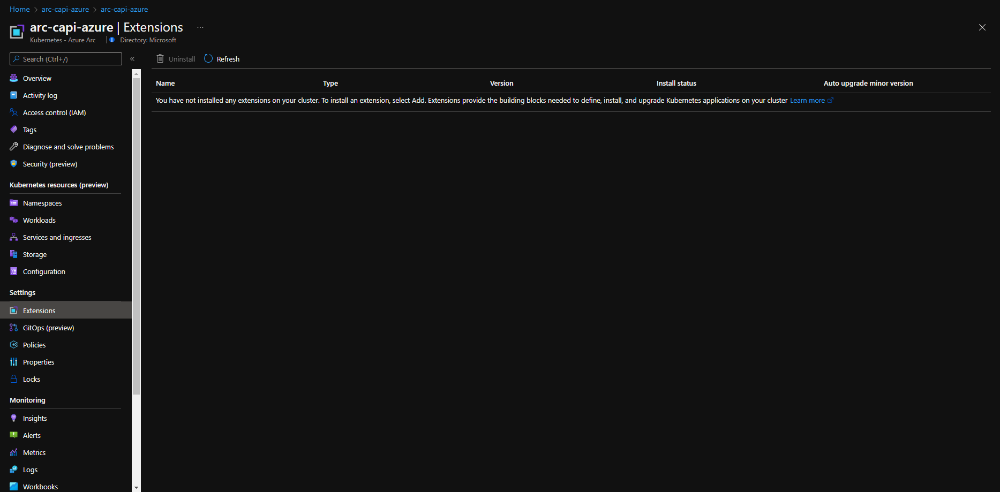
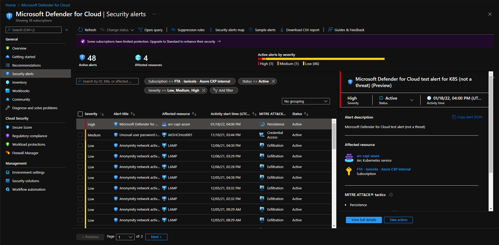
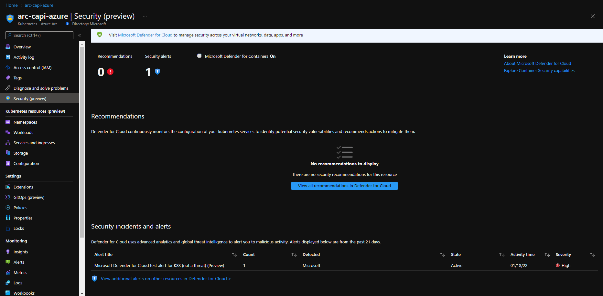

## Integrate Microsoft Defender for Cloud with Cluster API as an Azure Arc Connected Cluster using Kubernetes extensions

The following README will guide you on how to enable [Microsoft Defender for Cloud](https://docs.microsoft.com/en-us/azure/defender-for-cloud/defender-for-containers-introduction?tabs=defender-for-container-arch-aks) for a Cluster API that is projected as an Azure Arc-connected cluster.

In this guide, you will hook the Cluster API to Microsoft Defender for Cloud by deploying the [Defender extension](https://docs.microsoft.com/azure/defender-for-cloud/defender-for-containers-enable?tabs=aks-deploy-portal%2Ck8s-deploy-cli%2Ck8s-verify-cli%2Ck8s-remove-arc%2Caks-removeprofile-api#protect-arc-enabled-kubernetes-clusters) on your Kubernetes cluster in order to start collecting security related logs and telemetry.  

> **Note: This guide assumes you already deployed a Cluster API and connected it to Azure Arc. If you haven't, this repository offers you a way to do so in an automated fashion using a [Shell script](https://azurearcjumpstart.io/azure_arc_jumpstart/azure_arc_k8s/cluster_api/capi_azure/).**

Kubernetes extensions are add-ons for Kubernetes clusters. The extensions feature on Azure Arc-enabled Kubernetes clusters enables usage of Azure Resource Manager based APIs, CLI and portal UX for deployment of extension components (Helm charts in initial release) and will also provide lifecycle management capabilities such as auto/manual extension version upgrades for the extensions.

## Prerequisites

* Clone the Azure Arc Jumpstart repository

    ```shell
    git clone https://github.com/microsoft/azure_arc.git
    ```

* [Install or update Azure CLI to version 2.25.0 and above](https://docs.microsoft.com/en-us/cli/azure/install-azure-cli?view=azure-cli-latest). Use the below command to check your current installed version.

  ```shell
  az --version
  ```

* Create Azure service principal (SP). To deploy this scenario, an Azure service principal assigned with multiple RBAC roles is required:

  * "Contributor" - Required for provisioning Azure resources
  * "Security admin" - Required for installing Cloud Defender Azure-Arc enabled Kubernetes extension and dismiss alerts
  * "Security reader" - Required for being able to view Azure-Arc enabled Kubernetes Cloud Defender extension findings

    To create it login to your Azure account run the below command (this can also be done in [Azure Cloud Shell](https://shell.azure.com/).

    ```shell
    az login
    az ad sp create-for-rbac -n "<Unique SP Name>" --role "Contributor"
    az ad sp create-for-rbac -n "<Unique SP Name>" --role "Security admin"
    az ad sp create-for-rbac -n "<Unique SP Name>" --role "Security reader"
    ```

    For example:

    ```shell
    az ad sp create-for-rbac -n "JumpstartArcK8s" --role "Contributor"
    az ad sp create-for-rbac -n "JumpstartArcK8s" --role "Security admin"
    az ad sp create-for-rbac -n "JumpstartArcK8s" --role "Security reader"
    ```

    Output should look like this:

    ```json
    {
    "appId": "XXXXXXXXXXXXXXXXXXXXXXXXXXXX",
    "displayName": "AzureArcAppK8s",
    "name": "http://AzureArcAppK8s",
    "password": "XXXXXXXXXXXXXXXXXXXXXXXXXXXX",
    "tenant": "XXXXXXXXXXXXXXXXXXXXXXXXXXXX"
    }
    ```

    > **Note: The Jumpstart scenarios are designed with as much ease of use in-mind and adhering to security-related best practices whenever possible. It is optional but highly recommended to scope the service principal to a specific [Azure subscription and resource group](https://docs.microsoft.com/en-us/cli/azure/ad/sp?view=azure-cli-latest) as well considering using a [less privileged service principal account](https://docs.microsoft.com/en-us/azure/role-based-access-control/best-practices)**

## Automation Flow

For you to get familiar with the automation and deployment flow, below is an explanation.

* User has deployed Kubernetes using Cluster API and has it connected as Azure Arc-enabled Kubernetes cluster.

* User is editing the environment variables on the Shell script file (1-time edit) which then be used throughout the extension deployment.

* User is running the shell script. The script will use the extension management feature of Azure Arc to deploy the Microsoft Defender for Cloud extension on the Azure Arc connected cluster.

* User is veryfing the cluster is shown in Microsoft Defender for Cloud and that the extension is deployed.

* User is simulating a security alert on the Kubernetes cluster that will cause Microsoft Defender for Cloud to detect this activity and trigger a security alert.

## Create Defender extensions instance

To create a new extension Instance, we will use the _k8s-extension create_ command while passing in values for the mandatory parameters. This scenario provides you with the automation to deploy the Microsoft Defender for Containers extension on your Azure Arc-enabled Kubernetes cluster.

* Before integrating the cluster with Microsoft Defender for Cloud, click on the "Security (preview)" blade for the connected Azure Arc cluster to show how the cluster is not currently being assessed by Microsoft Defender for Cloud.

    

    

* Edit the environment variables in [the script](https://raw.githubusercontent.com/microsoft/azure_arc/main/azure_arc_k8s_jumpstart/cluster_api/capi_defender_extension/azure_defender_k8s_extension.sh) to match your environment parameters followed by running the ```. ./azure_defender_k8s_extension.sh``` command.

    

    > **Note: The extra dot is due to the shell script has an *export* function and needs to have the vars exported in the same shell session as the rest of the commands.**

   The script will:

  * Login to your Azure subscription using the SPN credentials
  * Add or Update your local _connectedk8s_ and _k8s-extension_ Azure CLI extensions
  * Create Defender k8s extension instance

* You can see that Microsoft Defender for Cloud is enabled once you visit the security tab section of the Azure Arc-enabled Kubernetes cluster resource in Azure.


* Also verify under the Extensions section of the Azure Arc-enabled Kubernetes cluster that the Defender extension is correctly installed.


* You can also verify the deployment by running the command below:

```bash
kubectl get pods -n azuredefender --kubeconfig <cluster-name>.kubeconfig
```


## Simulate a security alert

To verify that Microsoft Defender for Cloud is working properly and alerting on security threats, run the below command to simulate an alert:

```bash
kubectl get pods --namespace=asc-alerttest-662jfi039n --kubeconfig <cluster-name>.kubeconfig
```

Within 30 minutes Microsoft Defender for Cloud will detect this event and trigger a security alert that you wil see in the Azure Portal under Microsoft Defender for Cloud's security alerts and also on the security tab of your Azure Arc-enabled cluster.






### Delete extension instance

The following command only deletes the extension instance, but doesn't delete the Log Analytics workspace or disables Microsoft Defender for Cloud.

```bash
az k8s-extension delete --name microsoft.azuredefender.kubernetes --cluster-type connectedClusters --cluster-name <cluster-name> --resource-group <resource-group>
```
