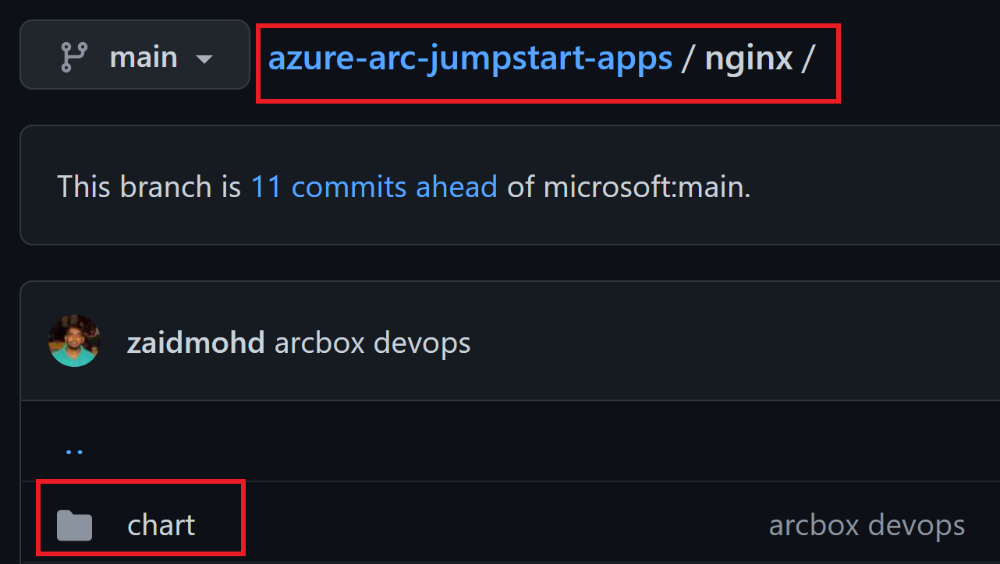
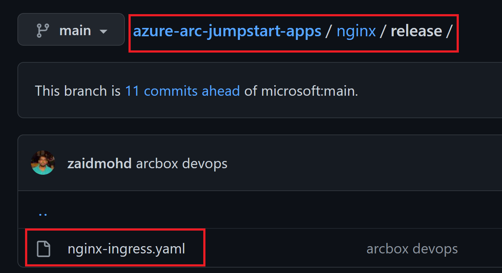
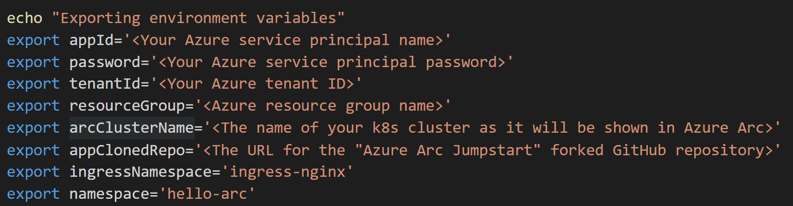
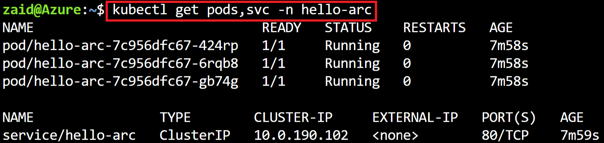
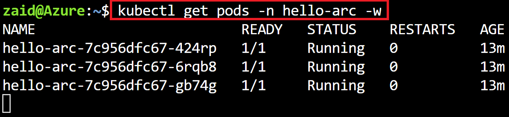
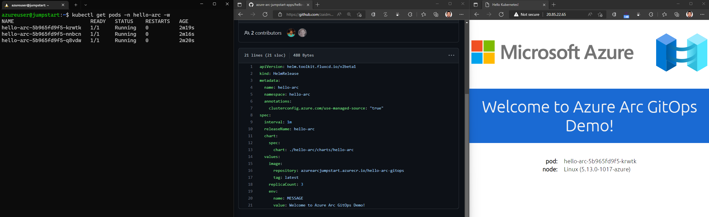

## Deploy GitOps configurations and perform Helm-based GitOps flow on Cluster API as an Azure Arc Connected Cluster (Flux v2)

The following README will guide you on how to create [Helm](https://helm.sh/)-based GitOps configuration on a Cluster API which is projected as an Azure Arc-connected cluster resource.

In this guide, you will deploy & attach two GitOps configurations to your cluster, a cluster-level config to deploy [nginx-ingress controller](https://kubernetes.github.io/ingress-nginx/) and a namespace-level config to deploy the "Hello World" Azure Arc web application on your Kubernetes cluster. By doing so, you will be able to make real-time changes to the application and show how the GitOps flow takes effect.

GitOps on Azure Arc-enabled Kubernetes uses [Flux](https://fluxcd.io/docs/), a popular open-source toolset. Flux is a tool for keeping Kubernetes clusters in sync with sources of configuration (like Git repositories) and automating updates to the configuration when there is new code to deploy. The Flux toolkit component Helm Controller is a Kubernetes operator, allowing one to declaratively manage Helm chart releases with Kubernetes manifests. The Operator is aware of the “HelmRelease” Custom Resource Definition (CRD). This HelmRelease points to a helm chart in a git repo and can optionally contain specific values to input into the helm chart.

> **NOTE: This guide assumes you already deployed a Cluster API and connected it to Azure Arc. If you haven't, this repository offers you a way to do so in an automated fashion using a [Shell script](https://azurearcjumpstart.io/azure_arc_jumpstart/azure_arc_k8s/cluster_api/capi_azure/).**

## Prerequisites

- Fork the ["Azure Arc Jumpstart Apps"](https://github.com/microsoft/azure-arc-jumpstart-apps) repository. In this guide, you will be making changes on your own forked repository to initiate the GitOps flow.

- Clone the forked Azure Arc Jumpstart repository.

    For example:

    ```shell
    git clone https://github.com/**zaidmohd**/azure-arc-jumpstart-apps.git
    ```

- (Optional) Install the "Tab Auto Refresh" extension for your browser. This will help you to show the real-time changes on the application in an automated way.

  - [Microsoft Edge](https://microsoftedge.microsoft.com/addons/detail/odiofbnciojkpogljollobmhplkhmofe)

  - [Google Chrome](https://chrome.google.com/webstore/detail/tab-auto-refresh/jaioibhbkffompljnnipmpkeafhpicpd?hl=en)

  - [Mozilla Firefox](https://addons.mozilla.org/en-US/firefox/addon/tab-auto-refresh/)

- As mentioned, this guide starts at the point where you already have a Cluster API projected as an Azure Arc connected cluster.

    

    

- [Install or update Azure CLI to version 2.25.0 and above](https://docs.microsoft.com/en-us/cli/azure/install-azure-cli?view=azure-cli-latest). Use the below command to check your current installed version.

  ```shell
  az --version
  ```

- Create Azure service principal (SP)

    To be able to complete the scenario and its related automation, Azure service principal assigned with the “Contributor” role is required. To create it, login to your Azure account run the below command (this can also be done in [Azure Cloud Shell](https://shell.azure.com/)).

    ```shell
    az login
    az ad sp create-for-rbac -n "<Unique SP Name>" --role contributor
    ```

    For example:

    ```shell
    az ad sp create-for-rbac -n "http://AzureArcK8s" --role contributor
    ```

    Output should look like this:

    ```json
    {
    "appId": "XXXXXXXXXXXXXXXXXXXXXXXXXXXX",
    "displayName": "AzureArcK8s",
    "name": "http://AzureArcK8s",
    "password": "XXXXXXXXXXXXXXXXXXXXXXXXXXXX",
    "tenant": "XXXXXXXXXXXXXXXXXXXXXXXXXXXX"
    }
    ```

    > **NOTE: The Jumpstart scenarios are designed with as much ease of use in-mind and adhering to security-related best practices whenever possible. It is optional but highly recommended to scope the service principal to a specific [Azure subscription and resource group](https://docs.microsoft.com/en-us/cli/azure/ad/sp?view=azure-cli-latest) as well considering using a [less privileged service principal account](https://docs.microsoft.com/en-us/azure/role-based-access-control/best-practices)**

## Automation Flow

For you to get familiar with the automation and deployment flow, below is an explanation.

- User is editing the environment variables in the Shell script file (1-time edit) which then be used throughout the GitOps configuration.

- User is running the shell script. The script will use the extension management feature of Azure Arc to deploy the Flux extension and create GitOps configurations on the Azure Arc-connected Kubernetes cluster.

- The GitOps configurations will create the namespace, deploy NGINX Ingress controller and Hello-Arc application

- User is verifying the cluster and making sure the extension and GitOps configuration is deployed.

- User is making an edit on the GitHub repo that will cause Flux GitOps to detect this change and trigger an update to the pod deployment.

## Azure Arc Kubernetes GitOps Configuration

To create the GitOps Configuration, we will use the _`k8s-configuration flux create`_ command while passing in values for the mandatory parameters. This scenario provides you with the automation to configure the GitOps on your Azure Arc-enabled Kubernetes cluster.

> **NOTE: Before configuring GitOps, make sure that the _kubectl_ context is pointing to your Azure Arc-enabled Kubernetes cluster. To do that, you can refer to the [official Kubernetes documentation](https://kubernetes.io/docs/tasks/access-application-cluster/configure-access-multiple-clusters/) to find the options to change the kubecontext to different Kubernetes clusters.**


- In the screenshot below, notice how currently there is no GitOps configuration in your Arc-enabled Kubernetes cluster.

    

## Cluster-level Config vs. Namespace-level Config

### Cluster-level Config

With Cluster-level GitOps config, the goal is to have "horizontal components" or "management components" deployed on your Kubernetes cluster which will then be used by your applications. Good examples are Service Mesh, security products, monitoring solutions, etc. A very popular example will also be ingress controllers, which is exactly the Nginx ingress controller we will deploy in the next section.

### Namespace-level Config

With Namespace-level GitOps config, the goal is to have Kubernetes resources deployed only in the namespace selected. The most obvious use-case here is simply your application and its respective pods, services, ingress routes, etc. In the next section, will have the "Hello Arc" application deployed on a dedicated namespace.

- Download [the script](https://github.com/microsoft/azure_arc/blob/main/azure_arc_k8s_jumpstart/cluster_api/gitops/helm/az_k8sconfig_helm_capi.sh) using below command

    ```shell
    curl -L https://raw.githubusercontent.com/microsoft/azure_arc/main/azure_arc_k8s_jumpstart/cluster_api/gitops/helm/az_k8sconfig_helm_capi.sh -o ~/az_k8sconfig_helm_capi.sh
    ```

- Edit the environment variables to match your environment parameters followed by running the _`. ./az_k8sconfig_helm_capi.sh`_ command.

    

    For example:

    

    > **NOTE: The extra dot is due to the shell script having an *export* function and needs to have the vars exported in the same shell session as the rest of the commands.**

    The script will:

  - Log in to your Azure subscription using the SPN credentials
  - Retrieve the cluster credentials (KUBECONFIG)
  - Create the GitOps configurations to deploy the Flux controllers and NGINX ingress controller on the Azure Arc-connected cluster
  - Create the GitOps configurations to deploy the ["Hello Arc"](https://github.com/microsoft/azure-arc-jumpstart-apps/blob/main/hello-arc) application alongside an Ingress rule to make it available from outside the cluster

    > **Disclaimer: For the purpose of this guide, notice how the "_sync-interval 3s_" is set. The 3 seconds interval is useful for demo purposes since it will make the sync interval rapidly track changes on the repository but it is recommended to have a longer interval in your production environment (default value is 5min)**

- Once the script will complete it's run, you will have the GitOps configuration create all the resources deployed in your Kubernetes cluster. Note that it takes a few min for the configuration change status from "Pending" to Install.

    

    

    

    

## The "Hello Arc" Application & Components

- Before kicking off the GitOps flow, let's verify and "zoom in" to the Kubernetes resources deployed by running a few _kubectl_ commands.

- Show the Flux operator pods.

    ```shell
    kubectl get pods -n flux-system 
    ```

    

- Show 3 replicas of the "Hello Arc" application and the NGINX controller.

    ```shell
    kubectl get pods -n hello-arc
    ```

    

- Show NGINX controller Kubernetes Service (Type _LoadBalancer_).

    ```shell
    kubectl get svc -n hello-arc
    ```

    

- Show NGINX rule which will route the traffic to the "Hello Arc" application from outside the cluster.

    ```shell
    kubectl get ing -n hello-arc
    ```

    

- The GitOps flow works as follow:

    1. The Flux operator holds the "desired state" for both the NGINX Ingress Controller and the "Hello Arc" Helm releases, this is the configuration we deployed against the Azure Arc connected cluster. The operator "polls" the state of the ["Hello Arc"](https://github.com/microsoft/azure-arc-jumpstart-apps/blob/main/hello-arc) application repository.

    2. Changing the application, which is considered to be a new version of it, will trigger the Flux operator to kick in the GitOps flow.

    3. A new Kubernetes pod with the new version of the application will be deployed on the cluster. Once the new pods are successfully deployed, the old one will be terminated (rolling upgrade).

- To show the above flow, open 2 (ideally 3) side-by-side browser windows:

  - Shell running the command
  
      ```shell
      kubectl get pods -n hello-arc -w
      ```
  
    

  - In **your fork** of the "Azure Arc Jumpstart App" repository, open the *hello_arc.yaml* file (/hello-arc/releases/app/hello_arc.yaml).

  - The external IP address of the Kubernetes Service is seen using the _`kubectl get svc -n hello-arc`_ command.

    

  - End result should look like that:

    

- As mentioned in the prerequisites section, it is optional but highly recommended to configure the "Tab Auto Refresh" extension for your browser. If you did, in the "Hello Arc" application window, configure it to refresh every 2 seconds.

    

- In the repository window showing the _hello_arc.yaml_ file, change the text under the "MESSAGE" section commit the change. Alternatively, you can open your cloned repository in your IDE, make the change, commit and push it.

    

    

- Upon committing the changes, notice how the Kubernetes Pod rolling upgrade will start. Once the Pod is up & running, the new "Hello Arc" application version window will show the new message, showing the rolling upgrade is completed and the GitOps flow is successful.

    
