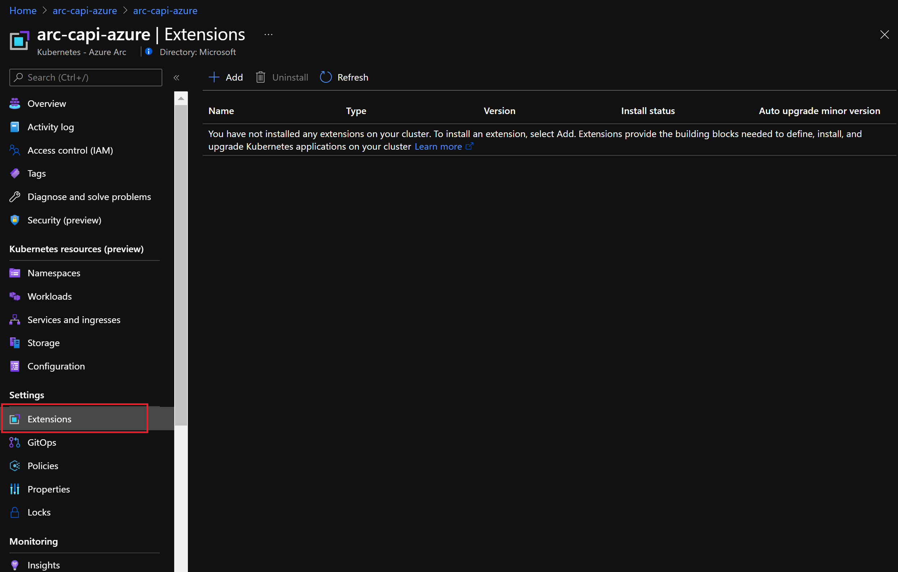

## Integrate Azure Key Vault with Cluster API as an Azure Arc Connected Cluster using Kubernetes extensions

The following README will guide you on how to enable [Azure Key Vault](https://docs.microsoft.com/en-us/azure/key-vault/general/overview) for a Cluster API that is projected as an Azure Arc connected cluster.

In this guide, you will hook the Cluster API to Azure Key Vault by deploying the Azure Key Vault extension and a sample app on your Kubernetes cluster in order to integrate Azure Key Vault as a secrets store with a Kubernetes cluster via a [Container Storage Interface (CSI)](https://kubernetes-csi.github.io/docs/) volume. This will also include deploying a Key Vault and sample secret on your Azure subscription.

> **Note: This guide assumes you already deployed a Cluster API and connected it to Azure Arc. If you haven't, this repository offers you a way to do so in an automated fashion using a [Shell script](https://azurearcjumpstart.io/azure_arc_jumpstart/azure_arc_k8s/cluster_api/capi_azure/).**

Kubernetes extensions are add-ons for Kubernetes clusters. The extensions feature on Azure Arc-enabled Kubernetes clusters enables usage of Azure Resource Manager based APIs, CLI, and portal UX for the deployment of extension components (Helm charts in initial release) and will also provide lifecycle management capabilities such as auto/manual extension version upgrades for the extensions.

## Prerequisites

- Clone the Azure Arc Jumpstart repository

    ```shell
    git clone https://github.com/microsoft/azure_arc.git
    ```

- [Install or update Azure CLI to version 2.25.0 and above](https://docs.microsoft.com/en-us/cli/azure/install-azure-cli?view=azure-cli-latest). Use the below command to check your current installed version.

  ```shell
  az --version
  ```

- Create Azure service principal (SP)

    To be able to complete the scenario and its related automation, Azure service principal assigned with the “Contributor” role is required. To create it, login to your Azure account run the below command (this can also be done in [Azure Cloud Shell](https://shell.azure.com/)).

    ```shell
    az login
    az ad sp create-for-rbac -n "<Unique SP Name>" --role contributor
    ```

    For example:

    ```shell
    az ad sp create-for-rbac -n "http://AzureArcK8s" --role contributor
    ```

    Output should look like this:

    ```json
    {
    "appId": "XXXXXXXXXXXXXXXXXXXXXXXXXXXX",
    "displayName": "AzureArcK8s",
    "name": "http://AzureArcK8s",
    "password": "XXXXXXXXXXXXXXXXXXXXXXXXXXXX",
    "tenant": "XXXXXXXXXXXXXXXXXXXXXXXXXXXX"
    }
    ```

    > **Note: The Jumpstart scenarios are designed with as much ease of use in-mind and adhering to security-related best practices whenever possible. It is optional but highly recommended to scope the service principal to a specific [Azure subscription and resource group](https://docs.microsoft.com/en-us/cli/azure/ad/sp?view=azure-cli-latest) as well considering using a [less privileged service principal account](https://docs.microsoft.com/en-us/azure/role-based-access-control/best-practices)**

## Automation Flow

For you to get familiar with the automation and deployment flow, below is an explanation.

- User has deployed the Kubernetes cluster using Cluster API and has it connected as Azure Arc-enabled Kubernetes cluster.

- User is editing the environment variables in the Shell script file (1-time edit) which then be used throughout the extension deployment.

- User is running the shell script. The script will use the extension management feature of Azure Arc to deploy the Azure Key Vault Secrets Provider extension on the Azure Arc connected cluster.

- The script will also deploy the Key Vault, sample secret to Azure Subscription, and a sample app to Azure Arc-enabled Kubernetes cluster

- User is verifying the cluster and making sure the extension is deployed.

- User is checking the secret value mounted in a Kubernetes pod.

## Create Azure Key Vault extensions instance

To create a new extension Instance, we will use the _k8s-extension create_ command while passing in values for the mandatory parameters. This scenario provides you with the automation to deploy the Azure Key Vault extension on your Azure Arc-enabled Kubernetes cluster.

> **Note: Before installing the Key Vault extension, make sure that the _kubectl_ context is pointing to your Azure Arc-enabled Kubernetes cluster. To do that, you can refer to the [official Kubernetes documentation](https://kubernetes.io/docs/tasks/access-application-cluster/configure-access-multiple-clusters/) to find the options to change the kubecontext to different Kubernetes clusters.**


* In the screenshot below, notice how currently there are no extensions installed yet in your Arc-enabled Kubernetes cluster.

    

- Edit the environment variables in the script to match your environment parameters followed by running the ```. ./azure_keyvault_k8s_extension.sh``` command.

    

    > **Note: The extra dot is due to the shell script has an *export* function and needs to have the vars exported in the same shell session as the rest of the commands.**

   The script will:

  - Login to your Azure subscription using the SPN credentials
  - Add or Update your local _connectedk8s_ and _k8s-extension_ Azure CLI extensions
  - Create Resource Group, Key Vault and a sample secret
  - Create Azure Key Vault k8s extension instance
  - Create Kubernetes Secret for supporting SPN Authentication
  - Create Secret Provider Class to read the secrets
  - Deploy the app

- You can now see that Azure Key Vault extensions are now enabled in the extension tab section of the Azure Arc-enabled Kubernetes cluster resource in Azure.

    

- You can also verify the deployment by running the below _kubectl_ commands and seeing the deployed artifacts in the _kube-system_ namespace.

    ```shell
    kubectl get pods,secret -n hello-arc
    kubectl get secretproviderclass -n hello-arc

    kubectl get customresourcedefinitions \
    secretproviderclasses.secrets-store.csi.x-k8s.io \
    secretproviderclasspodstatuses.secrets-store.csi.x-k8s.io
    ```

    

    

## Validate the Secrets

* To verify that Azure Key Vault Secret Provider is working properly and fetching the secrets, run the below command to show secrets held in secrets-store:

    ```shell
    kubectl -n hello-arc exec busybox-secrets-sync -- ls /mnt/secrets-store/
    ```

    

* Run the below command to print a test secret held in secrets-store:

    ```shell
    kubectl -n hello-arc exec busybox-secrets-sync -- sh -c 'echo $SECRET_USERNAME'
    ```

    

## Delete extension instance

* The following command only deletes the extension instance.

    ```shell
    az k8s-extension delete --name <extension-name> --cluster-type connectedClusters --cluster-name <cluster-name> --resource-group <resource-group>
    ```

* You can also delete the extension from the Azure Portal under the extensions section of Azure Arc-enabled Kubernetes cluster resource.

    
