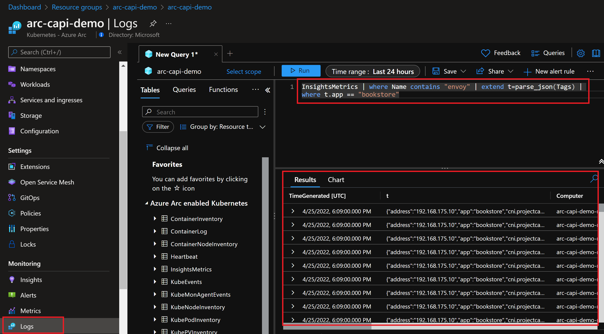

## Integrate Open Service Mesh (OSM) with Cluster API as an Azure Arc Connected Cluster using Kubernetes extensions

The following README will guide you on how to enable [Open Service Mesh](https://openservicemesh.io/) for a Cluster API that is projected as an Azure Arc connected cluster. Open Service Mesh (OSM) is a lightweight, extensible, Cloud Native service mesh that allows users to uniformly manage, secure, and get out-of-the-box observability features for highly dynamic microservice environments.

In this guide, you will hook the Cluster API to Open Service Mesh by deploying the [Open Service Mesh extension](https://aka.ms/arc-osm-doc) on your Kubernetes cluster in order to start collecting security-related logs and telemetry. Arc-enabled Open Service Mesh will have deep integrations into Azure monitor, and provide a seamless Azure experience for viewing and responding to critical KPIs provided by OSM metrics. This guide also provides you the automation to test Azure monitor integration with Arc-enabled Open Service Mesh.

> **Note: Currently, Azure Arc-enabled Open Service Mesh is in [public preview](https://aka.ms/arc-osm-doc)**.

> **Note: This guide assumes you already deployed a Cluster API and connected it to Azure Arc. If you haven't, this repository offers you a way to do so in an automated fashion using a [Shell script](https://azurearcjumpstart.io/azure_arc_jumpstart/azure_arc_k8s/cluster_api/capi_azure/).**

Kubernetes extensions are add-ons for Kubernetes clusters. The extensions feature on Azure Arc-enabled Kubernetes clusters enables usage of Azure Resource Manager based APIs, CLI, and portal UX for the deployment of extension components (Helm charts in initial release) and will also provide lifecycle management capabilities such as auto/manual extension version upgrades for the extensions.

## Prerequisites

* Clone the Azure Arc Jumpstart repository

    ```shell
    git clone https://github.com/microsoft/azure_arc.git
    ```

* [Install or update Azure CLI to version 2.25.0 and above](https://docs.microsoft.com/en-us/cli/azure/install-azure-cli?view=azure-cli-latest). Use the below command to check your current installed version.

  ```shell
  az --version
  ```

* Create Azure service principal (SP)

    To be able to complete the scenario and its related automation, Azure service principal assigned with the “Contributor” role is required. To create it, login to your Azure account run the below command (this can also be done in [Azure Cloud Shell](https://shell.azure.com/)).

    ```shell
    az login
    az ad sp create-for-rbac -n "<Unique SP Name>" --role contributor
    ```

    For example:

    ```shell
    az ad sp create-for-rbac -n "http://AzureArcK8s" --role contributor
    ```

    Output should look like this:

    ```json
    {
    "appId": "XXXXXXXXXXXXXXXXXXXXXXXXXXXX",
    "displayName": "AzureArcK8s",
    "name": "http://AzureArcK8s",
    "password": "XXXXXXXXXXXXXXXXXXXXXXXXXXXX",
    "tenant": "XXXXXXXXXXXXXXXXXXXXXXXXXXXX"
    }
    ```

    > **Note: The Jumpstart scenarios are designed with as much ease of use in-mind and adhering to security-related best practices whenever possible. It is optional but highly recommended to scope the service principal to a specific [Azure subscription and resource group](https://docs.microsoft.com/en-us/cli/azure/ad/sp?view=azure-cli-latest) as well considering using a [less privileged service principal account](https://docs.microsoft.com/en-us/azure/role-based-access-control/best-practices)**

## Automation Flow

For you to get familiar with the automation and deployment flow, below is an explanation.

* User has deployed Kubernetes using Cluster API and has it connected as Azure Arc-enabled Kubernetes cluster.

* User is editing the environment variables on the Shell script file (1-time edit) which then be used throughout the extension deployment.

* User will set the current kubectl context to the connected Azure Arc-enabled Kubernetes cluster.

* User is running the shell script. The script will use the extension management feature of Azure Arc to deploy the Open Service Mesh extension and Azure monitor extension on the Azure Arc connected cluster.

* The script will also deploy the sample app (bookstore) to Azure Arc-enabled Kubernetes cluster and onboard the app namespaces with OSM to monitor.

* User is verifying the cluster and make sure OSM extension enabled.

* User check the monitoring insights to confirm OSM start capturing the logs and metrics from the custom app sending it over to Azure Monitor.

## Create Open Service Mesh and Azure Monitor extension instances with sample app

To create a new extension Instance, we will use the _k8s-extension create_ command while passing in values for the mandatory parameters. This scenario provides you with the automation to deploy the Open Service Mesh extension on your Azure Arc-enabled Kubernetes cluster.

> **Note: Before installing the Open Service Mesh extension, make sure that the kubectl context is pointing to your Azure Arc-enabled Kubernetes cluster. To do that, you can refer to the [official Kubernetes documentation](https://kubernetes.io/docs/tasks/access-application-cluster/configure-access-multiple-clusters/) to find the options to change the kubecontext to different Kubernetes clusters.**


* In the screenshot below, notice how currently there are no extensions installed yet in your Arc-enabled Kubernetes cluster.

  

* Edit the environment variables in the [_capi_osm_extension.sh_](https://github.com/microsoft/azure_arc/blob/main/azure_arc_k8s_jumpstart/cluster_api/capi_osm_extension/capi_osm_extension.sh) shell script to match your environment parameters followed by running the ```. ./capi_osm_extension.sh``` command.

  

  > **Note: The extra dot is due to the shell script has an *export* function and needs to have the vars exported in the same shell session as the rest of the commands.**

  The script will:

  * Login to your Azure subscription using the SPN credentials
  * Add or Update your local _connectedk8s_ and _k8s-extension_ Azure CLI extensions
  * Create Open Service Mesh k8s extension instance
  * Create Azure Monitor k8s extension instance
  * Download and install OSM cli locally
  * Create four namespaces in kubernetes to deploy a test app
  * Onboard the Namespaces to the OSM Mesh and enable sidecar injection on the namespaces
  * Enable metrics for pods belonging to app namespaces
  * Update the namespaces to be monitored by modifying the configmap provided by the OSM
  * Deploy the apps to the namespaces

* You can now see that Open Service Mesh & Azure Monitor for containers extensions are now enabled in the extension tab section of the Azure Arc-enabled Kubernetes cluster resource in Azure.

  

* You can also verify the deployment by running the below _kubectl_ commands and see the deployed artifacts in the _arc-osm-system_ namespace.

  

* It can take ~15 minutes before you will be able to verify the integration and monitoring insights coming from OSM to Azure Monitor by following the below steps in the Azure portal.

  * Verify the namespaces are showing up in the insights section of the Arc-enabled Kubernetes resource in Azure portal.

    

  * Verify if monitoring working correctly by query the logs for pulling the data from the InsightsMetrics schema.
  
    ```console
    InsightsMetrics | where Name contains "envoy" | extend t=parse_json(Tags) | where t.app == "bookstore"
    ```

    

  * You can also navigate to the "Reports" tabs in the Insights section and see the OSM dashboard report got added.

    > **Disclaimer: This feature is under preview and in order to view the OSM report template you have to access the portal with a query string _"?feature.includePreviewTemplates=true"_ or directly accessing the Azure portal using the following [link](https://aka.ms/azmon/osmux).**

    

### Delete extension instances

* The following command only deletes the extension instances but doesn't delete the Log Analytics workspace.

    ```shell
    az k8s-extension delete --cluster-type connectedClusters --cluster-name <name of the cluster> --resource-group <name of the resource group> --name <name of the extension> -y
    ```

* You can also delete the extensions from the Azure Portal under the extensions section of Azure Arc-enabled Kubernetes cluster resource.

  
