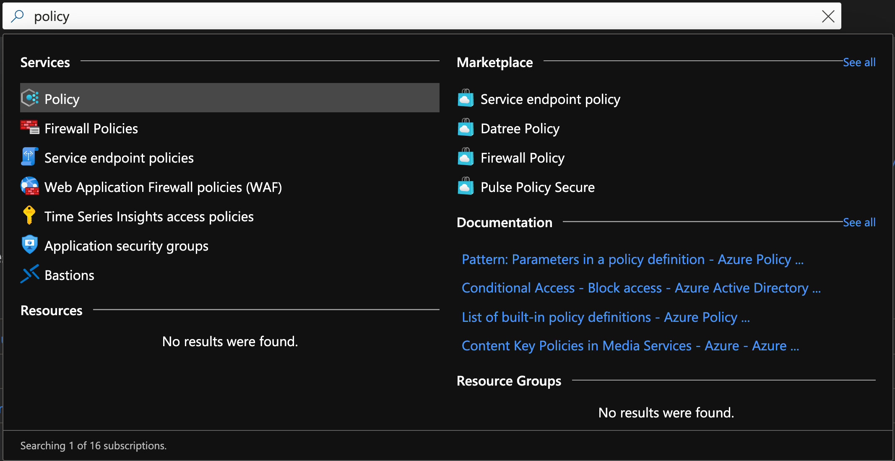
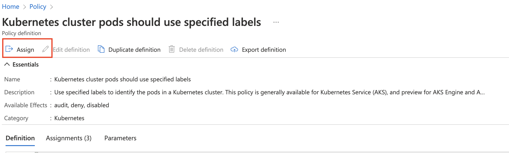
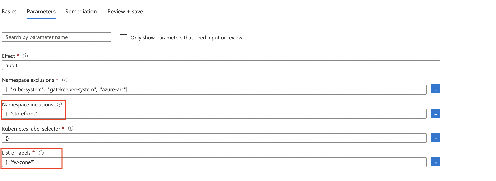
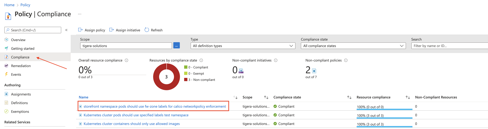
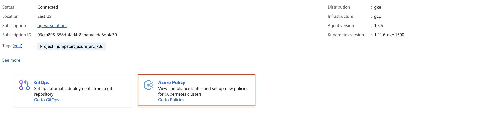
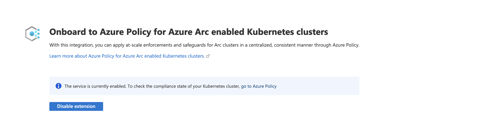

## Use the Azure Policy on a Azure-Arc enabled Kubernetes cluster for applying ingress/egress rules

 > **Disclaimer: This scenario was contributed by the Platform9 team as part of the "Jumpstart Friends" program**

<p align="center"></p>

The following README will guide you on how to use a Azure Policy [Azure Policy for Kubernetes](https://docs.microsoft.com/en-us/azure/governance/policy/concepts/policy-for-kubernetes#:~:text=Azure%20Policy%20extends%20Gatekeeper%20v3,Kubernetes%20clusters%20from%20one%20place.) on an Azure Arc-connected Kubernetes cluster to audit/enforce label for pods as [network policy](https://projectcalico.docs.tigera.io/about/about-network-policy) are applied to pods using label selectors.

> **Note: This guide assumes you already deployed an Amazon Elastic Kubernetes Service (EKS) or Google Kubernetes Engine (GKE) cluster and connected it to Azure Arc. If you haven't, this repository offers you a way to do so in an automated fashion using these couple of Jumpstart scenarios:**

- [Deploy EKS cluster and connect it to Azure Arc using Terraform](https://azurearcjumpstart.io/azure_arc_jumpstart/azure_arc_k8s/eks/eks_terraform/)
- [Deploy GKE cluster and connect it to Azure Arc using Terraform](https://azurearcjumpstart.io/azure_arc_jumpstart/azure_arc_k8s/gke/gke_terraform/)

> **Note: This guide assumes you already deployed Calico network policy in your cluster. If you haven't, you can use our installation for Calico open source or Calico Cloud:**

- [Deploy Calico open source in your managed public cluster](https://projectcalico.docs.tigera.io/getting-started/kubernetes/managed-public-cloud/)
- [Deploy Calico Cloud in your managed public cluster](https://projectcalico.docs.tigera.io/calico-enterprise/)

Calico Network Policy uses labels to select pods in Kubernetes for applying ingress/egress rules.
In this scenario, we will be using Azure Policy on an Azure-Arc enabled Kubernetes cluster to check whether the “fw-zone” label is present on pods in the “storefront” namespace, and how pods' labels impact network policy enforcement.
The policy will be set to “Audit” mode to check the configuration of existing clusters (it can also be set to “Deny” mode to avoid any future misconfigurations)

## Prerequisites

- Clone the Azure Arc Jumpstart repository

    ```shell
    git clone https://github.com/microsoft/azure_arc.git
    ```

- [Install or update Azure CLI to version 2.25.0 and above](https://docs.microsoft.com/en-us/cli/azure/install-azure-cli?view=azure-cli-latest). Use the below command to check your current installed version.

  ```shell
  az --version
  ```

- As mentioned, this guide starts at the point where you already have a connected EKS/GKE cluster to Azure Arc.

    

    

- Before installing the Azure Policy Add-on or enabling any of the service features, your subscription must enable the _Microsoft.PolicyInsights_ resource provider and create a role assignment for the cluster service principal. To do that, open [Azure Cloud Shell](https://shell.azure.com/) and run either the Azure CLI or PowerShell command.

    

    Azure CLI:

    ```shell
    az provider register --namespace 'Microsoft.PolicyInsights'
    ```

    PowerShell:

    ```powershell
    Register-AzResourceProvider -ProviderNamespace 'Microsoft.PolicyInsights'
    ```

    To verify successful registration, run either the below Azure CLI or PowerShell command.

    Azure CLI:

    ```shell
    az provider show --namespace 'Microsoft.PolicyInsights'
    ```

    PowerShell:

    ```powershell
    Get-AzResourceProvider -ProviderNamespace 'Microsoft.PolicyInsights'
    ```

    

- Azure Policy installed in Azure Arc-Connected Cluster

  > by running the the ```kubectl get pods -n gatekeeper-system``` command, you will notice all pods have been deployed.

  

- Deploy a demo application and calico network policy in your Azure Arc-Connected Cluster.

  ```shell
  kubectl create -f storefront.yaml
  ```

  > by running the  ```kubectl create -f storefront.yaml``` command, you will deploy `storefront` demo application in your cluster.

  

  ```shell
  kubectl create -f calico-firewall-policy.yaml
  ```

  > by running the  ```kubectl create -f calico-firewall-policy.yaml``` command, you will deploy firewall network policy.

  

## Deploy a Azure policy to verify if “fw-zone” label exist in each pods

- In the Azure portal Search bar, look for _Policy_ and click on _Definitions_ which will show you all of the available Azure policies.

    

    

- Click on _Category_ to search a build-in policy.

    

- In the below example, make sure _Category_ is set to _Kubernetes_ only, and type `label` in _Search_, you will find `Kubernetes cluster pods should use specified labels` in _BuiltIn_ Type.

    

    

- Click this policy, and assign it to your Azure resource group which includes the Azure Arc-enabled Kubernetes clusters. Alternatively, you can assign the policy to entre Azure subscription.
  
  

- Rename the assignment for distinguishing purpose, such as `storefront namespace pods should use fw-zone labels for calico _networkpolicy_ enforcement`.

  

- In the below example, we only audit one namespace which is `storefront` and use `fw-zone` as target label.

  

- After the assignment, the policy task will start the evaluation against Arc-enabled cluster under your resource group, you can find this assignment in `Compliance` once created.

  

> **Note: The process of evaluation against the cluster can take 30min, you will see 0 out of 0 in `Resource compliance` as it hasn't started yet.**

- After the evaluation, the policy will inform you the result and also provide the details if there is any `non-compliance` resource.  

  > We will deploy a centos and a nginx pod to create `non-compliance` resources by running the commands below. As mentioned before, the policy effect is `audit` instead of `deny` which will allow pod creating without `fw-zone` label.

  ```shell
  kubectl run centos --image=centos -n storefront --restart=Never -- /bin/sh -c "sleep 24h"
  ```

  ```shell
  kubectl run nginx --image=nginx -n storefront
  kubectl -n storefront expose pod nginx --port=80
  ```
  
  

  

- Test the network policy enforcement by changing labels in `centos` and `nginx` pods.

  > The firewall policy only allow `trusted` zone connect to `restricted` zone, and will deny the traffic from `dmz` zone. We will label the nginx pod with `restricted` zone, and test connectivity while changing centos pod label with `trusted` and `dmz` zone.

  ```shell
  kubectl -n storefront label pod nginx fw-zone=restricted
  kubectl -n storefront label pod centos fw-zone=trusted
  ```

  ```shell
  kubectl -n storefront exec -t centos -- sh -c 'curl -m3 -sI http://nginx 2>/dev/null | grep -i http'
  ```

  

## Clean up environment

Complete the following steps to clean up your environment.

- From each Azure Arc-enabled cluster under your resource group, click _Azure Policy_ page, disable the extension of Azure policy under `Onboard to Azure Policy for Azure Arc enabled Kubernetes cluster`

    

    

    

- You can use these below Jumpstart scenarios for deleting the clusters as described:
- [Deploy EKS cluster and connect it to Azure Arc using Terraform](https://azurearcjumpstart.io/azure_arc_jumpstart/azure_arc_k8s/eks/eks_terraform/)
- [Deploy GKE cluster and connect it to Azure Arc using Terraform](https://azurearcjumpstart.io/azure_arc_jumpstart/azure_arc_k8s/gke/gke_terraform/)
