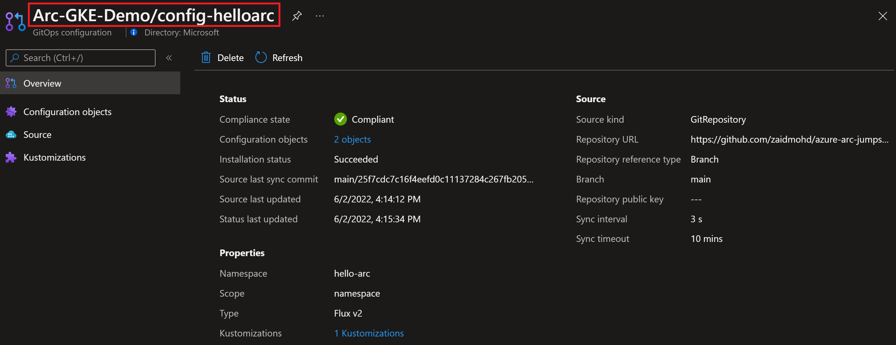
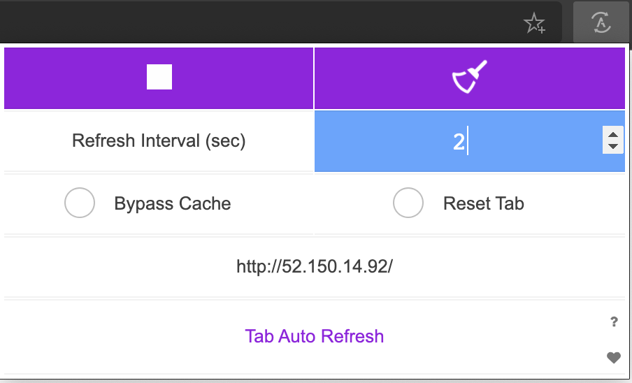

## Deploy GitOps configurations and perform basic GitOps flow on GKE as an Azure Arc Connected Cluster (Flux v2)

The following Jumpstart scenario will guide you on how to create GitOps configuration on a Google Kubernetes Engine (GKE) cluster which is projected as an Azure Arc connected cluster resource.

In this scenario, you will deploy & attach GitOps configuration to your cluster which will also include deploying an "Hello Arc" web application on your Kubernetes cluster. By doing so, you will be able to make real-time changes to the application and show how the GitOps flow takes effect.

GitOps on Azure Arc-enabled Kubernetes uses [Flux](https://fluxcd.io/docs/), a popular open-source toolset. Flux is a tool for keeping Kubernetes clusters in sync with sources of configuration (like Git repositories) and automating updates to the configuration when there is new code to deploy.

**NOTE: This guide assumes you already deployed a GKE cluster and connected it to Azure Arc. If you haven't, this repository offers you a way to do so in an automated fashion using [Terraform](https://azurearcjumpstart.io/azure_arc_jumpstart/azure_arc_k8s/gke/gke_terraform/).**

## Prerequisites

- Fork the ["Azure Arc Jumpstart Apps"](https://github.com/microsoft/azure-arc-jumpstart-apps) repository. In this scenario, you will be making changes on your own forked repository to initiate the GitOps flow.

- (Optional) Install the "Tab Auto Refresh" extension for your browser. This will help you to show the real-time changes on the application in an automated way.

  - [Microsoft Edge](https://microsoftedge.microsoft.com/addons/detail/odiofbnciojkpogljollobmhplkhmofe)

  - [Google Chrome](https://chrome.google.com/webstore/detail/tab-auto-refresh/jaioibhbkffompljnnipmpkeafhpicpd?hl=en)

  - [Mozilla Firefox](https://addons.mozilla.org/firefox/addon/tab-auto-refresh/)

- As mentioned, this scenario starts at the point where you already have a connected GKE cluster to Azure Arc.

    

    

- [Install or update Azure CLI to version 2.49.0 and above](https://docs.microsoft.com/cli/azure/install-azure-cli?view=azure-cli-latest). Use the below command to check your current installed version.

  ```shell
  az --version
  ```

- Create Azure service principal (SP)

    To be able to complete the scenario and its related automation, Azure service principal assigned with the “Contributor” role is required. To create it, login to your Azure account run the below command (this can also be done in [Azure Cloud Shell](https://shell.azure.com/)).

    ```shell
    az login
    subscriptionId=$(az account show --query id --output tsv)
    az ad sp create-for-rbac -n "<Unique SP Name>" --role "Contributor" --scopes /subscriptions/$subscriptionId
    ```

    For example:

    ```shell
    az login
    subscriptionId=$(az account show --query id --output tsv)
    az ad sp create-for-rbac -n "JumpstartArcK8s" --role "Contributor" --scopes /subscriptions/$subscriptionId
    ```

    Output should look like this:

    ```json
    {
    "appId": "XXXXXXXXXXXXXXXXXXXXXXXXXXXX",
    "displayName": "JumpstartArcK8s",
    "password": "XXXXXXXXXXXXXXXXXXXXXXXXXXXX",
    "tenant": "XXXXXXXXXXXXXXXXXXXXXXXXXXXX"
    }
    ```

    > **NOTE: If you create multiple subsequent role assignments on the same service principal, your client secret (password) will be destroyed and recreated each time. Therefore, make sure you grab the correct password**.

    > **NOTE: The Jumpstart scenarios are designed with as much ease of use in-mind and adhering to security-related best practices whenever possible. It is optional but highly recommended to scope the service principal to a specific [Azure subscription and resource group](https://docs.microsoft.com/cli/azure/ad/sp?view=azure-cli-latest) as well considering using a [less privileged service principal account](https://docs.microsoft.com/azure/role-based-access-control/best-practices)**

## Automation Flow

For you to get familiar with the automation and deployment flow, below is an explanation.

- User has deployed the GKE cluster and has it connected as Azure Arc-enabled Kubernetes cluster.

- User is editing the environment variables in the Shell script file (1-time edit) which then be used throughout the GitOps configuration.

- User is running the shell script. The script will use the extension management feature of Azure Arc to deploy the Flux extension and create GitOps configurations on the Azure Arc-connected Kubernetes cluster.

- The script will also create a namespace and deploy Nginx Ingress Controller.

- User is verifying the cluster and making sure the extension and GitOps configuration is deployed.

- User is making an edit on the GitHub repo that will cause Flux GitOps to detect this change and trigger an update to the pod deployment.

## Cluster-level Config vs. Namespace-level Config

### Cluster-level Config

With Cluster-level GitOps config, the goal is to have an "horizontal components" or "management components" deployed on your Kubernetes cluster which will then be used by your applications. Good examples are Service Meshes, Security products, Monitoring solutions, etc. A very popular example will also be Ingress Controller which is exactly the nginx-ingress controller we will deploy in the next section.

### Namespace-level Config

With Namespace-level GitOps config, the goal is to have Kubernetes resources deployed only in the namespace selected. The most obvious use-case here is simply your application and it's respective pods, services, ingress routes, etc. In the next section will have the "Hello Arc" application deployed on a dedicated namespace.

## Azure Arc Kubernetes GitOps Configuration

To create the GitOps Configuration, we will use the _k8s-configuration flux create_ command while passing in values for the mandatory parameters. This scenario provides you with the automation to configure the GitOps on your Azure Arc-enabled Kubernetes cluster.

- In the screenshot below, notice how currently there is no GitOps configuration in your Arc-enabled Kubernetes cluster.

    

- In order to keep your local environment clean and untouched, we will use [Google Cloud Shell](https://cloud.google.com/shell) to run the *az_k8sconfig_gke* shell script against the GKE connected cluster.

- Edit the environment variables in the [*az_k8sconfig_gke*](https://github.com/microsoft/azure_arc/blob/main/azure_arc_k8s_jumpstart/gke/gitops/basic/az_k8sconfig_gke.sh) shell script to match your parameters, upload it to the Cloud Shell environment and run it using the _`. ./az_k8sconfig_gke.sh`_ command.

    > **NOTE: The extra dot is due to the script having an _export_ function and needs to have the vars exported in the same shell session as the rest of the commands.**

    

    For example:

    

    

    

    

    

    

    The script will:

  - Login to your Azure subscription using the SPN credentials
  - Retrieve the cluster credentials (KUBECONFIG)
  - Use Helm to deploy NGINX ingress controller
  - Create the GitOps configurations and deploy the Flux controllers on the Azure Arc connected cluster
  - Deploy the ["Hello Arc"](https://github.com/microsoft/azure-arc-jumpstart-apps/tree/main/hello-arc/yaml) application alongside an Ingress rule to make it available from outside the cluster

    > **Disclaimer: For the purpose of this guide, notice how the "_sync-interval 3s_" is set. The 3 seconds interval is useful for demo purposes since it will make the sync interval to rapidly track changes on the repository but it is recommended to have longer interval in your production environment (the default value is 5min)**

- Once the script will complete it's run, you will have the GitOps configuration created and all the resources deployed in your Kubernetes cluster.

    > **NOTE: that it takes few min for the GitOps configuration change it's state status from "Creating" to Succeeded.**

    

    

    

    

## The "Hello Arc" Application & Components

- Before kicking the GitOps flow, let's verify and "zoom-in" to the Kubernetes resources deployed by running few _kubectl_ commands.

- Show the Flux agent and controller pods.

    ```shell
    kubectl get pods -n flux-system 
    ```

    

- Show 3 replicas of the "Hello Arc" application and the NGINX controller.

    ```shell
    kubectl get pods -n hello-arc
    ```

    

- Show NGINX controller Kubernetes Service (Type _LoadBalancer_).

    ```shell
    kubectl get svc -n hello-arc
    ```

    

- Show NGINX rule which will route the traffic to the "Hello Arc" application from outside the cluster.

    ```shell
    kubectl get ing -n hello-arc
    ```

    

- The GitOps flow works as follow:

    1. The Flux controller holds the "desired state" of the "Hello Arc" application, this is the configuration we deployed against the Azure Arc connected cluster. The controllers "polls" the state of the ["Hello Arc"](https://github.com/microsoft/azure-arc-jumpstart-apps/tree/main/hello-arc/yaml) application repository.

    2. Changing the application, which is considered to be a new version of it, will trigger the Flux controllers to kick in the GitOps flow.

    3. A new Kubernetes pod with the new version of the application will be deployed on the cluster. Once the new pods are successfully deployed, the old one will be terminated (rolling upgrade).

- To show the above flow, open 2 (ideally 3) side-by-side windows:

  - Azure Cloud Shell running the command
  
      ```shell
      kubectl get pods -n hello-arc -w
      ```
  
    

  - In **your fork** of the "Azure Arc Jumpstart" repository, open the *hello_arc.yaml* file (/hello-arc/yaml/hello_arc.yaml).

  - The external IP address of the Kubernetes Service seen using the _`kubectl get svc -n hello-arc`_ command.

    

  - End result should look like that:

    

- As mentioned in the prerequisites section, it is optional but highly recommended to configure the "Tab Auto Refresh" extension for your browser. If you did, in the "Hello Arc" application window, configure it to refresh every 2 seconds.

    

- In the repository window showing the _hello_arc.yaml_ file, change the text under the "MESSAGE" section commit the change. Alternatively, you can open your cloned repository in your IDE, make the change, commit and push it.

    

    

- Upon committing the changes, notice how the Kubernetes Pod rolling upgrade will start. Once the Pod is up & running, the new "Hello Arc" application version window will show the new message, showing the rolling upgrade is completed and the GitOps flow is successful.

    
