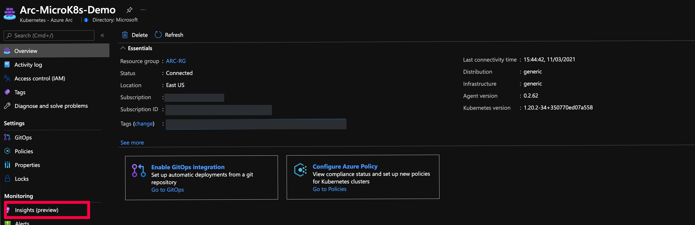
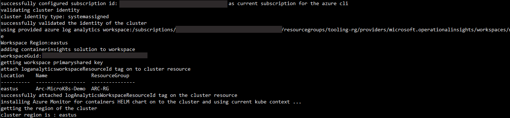
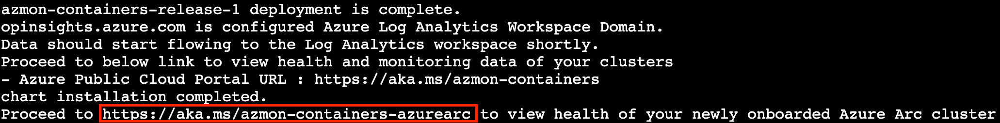
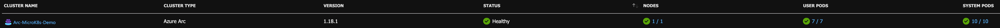
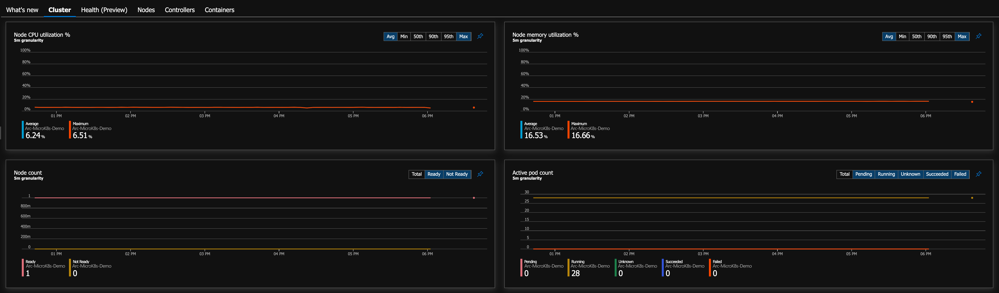
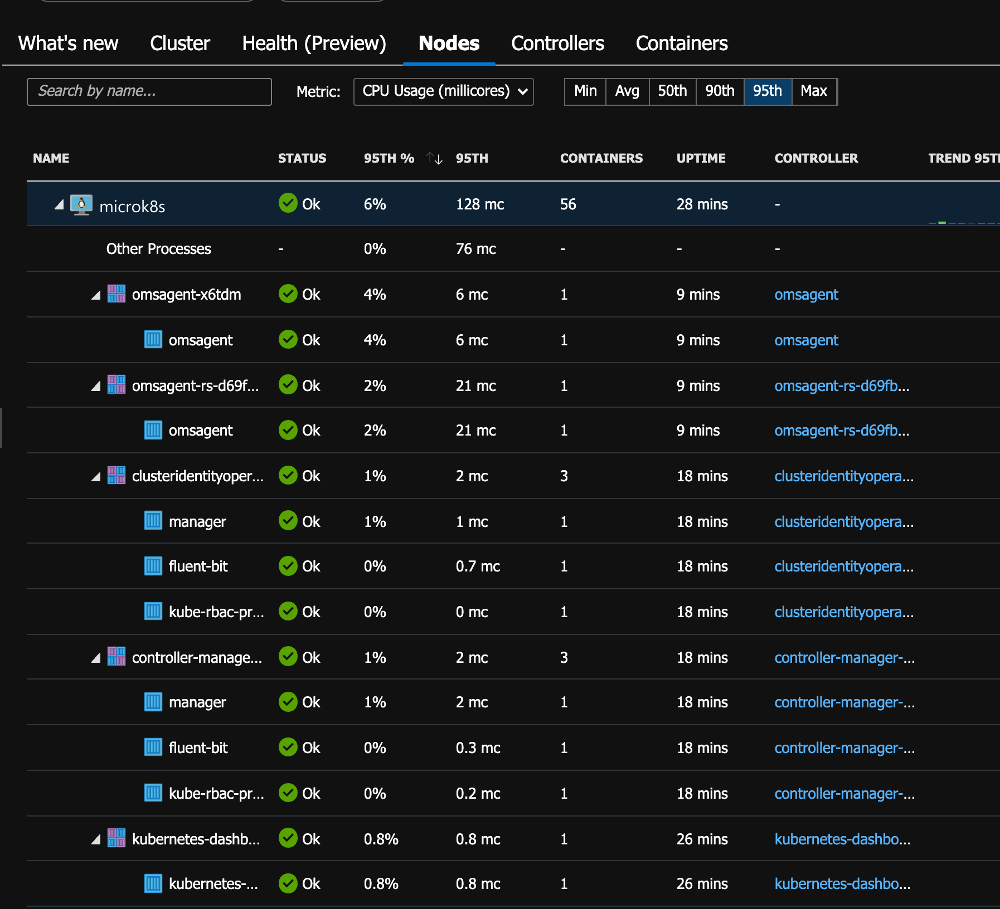
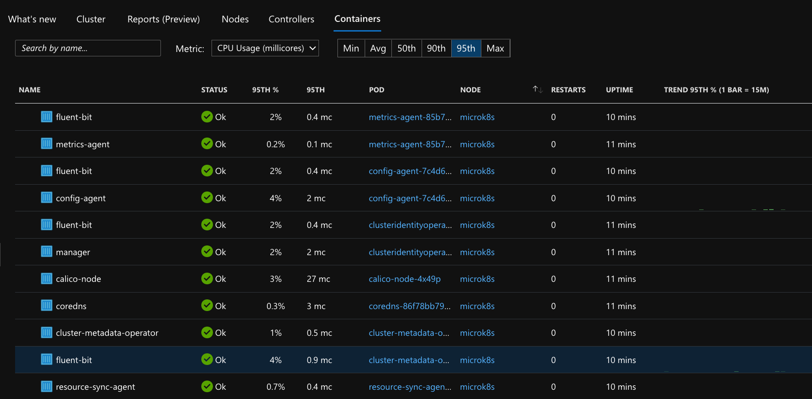

## Integrate Azure Monitor for Containers with MicroK8s as an Azure Arc Connected Cluster

The following README will guide you on how to onboard an microK8s cluster which is projected an Azure Arc connected cluster resource on to [Azure Monitor for Containers](https://docs.microsoft.com/en-us/azure/azure-monitor/insights/container-insights-overview).

In this guide, you will hook the microK8s cluster to Azure Monitor by deploying the [OMS agent](https://docs.microsoft.com/en-us/azure/azure-monitor/platform/log-analytics-agent) on your Kubernetes cluster to start collecting telemetry.  

> **Note: This guide assumes you already deployed MicroK8s and connected it to Azure Arc. If you haven't, this repository offers you a way to do so in the [MicroK8s onboarding guide](https://azurearcjumpstart.io/azure_arc_jumpstart/azure_arc_k8s/microk8s/local_microk8s/).**

## Prerequisites

* Clone the Azure Arc Jumpstart repository

    ```shell
    git clone https://github.com/microsoft/azure_arc.git
    ```

* [Install or update Azure CLI to version 2.25.0 and above](https://docs.microsoft.com/en-us/cli/azure/install-azure-cli?view=azure-cli-latest). Use the below command to check your current installed version.

  ```shell
  az --version
  ```

* Create Azure service principal (SP)

    To be able to complete the scenario and its related automation, Azure service principal assigned with the “Contributor” role is required. To create it, login to your Azure account run the below command (this can also be done in [Azure Cloud Shell](https://shell.azure.com/)).

    ```shell
    az login
    az ad sp create-for-rbac -n "<Unique SP Name>" --role contributor
    ```

    For example:

    ```shell
    az ad sp create-for-rbac -n "http://AzureArcK8s" --role contributor
    ```

    Output should look like this:

    ```json
    {
    "appId": "XXXXXXXXXXXXXXXXXXXXXXXXXXXX",
    "displayName": "AzureArcK8s",
    "name": "http://AzureArcK8s",
    "password": "XXXXXXXXXXXXXXXXXXXXXXXXXXXX",
    "tenant": "XXXXXXXXXXXXXXXXXXXXXXXXXXXX"
    }
    ```

    > **Note: The Jumpstart scenarios are designed with as much ease of use in-mind and adhering to security-related best practices whenever possible. It is optional but highly recommended to scope the service principal to a specific [Azure subscription and resource group](https://docs.microsoft.com/en-us/cli/azure/ad/sp?view=azure-cli-latest) as well considering using a [less privileged service principal account](https://docs.microsoft.com/en-us/azure/role-based-access-control/best-practices)**

## Azure Monitor for Containers Integration

* Retrieve either the shell and PowerShell scripts [provided](https://github.com/microsoft/azure_arc/tree/main/azure_arc_k8s_jumpstart/microk8s/azure_monitor).

* Before integrating the cluster with Azure Monitor for Containers, click on the "Insights (preview)" blade for the connected Arc cluster to show how the cluster is not currently being monitored.

    

    

* Edit the environment variables in either of the scripts to match your environment parameters, run it using the ```. ./microk8s_monitor_onboarding.sh``` (Bash) or ```./microk8s_monitor_onboarding.ps1``` (PowerShell) command.

    ```shell
    export subscriptionId='e73c1dbe-XXXX-XXXX-XXXX-c813757b1786'
    export appId='051b9a58-XXXX-XXXX-XXXX-0e7ae1bca3fb'
    export password='051b9a58-XXXX-XXXX-XXXX-0e7ae1bca3fb'
    export tenantId='051b9a58-XXXX-XXXX-XXXX-0e7ae1bca3fb'
    export resourceGroup='Arc-MicroK8s-Demo'
    export arcClusterName='Arc-MicroK8s-Demo'
    ```

    The script will:

  * Login to your Azure subscription using the SPN credentials
  * Download the OMS script
  * Retrieve the Azure Arc Connected Cluster Azure Resource ID as well as the cluster credentials (KUBECONFIG)
  * Retrieve the Kube config using the `microk8s config` command and append the configuration to ~/.kube/config
  * Execute the script which will create Azure Log Analytics workspace, deploy the OMS agent on the Kubernetes cluster and tag the cluster
  * Delete the downloaded script

  * Once the script will complete its run, you will have an Azure Arc connected cluster integrated with Azure Monitor for Containers.
  
At the end of its run, the script will generate a URL for you to click on, this URL will open a new browser tab leading to the Azure Monitor for Containers Insights page.

  > **Note: As the OMS start collecting telemetry from the cluster nodes and pods, it will take 5-10min for data to start show up in the Azure Portal.**

  

  

* Click the "Connected Clusters" tab and see the Azure Arc connected cluster was added. Now that your cluster is being monitored, navigate through the different tabs and sections and watch the monitoring telemetry for the cluster nodes and pods.  

    

    

    

    

    
