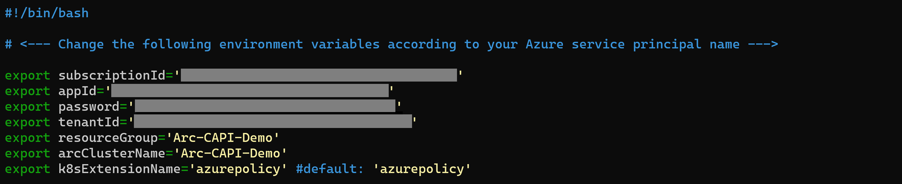
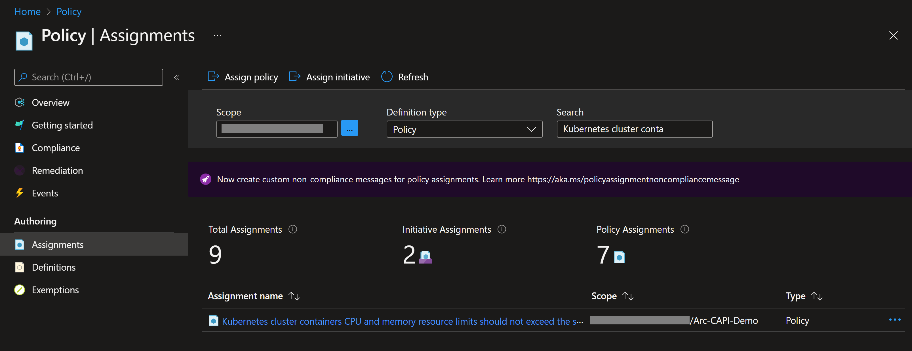
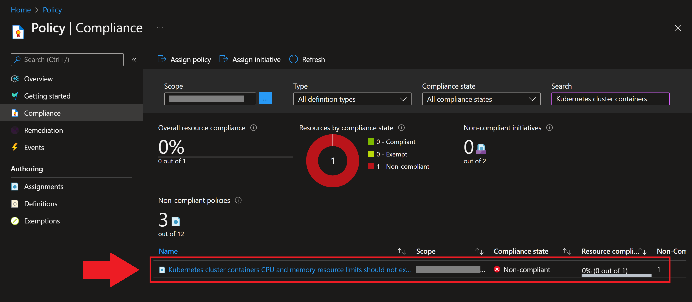
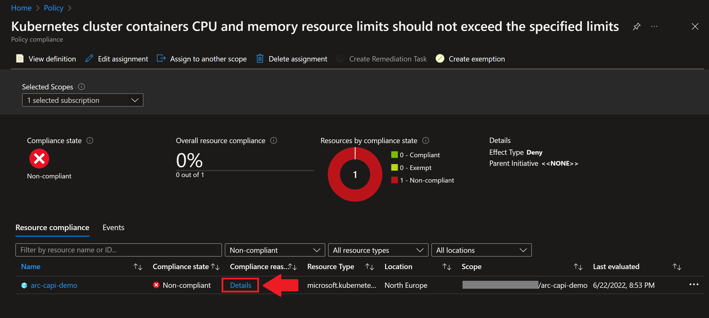
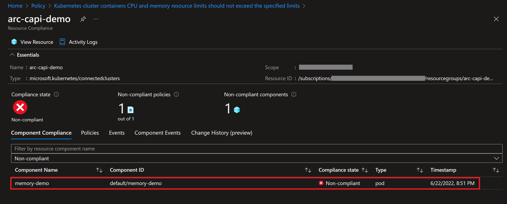

## Integrate Azure Policy with an Azure Arc-enabled Kubernetes cluster using extensions

The following Jumpstart scenario will guide you on how to enable [Azure Policy](https://docs.microsoft.com/azure/governance/policy/concepts/policy-for-kubernetes?toc=%2Fazure%2Fazure-arc%2Fkubernetes%2Ftoc.json) for an Azure Arc-enabled Kubernetes cluster.

In this scenario, you will hook the Azure Arc-enabled Kubernetes cluster to Azure Policy by deploying the [Azure Policy cluster extension](https://docs.microsoft.com/azure/governance/policy/concepts/policy-for-kubernetes?toc=%2Fazure%2Fazure-arc%2Fkubernetes%2Ftoc.json#install-azure-policy-extension-for-azure-arc-enabled-kubernetes) on your Kubernetes cluster in order to start using some of the Kubernetes Azure Policies.

  > **NOTE: This scenario assumes you already deployed a Kubernetes cluster and connected it to Azure Arc. If you haven't, this repository offers you a way to do so in an automated fashion**

- **[Azure Kubernetes Service](https://azurearcjumpstart.io/azure_arc_jumpstart/azure_arc_k8s/aks/)**
- **[AKS on Azure Stack HCI](https://azurearcjumpstart.io/azure_arc_jumpstart/azure_arc_k8s/aks_stack_hci/)**
- **[Kubernetes Cluster API](https://azurearcjumpstart.io/azure_arc_jumpstart/azure_arc_k8s/cluster_api/)**
- **[Azure Red Hat OpenShift](https://azurearcjumpstart.io/azure_arc_jumpstart/azure_arc_k8s/aro/)**
- **[Amazon Elastic Kubernetes Service](https://azurearcjumpstart.io/azure_arc_jumpstart/azure_arc_k8s/eks/)**
- **[Google Kubernetes Engine](https://azurearcjumpstart.io/azure_arc_jumpstart/azure_arc_k8s/gke/)**
- **[Alibaba Cloud Container Service for Kubernetes](https://azurearcjumpstart.io/azure_arc_jumpstart/azure_arc_k8s/alibaba/)**
- **[Rancher K3s](https://azurearcjumpstart.io/azure_arc_jumpstart/azure_arc_k8s/rancher_k3s/)**
- **[Kind](https://azurearcjumpstart.io/azure_arc_jumpstart/azure_arc_k8s/kind/)**
- **[MicroK8s](https://azurearcjumpstart.io/azure_arc_jumpstart/azure_arc_k8s/microk8s/)**
- **[Platform9 Managed Kubernetes](https://azurearcjumpstart.io/azure_arc_jumpstart/azure_arc_k8s/pf9/)**

Kubernetes extensions are add-ons for Kubernetes clusters. The extensions feature on Azure Arc-enabled Kubernetes clusters enables usage of Azure Resource Manager based APIs, CLI and Azure Portal for deployment of extension components (Helm charts in initial release) and will also provide lifecycle management capabilities such as auto/manual extension version upgrades for the extensions.

## Prerequisites

- Clone the Azure Arc Jumpstart repository

    ```shell
    git clone https://github.com/microsoft/azure_arc.git
    ```

- [Install or update Azure CLI to version 2.49.0 and above](https://docs.microsoft.com/cli/azure/install-azure-cli?view=azure-cli-latest). Use the below command to check your current installed version.

  ```shell
  az --version
  ```

- Create Azure service principal (SP). To deploy this scenario, an Azure service principal assigned with multiple Role-based access control (RBAC) roles is required:

  - "Contributor" - Required for provisioning Azure resources
  - "Resource Policy Contributor" - Required to assign Azure Policy definition

    To create it login to your Azure account run the below command (this can also be done in [Azure Cloud Shell](https://shell.azure.com/)).

    ```shell
    az login
    subscriptionId=$(az account show --query id --output tsv)
    az ad sp create-for-rbac -n "<Unique SP Name>" --role "Contributor" --scopes /subscriptions/$subscriptionId
    az ad sp create-for-rbac -n "<Unique SP Name>" --role "Resource Policy Contributor" --scopes /subscriptions/$subscriptionId
    ```

    For example:

    ```shell
    az login
    subscriptionId=$(az account show --query id --output tsv)
    az ad sp create-for-rbac -n "JumpstartArcK8s" --role "Contributor" --scopes /subscriptions/$subscriptionId
    az ad sp create-for-rbac -n "JumpstartArcK8s" --role "Resource Policy Contributor" --scopes /subscriptions/$subscriptionId
    ```

    Output should look like this:

    ```json
    {
    "appId": "XXXXXXXXXXXXXXXXXXXXXXXXXXXX",
    "displayName": "JumpstartArcK8s",
    "password": "XXXXXXXXXXXXXXXXXXXXXXXXXXXX",
    "tenant": "XXXXXXXXXXXXXXXXXXXXXXXXXXXX"
    }
    ```

    > **NOTE: If you create multiple subsequent role assignments on the same service principal, your client secret (password) will be destroyed and recreated each time. Therefore, make sure you grab the correct password**.

    > **NOTE: The Jumpstart scenarios are designed with as much ease of use in-mind and adhering to security-related best practices whenever possible. It is optional but highly recommended to scope the service principal to a specific [Azure subscription and resource group](https://docs.microsoft.com/cli/azure/ad/sp?view=azure-cli-latest) as well considering using a [less privileged service principal account](https://docs.microsoft.com/azure/role-based-access-control/best-practices)**

## Automation Flow

For you to get familiar with the automation and deployment flow, below is an explanation:

- User has deployed a Kubernetes cluster and has it connected as an Azure Arc-enabled Kubernetes cluster.

- User edits the environment variables on the Shell script file (1-time edit) which then will be used throughout the extension deployment.

- User runs the shell script. The script will use the extension management feature of Azure Arc to deploy the Azure Policy extension on the Azure Arc-enabled Kubernetes cluster and assign an Azure Policy to your Azure Arc-enabled Kubernetes cluster's resource group.

- User verifies that the Azure Policy extension is deployed as well as the Azure Policy assignment was created.

## Create Azure Policy cluster extensions instance

To create a new extension instance, we will use the _k8s-extension create_ command while passing in values for the mandatory parameters. This scenario provides you with the automation to deploy the Azure Policy cluster extension on your Azure Arc-enabled Kubernetes cluster.

- Before integrating the cluster with Azure Policy, click on the "Extensions" tab for the connected Azure Arc cluster to show how the cluster is not currently being assessed by Azure Policy.

    

- Edit the environment variables in [the script](https://raw.githubusercontent.com/microsoft/azure_arc/main/azure_arc_k8s_jumpstart/multi_distributions/azure_policy/azure_policy.sh) to match your environment parameters.

  - _`subscriptionId`_ - Your Azure subscription ID
  - _`appId`_ - Your Azure service principal name
  - _`password`_ - Your Azure service principal password
  - _`tenantId`_ - Your Azure tenant ID
  - _`resourceGroup`_ - Azure resource group name
  - _`arcClusterName`_ - Azure Arc Cluster Name
  - _`k8sExtensionName`_ - Azure Policy extension name, should be azurepolicy

  

- After editing the variables, to run the script, navigate to the [script folder](https://github.com/microsoft/azure_arc/tree/main/azure_arc_k8s_jumpstart/multi_distributions/azure_policy) and run the command

  ```shell  
  sudo chmod +x azure_monitor_alerts.sh && . ./azure_policy.sh
  ```

    > **NOTE: The extra dot is due to the shell script having an _export_ function and needs to have the vars exported in the same shell session as the rest of the commands.**

   The script will:

  - Login to your Azure subscription using the service principal credentials
  - Add or Update your local _connectedk8s_ and _k8s-extension_ Azure CLI extensions
  - Create the Azure Policy cluster extension instance
  - Assign the Azure Policy _Kubernetes cluster containers CPU and memory resource limits should not exceed the specified limits_ (cpuLimit=200m memoryLimit=1Gi) to the resource group of the Azure Arc-enabled Kubernetes cluster

- Verify under the extensions tab of the Azure Arc-enabled Kubernetes cluster that the Azure Policy cluster extension is correctly installed.

  

- You can also verify the pods by running the commands below:
  
  - The azure-policy pods are installed in the kube-system namespace:

    ```bash
    kubectl get pods -n kube-system --kubeconfig <kubeconfig> | grep azure-policy
    ```

    

  - The gatekeeper pods are installed in the gatekeeper-system namespace:

    ```bash
    kubectl get pods -n gatekeeper-system --kubeconfig <kubeconfig>
    ```

    

- Verify under the Azure Policy service in the Assignments tab that the Azure Policy Definition was assigned in your resource group:

  

## Test Azure Policy

> **IMPORTANT NOTE: Please note that it may take up to 30 minutes for the Azure Policy to take effect.**

- The Azure Policy we have assigned works as a [LimitRange](https://kubernetes.io/docs/concepts/policy/limit-range/), but we do not specify any namespace, so the Azure Policy will be applied on all namespaces. The limits specified in the Azure Policy are cpuLimit=200m and memoryLimit=1Gi, so to test it we need to create a pod with higher limits:

  > **pod-test.yaml**
  ```yaml
  apiVersion: v1
  kind: Pod
  metadata:
    name: nginx
  spec:
    containers:
    - name: nginx
      image: nginx
      resources:
        requests:
          memory: "2Gi"
          cpu: "2"
        limits:
          memory: "3Gi"
          cpu: "16"
  ```

- Create the above file and run the following command to create the pod:

  ```bash
  kubectl apply -f pod-test.yaml --kubeconfig <kubeconfig>
  ```

  

  As you can see we cannot create the pod due to the Azure policy that was applied.

- If there were pods that exceeded the limit before applying the Azure Policy, they will not be removed, but we can see which ones do not comply in the Azure Policy service in the Compliance tab, select the non-compliance event

  

- Click on Details to find out which pod is not compliant:

  

- This is the non-compliant pod:

  

### Delete resources

Complete the following steps to clean up your environment. The commands below delete the extension instance and the Azure Policy Assignment.

  ```bash
  export arcClusterName='<Azure Arc Cluster Name>'
  export resourceGroup='<Azure resource group name>'
  az k8s-extension delete --name azurepolicy --cluster-type connectedClusters --cluster-name $arcClusterName --resource-group $resourceGroup
  resourceGroupId=$(az group show --name $resourceGroup --query id -o tsv | sed 's/\r$//')
  az policy assignment delete --name "K8s containers should not exceed CPU=200m and Memory=1Gi" --scope $resourceGroupId
  ```
