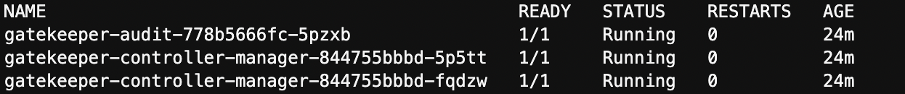

## Use Azure Policy on an Azure Arc connected Kubernetes cluster to audit pods' labels for use with  Calico network policy

 > **Disclaimer: This scenario was contributed by the Tigera Project Calico team as part of the "Jumpstart Friends" program**

<p align="center"></p>

The following README will guide you how to use Azure Policy [Azure Policy for Kubernetes](https://docs.microsoft.com/en-us/azure/governance/policy/concepts/policy-for-kubernetes#:~:text=Azure%20Policy%20extends%20Gatekeeper%20v3,Kubernetes%20clusters%20from%20one%20place.) on an Azure Arc connected Kubernetes cluster to audit/enforce labels for pods. [Network policy](https://projectcalico.docs.tigera.io/about/about-network-policy) is applied to pods using label selectors.

> **NOTE: This guide assumes you already deployed an Amazon Elastic Kubernetes Service (EKS) or Google Kubernetes Engine (GKE) cluster and connected it to Azure Arc. If you haven't, this repository offers you a way to do so in an automated fashion using these Jumpstart scenarios:**

- [Deploy EKS cluster and connect it to Azure Arc using Terraform](https://azurearcjumpstart.io/azure_arc_jumpstart/azure_arc_k8s/eks/eks_terraform/)
- [Deploy GKE cluster and connect it to Azure Arc using Terraform](https://azurearcjumpstart.io/azure_arc_jumpstart/azure_arc_k8s/gke/gke_terraform/)

> **NOTE: This guide assumes you already have deployed Calico network policy in your cluster. If you haven't, you can use our installation guides for Calico open source or Calico Cloud:**

- [Deploy Calico open source in your managed public cluster](https://projectcalico.docs.tigera.io/getting-started/kubernetes/managed-public-cloud/)
- [Sign up for a Calico Cloud trial](https://www.calicocloud.io/?utm_campaign=calicocloud&utm_medium=digital&utm_source=microsoft)

Calico Network Policy uses labels to select pods in Kubernetes for applying ingress/egress rules.

In this scenario, we will be using Azure Policy on an Azure-Arc enabled Kubernetes cluster to check whether the “fw-zone” label is present on pods in the “storefront” namespace, and how these labels are used in network policy enforcement.

The Azure Policy will be set to “Audit” mode to check the configuration of existing clusters (it can also be set to “Deny” mode to avoid any missing labels)

## Prerequisites

- Clone the Azure Arc Jumpstart repository

    ```shell
    git clone https://github.com/microsoft/azure_arc.git
    ```

- [Install or update Azure CLI to version 2.25.0 and above](https://docs.microsoft.com/en-us/cli/azure/install-azure-cli?view=azure-cli-latest). Use the following command to check your current installed version.

  ```shell
  az --version
  ```

- As mentioned, this guide starts at the point where you already have a connected EKS/GKE cluster to Azure Arc.

    

    

- Before installing the Azure Policy Add-on or enabling any of the service features, your subscription must enable the _Microsoft.PolicyInsights_ resource provider and create a role assignment for the cluster service principal. To do that, open [Azure Cloud Shell](https://shell.azure.com/) and run either the Azure CLI or PowerShell command.

    

    Azure CLI:

    ```shell
    az provider register --namespace 'Microsoft.PolicyInsights'
    ```

    PowerShell:

    ```powershell
    Register-AzResourceProvider -ProviderNamespace 'Microsoft.PolicyInsights'
    ```

    To verify successful registration, run either the below Azure CLI or PowerShell command.

    Azure CLI:

    ```shell
    az provider show --namespace 'Microsoft.PolicyInsights'
    ```

    PowerShell:

    ```powershell
    Get-AzResourceProvider -ProviderNamespace 'Microsoft.PolicyInsights'
    ```

    

- Check whether Azure Policy is installed in an Azure Arc connected cluster

  > by running the ```kubectl get pods -n gatekeeper-system``` command.
  
- You should see the following pods running.

  

- Deploy a demo application and Calico Network policy in your Azure Arc-Connected Cluster.

  ```shell
  cd azure_arc/docs/azure_arc_jumpstart/azure_arc_k8s/day2/multi_distributions/calico/
  ```

  ```shell
  kubectl create -f storefront.yaml
  ```

- Deploy the `storefront` demo application in your cluster by running the  ```kubectl create -f storefront.yaml``` command.

  

  ```shell
  kubectl create -f calico-firewall-policy.yaml
  ```

- Deploy a sample Calico network policy by running the  ```kubectl create -f calico-firewall-policy.yaml``` command.

  

## Deploy an Azure policy to verify if “fw-zone” label exists for pods in the `storefront` namespace

- In the Azure portal Search bar, look for _Policy_ and click on _Definitions_ which will show you all of the available Azure policies.

    

    

- Click on _Category_ to search for built-in policies.

    

- In the below example, make sure _Category_ is set to _Kubernetes_ only, and type `label` in _Search_, you will find `Kubernetes cluster pods should use specified labels` in _BuiltIn_ Type.

    

    

- Click this policy, and assign it to your Azure resource group which includes the Azure Arc-enabled Kubernetes clusters. Alternatively, you can assign the policy to the entire Azure subscription.
  
  

- Name the assignment, for example `storefront namespace pods should use fw-zone labels for calico _networkpolicy_ enforcement`.

  

- In the below example, we only audit one namespace which is `storefront` with `fw-zone` as the required label.

  

- Once assigned, the policy task will start the evaluation against the Arc connected cluster in your resource group. You can check the status of this assignment under `Compliance`.

  

> **NOTE: The process of evaluation can take up 30min, in the meantime will see 0 out of 0 in `Resource compliance`.**

- After the evaluation, the policy will inform you of the result and provide details if there are any resources that are `non-compliant`.  

  > We will deploy a centos and nginx pod to the `storefront` namespace without the `fw-zone` label by running the commands below. Creation of these pods will be allowed as the policy effect is set to `audit` instead of `deny`.

  ```shell
  kubectl run centos --image=centos -n storefront --restart=Never -- /bin/sh -c "sleep 24h"
  ```

  ```shell
  kubectl run nginx --image=nginx -n storefront
  kubectl -n storefront expose pod nginx --port=80
  ```
  
  

  

- Test Calico network policy enforcement by adding the `fw-zone` labels to the `centos` and `nginx` pods.
  > The network policy is set to allow only `trusted` zone connections to the `restricted` zone, and will deny traffic from `dmz` zone. We will label the nginx pod with `fw-zone=restricted`, and test connectivity when changing the centos pod label from `fw-zone=trusted` to `fw-zone=dmz`.

- Test Calico network policy enforcement without labels.

  

- Test Calico network policy enforcement with proper labels.

  

- Test Calico network policy enforcement with wrong labels.

  


## Clean up environment

Complete the following steps to clean up your environment.

- From each Azure Arc connected cluster under your resource group, click the _Azure Policy_ page, and disable the extension of Azure policy under `Onboard to Azure Policy for Azure Arc enabled Kubernetes cluster`

    

    

    

- You can use these Jumpstart scenarios below for deleting the clusters:
- [Deploy EKS cluster and connect it to Azure Arc using Terraform](https://azurearcjumpstart.io/azure_arc_jumpstart/azure_arc_k8s/eks/eks_terraform/)
- [Deploy GKE cluster and connect it to Azure Arc using Terraform](https://azurearcjumpstart.io/azure_arc_jumpstart/azure_arc_k8s/gke/gke_terraform/)
