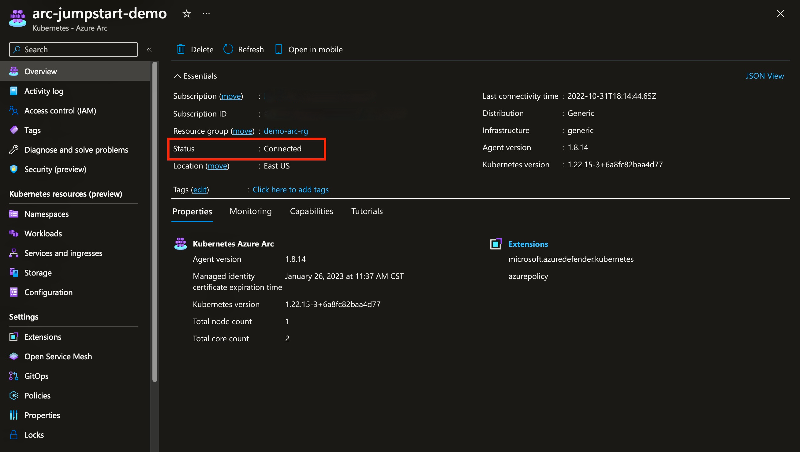
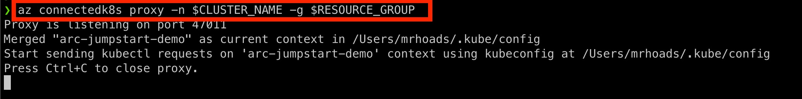
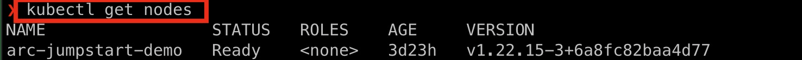
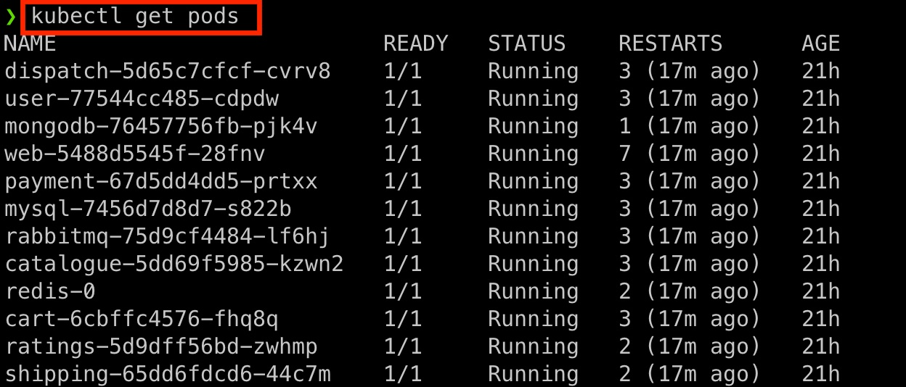
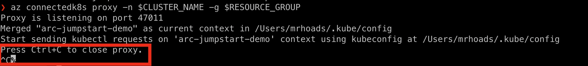

## Using Cluster Connect to connect to an Azure Arc-enabled Kubernetes cluster via service account token authentication

The following Jumpstart scenario will guide you through how to use the [Cluster Connect](https://docs.microsoft.com/azure/azure-arc/kubernetes/cluster-connect) capability of an Azure Arc connected Kubernetes cluster to manage and connect to the cluster securely without opening inbound firewall ports.

  > **NOTE: This scenario assumes you already deployed a Kubernetes cluster and connected it to Azure Arc. If you haven't, this repository offers you a way to do so in an automated fashion**

- **[Azure Kubernetes Service](https://azurearcjumpstart.io/azure_arc_jumpstart/azure_arc_k8s/aks/)**
- **[AKS on Azure Stack HCI](https://azurearcjumpstart.io/azure_arc_jumpstart/azure_arc_k8s/aks_stack_hci/)**
- **[Kubernetes Cluster API](https://azurearcjumpstart.io/azure_arc_jumpstart/azure_arc_k8s/cluster_api/)**
- **[Azure Red Hat OpenShift](https://azurearcjumpstart.io/azure_arc_jumpstart/azure_arc_k8s/aro/)**
- **[Amazon Elastic Kubernetes Service](https://azurearcjumpstart.io/azure_arc_jumpstart/azure_arc_k8s/eks/)**
- **[Google Kubernetes Engine](https://azurearcjumpstart.io/azure_arc_jumpstart/azure_arc_k8s/gke/)**
- **[Alibaba Cloud Container Service for Kubernetes](https://azurearcjumpstart.io/azure_arc_jumpstart/azure_arc_k8s/alibaba/)**
- **[Rancher K3s](https://azurearcjumpstart.io/azure_arc_jumpstart/azure_arc_k8s/rancher_k3s/)**
- **[Kind](https://azurearcjumpstart.io/azure_arc_jumpstart/azure_arc_k8s/kind/)**
- **[MicroK8s](https://azurearcjumpstart.io/azure_arc_jumpstart/azure_arc_k8s/microk8s/)**
- **[Platform9 Managed Kubernetes](https://azurearcjumpstart.io/azure_arc_jumpstart/azure_arc_k8s/pf9/)**

## Prerequisites

- Ensure you are logged in to the Azure CLI or PowerShell

  #### Option 1: Bash

  ```shell
  az login
  ```

  #### Option 2: PowerShell

  ```powershell
  Connect-AzAccount
  ```

- [Install or update Azure CLI to version 2.49.0 and above](https://docs.microsoft.com/cli/azure/install-azure-cli?view=azure-cli-latest). Use the below command to check your current installed version.

  ```shell
  az --version
  ```

- [Install or update to the latest version of the _connectedk8s_ CLI extension](https://learn.microsoft.com/azure/azure-arc/kubernetes/cluster-connect?tabs=azure-cli).

  ```shell
  az extension add --name connectedk8s
  ```

- As mentioned, this scenario starts at the point where you already have an Azure Arc connected cluster.

    

## Azure Arc Kubernetes Connected Cluster Configuration

The following steps walk through using the Cluster Connect functionality using Azure Active Directory (AAD); however, it can also be done using a service account token.  The benefit of using AAD authentication is that your current, logged-in user from the Azure CLI will be used and you won't have to obtain a service account token from your cluster.

- First, get values for the cluster name and resource group name in your terminal.

  #### Option 1: Bash

  ```shell
  CLUSTER_NAME=<cluster-name>
  RESOURCE_GROUP=<resource-group-name>
  ```

  #### Option 2: PowerShell

  ```powershell
  $CLUSTER_NAME = <cluster name>
  $RESOURCE_GROUP = <resource_group>
  ```

- Second, obtain the _user principal name and ID_ of your AAD user account.

  #### Option 1: Bash

  ```shell
  AAD_ENTITY=$(az ad signed-in-user show --query "[id, userPrincipalName]" -o tsv)
  ```

  #### Option 2: PowerShell

  ```powershell
  $AAD_ENTITY = (az ad signed-in-user show --query "[id, userPrincipalName]" -o tsv)
  ```

- Finally, create the Kubernetes _ClusterRoleBinding_ using the following:

  #### Option 1: Bash

  ```shell
  while ID= read -r line; do  kubectl create clusterrolebinding jumpstart-binding-$line --clusterrole cluster-admin --user=$line; done <<< "$AAD_ENTITY"
  ```

  #### Option 2: PowerShell

  ```powershell
  foreach($line in $AAD_ENTITY)
  { kubectl create clusterrolebinding jumpstart-binding-$line --clusterrole cluster-admin --user=$line }
  ```

## Access Cluster

From your terminal, run the following command to establish the proxy to the cluster.  Note that the specific port number that's used may differ from the screenshot below.

  ```shell
  az connectedk8s proxy -n $CLUSTER_NAME -g $RESOURCE_GROUP
  ```

  

## Run kubectl commands

With the proxy established, in another terminal session run a kubectl command.

  ```shell
  kubectl get nodes
  ```

  

If you already have a workload running on your cluster, you can view it using other kubectl commands, as the following screenshot illustrates:

  

## Close Proxy Connection

In your terminal, use the _CTRL+C_ key combination to close the proxy session.

  

With the proxy session now closed, access to the cluster using kubectl via the proxy is disabled.
