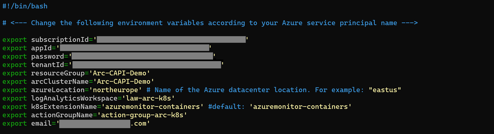
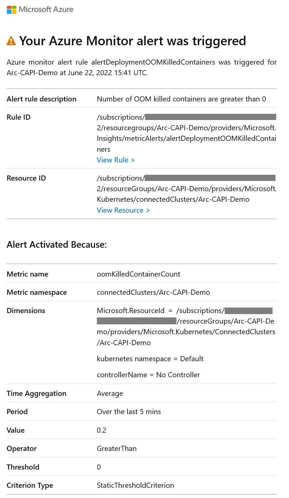

## Integrate Azure Monitor Container Insights and recommended alerts with an Azure Arc-enabled Kubernetes cluster using extensions

The following Jumpstart scenario will guide you on how to enable [Azure Monitor Container Insights](https://docs.microsoft.com/azure/azure-monitor/containers/container-insights-enable-arc-enabled-clusters?toc=%2Fazure%2Fazure-arc%2Fkubernetes%2Ftoc.json) and configure all [recommended metric alerts from Container insights](https://docs.microsoft.com/azure/azure-monitor/containers/container-insights-metric-alerts) for an Azure Arc-enabled Kubernetes cluster.

In this scenario, you will hook the Azure Arc-enabled Kubernetes cluster to Azure Monitor Container Insights by deploying the [Azure Monitor cluster extension](https://docs.microsoft.com/azure/azure-monitor/containers/container-insights-enable-arc-enabled-clusters?toc=%2Fazure%2Fazure-arc%2Fkubernetes%2Ftoc.json#create-extension-instance-using-azure-cli) on your Kubernetes cluster in order to start collecting Kubernetes related logs and telemetry. Then the recommended alerts will be enabled by an [ARM template](https://docs.microsoft.com/es-es/azure/azure-resource-manager/templates/overview).

  > **NOTE: This scenario assumes you already deployed a Kubernetes cluster and connected it to Azure Arc. If you haven't, this repository offers you a way to do so in an automated fashion**

- **[Azure Kubernetes Service](https://azurearcjumpstart.io/azure_arc_jumpstart/azure_arc_k8s/aks/)**
- **[AKS on Azure Stack HCI](https://azurearcjumpstart.io/azure_arc_jumpstart/azure_arc_k8s/aks_stack_hci/)**
- **[Kubernetes Cluster API](https://azurearcjumpstart.io/azure_arc_jumpstart/azure_arc_k8s/cluster_api/)**
- **[Azure Red Hat OpenShift](https://azurearcjumpstart.io/azure_arc_jumpstart/azure_arc_k8s/aro/)**
- **[Amazon Elastic Kubernetes Service](https://azurearcjumpstart.io/azure_arc_jumpstart/azure_arc_k8s/eks/)**
- **[Google Kubernetes Engine](https://azurearcjumpstart.io/azure_arc_jumpstart/azure_arc_k8s/gke/)**
- **[Alibaba Cloud Container Service for Kubernetes](https://azurearcjumpstart.io/azure_arc_jumpstart/azure_arc_k8s/alibaba/)**
- **[Rancher K3s](https://azurearcjumpstart.io/azure_arc_jumpstart/azure_arc_k8s/rancher_k3s/)**
- **[Kind](https://azurearcjumpstart.io/azure_arc_jumpstart/azure_arc_k8s/kind/)**
- **[MicroK8s](https://azurearcjumpstart.io/azure_arc_jumpstart/azure_arc_k8s/microk8s/)**
- **[Platform9 Managed Kubernetes](https://azurearcjumpstart.io/azure_arc_jumpstart/azure_arc_k8s/pf9/)**

Kubernetes extensions are add-ons for Kubernetes clusters. The extensions feature on Azure Arc-enabled Kubernetes clusters enables usage of Azure Resource Manager based APIs, CLI and Azure Portal for deployment of extension components (Helm charts in initial release) and will also provide lifecycle management capabilities such as auto/manual extension version upgrades for the extensions.

## Prerequisites

- Clone the Azure Arc Jumpstart repository

    ```shell
    git clone https://github.com/microsoft/azure_arc.git
    ```

- [Install or update Azure CLI to version 2.49.0 and above](https://docs.microsoft.com/cli/azure/install-azure-cli?view=azure-cli-latest). Use the below command to check your current installed version.

  ```shell
  az --version
  ```

- Create Azure service principal (SP). To deploy this scenario, an Azure service principal assigned with an Role-based access control (RBAC) _Contributor_ role is required:

  - "Contributor" - Required for provisioning Azure resources

    To create it login to your Azure account run the below command (this can also be done in [Azure Cloud Shell](https://shell.azure.com/)).

    ```shell
    az login
    subscriptionId=$(az account show --query id --output tsv)
    az ad sp create-for-rbac -n "<Unique SP Name>" --role "Contributor" --scopes /subscriptions/$subscriptionId
    ```

    For example:

    ```shell
    az login
    subscriptionId=$(az account show --query id --output tsv)
    az ad sp create-for-rbac -n "JumpstartArcK8s" --role "Contributor" --scopes /subscriptions/$subscriptionId
    ```

    Output should look like this:

    ```json
    {
    "appId": "XXXXXXXXXXXXXXXXXXXXXXXXXXXX",
    "displayName": "JumpstartArcK8s",
    "password": "XXXXXXXXXXXXXXXXXXXXXXXXXXXX",
    "tenant": "XXXXXXXXXXXXXXXXXXXXXXXXXXXX"
    }
    ```

    > **NOTE: The Jumpstart scenarios are designed with as much ease of use in-mind and adhering to security-related best practices whenever possible. It is optional but highly recommended to scope the service principal to a specific [Azure subscription and resource group](https://docs.microsoft.com/cli/azure/ad/sp?view=azure-cli-latest) as well considering using a [less privileged service principal account](https://docs.microsoft.com/azure/role-based-access-control/best-practices)**

## Automation Flow

For you to get familiar with the automation and deployment flow, below is an explanation:

- User has deployed a Kubernetes cluster and has it connected as an Azure Arc-enabled Kubernetes cluster.

- User is editing the environment variables on the Shell script file (1-time edit) which then will be used throughout the extension deployment.

- User is running the shell script. The script will use the extension management feature of Azure Arc to deploy the Azure Monitor cluster extension on the Azure Arc-enabled Kubernetes cluster and create all the recommended alerts.

- User is veryfing that the cluster is shown in Azure Monitor and that the extension is deployed as well as all the recommended alerts.

- User is simulating an alert.

## Create Azure Monitor cluster extensions instance

To create a new extension instance, we will use the _k8s-extension create_ command while passing in values for the mandatory parameters. This scenario provides you with the automation to deploy the Azure Monitor cluster extension on your Azure Arc-enabled Kubernetes cluster.

- Before integrating the cluster with Azure Monitor, click on the "Extensions" tab for the connected Azure Arc cluster to show how the cluster is not currently being assessed by Azure Monitor.

    

- Navigate to the folder that has the deployment script.

- Edit the environment variables in [the script](https://raw.githubusercontent.com/microsoft/azure_arc/main/azure_arc_k8s_jumpstart/multi_distributions/container_insights/azure_monitor_alerts.sh) to match your environment parameters.

  - _`subscriptionId`_ - Your Azure subscription ID
  - _`appId`_ - Your Azure service principal name
  - _`password`_ - Your Azure service principal password
  - _`tenantId`_ - Your Azure tenant ID
  - _`resourceGroup`_ - Azure resource group name
  - _`arcClusterName`_ - Azure Arc Cluster Name
  - _`azureLocation`_ - Azure region
  - _`logAnalyticsWorkspace`_ - Log Analytics Workspace Name
  - _`k8sExtensionName`_ - Azure Monitor extension name, should be azuremonitor-containers
  - _`actionGroupName`_ - Action Group for the Alerts
  - _`email`_ - Email for the Action Group

  

- After editing the variables, to run the script, navigate to the [script folder](https://github.com/microsoft/azure_arc/tree/main/azure_arc_k8s_jumpstart/multi_distributions/container_insights) and run the command

  ```shell  
  sudo chmod +x azure_monitor_alerts.sh && . ./azure_monitor_alerts.sh
  ```

    > **NOTE: The extra dot is due to the shell script having an _export_ function and needs to have the vars exported in the same shell session as the rest of the commands.**

   The script will:

  - Login to your Azure subscription using the service principal credentials
  - Add or Update your local _connectedk8s_ and _k8s-extension_ Azure CLI extensions
  - Create the Azure Monitor cluster extension instance
  - Create an action group and all recommended alerts

- Verify under the extensions tab of the Azure Arc-enabled Kubernetes cluster that the Azure Monitor cluster extension is correctly installed.

  

- You can also verify the pods by running the command below:

  ```bash
  kubectl get pod -n kube-system --kubeconfig <kubeconfig> | grep omsagent
  ```

  

- Verify under the Alert rules tab on alerts section of the Azure Arc-enabled Kubernetes cluster that the alert rules are correctly created.

  

## Simulate an alert

- To verify that the recommended alerts are working properly, create the below pod to simulate an OOMKilledContainers alert:

  > **pod-test.yaml**
  ```yaml
  apiVersion: v1
  kind: Pod
  metadata:
    name: memory-demo
  spec:
    containers:
    - name: memory-demo-ctr
      image: polinux/stress
      resources:
        requests:
          memory: "50Mi"
        limits:
          memory: "100Mi"
      command: ["stress"]
      args: ["--vm", "1", "--vm-bytes", "250M", "--vm-hang", "1"]
  ```
- Create the above file and run the following command to create the pod:

  ```bash
  kubectl apply -f pod-test.yaml --kubeconfig <kubeconfig>
  ```
  
- In few minutes an alert will be created, you will see it in the Azure Portal under Alerts tab of your Azure Arc-enabled cluster.

  

- You also will receive an email like this:

  

### Delete resources

Complete the following steps to clean up your environment. The commands below delete the extension instance, recommended alerts, action group and Log Analytics workspace.

  ```bash
  export arcClusterName='<Azure Arc Cluster Name>'
  export resourceGroup='<Azure resource group name>'
  export logAnalyticsWorkspace='<Log Analytics Workspace Name>'
  export actionGroupName='<Action Group for the Alerts>'
  az k8s-extension delete --name azuremonitor-containers --cluster-type connectedClusters --cluster-name $arcClusterName --resource-group $resourceGroup
  az monitor metrics alert delete --name alertDeploymentContainerCPU --resource-group $resourceGroup
  az monitor metrics alert delete --name alertDeploymentContainerWorkingSetMemory --resource-group $resourceGroup
  az monitor metrics alert delete --name alertDeploymentNodeCPU --resource-group $resourceGroup
  az monitor metrics alert delete --name alertDeploymentNodeDiskUsage --resource-group $resourceGroup
  az monitor metrics alert delete --name alertDeploymentNodeNotReady --resource-group $resourceGroup
  az monitor metrics alert delete --name alertDeploymentNodeWorkingSetMemory --resource-group $resourceGroup
  az monitor metrics alert delete --name alertDeploymentOOMKilledContainers --resource-group $resourceGroup
  az monitor metrics alert delete --name alertDeploymentPodsReady --resource-group $resourceGroup
  az monitor metrics alert delete --name alertDeploymentFailedPodCounts --resource-group $resourceGroup
  az monitor metrics alert delete --name alertDeploymentPersistentVolumeUsage --resource-group $resourceGroup
  az monitor metrics alert delete --name alertDeploymentRestartingContainerCount --resource-group $resourceGroup
  az monitor metrics alert delete --name alertDeploymentCompletedJobCount --resource-group $resourceGroup
  az monitor scheduled-query delete --name alertDailyDataCapBreachedForWorkspace --resource-group $resourceGroup
  az monitor action-group delete --name $actionGroupName --resource-group $resourceGroup
  az monitor log-analytics workspace delete --resource-group $resourceGroup --workspace-name $logAnalyticsWorkspace
  ```
