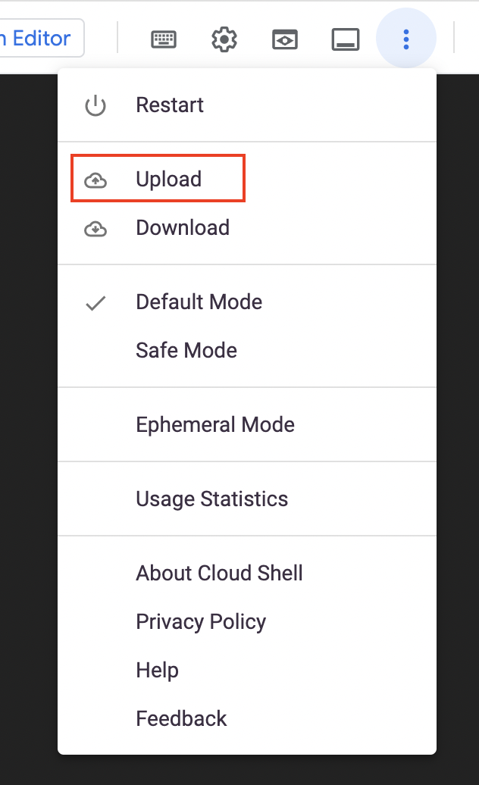
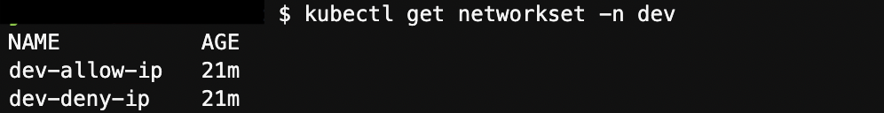

## Use GitOps in an Azure Arc-enabled Kubernetes cluster for managing Calico Network Policy

 > **Disclaimer: This scenario was contributed by the Tigera Project Calico team as part of the "Jumpstart Friends" program**

<p align="center"></p>

The following README will guide you how to use GitOps [GitOps for Azure Arc](https://docs.microsoft.com/en-us/azure/azure-arc/kubernetes/tutorial-use-gitops-connected-cluster) in an Azure Arc connected Kubernetes cluster to manage Calico Network Policy [Network Policy](https://projectcalico.docs.tigera.io/about/about-network-policy).

> **NOTE: This guide assumes you already deployed an Amazon Elastic Kubernetes Service (EKS) or Google Kubernetes Engine (GKE) cluster and connected it to Azure Arc. If you haven't, this repository offers you a way to do so in an automated fashion using these Jumpstart scenarios:**

- [Deploy EKS cluster and connect it to Azure Arc using Terraform](https://azurearcjumpstart.io/azure_arc_jumpstart/azure_arc_k8s/eks/eks_terraform/)
- [Deploy GKE cluster and connect it to Azure Arc using Terraform](https://azurearcjumpstart.io/azure_arc_jumpstart/azure_arc_k8s/gke/gke_terraform/)

> **NOTE: This guide assumes you already have deployed Calico network policy in your cluster. If you haven't, you can use our installation guides for Calico open source or Calico Cloud:**

- [Deploy Calico open source in your managed public cluster](https://projectcalico.docs.tigera.io/getting-started/kubernetes/managed-public-cloud/)
- [Sign up for a Calico Cloud trial](https://www.calicocloud.io/?utm_campaign=calicocloud&utm_medium=digital&utm_source=microsoft)

Calico Network Policy provides the [Network Set](https://projectcalico.docs.tigera.io/archive/v3.21/reference/resources/networkset) resource to label an arbitrary set of IP subnetworks/CIDRs, allowing it to be matched by Calico policy.

In this scenario, we will be using GitOps in an Azure Arc connected Kubernetes cluster to update `Network Sets`. The changes will be committed to a Git repository, and Flux will pick up these changes and apply them to the cluster.

## Prerequisites

- Clone the Azure Arc Jumpstart repository

    ```shell
    git clone https://github.com/microsoft/azure_arc.git
    ```

- Fork the [Tigera Azure-arc-demo repository](https://github.com/tigera-solutions/Azure-arc-demo)

- [Install or update Azure CLI to version 2.25.0 and above](https://docs.microsoft.com/en-us/cli/azure/install-azure-cli?view=azure-cli-latest). Use the following command to check your current installed version.

  ```shell
  az --version
  ```

- As mentioned, this guide starts at the point where you already have an Azure Arc connected EKS/GKE cluster.

    

    

## Azure Arc Kubernetes GitOps Configuration for Calico

* We will use a shell script [*calico_k8sconfig_gitops*](https://github.com/microsoft/azure_arc/tree/main/docs/azure_arc_jumpstart/azure_arc_k8s/day2/multi_distributions/gitops/calico_k8sconfig_gitops.sh) against the GKE/EKS connected cluster.You can use Cloud Shell in order to keep your local environment clean.

[Google Cloud Shell](https://cloud.google.com/shell)
[AWS Cloud Shell](https://aws.amazon.com/cloudshell/)

* Edit the environment variables in the [*calico_k8sconfig_gitops*](https://github.com/microsoft/azure_arc/tree/main/docs/azure_arc_jumpstart/azure_arc_k8s/day2/multi_distributions/gitops/calico_k8sconfig_gitops.sh) shell script to match your parameters, upload it to the Cloud Shell environment and run it using the ```. ./calico_k8sconfig_gitops.sh``` command to create the GitOps configuration.

    > **Note: The extra dot is due to the script having an *export* function and needs to have the vars exported in the same shell session as the rest of the commands.**
    > **Note: The default branch is `master`. Newer repositories have a root branch named main, in which case you need to set `--git-branch=main` in operator params.**

    

    

    The script will:

  * Login to your Azure subscription using the SPN credentials
  * Retrieve the cluster credentials (KUBECONFIG)
  * Install Helm 3 & Azure CLI & Azure Arc Extensions
  * Create the GitOps configuration and deploy the Flux operator and Memcached on the Azure Arc connected cluster
  * Deploy the `dev` utilities as well as `network policy` and `network set` on the Azure Arc connected cluster

    > **Disclaimer: For the purpose of this guide, notice that "*git-poll-interval 30s*" is set. The 30 seconds interval is useful for demo purposes since changes can be observed quickly but it is recommended to have a longer interval in your production environment (default value is 5min)**

* Once the script completes running, a GitOps configuration will be created with all the resources deployed in your Kubernetes cluster. Note that it takes a few minutes for the configuration to change it's Operator state status from "Pending" to "Installed".

    

    

- Check whether the Flux operator is installed in an Azure Arc connected cluster by running the ```kubectl get pods -n calico-config``` command.
  > You should see the following pods running.

  


## Confirm Network Sets exist in the Azure Arc connected cluster

- Check `Network Sets` are installed in an Azure Arc connected Cluster by running the ```kubectl get networkset -n dev ```  command.
  > You should see the following output.

  

- Check that the `dev-deny-ip` and `dev-allow-ip` CIDRs in the cluster are the same as your the definitions in the Git repository by running the ```kubectl get networkset -n dev dev-deny-ip -o yaml ``` and ```kubectl get networkset -n dev dev-allow-ip -o yaml ``` command.
  > You should see the following output.
    
    

- You can also verify  `Network Sets` in the Calico Cloud dashboard.

    

- Modify the CIDRs by editing the `tigera-allow.yaml` and `tigera-deny.yaml` files in the `networkset` folder and commit the changes to your Git repository. Flux will pickup these changes and apply them to the cluster.
  
  
  
  > **NOTE: The sync process can take some time depending on your platform, you can restart your Flux operator to trigger the sync.**

- Check that the `dev-deny-ip` and `dev-allow-ip` CIDRs have been updated in your Azure Arc connected cluster by running the ```kubectl get networkset -n dev dev-deny-ip -o yaml ``` and ```kubectl get networkset -n dev dev-allow-ip -o yaml ``` commands.
  > You should see the following output.
  
  

- You can also verify that `Network Sets` have been updated in the Calico Cloud dashboard.

    


## Clean up environment

Complete the following steps to clean up your environment.

- For each Azure Arc connected cluster in your resource group, click the _GitOps_ page, and delete `calico-gitops-test`.
  

- Delete the k8s-configuration `calico-gitops-test` by running the following command:

    ```shell
    az k8s-configuration delete --name calico-gitops-test \
    --cluster-name $arcClusterName --resource-group $resourceGroup \
    --cluster-type connectedClusters
    ```

- You can use follow these Jumpstart scenarios below for deleting the clusters:
- [Deploy EKS cluster and connect it to Azure Arc using Terraform](https://azurearcjumpstart.io/azure_arc_jumpstart/azure_arc_k8s/eks/eks_terraform/)
- [Deploy GKE cluster and connect it to Azure Arc using Terraform](https://azurearcjumpstart.io/azure_arc_jumpstart/azure_arc_k8s/gke/gke_terraform/)
