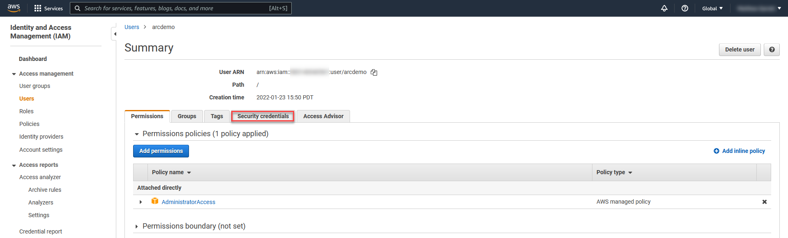

## Alternative Deployment: Deploy EKS cluster and connect it to Azure Arc using Terraform and GitHub Actions

The following Jumpstart scenario will guide you on how to use the provided [Terraform](https://www.terraform.io/) plan to deploy an Amazon Web Services (AWS) [Kubernetes Engine cluster](https://aws.amazon.com/eks/) and connected it as an Azure Arc cluster resource. Alternatively you can deploy this Jumpstart scenario using Command-Line Tools, [here the guide](_index.md).

## Prerequisites

* Clone the Azure Arc Jumpstart repository

    ```shell
    git clone https://github.com/microsoft/azure_arc.git
    ```

* [Create a free Amazon Web Service's account](https://aws.amazon.com/free/)

* [Create a Terraform Cloud account](https://learn.hashicorp.com/tutorials/terraform/cloud-sign-up?in=terraform/cloud-get-started#create-an-account)

    * Create API Token to get access to Terraform Cloud Workspace. Copy and save your token to use it later.

        

* Login to Azure CLI

    To be able to complete the scenario and its related automation, you will need access to an Azure subscription in which you are assigned the role of at least "Contributor".

    ```shell
    az login
    az account set --subscription "<SubscriptionID>"
    ```

    For example:

    ```shell
    az account set --subscription "d4617bb1-551c-4450-88a7-f3e4d17cbe46"
    ```

* [Enable subscription with](https://docs.microsoft.com/en-us/azure/azure-resource-manager/management/resource-providers-and-types#register-resource-provider) the two resource providers for Azure Arc-enabled Kubernetes. Registration is an asynchronous process, and registration may take approximately 10 minutes.

  ```shell
  az provider register --namespace Microsoft.Kubernetes
  az provider register --namespace Microsoft.KubernetesConfiguration
  az provider register --namespace Microsoft.ExtendedLocation
  ```

  You can monitor the registration process with the following commands:

  ```shell
  az provider show -n Microsoft.Kubernetes -o table
  az provider show -n Microsoft.KubernetesConfiguration -o table
  az provider show -n Microsoft.ExtendedLocation -o table
  ```

* Install the Azure Arc for Kubernetes CLI extensions ***connectedk8s*** and ***k8s-configuration***:

  ```shell
  az extension add --name connectedk8s
  az extension add --name k8s-configuration
  ```

  > **NOTE:  If you already used this guide before and/or have the extensions installed, use the bellow commands:**

  ```shell
  az extension update --name connectedk8s
  az extension update --name k8s-configuration
  ```
  
* Create service principal with a secret and save it to use it later.

  ```shell
  az ad sp create-for-rbac --name "AzureArc" --role contributor \
                            --scopes /subscriptions/{subscription-id}/resourceGroups/{resource-group} \
                            --sdk-auth
                            
  # Replace {subscription-id}, {resource-group} with the subscription, resource group details

  # The command should output a JSON object similar to this:

 
  {
    "clientId": "<GUID>",
    "clientSecret": "<STRING>",
    "subscriptionId": "<GUID>",
    "tenantId": "<GUID>",
    "resourceManagerEndpointUrl": "<URL>"
    (...)
  }
  ```
  
* Create a Terraform Cloud Workspace
  
  * Login your Terraform Cloud account and create Workspace, workflow type CLI-driven

    
    
  * Define a name for your Workspace, you can type the name "azure_arc".

    

* Create AWS User IAM Key

  An access key grants programmatic access to your resources. To create an AWS Access Key for a user:

  * Navigate to the [IAM Access page](https://console.aws.amazon.com/iam/home#/home) and select the **Users** from the side menu.

    

  * Select the **User** you want to create the access key for.

    

  * Select **Security credentials** of the **User** selected.

    

  * Under **Access Keys** select **Create Access Keys**.

    

  * In the popup window it will show you the ***Access key ID*** and ***Secret access key***. Save both of these values to configure **AWS CLI** later

    

  * Set your credentials via the AWS_ACCESS_KEY_ID and AWS_SECRET_ACCESS_KEY, environment variables on Terraform Cloud, representing your AWS Access Key and AWS Secret Key.

  * Create variables on your Terraform Cloud Workspace. Variables should be created as a enviroment varibles and sensitive.

    
    
  

## Deployment

* Create a Terraform GitHub Workflow 

    


* Update GitHub Worflow by copying and pasting content file from "[tf-deploy-eks.yml](https://github.com/oaviles/azure_arc/blob/gh-action_deployment/azure_arc_k8s_jumpstart/eks/terraform/github_option/tf-deploy-eks.yml)" in your GitHub Workflow.

    
    
* Create GitHub Secret called "TF_API_TOKEN" in your GitHub Repo and copy the value of your Terraform Cloud Token

    

* Update "[main.tf](https://github.com/oaviles/azure_arc/blob/gh-action_deployment/azure_arc_k8s_jumpstart/eks/terraform/github_option/main.tf)" file with your Terraform Cloud Organization Name and Terraform Cloud Workspace Name

    


* Run GitHub Workflow to Deploy EKS on your AWS Account, run GitHub Workflow manually. 

    
    
* Wait for 12 minutes or more to finish GitHub Workflow. 

    
    
* Verify EKS deployment

  Once done, you will have a ready EKS cluster under the ***Elastic Kubernetes Service*** section in your AWS console.

  

  

## Connecting to Azure Arc

* Create a new GitHub Workflow from scratch

    
    
    
* Update your new GitHub Workflow with content file "[connect-eks-and-arc.yml](https://github.com/oaviles/azure_arc/blob/gh-action_deployment/azure_arc_k8s_jumpstart/eks/terraform/github_option/connect-eks-and-arc.yml)"

    
    
* Create the following GitHub Secrets in your GitHub Repo, these 8 secrests are needed to run workflow.
    - AWS Secrets: AWS_ACCESS_KEY_ID, AWS_SECRET_ACCESS_KEY, EKSCLUSTER_NAME
    - Azure Service Principal Secrets: CLIENTID, CLIENTSECRET, TENANTID
    - Other Azure Secrets: AZURE_RG, AZURE_REGION

* Run GitHub Workflow to connect EKS to Azure Arc, run GitHub Workflow manually. 

    
    
* Wait for 7 minutes or more to finish GitHub Workflow. 

       

* Upon completion, you will have your EKS cluster connect as a new Azure Arc-enabled Kubernetes resource in a new resource group.

  

  

## Delete the deployment

In Azure, the most straightforward way is to delete the cluster or the resource group via the Azure Portal or through the CLI.

```shell
az group delete --name "Arc-EKS-Demo"
```


To delete EKS cluster, you must sign in to the AWS Console and delete EKS Cluster.
