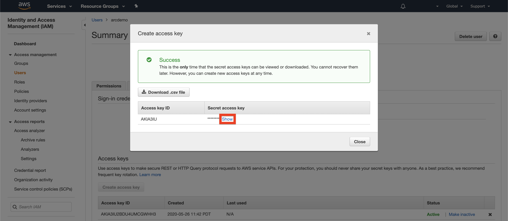
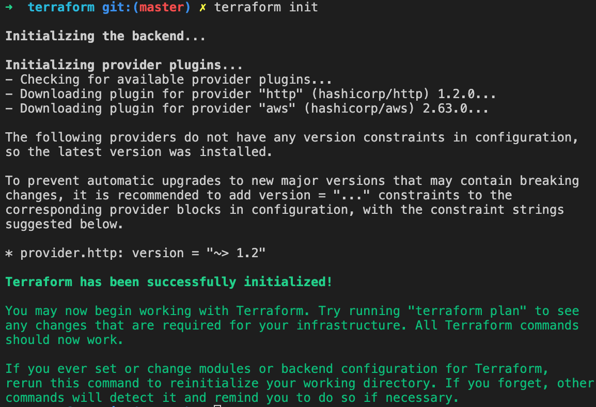
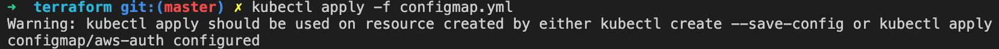
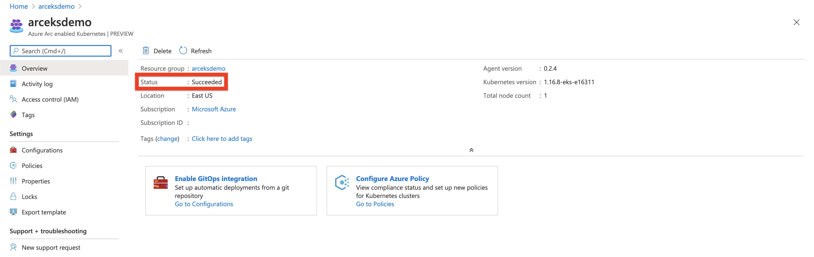
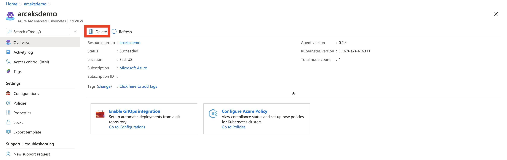
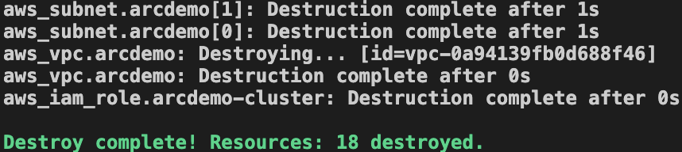

## Deploy EKS cluster and connect it to Azure Arc using Terraform

The following README will guide you on how to use the provided [Terraform](https://www.terraform.io/) plan to deploy an Amazon Web Services (AWS) [Kubernetes Engine cluster](https://aws.amazon.com/eks/) and connected it as an Azure Arc cluster resource.

## Prerequisites

* Clone the Azure Arc Jumpstart repository

    ```console
    git clone https://github.com/microsoft/azure_arc.git
    ```

* [Install](https://docs.aws.amazon.com/cli/latest/userguide/cli-chap-install.html) and [Configure](https://docs.aws.amazon.com/cli/latest/userguide/cli-chap-configure.html#cli-quick-configuration) AWS CLI

* Install **wget** package (required for the eks module)
  * [Windows](https://builtvisible.com/download-your-website-with-wget/)
  * [Mac](https://www.cyberciti.biz/faq/howto-install-wget-om-mac-os-x-mountain-lion-mavericks-snow-leopard/)
  * [Linux](https://www.tecmint.com/install-wget-in-linux/)

* [Install AWS IAM Authenticator](https://docs.aws.amazon.com/eks/latest/userguide/install-aws-iam-authenticator.html)

* [Install or update Azure CLI](https://docs.microsoft.com/en-us/cli/azure/install-azure-cli?view=azure-cli-latest). **Azure CLI should be running version 2.7** or later. Use ```az --version``` to check your current installed version.

* [Create a free Amazon Web Service's account](https://aws.amazon.com/free/)

* [Install Helm 3](https://helm.sh/docs/intro/install/)

* [Install Terraform >=0.12](https://learn.hashicorp.com/terraform/getting-started/install.html)

* Create Azure service principal (SP)

    To connect a Kubernetes cluster to Azure Arc, Azure service principal assigned with the "Contributor" role is required. To create it, login to your Azure account run the below command (this can also be done in [Azure Cloud Shell](https://shell.azure.com/)).

    ```console
    az login
    az ad sp create-for-rbac -n "<Unique SP Name>" --role contributor
    ```

    For example:

    ```console
    az ad sp create-for-rbac -n "http://AzureArcK8s" --role contributor
    ```

    Output should look like this:

    ```json
    {
    "appId": "XXXXXXXXXXXXXXXXXXXXXXXXXXXX",
    "displayName": "AzureArcK8s",
    "name": "http://AzureArcK8s",
    "password": "XXXXXXXXXXXXXXXXXXXXXXXXXXXX",
    "tenant": "XXXXXXXXXXXXXXXXXXXXXXXXXXXX"
    }
    ```

    > **Note: It is optional but highly recommended to scope the SP to a specific [Azure subscription and resource group](https://docs.microsoft.com/en-us/cli/azure/ad/sp?view=azure-cli-latest)**

* Enable subscription for two providers for Azure Arc enabled Kubernetes
  Registration is an asynchronous process, and registration may take approximately 10 minutes.

  ```console
  az provider register --namespace Microsoft.Kubernetes
  az provider register --namespace Microsoft.KubernetesConfiguration
  ```

  You can monitor the registration process with the following commands:

  ```console
  az provider show -n Microsoft.Kubernetes -o table
  az provider show -n Microsoft.KubernetesConfiguration -o table
  ```

* Install the Azure Arc for Kubernetes CLI extensions ***connectedk8s*** and ***k8sconfiguration***:

  ```console
  az extension add --name connectedk8s
  az extension add --name k8sconfiguration
  ```

  > **Note: If you already used this guide before and/or have the extensions installed, use the ```az extension update --name connectedk8s``` and the ```az extension update --name k8sconfiguration``` commands.**

* Create AWS User IAM Key

  An access key grants programmatic access to your resources. To create an AWS Access Key for a user:

  * Navigate to the [IAM Access page](https://console.aws.amazon.com/iam/home#/home).

    

  * Select the **Users** from the side menu.

    

  * Select the **User** you want to create the access key for.

    

  * Select ***Security credentials** of the **User** selected.

    

  * Under **Access Keys** select **Create Access Keys**.

    

  * In the popup window it will show you the ***Access key ID*** and ***Secret access key***. Save both of these values to configure **AWS CLI** later

    

  * Set your credentials via the AWS_ACCESS_KEY_ID and AWS_SECRET_ACCESS_KEY, environment variables, representing your AWS Access Key and AWS Secret Key.

      ```console
      export AWS_ACCESS_KEY_ID="anaccesskey"
      export AWS_SECRET_ACCESS_KEY="asecretkey"
      export AWS_DEFAULT_REGION="us-west-2"
      ```

## Deployment

* Navigate to the folder that has **EKS** terraform binaries.

  ```console
  cd azure_arc_k8s_jumpstart/eks/terraform
  ```

* Run the ```terraform init``` command which will initialize Terraform, creating the state file to track our work:

  

* Deploy EKS by running the ```terraform apply --auto-approve``` command.
  Wait for the plan to finish:

  

* You will need the configuration output from Terraform in order to use kubectl to interact with your new cluster. Create your kube configuration directory, and output the configuration from Terraform into the config file using the Terraform output command:

  ```console
  mkdir ~/.kube/
  terraform output kubeconfig>~/.kube/config
  ```
  
  Check to see if cluster is discoverable by ```kubectl``` by running:

  ```console
  kubectl version
  ```

  Output should look similar to this:
  
  ```console
  Client Version: version.Info{Major:"1", Minor:"15", GitVersion:"v1.15.5", GitCommit:"20c265fef0741dd71a66480e35bd69f18351daea", GitTreeState:"clean", BuildDate:"2019-10-15T19:16:51Z", GoVersion:"go1.12.10", Compiler:"gc", Platform:"darwin/amd64"}
  Server Version: version.Info{Major:"1", Minor:"16+", GitVersion:"v1.16.8-eks-e16311", GitCommit:"e163110a04dcb2f39c3325af96d019b4925419eb", GitTreeState:"clean", BuildDate:"2020-03-27T22:37:12Z", GoVersion:"go1.13.8", Compiler:"gc", Platform:"linux/amd64"}
  ```

* Configure EKS Nodes to communicate to EKS Control Plane

  Now let’s add the ConfigMap to the cluster from Terraform as well. The ConfigMap is a Kubernetes configuration, in this case for granting access to our EKS cluster. This ConfigMap allows our ec2 instances in the cluster to communicate with the EKS master, as well as allowing our user account access to run commands against the cluster. You’ll run the Terraform output command to a file, and the kubectl apply command to apply that file:

  ```console
  terraform output config_map_aws_auth > configmap.yml
  kubectl apply -f configmap.yml
  ```

  

  Once this is complete, you should see your nodes from your autoscaling group either starting to join or joined to the cluster. Once the second column reads Ready the node can have deployments pushed to it. Again, your output may vary here:

  ```console
  kubectl get nodes -o wide
  ```

  

* Verify EKS deployment

  Once done, you will have a ready EKS cluster under the ***Elastic Kubernetes Service*** section in your AWS console.

  

  

## Connecting to Azure Arc

Now that you have a running EKS cluster, lets connect the EKS cluster to Azure Arc by:

* Login to previously created [***Service Principal***](#prerequisites)

    ```console
    az login --service-principal -u mySpnClientId -p mySpnClientSecret --tenant myTenantID
    ```

* Create a resource group

   ```console
   az group create --name arceksdemo -l EastUS -o table
   ```

   > **Note: Azure Arc enabled Kubernetes is currently supported in *East US* and *West Europe***

* Deploy Arc binaries using Azure CLI:

  ```console
  az connectedk8s connect --name arceksdemo --resource-group arceksdemo --location 'eastus' --tags 'Project=jumpstart_azure_arc_k8s'
  ```

* Upon completion, you will have your EKS cluster connect as a new Azure Arc enabled Kubernetes resource in a new resource group.

  

  

  

## Delete the deployment

In Azure, the most straightforward way is to delete the cluster or the resource group via the Azure Portal or through the CLI.

```console
az group delete --name arceksdemo
```




On your AWS portal, select the cluster and delete it or alternatively, you can use the ```terraform destroy --auto-approve``` command.



