## Deploy EKS cluster and connect it to Azure Arc using Terraform

The following README will guide you on how to use the provided [Terraform](https://www.terraform.io/) plan to deploy an Amazon Web Services (AWS) [Kubernetes Engine cluster](https://aws.amazon.com/eks/) and connected it as an Azure Arc cluster resource.

## Prerequisites

* Clone the Azure Arc Jumpstart repository

    ```shell
    git clone https://github.com/microsoft/azure_arc.git
    ```

* [Install](https://docs.aws.amazon.com/cli/latest/userguide/cli-chap-install.html) and [Configure](https://docs.aws.amazon.com/cli/latest/userguide/cli-chap-configure.html#cli-quick-configuration) AWS CLI

* [Install AWS IAM Authenticator](https://docs.aws.amazon.com/eks/latest/userguide/install-aws-iam-authenticator.html)

* [Install or update Azure CLI to version 2.25.0 and above](https://docs.microsoft.com/en-us/cli/azure/install-azure-cli?view=azure-cli-latest). Use the below command to check your current installed version.

  ```shell
  az --version
  ```

* [Create a free Amazon Web Service's account](https://aws.amazon.com/free/)

* [Install Terraform >=1.0](https://learn.hashicorp.com/terraform/getting-started/install.html)

* [Install Kubectl](https://kubernetes.io/docs/tasks/tools/)

* Login to Azure CLI

    To be able to complete the scenario and its related automation, you will need access to an Azure subscription in which you are assigned the role of at least "Contributor".

    ```shell
    az login
    az account set --subscription "<SubscriptionID>"
    ```

    For example:

    ```shell
    az account set --subscription "d4617bb1-551c-4450-88a7-f3e4d17cbe46"
    ```

* [Enable subscription with](https://docs.microsoft.com/en-us/azure/azure-resource-manager/management/resource-providers-and-types#register-resource-provider) the two resource providers for Azure Arc-enabled Kubernetes. Registration is an asynchronous process, and registration may take approximately 10 minutes.

  ```shell
  az provider register --namespace Microsoft.Kubernetes
  az provider register --namespace Microsoft.KubernetesConfiguration
  az provider register --namespace Microsoft.ExtendedLocation
  ```

  You can monitor the registration process with the following commands:

  ```shell
  az provider show -n Microsoft.Kubernetes -o table
  az provider show -n Microsoft.KubernetesConfiguration -o table
  az provider show -n Microsoft.ExtendedLocation -o table
  ```

* Install the Azure Arc for Kubernetes CLI extensions ***connectedk8s*** and ***k8s-configuration***:

  ```shell
  az extension add --name connectedk8s
  az extension add --name k8s-configuration
  ```

  > **NOTE:  If you already used this guide before and/or have the extensions installed, use the bellow commands:**

  ```shell
  az extension update --name connectedk8s
  az extension update --name k8s-configuration
  ```

* Create AWS User IAM Key

  An access key grants programmatic access to your resources. To create an AWS Access Key for a user:

  * Navigate to the [IAM Access page](https://console.aws.amazon.com/iam/home#/home) and select the **Users** from the side menu.

    

  * Select the **User** you want to create the access key for.

    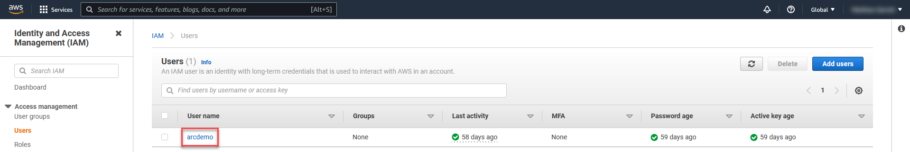

  * Select **Security credentials** of the **User** selected.

    

  * Under **Access Keys** select **Create Access Keys**.

    

  * In the popup window it will show you the ***Access key ID*** and ***Secret access key***. Save both of these values to configure **AWS CLI** later

    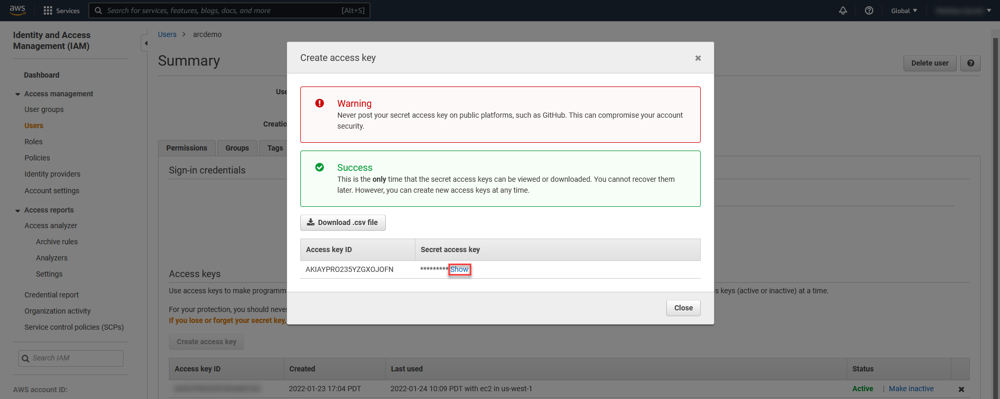

  * Set your credentials via the AWS_ACCESS_KEY_ID and AWS_SECRET_ACCESS_KEY, environment variables, representing your AWS Access Key and AWS Secret Key.

      ```shell
      export TF_VAR_AWS_ACCESS_KEY_ID="<AWS ACCESS KEY ID>"
      export TF_VAR_AWS_SECRET_ACCESS_KEY="<AWS ACCESS KEY SECRET>"
      export TF_VAR_AWS_DEFAULT_REGION="us-west-2"
      ```

## Deployment

* Navigate to the folder that has **EKS** terraform binaries.

  ```shell
  cd azure_arc_k8s_jumpstart/eks/terraform
  ```

* Run the ```terraform init``` command which will initialize Terraform, creating the state file to track our work:

  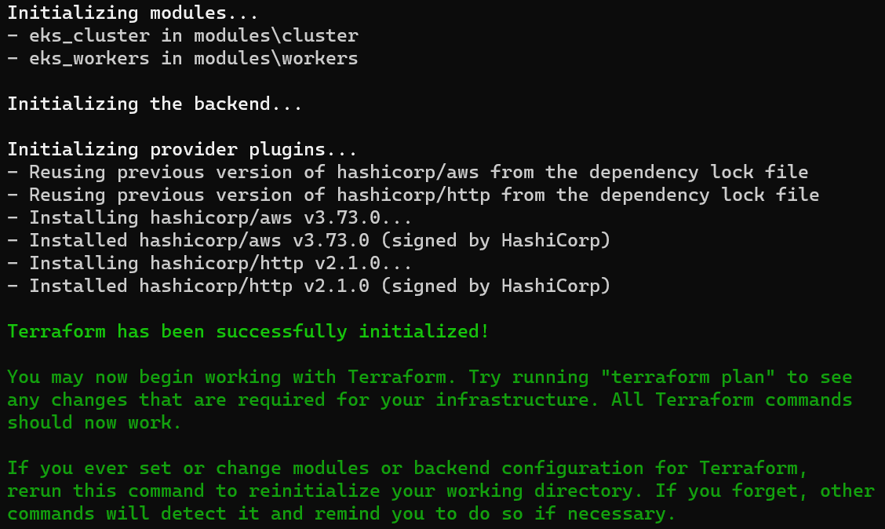

* Plan the Terraform deployment by running the ```terraform plan -out=infra.out``` command.
  Wait for the plan to finish:

  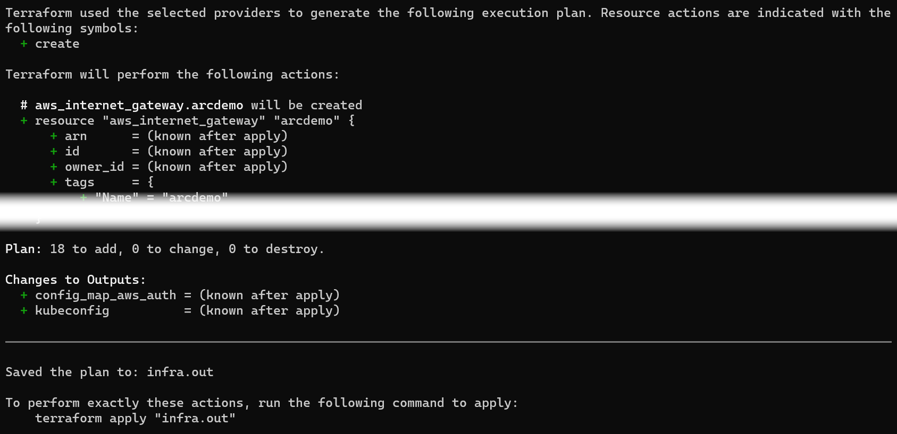

  > **NOTE:  Screenshot has been clipped for brevity**

* Deploy EKS by running the ```terraform apply "infra.out"``` command.
  Wait for the plan to finish:

  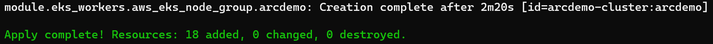

* You will need the configuration output from Terraform in order to use kubectl to interact with your new cluster. Create your kube configuration directory, and output the configuration from Terraform into the config file using the Terraform output command:

  **Mac/Linux**
  ```shell
  mkdir ~/.kube/
  terraform output -raw kubeconfig > ~/.kube/config
  ```

  **Windows**
  ```text
  mkdir %USERPROFILE%\.kube
  terraform output -raw kubeconfig > %USERPROFILE%\.kube\config
  ```

  Check to see if cluster is discoverable by ```kubectl``` by running:

  ```shell
  kubectl version
  ```

  Output should look similar to this:

  ```shell
  Client Version: version.Info{Major:"1", Minor:"23", GitVersion:"v1.23.0", GitCommit:"ab69524f795c42094a6630298ff53f3c3ebab7f4", GitTreeState:"clean", BuildDate:"2021-12-07T18:16:20Z", GoVersion:"go1.17.3", Compiler:"gc", Platform:"windows/amd64"}
  Server Version: version.Info{Major:"1", Minor:"21+", GitVersion:"v1.21.5-eks-bc4871b", GitCommit:"5236faf39f1b7a7dabea8df12726f25608131aa9", GitTreeState:"clean", BuildDate:"2021-10-29T23:32:16Z", GoVersion:"go1.16.8", Compiler:"gc", Platform:"linux/amd64"}
  ```

* Configure EKS Nodes to communicate to EKS Control Plane

  Now let’s add the ConfigMap to the cluster from Terraform as well. The ConfigMap is a Kubernetes configuration, in this case for granting access to our EKS cluster. This ConfigMap allows our ec2 instances in the cluster to communicate with the EKS master, as well as allowing our user account access to run commands against the cluster. You’ll run the Terraform output command to a file, and the kubectl apply command to apply that file:

  ```shell
  terraform output -raw config_map_aws_auth > configmap.yml
  kubectl apply -f configmap.yml
  ```

  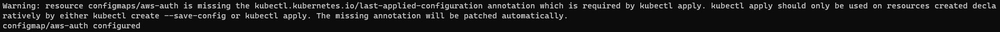

  Once this is complete, you should see your nodes from your autoscaling group either starting to join or joined to the cluster. Once the second column reads Ready the node can have deployments pushed to it. Again, your output may vary here:

  ```shell
  kubectl get nodes -o wide
  ```

  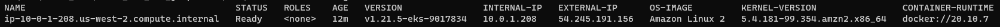

* Verify EKS deployment

  Once done, you will have a ready EKS cluster under the ***Elastic Kubernetes Service*** section in your AWS console.

  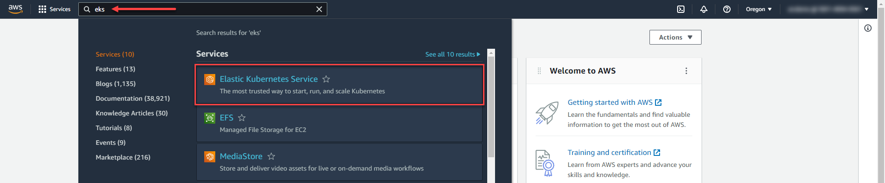

  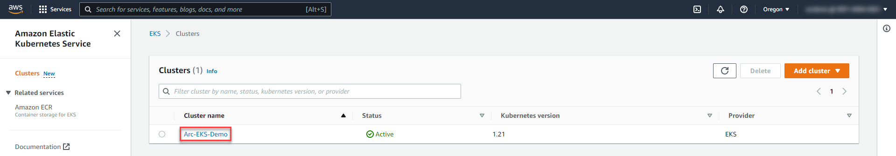

## Connecting to Azure Arc

Now that you have a running EKS cluster, lets connect the EKS cluster to Azure Arc by:

* Create a resource group

   ```shell
   az group create --name "Arc-EKS-Demo" --location "eastus"
   ```

   > **NOTE:  Before deploying, make sure to check the Azure Arc-enabled Kubernetes region availability [page](https://azure.microsoft.com/en-us/global-infrastructure/services/?products=azure-arc).**

* Deploy Arc binaries using Azure CLI:

  ```shell
  az connectedk8s connect --name "Arc-EKS-Demo" --resource-group "Arc-EKS-Demo" --location "eastus" --tags "Project=jumpstart_azure_arc_k8s"
  ```

* Upon completion, you will have your EKS cluster connect as a new Azure Arc-enabled Kubernetes resource in a new resource group.

  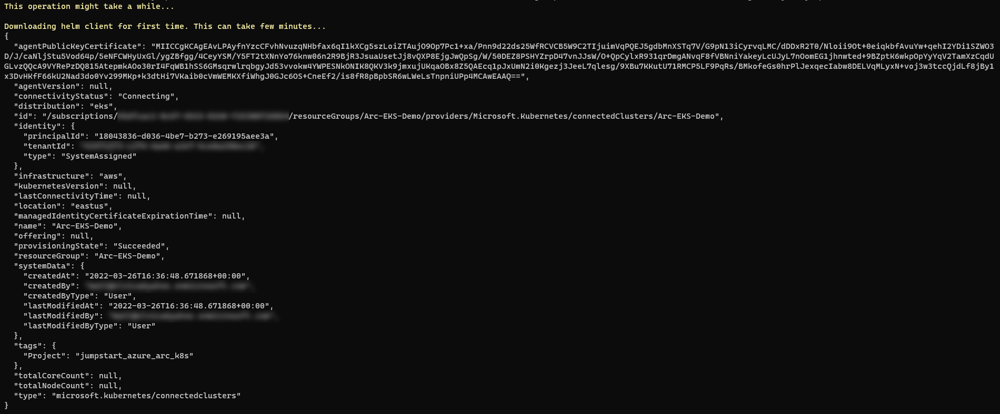

  

  

## Delete the deployment

In Azure, the most straightforward way is to delete the cluster or the resource group via the Azure Portal or through the CLI.

```shell
az group delete --name "Arc-EKS-Demo"
```

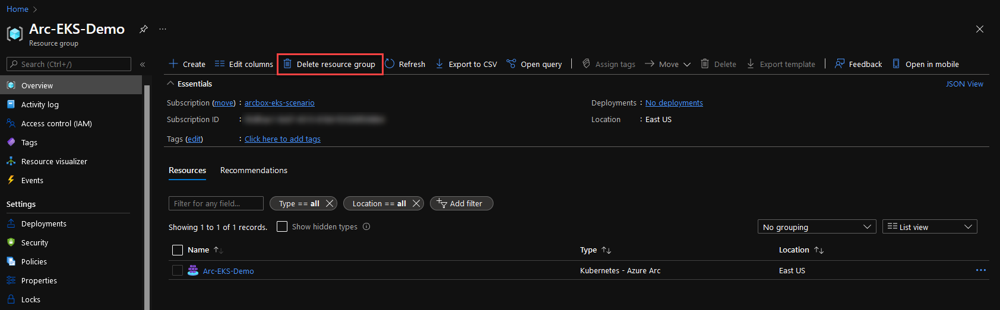

To delete the EKS cluster and supporting components, use the ```terraform destroy --auto-approve``` command.

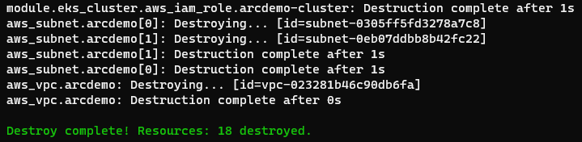
