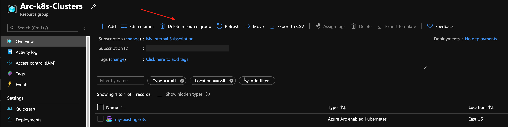

## Connect an existing Kubernetes cluster to Azure Arc

The following README will guide you on how to connect an existing Kubernetes cluster to Azure Arc using a simple shell script.

## Prerequisites

* Make sure your *kubeconfig* file is configured properly and you are working against your [k8s cluster context](https://kubernetes.io/docs/tasks/access-application-cluster/configure-access-multiple-clusters/).

* (Optional) To simplify work against multiple k8s contexts, consider using [kubectx](https://github.com/ahmetb/kubectx).

* [Install or update Azure CLI to version 2.25.0 and above](https://docs.microsoft.com/en-us/cli/azure/install-azure-cli?view=azure-cli-latest). Use the below command to check your current installed version.

  ```shell
  az --version
  ```

* [Install and Set Up kubectl](https://kubernetes.io/docs/tasks/tools/install-kubectl/)

* [Install Helm 3](https://helm.sh/docs/intro/install/). If you are on a Windows environment, a recommended and easy way is to use the [Helm 3 Chocolatey package](https://chocolatey.org/packages/kubernetes-helm).

* Create Azure service principal (SP)

    To be able to complete the scenario and its related automation, Azure service principal assigned with the “Contributor” role is required. To create it, login to your Azure account run the below command (this can also be done in [Azure Cloud Shell](https://shell.azure.com/)).

    ```shell
    az login
    subscriptionId=$(az account show --query id --output tsv)
    az ad sp create-for-rbac -n "<Unique SP Name>" --role "Contributor" --scopes /subscriptions/$subscriptionId
    ```

    For example:

    ```shell
    az login
    subscriptionId=$(az account show --query id --output tsv)
    az ad sp create-for-rbac -n "JumpstartArcK8s" --role "Contributor" --scopes /subscriptions/$subscriptionId
    ```

    Output should look like this:

    ```json
    {
    "appId": "XXXXXXXXXXXXXXXXXXXXXXXXXXXX",
    "displayName": "JumpstartArcK8s",
    "password": "XXXXXXXXXXXXXXXXXXXXXXXXXXXX",
    "tenant": "XXXXXXXXXXXXXXXXXXXXXXXXXXXX"
    }
    ```

    > **NOTE: If you create multiple subsequent role assignments on the same service principal, your client secret (password) will be destroyed and recreated each time. Therefore, make sure you grab the correct password**.

    > **NOTE: The Jumpstart scenarios are designed with as much ease of use in-mind and adhering to security-related best practices whenever possible. It is optional but highly recommended to scope the service principal to a specific [Azure subscription and resource group](https://docs.microsoft.com/cli/azure/ad/sp?view=azure-cli-latest) as well considering using a [less privileged service principal account](https://docs.microsoft.com/azure/role-based-access-control/best-practices)**

* [Enable subscription with](https://docs.microsoft.com/en-us/azure/azure-resource-manager/management/resource-providers-and-types#register-resource-provider) the two resource providers for Azure Arc-enabled Kubernetes. Registration is an asynchronous process, and registration may take approximately 10 minutes.

  ```shell
  az provider register --namespace Microsoft.Kubernetes
  az provider register --namespace Microsoft.KubernetesConfiguration
  az provider register --namespace Microsoft.ExtendedLocation
  ```

  You can monitor the registration process with the following commands:

  ```shell
  az provider show -n Microsoft.Kubernetes -o table
  az provider show -n Microsoft.KubernetesConfiguration -o table
  az provider show -n Microsoft.ExtendedLocation -o table
  ```

* Create a new Azure resource group where you want your cluster(s) to show up.

  ```shell
  az group create -l <Azure Region> -n <resource group name>
  ```

  For example:

  ```shell
  az group create -l eastus -n Arc-k8s-Clusters
  ```

  > **Note: Currently, Azure Arc-enabled Kubernetes resource creation is supported only in the following locations: eastus, westeurope. Use the --location (or -l) flag to specify one of these locations.**

  

* Change the following environment variables according to your Azure service principal name and Azure environment.

  If using shell:

  ```shell
  export appId='<Your Azure service principal name>'
  export password='<Your Azure service principal password>'
  export tenantId='<Your Azure tenant ID>'
  export resourceGroup='<Azure resource group name>'
  export arcClusterName='<The name of your k8s cluster as it will be shown in Azure Arc>'
  ```

  If using PowerShell:

  ```powershell
  $env:appId=<Your Azure service principal name>
  $env:password=<Your Azure service principal password>
  $env:tenantId=<Your Azure tenant ID>
  $env:resourceGroup=<Azure resource group name>
  $env:arcClusterName=<The name of your k8s cluster as it will be shown in Azure Arc>
  ```

## Deployment

* Install the Azure Arc for Kubernetes CLI extensions ***connectedk8s*** and ***k8s-configuration***:

  ```shell
  az extension add --name connectedk8s
  az extension add --name k8s-configuration
  ```

  > **Note: If you already used this guide before and/or have the extensions installed, use the bellow commands:**

  ```shell
  az extension update --name connectedk8s
  az extension update --name k8s-configuration
  ```

* Login to your Azure subscription using the SP you created.  

  If using shell:

  ```shell
  az login --service-principal --username $appId --password $password --tenant $tenantId
  ```

  If using PowerShell:

  ```powershell
  az login --service-principal --username $env:appId --password $env:password --tenant $env:tenantId
  ```

* If you are working in a Linux OS or MacOS environment, make sure you are the owner of the following:

  ```shell
  sudo chown -R $USER /home/${USER}/.kube
  sudo chown -R $USER /home/${USER}/.kube/config
  sudo chown -R $USER /home/${USER}/.azure/config
  sudo chown -R $USER /home/${USER}/.azure
  sudo chmod -R 777 /home/${USER}/.azure/config
  sudo chmod -R 777 /home/${USER}/.azure
  ```

* To connect the Kubernetes cluster to Azure Arc use the below command.

  If using shell:

  ```shell
  az connectedk8s connect --name $arcClusterName --resource-group $resourceGroup
  ```

  If using PowerShell:

  ```powershell
  az connectedk8s connect --name $env:arcClusterName --resource-group $env:resourceGroup
  ```

Upon completion, you will have your Kubernetes cluster, connected as a new Azure Arc-enabled Kubernetes resource inside your resource group.


## Delete the deployment

The most straightforward way is to delete the Azure Arc-enabled Kubernetes resource is via the Azure Portal, just select cluster and delete it.


If you want to delete the entire environment, just delete the Azure resource group.


