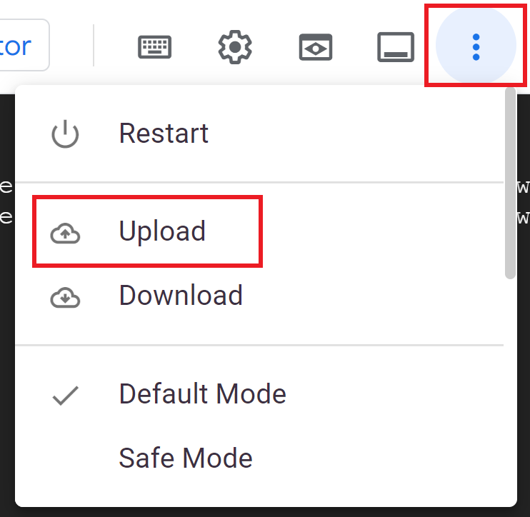
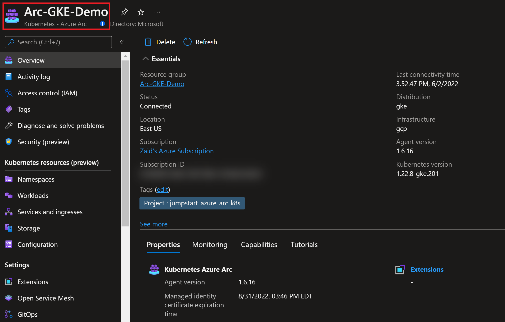

## Deploy GKE cluster and connect it to Azure Arc using Terraform

The following Jumpstart scenario will guide you on how to use the provided [Terraform](https://www.terraform.io/) plan to deploy a Google Cloud Platform [Kubernetes Engine cluster](https://cloud.google.com/kubernetes-engine) and connected it as an Azure Arc-enabled Kubernetes resource.

## Prerequisites

- Clone the Azure Arc Jumpstart repository

    ```shell
    git clone https://github.com/microsoft/azure_arc.git
    ```

- [Install or update Azure CLI to version 2.49.0 and above](https://docs.microsoft.com/cli/azure/install-azure-cli?view=azure-cli-latest). Use the below command to check your current installed version.

  ```shell
  az --version
  ```

- [Create a Google Cloud account](https://cloud.google.com/free)

- [Install Terraform >=1.1.9](https://learn.hashicorp.com/terraform/getting-started/install.html)

- Create Azure service principal (SP)

    To be able to complete the scenario and its related automation, Azure service principal assigned with the “Contributor” role is required. To create it, login to your Azure account run the below command (this can also be done in [Azure Cloud Shell](https://shell.azure.com/)).

    ```shell
    az login
    subscriptionId=$(az account show --query id --output tsv)
    az ad sp create-for-rbac -n "<Unique SP Name>" --role "Contributor" --scopes /subscriptions/$subscriptionId
    ```

    For example:

    ```shell
    az login
    subscriptionId=$(az account show --query id --output tsv)
    az ad sp create-for-rbac -n "JumpstartArcK8s" --role "Contributor" --scopes /subscriptions/$subscriptionId
    ```

    Output should look like this:

    ```json
    {
    "appId": "XXXXXXXXXXXXXXXXXXXXXXXXXXXX",
    "displayName": "JumpstartArcK8s",
    "password": "XXXXXXXXXXXXXXXXXXXXXXXXXXXX",
    "tenant": "XXXXXXXXXXXXXXXXXXXXXXXXXXXX"
    }
    ```

    > **NOTE: If you create multiple subsequent role assignments on the same service principal, your client secret (password) will be destroyed and recreated each time. Therefore, make sure you grab the correct password**.

    > **NOTE: The Jumpstart scenarios are designed with as much ease of use in-mind and adhering to security-related best practices whenever possible. It is optional but highly recommended to scope the service principal to a specific [Azure subscription and resource group](https://docs.microsoft.com/cli/azure/ad/sp?view=azure-cli-latest) as well considering using a [less privileged service principal account](https://docs.microsoft.com/azure/role-based-access-control/best-practices)**

### Create a new GCP Project

- Browse to <https://console.cloud.google.com/> and login with your Google Cloud account. Once logged in, [create a new project](https://cloud.google.com/resource-manager/docs/creating-managing-projects) named "Azure Arc Demo". After creating it, be sure to copy down the project id as it is usually different then the project name.

  

  

  

- Enable the Compute Engine API for the project, create a project Owner service account credentials and download the private key JSON file and copy the file to the directory where Terraform files are located. Change the JSON file name (for example *account.json*). The Terraform plan will be using the credentials stored in this file to authenticate against your GCP project.

  

  

  

  

  

  

  

  

  

  

  
  
  

  

  

  

- Enable the Kubernetes Engine API for the project

  

  

## Deployment

The only thing you need to do before executing the Terraform plan is to create the tfvars file which will be used by the plan. This is based on the Azure service principal you've just created and your subscription.  

- Navigate to the [terraform folder](https://github.com/microsoft/azure_arc/tree/main/azure_arc_k8s_jumpstart/gke/terraform) and create a terraform.tfvars file with values for your environment.

  ```shell
  subscriptionId="<Your Azure subscription ID>"
  servicePrincipalAppId="<Your Azure service principal App ID>"
  servicePrincipalSecret="<Your Azure service principal App Password>"
  servicePrincipalTenantId="<Your Azure tenant ID"
  gcp_project_id="<Your GCP Project ID>"
  location="<Azure Region>"
  resource_group_name="<Azure resource group name>"
  gcp_credentials_filename="<Location on the Keys JSON file>"
  gcp_region="<GCP Region to deploy resources>"
  gke_cluster_name="<GKE cluster name>"
  admin_username="<GKE control plane administrator username>"
  admin_password="<GKE control plane administrator password>"
  gke_cluster_node_count="<GKE cluster node count>"
  gke_cluster_node_machine_type="<GKE cluster node machine type>"
  ```  

  For example:

  ```shell
  subscriptionId="ea2faf71-b368-4143-b5a5-4f6bc3c6a606"
  servicePrincipalAppId="cf59c3b0-3545-43c3-bfb5-219f9b430b55"
  servicePrincipalSecret="fakeSecretValue123458125712ahjeacjh"
  servicePrincipalTenantId="3eb88a17-b9ae-4bdc-bd69-69a22255968d"
  gcp_project_id="azure-arc-demo-352117"
  location="eastus"
  resource_group_name="Arc-GKE-Demo"
  gcp_credentials_filename="account.json"
  gcp_region="us-west1"
  gke_cluster_name="arc-gke-demo"
  admin_username="arcdemo"
  admin_password="ArcDemo1234567!!"
  gke_cluster_node_count=1
  gke_cluster_node_machine_type="n1-standard-2"
  ```

- Run the *`terraform init`* command which will download the required terraform providers.

  

- Run the *`terraform apply --auto-approve`* command and wait for the apply to finish. Once done, you will have a new empty Azure resource group and and a GKE cluster under the *Kubernetes Engine* page in your GCP console.

  

    

  

  

## Automation Flow

For you to get familiar with the automation and deployment flow, below is an explanation.

- User is editing the environment variables in the Shell script file (1-time edit) which then be used throughout the deployment.
- User is uploading the script to Cloud Shell and running the shell script. The script will:
  - Connect to Azure using SPN credentials.
  - Install Azure Arc CLI extensions.
  - Connecting the cluster to Azure Arc.
- User is verifying the Arc-enabled Kubernetes cluster.

## Connecting to Azure Arc

- Now that you have a running GKE cluster, edit the environment variables section in the included [az_connect_gke](https://github.com/microsoft/azure_arc/blob/main/azure_arc_k8s_jumpstart/gke/terraform/scripts/az_connect_gke.sh) shell script.

  

  For example:

  

- Open a new Cloud Shell session which will pre-authenticated against your GKE cluster.

  

  

  

- Upload the [*az_connect_gke*](https://github.com/microsoft/azure_arc/blob/main/azure_arc_k8s_jumpstart/gke/terraform/scripts/az_connect_gke.sh) shell script and run it using the *`. ./az_connect_gke.sh`* command.

  > **NOTE: The extra dot is due to the script having an _export_ function and needs to have the vars exported in the same shell session as the rest of the commands.**

  

  

  

- Once the script run has finished, the GKE cluster will be projected as a new Azure Arc-enabled Kubernetes resource.

  

  

## Delete the deployment

The most straightforward way is to delete the Azure Arc-enabled Kubernetes resource via the Azure portal, just select the cluster and delete it.


To delete the GKE environment, use the *`terraform destroy --auto-approve`* command.
