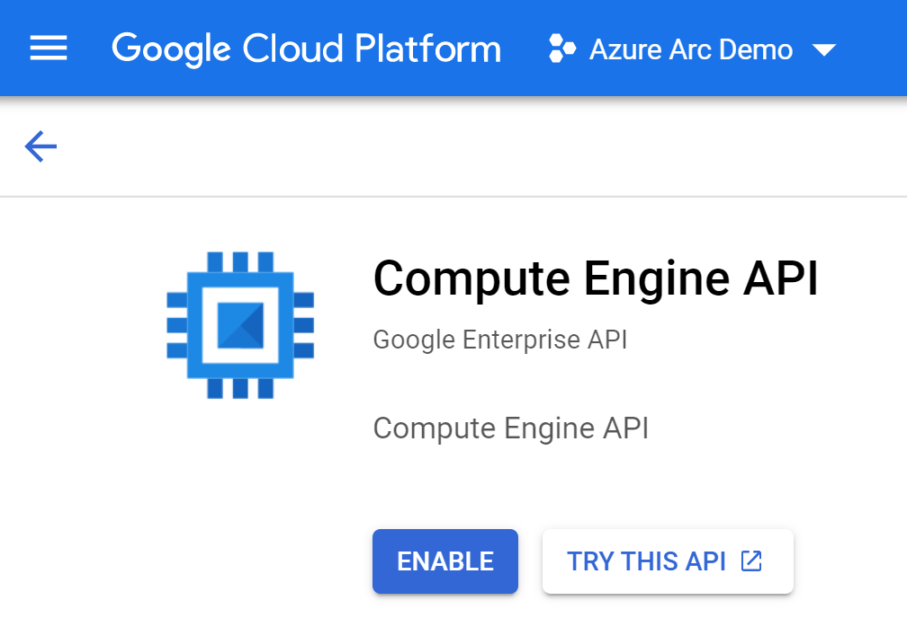
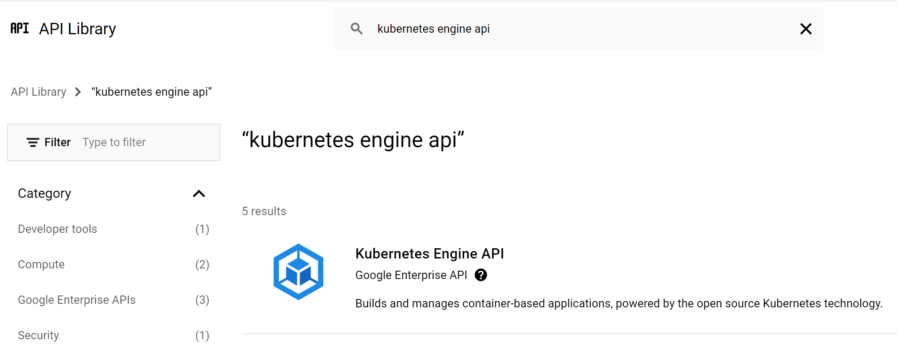

## Deploy GKE cluster and connect it to Azure Arc using Terraform

The following README will guide you on how to use the provided [Terraform](https://www.terraform.io/) plan to deploy a Google Cloud Platform [Kubernetes Engine cluster](https://cloud.google.com/kubernetes-engine) and connected it as an Azure Arc cluster resource.

## Prerequisites

* Clone the Azure Arc Jumpstart repository

    ```shell
    git clone https://github.com/microsoft/azure_arc.git
    ```

* [Install or update Azure CLI to version 2.25.0 and above](https://docs.microsoft.com/en-us/cli/azure/install-azure-cli?view=azure-cli-latest). Use the below command to check your current installed version.

  ```shell
  az --version
  ```

* [Create a Google Cloud account](https://cloud.google.com/free)

* [Install Terraform >=1.0](https://learn.hashicorp.com/terraform/getting-started/install.html)

* Create Azure service principal (SP)

    To be able to complete the scenario and its related automation, Azure service principal assigned with the “Contributor” role is required. To create it, login to your Azure account run the below command (this can also be done in [Azure Cloud Shell](https://shell.azure.com/)).

    ```shell
    az login
    az ad sp create-for-rbac -n "<Unique SP Name>" --role contributor
    ```

    For example:

    ```shell
    az ad sp create-for-rbac -n "http://AzureArcK8s" --role contributor
    ```

    Output should look like this:

    ```json
    {
    "appId": "XXXXXXXXXXXXXXXXXXXXXXXXXXXX",
    "displayName": "AzureArcK8s",
    "name": "http://AzureArcK8s",
    "password": "XXXXXXXXXXXXXXXXXXXXXXXXXXXX",
    "tenant": "XXXXXXXXXXXXXXXXXXXXXXXXXXXX"
    }
    ```

  > **Note: The Jumpstart scenarios are designed with as much ease of use in-mind and adhering to security-related best practices whenever possible. It is optional but highly recommended to scope the service principal to a specific [Azure subscription and resource group](https://docs.microsoft.com/en-us/cli/azure/ad/sp?view=azure-cli-latest) as well considering using a [less privileged service principal account](https://docs.microsoft.com/en-us/azure/role-based-access-control/best-practices)**

* [Enable subscription with](https://docs.microsoft.com/en-us/azure/azure-resource-manager/management/resource-providers-and-types#register-resource-provider) the two resource providers for Azure Arc-enabled Kubernetes. Registration is an asynchronous process, and registration may take approximately 10 minutes.

  ```shell
  az provider register --namespace Microsoft.Kubernetes
  az provider register --namespace Microsoft.KubernetesConfiguration
  az provider register --namespace Microsoft.ExtendedLocation
  ```

  You can monitor the registration process with the following commands:

  ```shell
  az provider show -n Microsoft.Kubernetes -o table
  az provider show -n Microsoft.KubernetesConfiguration -o table
  az provider show -n Microsoft.ExtendedLocation -o table
  ```

* Install the Azure Arc for Kubernetes CLI extensions ***connectedk8s*** and ***k8s-configuration***:

  ```shell
  az extension add --name connectedk8s
  az extension add --name k8s-configuration
  ```

  > **Note: If you already used this guide before and/or have the extensions installed, use the bellow commands:**

  ```shell
  az extension update --name connectedk8s
  az extension update --name k8s-configuration
  ```

### Create a new GCP Project

* Browse to <https://console.cloud.google.com/> and login with your Google Cloud account. Once logged in, [create a new project](https://cloud.google.com/resource-manager/docs/creating-managing-projects) named "Azure Arc Demo". After creating it, be sure to copy down the project id as it is usually different then the project name.

  

  

  

* Enable the Compute Engine API for the project, create a project Owner service account credentials and download the private key JSON file and copy the file to the directory where Terraform files are located. Change the JSON file name (for example *account.json*). The Terraform plan will be using the credentials stored in this file to authenticate against your GCP project.

  

  

  

  

  

  

  

  

  

  

  

  

* Enable the Kubernetes Engine API for the project

  

  

## Deployment

The only thing you need to do before executing the Terraform plan is to export the environment variables which will be used by the plan. This is based on the Azure service principal you've just created and your subscription.  

* Export the environment variables needed for the Terraform plan.

  ```shell
  export TF_VAR_subscriptionId='<Your Azure subscription ID>'
  export TF_VAR_servicePrincipalAppId='<Your Azure service principal App ID>'
  export TF_VAR_servicePrincipalSecret='<Your Azure service principal App Password>'
  export TF_VAR_servicePrincipalTenantId='<Your Azure tenant ID'
  export TF_VAR_gcp_project_id='<Your GCP Project ID>'
  export TF_VAR_location='<Azure Region>'
  export TF_VAR_resource_group_name='<Azure resource group name>'
  export TF_VAR_gcp_credentials_filename='<Location on the Keys JSON file>'
  export TF_VAR_gcp_region='<GCP Region to deploy resources>'
  export TF_VAR_gke_cluster_name='<GKE cluster name>'
  export TF_VAR_admin_username='<GKE control plane administrator username>'
  export TF_VAR_admin_password='<GKE control plane administrator password>'
  export TF_VAR_gke_cluster_node_count='<GKE cluster node count>'
  export TF_VAR_gke_cluster_node_machine_type='<GKE cluster node machine type>'
  ```  

  For example:

  ```shell
  export TF_VAR_subscriptionId='XXXXXXXX-XXXX-XXXX-XXXX-XXXXXXXXXXXX'
  export TF_VAR_servicePrincipalAppId='XXXXXXXX-XXXX-XXXX-XXXX-XXXXXXXXXXXX'
  export TF_VAR_servicePrincipalSecret='XXXXXXXX-XXXX-XXXX-XXXX-XXXXXXXXXXXX'
  export TF_VAR_servicePrincipalTenantId='XXXXXXXX-XXXX-XXXX-XXXX-XXXXXXXXXXXX'
  export TF_VAR_location='eastus'
  export TF_VAR_resourceGroup='Arc-GKE-Demo'
  export TF_VAR_gcp_project_id='azure-arc-demo-111111'
  export TF_VAR_gcp_credentials_filename='account.json'
  export TF_VAR_gcp_region='us-west1'
  export TF_VAR_gke_cluster_name='arc-gke-demo'
  export TF_VAR_admin_username='arcdemo'
  export TF_VAR_admin_password='ArcDemo1234567!!'
  export TF_VAR_gke_cluster_node_count=1
  export TF_VAR_gke_cluster_node_machine_type='n1-standard-2'
  ```

    > **Note: If you are running in a PowerShell environment, to set the Terraform environment variables, use the _Set-Item -Path env:_ prefix (see example below)**

    ```powershell
    Set-Item -Path env:TF_VAR_gcp_project_id
    ```

* Run the ```terraform init``` command which will download the required terraform providers.

  

* Run the ```terraform apply --auto-approve``` command and wait for the plan to finish. Once done, you will have a new empty Azure resource group and and a GKE cluster under the *Kubernetes Engine* page in your GCP console.

  

    

  

  

## Connecting to Azure Arc

* Now that you have a running GKE cluster, retrieve your Azure subscription ID using the ```az account list``` command and edit the environment variables section in the included [az_connect_gke](https://github.com/microsoft/azure_arc/blob/main/azure_arc_k8s_jumpstart/gke/terraform/scripts/az_connect_gke.sh) shell script.

  

* Open a new Cloud Shell session which will pre-authenticated against your GKE cluster.

  

  

  

* Upload the *az_connect_gke* shell script and run it using the ```. ./az_connect_gke.sh``` command.

  > **Note: The extra dot is due to the script has an *export* function and needs to have the vars exported in the same shell session as the rest of the commands.**

  

  

  

* Upon completion, you will have your GKE cluster connect as a new Azure Arc Kubernetes cluster resource in the new Azure resource group.

  

  

  

## Delete the deployment

To delete the environment, use the *`terraform destroy --auto-approve`* command.

  
