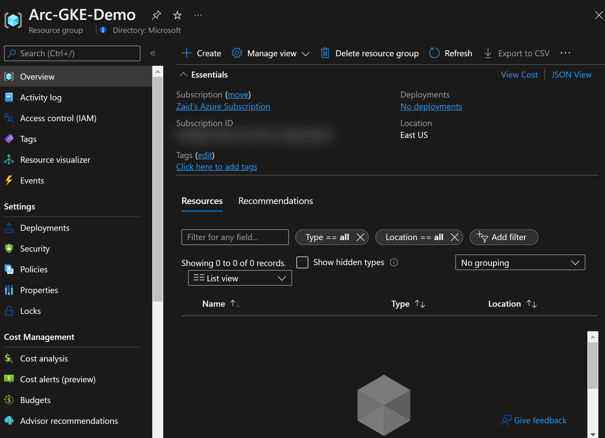

## Deploy GKE cluster and connect it to Azure Arc using Terraform

The following README will guide you on how to use the provided [Terraform](https://www.terraform.io/) plan to deploy a Google Cloud Platform [Kubernetes Engine cluster](https://cloud.google.com/kubernetes-engine) and connected it as an Azure Arc cluster resource.

> **Note: Currently, Azure Arc enabled Kubernetes is in [public preview](https://docs.microsoft.com/en-us/azure/azure-arc/kubernetes/)**.

## Prerequisites

* Clone the Azure Arc Jumpstart repository

    ```shell
    git clone https://github.com/microsoft/azure_arc.git
    ```

* [Install or update Azure CLI to version 2.7 and above](https://docs.microsoft.com/en-us/cli/azure/install-azure-cli?view=azure-cli-latest). Use the below command to check your current installed version.

  ```shell
  az --version
  ```

* [Create a free Google Cloud account](https://cloud.google.com/free)

* [Install Terraform >=0.12](https://learn.hashicorp.com/terraform/getting-started/install.html)

* Create Azure service principal (SP)

    To connect a Kubernetes cluster to Azure Arc, Azure service principal assigned with the "Contributor" role is required. To create it, login to your Azure account run the below command (this can also be done in [Azure Cloud Shell](https://shell.azure.com/)).

    ```shell
    az login
    az ad sp create-for-rbac -n "<Unique SP Name>" --role contributor
    ```

    For example:

    ```shell
    az ad sp create-for-rbac -n "http://AzureArcK8s" --role contributor
    ```

    Output should look like this:

    ```json
    {
    "appId": "XXXXXXXXXXXXXXXXXXXXXXXXXXXX",
    "displayName": "AzureArcK8s",
    "name": "http://AzureArcK8s",
    "password": "XXXXXXXXXXXXXXXXXXXXXXXXXXXX",
    "tenant": "XXXXXXXXXXXXXXXXXXXXXXXXXXXX"
    }
    ```

  > **Note: It is optional but highly recommended to scope the SP to a specific [Azure subscription and resource group](https://docs.microsoft.com/en-us/cli/azure/ad/sp?view=azure-cli-latest)**

* Enable subscription with the two resource providers for Azure Arc enabled Kubernetes. Registration is an asynchronous process, and registration may take approximately 10 minutes.

  ```shell
  az provider register --namespace Microsoft.Kubernetes
  az provider register --namespace Microsoft.KubernetesConfiguration
  ```

  You can monitor the registration process with the following commands:

  ```shell
  az provider show -n Microsoft.Kubernetes -o table
  az provider show -n Microsoft.KubernetesConfiguration -o table
  ```

* Install the Azure Arc for Kubernetes CLI extensions ***connectedk8s*** and ***k8sconfiguration***:

  ```shell
  az extension add --name connectedk8s
  az extension add --name k8sconfiguration
  ```

  > **Note: If you already used this guide before and/or have the extensions installed, use the bellow commands:**

  ```shell
  az extension update --name connectedk8s
  az extension update --name k8sconfiguration
  ```

### Create a new GCP Project

* Browse to <https://console.cloud.google.com/> and login with your Google Cloud account. Once logged in, [create a new project](https://cloud.google.com/resource-manager/docs/creating-managing-projects) named "Azure Arc Demo". After creating it, be sure to copy down the project id as it is usually different then the project name.

  

  

  

* Enable the Compute Engine API for the project, create a project Owner service account credentials and download the private key JSON file and copy the file to the directory where Terraform files are located. Change the JSON file name (for example *account.json*). The Terraform plan will be using the credentials stored in this file to authenticate against your GCP project.

  

  

  

  

  

  

  

  

  

  

  

  

* Enable the Compute Engine API for the project

  

  

## Deployment

The only thing you need to do before executing the Terraform plan is to export the environment variables which will be used by the plan. This is based on the Azure service principal you've just created and your subscription.  

* Export the environment variables needed for the Terraform plan.

  ```shell
  export TF_VAR_gcp_project_id=<Your GCP Project ID
  export TF_VAR_gcp_credentials_filename=<Location on the Keys JSON file
  export TF_VAR_gcp_region=<GCP Region to deploy resources
  export TF_VAR_gke_cluster_name=<GKE cluster name>
  export TF_VAR_admin_username=<GKE cluster admin username>
  export TF_VAR_admin_password=<GKE cluster admin password>
  export TF_VAR_gke_cluster_node_count<GKE cluster node count>
  ```  

  For example:

  ```shell
  export TF_VAR_gcp_project_id=azure-arc-demo-273150
  export TF_VAR_gcp_credentials_filename=account.json
  export TF_VAR_gcp_region=us-west1
  export TF_VAR_gke_cluster_name=arc-gke-demo
  export TF_VAR_admin_username=arcdemo
  export TF_VAR_admin_password='arcdemo1234567!!'
  export TF_VAR_gke_cluster_node_count=1
  ```

* Run the ```terraform init``` command which will download the Terraform Google provider.

  

* Run the ```terraform apply --auto-approve``` command and wait for the plan to finish. Once done, you will have a ready GKE cluster under the *Kubernetes Engine* page in your GCP console.

  

  

  

## Connecting to Azure Arc

* Now that you have a running GKE cluster, retrieve your Azure subscription ID using the ```az account list``` command and edit the environment variables section in the included [az_connect_gke](https://github.com/microsoft/azure_arc/blob/main/azure_arc_k8s_jumpstart/gke/terraform/scripts/az_connect_gke.sh) shell script.

  

* Open a new Cloud Shell session which will pre-authenticated against your GKE cluster.

  

  

  

* Upload the *az_connect_gke* shell script and run it using the ```. ./az_connect_gke.sh``` command.

  > **Note: The extra dot is due to the script has an *export* function and needs to have the vars exported in the same shell session as the rest of the commands.**

  

  

  

* Upon completion, you will have your GKE cluster connect as a new Azure Arc Kubernetes cluster resource in a new resource group.

  

  

  

## Delete the deployment

* In Azure, the most straightforward way is to delete the cluster or the resource group via the Azure Portal.

  

  

* On your GCP console, select the cluster and delete it or alternatively, you can use the ```terraform destroy --auto-approve``` command.

  

  
