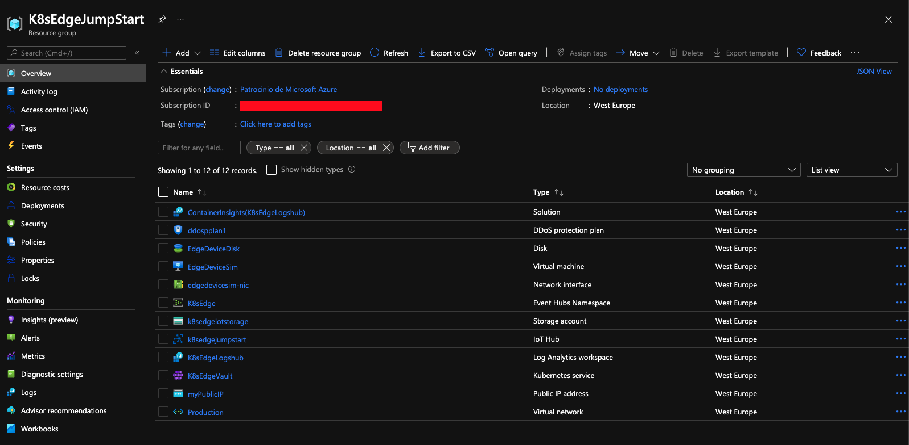
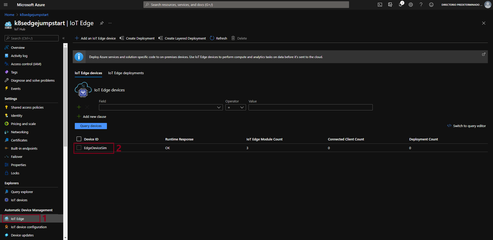

## Deploy AKS cluster on Azure IoT Edge and connect it to Azure Arc using Terraform

This scenario allows us to see how Azure IoT Edge and Azure Arc services complement each other in an easy and simple way, providing mechanisms for AKS cluster operators to configure the fundamental components of an AKS cluster and apply policies by monitoring its supervision, through Azure Arc. Furthermore, from Azure IoT Edge, application operators can remotely deploy and manage workloads at scale with convenient ingest from the cloud and in a bi-directional way.

  > **Note: Azure Kubernetes Service is now in preview on Azure IoT Edge. You can find more details about this service in the [IoT Edge's support for Kubernetes document](https://microsoft.github.io/iotedge-k8s-doc/)**

The following README will guide you on how to use the provided [Terraform](https://www.terraform.io/) plan to deploy an [Azure Kubernetes Service (AKS)](https://docs.microsoft.com/en-us/azure/aks/intro-kubernetes) cluster and connect it as an Azure Arc-enabled Kubernetes resource.

## Prerequisites

* Clone the Azure Arc Jumpstart repository

    ```shell
    git clone https://github.com/microsoft/azure_arc.git
    ```

* [Install or update Azure CLI to version 2.15.0 and above](https://docs.microsoft.com/en-us/cli/azure/install-azure-cli?view=azure-cli-latest). Use the below command to check your current installed version.

  ```shell
  az --version
  ```

* [Install Terraform >=0.15](https://learn.hashicorp.com/terraform/getting-started/install.html)

* Create Azure service principal (SP)

    To be able to complete the scenario and its related automation, Azure service principal assigned with the “Contributor” role is required. To create it, login to your Azure account run the below command (this can also be done in [Azure Cloud Shell](https://shell.azure.com/)).

    ```shell
    az login
    az ad sp create-for-rbac -n "<Unique SP Name>" --role contributor
    ```

    For example:

    ```shell
    az ad sp create-for-rbac -n "http://AzureArcK8s" --role contributor
    ```

    Output should look like this:

    ```json
    {
    "appId": "XXXXXXXXXXXXXXXXXXXXXXXXXXXX",
    "displayName": "AzureArcK8s",
    "name": "http://AzureArcK8s",
    "password": "XXXXXXXXXXXXXXXXXXXXXXXXXXXX",
    "tenant": "XXXXXXXXXXXXXXXXXXXXXXXXXXXX"
    }
    ```

    > **Note: The Jumpstart scenarios are designed with as much ease of use in-mind and adhering to security-related best practices whenever possible. It is optional but highly recommended to scope the service principal to a specific [Azure subscription and resource group](https://docs.microsoft.com/en-us/cli/azure/ad/sp?view=azure-cli-latest) as well considering using a [less privileged service principal account](https://docs.microsoft.com/en-us/azure/role-based-access-control/best-practices)**

* [Enable subscription with](https://docs.microsoft.com/en-us/azure/azure-resource-manager/management/resource-providers-and-types#register-resource-provider) the two resource providers for Azure Arc-enabled Kubernetes. Registration is an asynchronous process, and registration may take approximately 10 minutes.

  ```shell
  az provider register --namespace Microsoft.Kubernetes
  az provider register --namespace Microsoft.KubernetesConfiguration
  az extension add --name connectedk8s
  az extension add --name k8sconfiguration
  ```

  You can monitor the registration process with the following commands:

  ```shell
  az provider show -n Microsoft.Kubernetes -o table
  az provider show -n Microsoft.KubernetesConfiguration -o table
  ```

## Automation Flow

For you to get familiar with the automation and deployment flow, below is an explanation.

* First bash script ([_edge_azure_vm.sh_]((https://raw.githubusercontent.com/microsoft/azure_arc/main/azure_arc_k8s_jumpstart/aks_iot_edge/terraform/scripts/edge/edge_azure_vm.sh)) - Used specifically for provisioning the necessary components in the VM to be able to deploy our "simulated" edge device:

  * Download Install the required tools _moby-engine_
  * Download & install the Azure _aziot-edge_
  * Creation of a new configuration file for aziot-edge (_/etc/aziot/config.toml_)

* Second bash script ([_az_k8sconfig_helm_aks.sh_](https://raw.githubusercontent.com/microsoft/azure_arc/main/azure_arc_k8s_jumpstart/aks_iot_edge/terraform/scripts/helm/az_k8sconfig_helm_aks.sh)) Allow us to deploy our IoT Edge solution for AKS, configure our and associate our AKS cluster with Azure Arc, for this:

  * Log in to Azure with Service Principal & Getting AKS credentials (kubeconfig)
  * Associate our AKS with Azure Arc
  * Create Namespace _iotedge_ in AKS
  * Generate a secret that contains the connection string of our edge device.
  * Create Cluster-level GitOps-Config for deploying IoT Edge workload

## Deployment

Before running the Terraform automation, you need to export the environment variables that will be used by the plan to customize your environment.

In addition, validate that the AKS Kubernetes version is available in your region using the below Azure CLI command.

```shell
az aks get-versions -l "<Your Azure Region>"
```

In case the AKS service is not available in your region, you can change the AKS Kubernetes version in the [*variables.tf*](https://github.com/microsoft/azure_arc/blob/main/azure_arc_k8s_jumpstart/aks/terraform/variables.tf) file by searching for *kubernetes_version*.

* Export the environment variables needed for the Terraform plan.

    ```shell
    export TF_VAR_client_id=<Your Azure service principal App ID>
    export TF_VAR_client_secret=<Your Azure service principal App Password>
    ```

    > **Note: If you are running in a PowerShell environment, to set the Terraform environment variables, use the _Set-Item -Path env:_ prefix (see example below)**

    ```powershell
    Set-Item -Path env:TF_VAR_client_id
    ```

* Run the ```terraform init``` command which will download the Terraform AzureRM provider.

    

* Run the ```terraform apply -auto-approve`` command and wait for the plan to finish.

    Once the Terraform deployment is completed, a new Resource Group and all services (Vnet, Subnets, VMs, IoT Hub, EventHub, AKS Cluster) are created.

    

    

    

* In this scenario we will use a VM to "simulate" an IoT Edge device. To do this, we must register a new Edge device in our IoT Hub that we will later configure.

* In order to keep your local environment clean and untouched, we will use [Azure Cloud Shell](https://docs.microsoft.com/en-us/azure/cloud-shell/overview) (located in the top-right corner in the Azure portal) to run the next commands:

    

* Create IoT Edge Device

 ```shell
az iot hub device-identity create --device-id "EdgeDeviceSim" --edge-enabled --hub-name k8sedgejumpstart
 ```

> * We will obtain the connection string of the new IoT Edge device to be able to make the link

```shell
az iot hub device-identity connection-string show --device-id "EdgeDeviceSim" --hub-name k8sedgejumpstart
  ```

  

  

* Next, log into the deployment VM using your SSH credentials and edit the _/etc/aziot/config.toml_ by replacing the connection string using the one we obtained in the previous step.

```shell
# Manual provisioning with connection string
[provisioning]
source = "manual"
connection_string = "<ADD DEVICE CONNECTION STRING HERE>"
 ```

* In order to synchronize the configuration of the device that we have paired we must execute the following command:

```shell
sudo iotedge config apply
 ```


* Once completed the above steps, return to the Azure Cloud Shell where we will assign to our new device a module to simulate a temperature sensor. For this we will upload the file through the Azure Cloud Shell interface:  


* Once the file is uploaded, execute the following command:

> **Note: You can see an example of the [deployment.json](https://raw.githubusercontent.com/microsoft/azure_arc/main/azure_arc_k8s_jumpstart/aks_iot_edge/terraform/scripts/edge/deployment.json) file that we use.**

```shell
az iot edge set-modules --hub-name k8sedgejumpstart --device-id "EdgeDeviceSim" --content ./deployment.json
```

* From the Azure portal, select the IoT Hub instance under _K8sEdgeJumpStart_. By selecting our IoT Edge device, we can see all the information about the modules it is running and If everything has been successful we will see that the "SimulatedTemperatureSensor" module is running correctly.




* We can also check from the virtual machine itself the modules that are running at that moment, using the following command:

```shell
sudo iotedge list
```


* Now download the [values.yaml](https://github.com/Azure/iotedge/blob/preview/iiot/kubernetes/charts/edge-kubernetes/values.yaml) file for IoT Edge Helm chart and replace the deviceConnectionString placeholder at the end of the file with the connection string you noted earlier.

```yaml
# Manual provisioning configuration using a connection string
provisioning:
  source: "manual"
  deviceConnectionString: "<ADD DEVICE CONNECTION STRING HERE>"
  dynamicReprovisioning: false
```

* Edit the environment variables section in the included in the [_az_k8sconfig_helm_aks.sh_](https://raw.githubusercontent.com/microsoft/azure_arc/main/azure_arc_k8s_jumpstart/aks_iot_edge/terraform/scripts/helm/az_k8sconfig_helm_aks.sh) shell script. As we did in the previous steps, upload the files to our Azure Cloud Shell.


* Once the script run has finished, the AKS cluster will be projected as a new Azure Arc-enabled Kubernetes resource. We will proceed to connect to our AKS cluster and in a couple of minutes you should see the workload modules defined in the edge deployment running as pods along with edgeagent and iotedged.
We can use the following commands to check it:


```shell
kubectl get pods -n iotedge
kubectl logs -n iotedge <replace-with-iot-edge-pod-name> simulatedtemperaturesensor
```

## Delete the deployment

The most straightforward way is to delete the Azure Arc-enabled Kubernetes resource via the Azure Portal, just select the Resource Group and delete it.


If you want to nuke the entire environment, delete both the AKS and the AKS resources resource groups or run the ```terraform destroy -auto-approve``` command.


