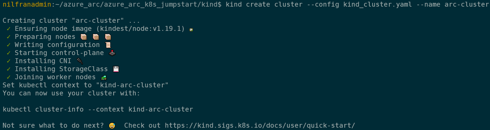
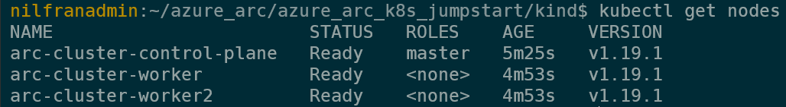
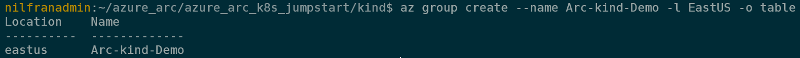
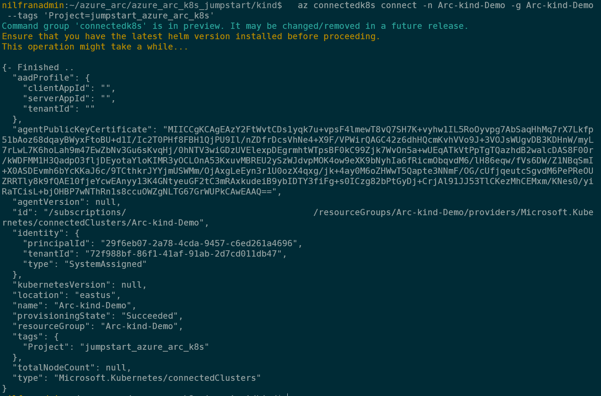
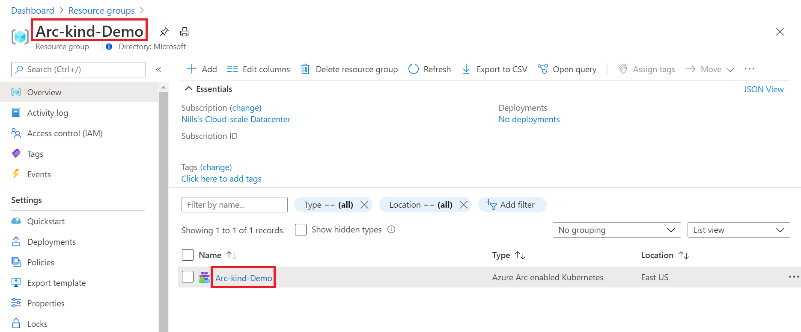
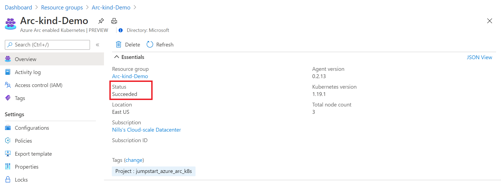
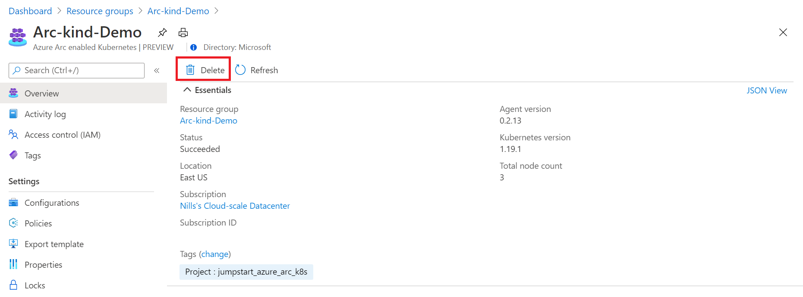
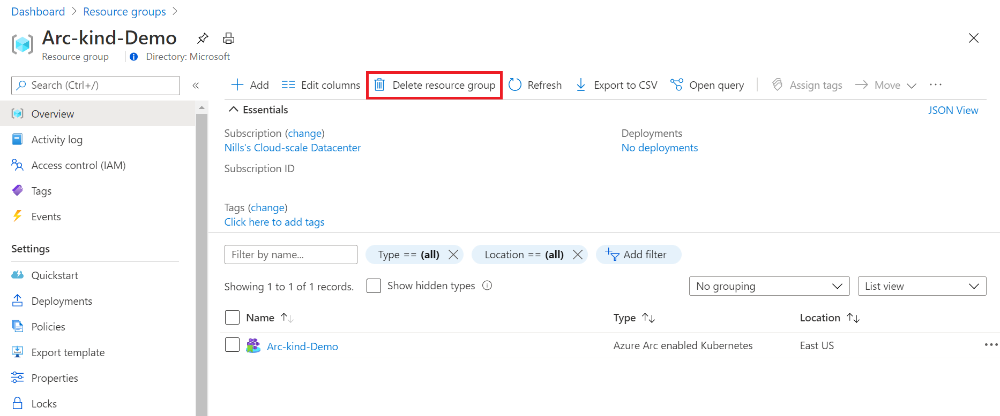
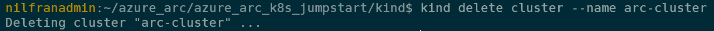

> **ADVISORY: An known issue affecting Azure CLI Kubernetes extensions is causing problems with automation in Jumpstart Kubernetes scenarios, data and app services scenarios, and ArcBox where the Azure CLI Kubernetes extensions are used. This issue will result result in incomplete or failed deployments. Thank you for your patience as the teams work to address the issue.**

## Deploy a local Kubernetes Cluster using kind and connect it to Azure Arc

The following README will guide you on how to use [kind](https://kind.sigs.k8s.io/) to run a Kubernetes cluster locally and connect it as an Azure Arc-enabled Kubernetes cluster resource.

## Prerequisites

* Clone the Azure Arc Jumpstart repository

    ```shell
    git clone https://github.com/microsoft/azure_arc.git
    ```

* [Install or update Azure CLI to version 2.25.0 and above](https://docs.microsoft.com/en-us/cli/azure/install-azure-cli?view=azure-cli-latest). Use the below command to check your current installed version.

  ```shell
  az --version
  ```

* [Install and Set Up kubectl](https://kubernetes.io/docs/tasks/tools/install-kubectl/)

* [Install Helm 3](https://helm.sh/docs/intro/install/)

* Kind leverages Docker to run the Kubernetes nodes. You will need to install Docker locally:

  * If you are a Windows user, install [Docker Desktop](https://www.docker.com/products/docker-desktop). You can also use the [Chocolatey package](https://chocolatey.org/packages/docker-desktop) to automate the installation.
  * If you are a MacOS User, install [Docker Desktop for Mac](https://docs.docker.com/docker-for-mac/).
  * If you are a Linux user, use your package manager to install the [Docker engine](https://docs.docker.com/engine/install/).

* Install the [Go programming language](https://golang.org/dl/).

* Create Azure service principal (SP)

  The Azure service principal assigned with the "Contributor" role is required to complete the scenario and its related automation. To create it, log in to your Azure account run the below command (you could also do this in [Azure Cloud Shell](https://shell.azure.com/)).

  ```shell
  az login
  az ad sp create-for-rbac -n "<Unique SP Name>" --role contributor
  ```

  For example:

  ```shell
  az ad sp create-for-rbac -n "http://AzureArcK8s" --role contributor
  ```

  The output should look like this:

  ```json
  {
  "appId": "XXXXXXXXXXXXXXXXXXXXXXXXXXXX",
  "displayName": "AzureArcK8s",
  "name": "http://AzureArcK8s",
  "password": "XXXXXXXXXXXXXXXXXXXXXXXXXXXX",
  "tenant": "XXXXXXXXXXXXXXXXXXXXXXXXXXXX"
  }
  ```

  > **Note: The Jumpstart scenarios are designed with ease of use in mind and adhering to security-related best practices whenever possible. It is optional but highly recommended to scope the service principal to a specific [Azure subscription and resource group](https://docs.microsoft.com/en-us/cli/azure/ad/sp?view=azure-cli-latest) as well considering using a [less privileged service principal account](https://docs.microsoft.com/en-us/azure/role-based-access-control/best-practices)**.

* [Enable subscription with](https://docs.microsoft.com/en-us/azure/azure-resource-manager/management/resource-providers-and-types#register-resource-provider) the two resource providers for Azure Arc-enabled Kubernetes. Registration is an asynchronous process, and registration may take approximately 10 minutes.

  ```shell
  az provider register --namespace Microsoft.Kubernetes
  az provider register --namespace Microsoft.KubernetesConfiguration
  az provider register --namespace Microsoft.ExtendedLocation
  ```

  You can monitor the registration process with the following commands:

  ```shell
  az provider show -n Microsoft.Kubernetes -o table
  az provider show -n Microsoft.KubernetesConfiguration -o table
  az provider show -n Microsoft.ExtendedLocation -o table
  ```

* Install the Azure Arc for Kubernetes CLI extensions ***connectedk8s*** and ***k8s-configuration***:

  ```shell
  az extension add --name connectedk8s
  az extension add --name k8s-configuration
  ```

  > **Note: If you already used this guide before and/or have the extensions installed, use the below commands:**

  ```shell
  az extension update --name connectedk8s
  az extension update --name k8s-configuration
  ```

## Deployment

* Install kind

  On Linux:

  ```shell
  curl -Lo ./kind https://kind.sigs.k8s.io/dl/v0.9.0/kind-linux-amd64
  chmod +x ./kind
  sudo mv ./kind /usr/local/bin/kind
  ```

  On MacOS:

  ```shell
  brew install kind
  ```

  On Windows:

  ```powershell
  choco install kind
  ```

  * Navigate to the folder that has the kind cluster definition.

  ```shell
  cd azure_arc/azure_arc_k8s_jumpstart/kind
  ```

  * Create the kind cluster. We are using a configuration file called `kind_cluster.yaml` to specify our cluster configuration. This will create a 3 node cluster, with 1 master node and 2 worker nodes.

  ```shell
  kind create cluster --config kind_cluster.yaml --name arc-cluster
  ```

  

  > **Note: By default, kind will store the kubeconfig file used to connect to your cluster in the ~/.kube directory. If you want to use a custom directory to store the kubeconfig file, use the `--kube-config` flag.**

  If you chose a specific location for the cluster's *kubeconfig* file, make sure you export its location as an environment variable using the `export KUBECONFIG=/path/to/kubeconfig` location or in Windows, add this location to your PATH.

* Verify that kind has created the cluster successfully, and you can access the cluster using `kubectl`.

  ```shell
  kubectl get nodes
  ```

  

## Connecting to Azure Arc

* Now that you have a running kind cluster let's connect the kind cluster to Azure Arc.

  ```shell
  az login --service-principal -u mySpnClientId -p mySpnClientSecret --tenant myTenantID
  ```

* Create a resource group

  ```shell
  az group create --name Arc-kind-Demo -l EastUS -o table
  ```

   > Note:  Before deploying, make sure to check the Azure Arc-enabled Kubernetes region availability [page](https://azure.microsoft.com/en-us/global-infrastructure/services/?products=azure-arc).

  

* Deploy the Arc binaries using Azure CLI:

  ```shell
  az connectedk8s connect -n Arc-kind-Demo -g Arc-kind-Demo --tags 'Project=jumpstart_azure_arc_k8s'
  ```

* Upon completion, you will have your kind cluster connected as a new Azure Arc Kubernetes cluster resource in a new resource group.

  

  

  

## Delete the deployment

* In Azure, the most straightforward way is to delete the cluster or the resource group via the Azure Portal or through the CLI.

  ```shell
  az group delete --name Arc-kind-Demo
  ```

  

  

* To delete the kind cluster locally, use the following command:

  ```shell
  kind delete cluster --name arc-cluster
  ```

  
