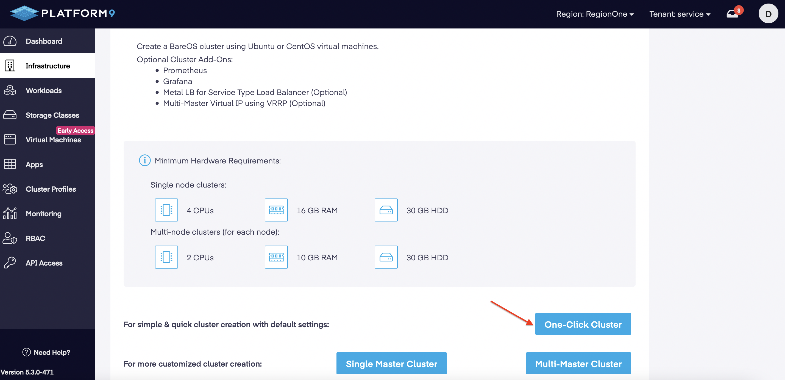
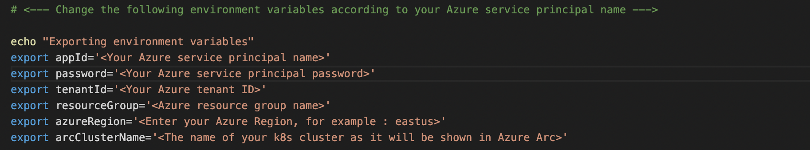
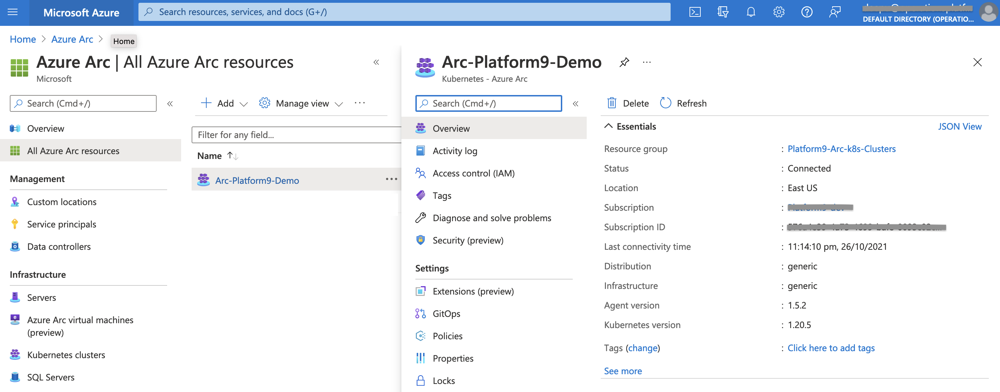
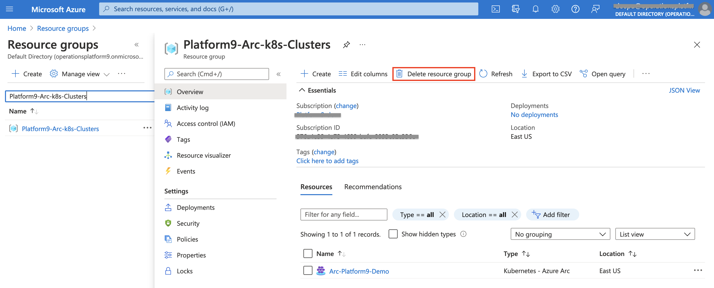

## Deploy a Platform9 Managed Kubernetes cluster and connect it to Azure Arc

The following document will guide on how to deploy a Kubernetes cluster with [Platform9 Managed Kubernetes (PMK)](https://platform9.com/managed-kubernetes/) and have it as a connected Azure Arc Kubernetes resource.
With PMK, you can have your clusters deployed on-premises, in public clouds or at the edge. In this document, we'll explain the steps on how to create an **on-premise [BareOS](https://platform9.com/docs/kubernetes/bareos-what-is-bareos) cluster** using **PMK** and connect it to **Microsoft Azure Arc**.

## Prerequisites

* An Ubuntu 20.04 installed physical machine or VM. For this demonstration, we would be using single node kubernetes cluster installation. This machine would also act as our management host.

* The [kubectl](https://platform9.com/learn/tutorials/kubectl) exe for cluster management locally. If you would want to have a seperate host for cluster management, follow the below steps to [install kubectl](https://kubernetes.io/docs/tasks/tools/install-kubectl-linux/#install-using-native-package-management) on it.

  ```shell
  sudo apt-get update
  sudo apt-get install -y apt-transport-https ca-certificates curl
  sudo curl -fsSLo /usr/share/keyrings/kubernetes-archive-keyring.gpg https://packages.cloud.google.com/apt/doc/apt-key.gpg
  echo "deb [signed-by=/usr/share/keyrings/kubernetes-archive-keyring.gpg] https://apt.kubernetes.io/ kubernetes-xenial main" | sudo tee /etc/apt/sources.list.d/kubernetes.list
  sudo apt-get update
  sudo apt-get install -y kubectl
  ```

  > **Note:** The *kubectl* package is installed from Kubernetes repository, hence the Google Cloud public signing key need to be downloaded to enable the repository.

  > **All PMK cluster nodes would have kubectl installed once cluster is deployed.**

* [Azure CLI (az)](https://docs.microsoft.com/en-us/cli/azure/install-azure-cli?view=azure-cli-latest) version 2.15.0 and above. This cli tool would help to setup the Azure resources and connect the Kubernetes cluster to Azure Arc.

* [Helm](https://helm.sh/docs/intro/install/) version 3+ , to install the Azure Arc agents on the cluster.

* [Enable subscription](https://docs.microsoft.com/en-us/azure/azure-resource-manager/management/resource-providers-and-types#register-resource-provider) with the two resource providers for Azure Arc-enabled Kubernetes.

  ```shell
  az provider register --namespace Microsoft.Kubernetes
  az provider register --namespace Microsoft.KubernetesConfiguration
  az provider register --namespace Microsoft.ExtendedLocation
  ```

  Registration is an asynchronous process, and registration may take approximately 10 minutes. You can monitor the registration process with the following commands

  ```shell
  az provider show -n Microsoft.Kubernetes -o table
  az provider show -n Microsoft.KubernetesConfiguration -o table
  az provider show -n Microsoft.ExtendedLocation -o table
  ```

* Install the Azure Arc Kubernetes CLI extensions *connectedk8s* and *k8s-configuration* .

  ```shell
  az extension add --name connectedk8s
  az extension add --name k8s-configuration
  ```

  Run below command to verify that it is installed.

  ```shell
  az extension list -o table
  ```

* Create Azure service principal (SP)
  To be able to complete the scenario and its related automation, Azure service principal assigned with the *Contributor* role is required.

  For creating the service principal, first login to your Azure account.

  ```shell
  az login
  ```

  Login by opening the [Microsoft devicelogin page](https://microsoft.com/devicelogin) on browser and enter the code to authenticate.

  An example output of successful authentication is shown below;

  

  Once you have a successful login, create the Azure service principal (SP).

  ```shell
  az ad sp create-for-rbac -n "<service-principal-name>" --role contributor
  ```

  See below example of creating a service principal.

  

  > *Note : It is highly recommended to scope the service principal to a specific [Azure subscription and resource group](https://docs.microsoft.com/en-us/cli/azure/ad/sp?view=azure-cli-latest) as well considering using a [less privileged service principal account](https://docs.microsoft.com/en-us/cli/azure/ad/sp?view=azure-cli-latest).*

* Create an Azure resource group where you want the PMK cluster to show up.

  ```shell
  az group create -l <Azure Region> -n <resource group name>
  ```

  See below example of creating a resource group.

  

## Deployment

This deployment consists of 3 parts.

  1. Onboarding the node to Platform9 Management Plane.
  2. Creating a PMK Cluster.
  3. Connect the cluster to Microsoft Azure Arc.

**Onboarding the node to Platform9 Management Plane**

* Login to your Management Plane.

  

  > **If you do not have a registered Management Plane with Platform9, you can create one easily using [PMK Free Tier deployment](https://platform9.com/managed-kubernetes/)**

* Onboard the Ubuntu host to your Management Plane.

  For a BareOS cluster, you will need to have the nodes registered with the PMK Management Plane on which the cluster is to be deployed. For this, first add the node.

  

  This should take you to the Node onboarding page. A **pf9ctl** utility is provided to setup the nodes and get connected with Management Plane. Follow the instructions to download and install the utility, which we will use to prepare the node and connect it with your Platform9 Management Plane.

  

  > **Note: Preparing the node and connecting it to Management Plane might take approximately 4-5 minutes to complete.**


**Creating a PMK Cluster**

* The onboarded node should now be seen on our Management Plane. Now let's create a [PMK cluster](https://platform9.com/learn/learn/get-started-bare-metal) using that onboarded node.

  The cluster creation is done from the PMK Management Plane UI. The steps for cluster creation will follow as below,

  i. Click to add cluster to the Management Plane.

  

  ii. Create a cluster from the nodes onboarded to the Management Plane.

  

  iii. Enter the cluster name and k8s version. Submit the page and it will trigger the cluster creation on the node.

  

  iv. The cluster should get created in a few minutes and the status should be reported as **Healthy**.

  

**Connect the cluster to Microsoft Azure Arc**

* Once cluster is Ready, set the environment variables according to your Azure service principal name and Azure environment on the host.

  

  > *The values can referenced from the service principal and resource groups outputs.*

* Login to your Azure subscription using the Service Principal created.

  ```shell
  az login --service-principal --username $appId --password $password --tenant $tenantId
  ```

  An example output is shown below;

  

* Connect the Platform9 Managed Kubernetes (PMK) cluster to Azure Arc.

  ```shell
  az connectedk8s connect --name $arcClusterName --resource-group $resourceGroup
  ```

  > **Note : The KUBECONFIG variable needs to be set before running this command. The kubeconfig file for the cluster is available for download from the Management Plane**

  

  An example output is shown below;

  

  


## Verification

* The cluster should be seen onboarded as a new Azure Arc-enabled Kubernetes resource.

  

* Azure Arc agents are running in the cluster.

  

## Deleting the Deployment

* The Azure Arc-enabled Kubernetes resource can be deleted via the Azure Portal.

  

* For deleting the entire environment, just delete the Azure resource group that was created.

  
