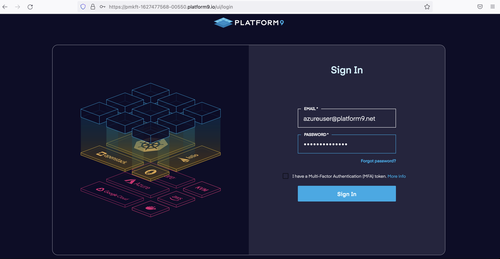
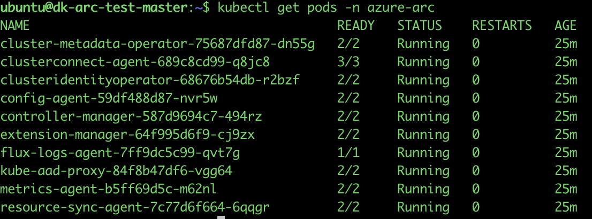
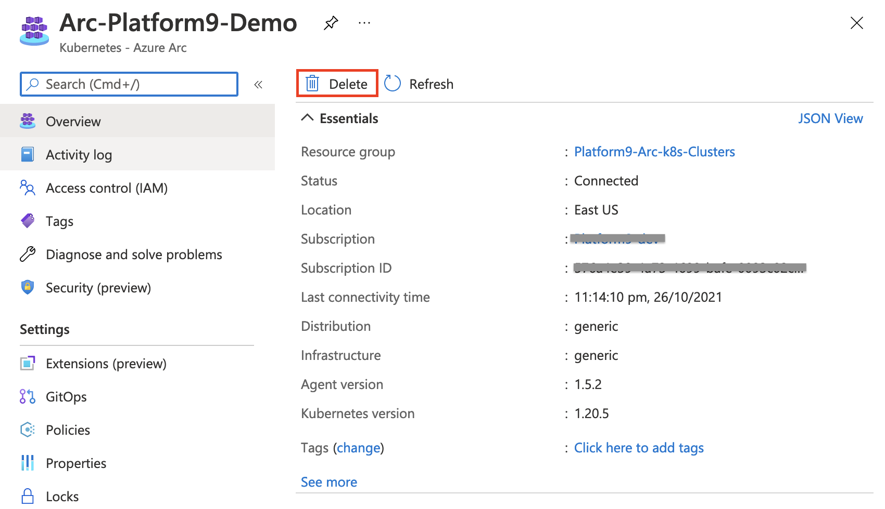

> **ADVISORY: An known issue affecting Azure CLI Kubernetes extensions is causing problems with automation in Jumpstart Kubernetes scenarios, data and app services scenarios, and ArcBox where the Azure CLI Kubernetes extensions are used. This issue will result result in incomplete or failed deployments. Thank you for your patience as the teams work to address the issue.**

## Deploy a Platform9 Managed Kubernetes cluster and connect it to Azure Arc

 > **Disclaimer: This scenario was contributed by the Platform9 team as part of the "Jumpstart Friends" program**

<p align="center"></p>

The following README will guide on how to deploy a Kubernetes cluster with [Platform9 Managed Kubernetes (PMK)](https://platform9.com/managed-kubernetes/) and have it as a connected Azure Arc Kubernetes resource. With PMK, you can have your clusters deployed on-premises, in public clouds, or at the edge. In this document, we'll explain the steps on how to create an **on-premise [BareOS](https://platform9.com/docs/kubernetes/bareos-what-is-bareos) cluster** using **PMK** and connect it to **Microsoft Azure Arc**.

## Prerequisites

- An Ubuntu 20.04 installed physical machine or VM. In this scenario, we would be using single node kubernetes cluster installation. This machine would also act as our management host.

- The [kubectl](https://platform9.com/learn/tutorials/kubectl) executable binary for local cluster management. If you would want to have a separate host for cluster management, follow the below steps to [install kubectl](https://kubernetes.io/docs/tasks/tools/install-kubectl-linux/#install-using-native-package-management) on it.

  ```shell
  sudo apt-get update
  sudo apt-get install -y apt-transport-https ca-certificates curl
  sudo curl -fsSLo /usr/share/keyrings/kubernetes-archive-keyring.gpg https://packages.cloud.google.com/apt/doc/apt-key.gpg
  echo "deb [signed-by=/usr/share/keyrings/kubernetes-archive-keyring.gpg] https://apt.kubernetes.io/ kubernetes-xenial main" | sudo tee /etc/apt/sources.list.d/kubernetes.list
  sudo apt-get update
  sudo apt-get install -y kubectl
  ```

  > **Note: The *kubectl* package is installed from the Kubernetes repository, hence the Google Cloud public signing key need to be downloaded to enable the repository. Note: All PMK cluster nodes would have kubectl installed once the cluster is deployed.**

- [Install or update Azure CLI (az) to version 2.25.0 and above](https://docs.microsoft.com/en-us/cli/azure/install-azure-cli?view=azure-cli-latest).

  Use the below command to check your current installed version.

  ```shell
  az --version
  ```

- [Helm](https://helm.sh/docs/intro/install/) version 3+ , to install the Azure Arc agents on the cluster.

  ```shell
  curl https://raw.githubusercontent.com/helm/helm/main/scripts/get-helm-3 | sudo bash
  ```

- Create Azure service principal (SP)

  To be able to complete the scenario and its related automation, Azure service principal assigned with the “Contributor” role is required. To create it, login to your Azure account run the below command (this can also be done in [Azure Cloud Shell](https://shell.azure.com/)).

  ```shell
  az login
  az ad sp create-for-rbac -n "<Unique SP Name>" --role contributor
  ```

  For example:

  ```shell
  az ad sp create-for-rbac -n "http://AzureArcK8s" --role contributor
  ```

  Output should look like this:

  ```json
  {
  "appId": "XXXXXXXXXXXXXXXXXXXXXXXXXXXX",
  "displayName": "AzureArcK8s",
  "name": "http://AzureArcK8s",
  "password": "XXXXXXXXXXXXXXXXXXXXXXXXXXXX",
  "tenant": "XXXXXXXXXXXXXXXXXXXXXXXXXXXX"
  }
  ```

  > **Note: The Jumpstart scenarios are designed with as much ease of use in-mind and adhering to security-related best practices whenever possible. It is optional but highly recommended to scope the service principal to a specific [Azure subscription and resource group](https://docs.microsoft.com/en-us/cli/azure/ad/sp?view=azure-cli-latest) as well considering using a [less privileged service principal account](https://docs.microsoft.com/en-us/azure/role-based-access-control/best-practices)**

## Deployment

This deployment consists of 3 sections.

  1. Onboarding the node to Platform9 Management Plane.
  2. Creating a PMK Cluster.
  3. Connect the cluster to Microsoft Azure Arc.

### Onboarding the node to Platform9 Management Plane

- Login to your Management Plane.

  

  > **Note: If you do not have a registered Management Plane with Platform9, you can create one easily using [PMK Free Tier deployment](https://platform9.com/managed-kubernetes/)**

- Onboard the Ubuntu host to your Management Plane.

  For a BareOS cluster, you will need to have the nodes registered with the PMK Management Plane on which the cluster is to be deployed. For this first, add the node.

  

  This should take you to the Node onboarding page. A **pf9ctl** utility is provided to set up the nodes and get connected with Management Plane.
  Follow the instructions to download and install the utility, which we will use to prepare the node and connect it with your Platform9 Management Plane.

  

  > **Note: Preparing the node and connecting it to Management Plane might take approximately 4-5 minutes to complete.**

### Creating a PMK Cluster

- The onboarded node should now be seen on our Management Plane. To create a [PMK cluster](https://platform9.com/learn/learn/get-started-bare-metal) via the PMK Management Plane UI, follow the steps as described below.

  - Click to add a cluster to the Management Plane.

  

  - Create a cluster from the nodes onboarded to the Management Plane.

  

  - Enter the cluster name and k8s version. Submit the page and it will trigger the cluster creation on the node.

  

  - The cluster should get created in a few minutes and the status should be reported as **Healthy** and **Online**.

  

### Connect the cluster to Microsoft Azure Arc

- Clone the [Azure Arc Jumpstart repository](https://github.com/microsoft/azure_arc) and change to the pf9 script directory.

  ```shell
  git clone https://github.com/microsoft/azure_arc.git
  cd azure_arc/azure_arc_k8s_jumpstart/pf9
  ```

- Set the variables according to your Azure service principal name and Azure environment in the *pf9_az_connect_k8s.sh* script.

  

  > **Note: The values can be referenced from the service principal output.**

- Set the KUBECONFIG variable for connecting to the K8s cluster. The kubeconfig file for the cluster is available for download from the Management Plane.

  

  - An example output is shown below for setting the _KUBECONFIG_ variable;

  ```shell
  export KUBECONFIG=~/path/to/config/file
  ```

- Run the _pf9_az_connect_k8s.sh_ script to connect the Platform9 Managed Kubernetes (PMK) cluster to Azure Arc.

  ```shell
  sh ./pf9_az_connect_k8s.sh
  ```

  

## Verification

- The cluster should be seen onboarded as a new Azure Arc-enabled Kubernetes resource.

  

- Azure Arc agents are running in the cluster.

  

## Deleting the Deployment

- The Azure Arc-enabled Kubernetes resource can be deleted via the Azure Portal.

  

- For deleting the entire environment, just delete the Azure resource group that was created.

  
