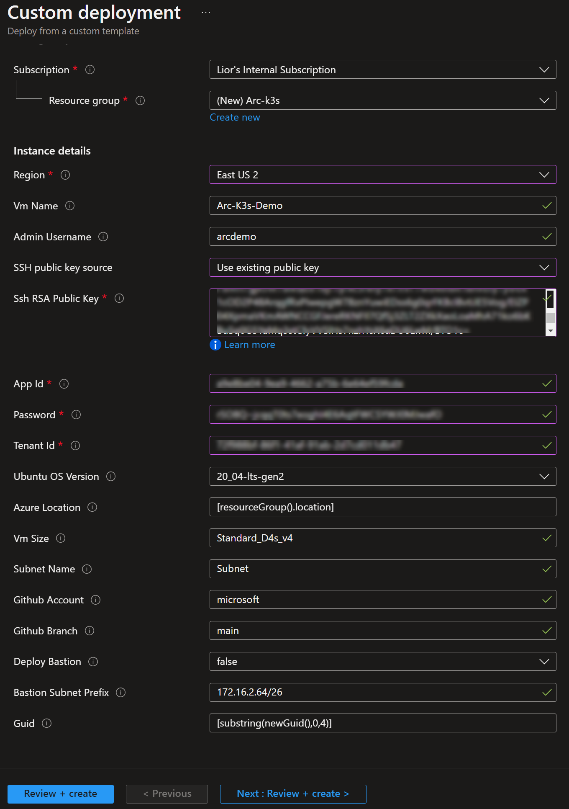
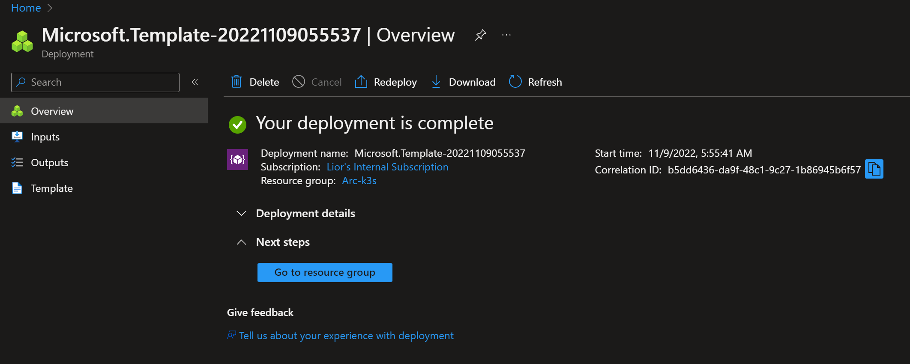
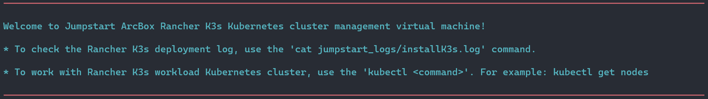

## Deploy Rancher k3s on an Azure VM and connect it to Azure Arc using Azure ARM template

The following Jumpstart scenario will guide you on how to use the provided [Azure ARM Template](https://docs.microsoft.com/azure/azure-resource-manager/templates/overview) to deploy a "Ready to Go" Azure virtual machine installed with single-master Rancher K3s Kubernetes cluster and connected it as an Azure Arc cluster resource.

## Prerequisites

- Clone the Azure Arc Jumpstart repository

    ```shell
    git clone https://github.com/microsoft/azure_arc.git
    ```

- [Install or update Azure CLI to version 2.49.0 and above](https://docs.microsoft.com/cli/azure/install-azure-cli?view=azure-cli-latest). Use the below command to check your current installed version.

  ```shell
  az --version
  ```

- Create Azure service principal (SP)

    To be able to complete the scenario and its related automation, Azure service principal assigned with the “Contributor” role is required. To create it, login to your Azure account run the below command (this can also be done in [Azure Cloud Shell](https://shell.azure.com/)).

    ```shell
    az login
    subscriptionId=$(az account show --query id --output tsv)
    az ad sp create-for-rbac -n "<Unique SP Name>" --role "Contributor" --scopes /subscriptions/$subscriptionId
    ```

    For example:

    ```shell
    az login
    subscriptionId=$(az account show --query id --output tsv)
    az ad sp create-for-rbac -n "JumpstartArcK8s" --role "Contributor" --scopes /subscriptions/$subscriptionId
    ```

    Output should look like this:

    ```json
    {
    "appId": "XXXXXXXXXXXXXXXXXXXXXXXXXXXX",
    "displayName": "JumpstartArcK8s",
    "password": "XXXXXXXXXXXXXXXXXXXXXXXXXXXX",
    "tenant": "XXXXXXXXXXXXXXXXXXXXXXXXXXXX"
    }
    ```

    > **NOTE: If you create multiple subsequent role assignments on the same service principal, your client secret (password) will be destroyed and recreated each time. Therefore, make sure you grab the correct password**.

    > **NOTE: The Jumpstart scenarios are designed with as much ease of use in-mind and adhering to security-related best practices whenever possible. It is optional but highly recommended to scope the service principal to a specific [Azure subscription and resource group](https://docs.microsoft.com/cli/azure/ad/sp?view=azure-cli-latest) as well considering using a [less privileged service principal account](https://docs.microsoft.com/azure/role-based-access-control/best-practices)**

- Enable subscription for two providers for Azure Arc-enabled Kubernetes.
  
- [Enable subscription with](https://docs.microsoft.com/azure/azure-resource-manager/management/resource-providers-and-types#register-resource-provider) the two resource providers for Azure Arc-enabled Kubernetes. Registration is an asynchronous process, and registration may take approximately 10 minutes.

  ```shell
  az provider register --namespace Microsoft.Kubernetes
  az provider register --namespace Microsoft.KubernetesConfiguration
  az provider register --namespace Microsoft.ExtendedLocation
  ```

  You can monitor the registration process with the following commands:

  ```shell
  az provider show -n Microsoft.Kubernetes -o table
  az provider show -n Microsoft.KubernetesConfiguration -o table
  az provider show -n Microsoft.ExtendedLocation -o table
  ```

- [- [Generate a new SSH key pair](https://docs.microsoft.com/azure/virtual-machines/linux/create-ssh-keys-detailed) or use an existing one (Windows 10 and above now comes with a built-in ssh client).

  ```shell
  ssh-keygen -t rsa -b 4096
  ```

  To retrieve the SSH public key after it's been created, depending on your environment, use one of the below methods:
  - In Linux, use the `cat ~/.ssh/id_rsa.pub` command.
  - In Windows (CMD/PowerShell), use the SSH public key file that by default, is located in the _`C:\Users\WINUSER/.ssh/id_rsa.pub`_ folder.

  SSH public key example output:

  ```shell
  ssh-rsa o1djFhyNe5NXyYk7XVF7wOBAAABgQDO/QPJ6IZHujkGRhiI+6s1ngK8V4OK+iBAa15GRQqd7scWgQ1RUSFAAKUxHn2TJPx/Z/IU60aUVmAq/OV9w0RMrZhQkGQz8CHRXc28S156VMPxjk/gRtrVZXfoXMr86W1nRnyZdVwojy2++sqZeP/2c5GoeRbv06NfmHTHYKyXdn0lPALC6i3OLilFEnm46Wo+azmxDuxwi66RNr9iBi6WdIn/zv7tdeE34VAutmsgPMpynt1+vCgChbdZR7uxwi66RNr9iPdMR7gjx3W7dikQEo1djFhyNe5rrejrgjerggjkXyYk7XVF7wOk0t8KYdXvLlIyYyUCk1cOD2P48ArqgfRxPIwepgW78znYuwiEDss6g0qrFKBcl8vtiJE5Vog/EIZP04XpmaVKmAWNCCGFJereRKNFIl7QfSj3ZLT2ZXkXaoLoaMhA71ko6bKBuSq0G5YaMq3stCfyVVSlHs7nzhYsX6aDU6LwM/BTO1c= user@pc
  ```](https://docs.github.com/en/authentication/connecting-to-github-with-ssh/generating-a-new-ssh-key-and-adding-it-to-the-ssh-agent) (or use existing ssh key)

> **NOTE: Default file location for public key: Windows - (C:\Users\WINUSER/.ssh\id_rsa.pub), Linux - (~/.ssh/id_rsa.pub)**

## Deployment Options and Automation Flow

This Jumpstart scenario provides multiple paths for deploying and configuring resources. Deployment options include:

- Azure portal
- ARM template via Azure CLI

For you to get familiar with the automation and deployment flow, below is an explanation.

1. User provides the ARM template parameter values, either via the portal or editing the ARM template parameters file (1-time edit). These parameters values are being used throughout the deployment.

2. User deploys the ARM template that will initiate the deployment of the k3s cluster and that will be onboarded as an Azure Arc-enabled Kubernetes cluster.

3. User configures external access for the cluster.

## Deployment Option 1: Azure portal

- Click the <a href="https://portal.azure.com/#create/Microsoft.Template/uri/https%3A%2F%2Fraw.githubusercontent.com%2Fmicrosoft%2Fazure_arc%2Fmain%2Fazure_arc_k8s_jumpstart%2Francher_k3s%2Fazure%2Farm_template%2Fazuredeploy.json" target="_blank"></a> button and enter values for the the ARM template parameters.

  

  

## Deployment Option 2: ARM template with Azure CLI

The deployment is using the template parameters file. Before initiating the deployment, edit the [_azuredeploy.parameters.json_](https://raw.githubusercontent.com/microsoft/azure_arc/main/azure_arc_k8s_jumpstart/rancher_k3s/azure/arm_template/azuredeploy.parameters.json) file to include your public SSH key, the Ubuntu OS username as well as the appId, password and tenant generated from the service principal creation.  

To deploy the ARM template, navigate to the [deployment folder](https://github.com/microsoft/azure_arc/tree/main/azure_arc_k8s_jumpstart/rancher_k3s/azure/arm_template) and run the below command:

```shell
az group create --name <Name of the Azure resource group> --location <Azure Region>
az deployment group create \
--resource-group <Name of the Azure resource group> \
--name <The name of this deployment> \
--template-uri https://raw.githubusercontent.com/microsoft/azure_arc/main/azure_arc_k8s_jumpstart/rancher_k3s/azure/arm_template/azuredeploy.json \
--parameters <The *azuredeploy.parameters.json* parameters file location>
```

For example:

```shell
az group create --name Arc-K3s-Demo --location "East US 2"
az deployment group create \
--resource-group Arc-K3s-Demo \
--name arck3sdemo01 \
--template-uri https://raw.githubusercontent.com/microsoft/azure_arc/main/azure_arc_k8s_jumpstart/rancher_k3s/azure/arm_template/azuredeploy.json \
--parameters azuredeploy.parameters.json
```

> **NOTE: If you receive an error message stating that the requested VM size is not available in the desired location (as an example: 'Standard_D8s_v3'), it means that there is currently a capacity restriction for that specific VM size in that particular region. Capacity restrictions can occur due to various reasons, such as high demand or maintenance activities. Microsoft Azure periodically adjusts the available capacity in each region based on usage patterns and resource availability. To continue deploying this scenario, please try to re-run the deployment using another region.**

Upon completion, you will have new VM installed as a single-host k3s cluster which is already projected as an Azure Arc-enabled Kubernetes cluster in a new resource group.


## Logging

For ease of troubleshooting and tracking, a deployment log will be created automatically as part of the script runtime. To view the deployment log use the below command:

```shell
cat /home/<USER>/jumpstart_logs/installK3s.log
```



> **NOTE: For enhanced security posture, SSH (22) port are not open by default in this scenario. You will need to create a network security group (NSG) rule to allow network access to port 22, or use [Azure Bastion](https://docs.microsoft.com/azure/bastion/bastion-overview) or [Just-in-Time (JIT)](https://docs.microsoft.com/azure/defender-for-cloud/just-in-time-access-usage?tabs=jit-config-asc%2Cjit-request-asc) access to connect to the VM.**

## Cleanup

To delete environment, simply just delete the Azure resource group.


