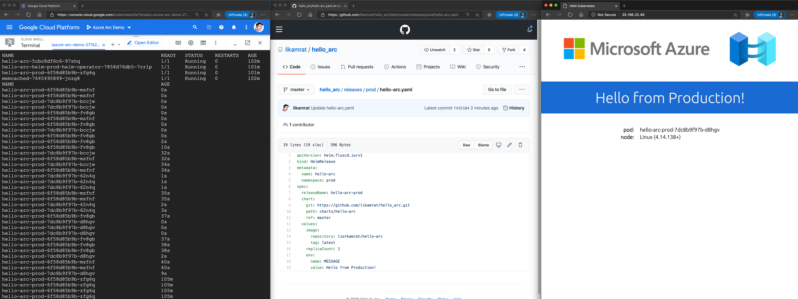

## Unified Operations at Scale with Azure Arc and Azure Lighthouse

## Overview

Modern organizations usually manage diverse and complex IT infrastructures that frequently are distributed across on-premises, edge, and multi-cloud.

In these kinds of environments, it is very important to have a consistent approach to operations and select the proper tools that allow you to have greater visibility and work at scale. Many enterprises have chosen vendor or technology-specific tools which leads to silos, causes a ruptured management experience, and an inconsistent approach to operations. When we add to the mix the speed and the innovation that cloud-native technologies and practices bring to the table, the challenge becomes even greater. The absence of a single view and consistent tooling complicates the management for customers and partners alike.

This guide provides an overview of how managed service providers or any multi-tenant organization can leverage Azure Arc in a scalable way to manage hybrid and multi-cloud environments, with visibility across all managed tenants by using Azure Lighthouse.

### Management across tenants

[Azure Lighthouse](https://docs.microsoft.com/en-us/azure/lighthouse/overview) is an Azure service that enables cross and multi-tenant management providing greater visibility and scale into operations. Azure Lighthouse uses an Azure Resource Provider that brings the Azure Delegated Resource Management capability by logically projecting resources from one tenant onto another and unlocking cross-tenant management without the need to do context switching.

This service is very valuable for service providers as they can realize efficiencies in their offerings using Azure’s operations and management tools for multiple customers, however, it is as useful to customers that may have multiple Azure AD tenants (e.g. multiple subsidiaries or geographies in separate tenants).

To get started with Azure Lighthouse you can onboard a managed tenant using the Azure Delegated resource management. The onboarding process can be done in two different ways:

- [Using an ARM template](https://docs.microsoft.com/en-us/azure/lighthouse/how-to/onboard-customer#create-an-azure-resource-manager-template)
- [Publishing a Managed Service offer to the Azure Marketplace](https://docs.microsoft.com/en-us/azure/lighthouse/how-to/publish-managed-services-offers)

After you finish the onboarding process you will have a central management tenant, in this scenario Contoso, that will aggregate the information from multiple customers: Microsoft, Fabrikam, and Fourth Coffee.

### Extend Azure management across your environments

Once you have centralized all operations in Azure using Lighthouse and Azure's Operations and Management tools, you can stretch these services to run across on-premises, other clouds, or the edge.

With Azure Arc, your on-premises and other cloud deployments become an Azure Resource Manager entity and as such, servers, Kubernetes clusters, or data services can be treated as first-class citizens of Azure.  As with any other ARM resource, they can be organized into resource groups and subscriptions, use tags, policies, assign RBAC, and can even leverage Azure Arc to onboard other services such as Azure Monitoring, Azure Security Center, Azure Sentinel, or Azure Automation.

In our scenario, now Arc Contoso can use Azure Arc to not only understand and organize the breadth of operations but also extend and grow services and offerings provided in Azure into every corner of the digital state. Using Azure hybrid management services with Azure Arc allows Contoso to adopt cloud-native practices everywhere and Lighthouse will provide the multitenancy required to have a single view into operations. Now we can explore key cross-tenant management experiences that are enabled by Azure Arc and Azure Lighthouse.

### Governance and Compliance

Azure Policy provides the mechanism to enforce corporate standards and to assess compliance at scale. Through it, you can implement governance for consistency of deployments, compliance, control costs, and improve your security posture; with its compliance dashboard, you will get an aggregated view of the overall state of the Azure environment as well as remediation capabilities. If your resources are distributed across different tenants, Azure Lighthouse will provide the full picture of your compliance status.

With Azure Arc you can even take it a step further as now Azure Policies can be assigned to Azure Arc-enabled servers and Kubernetes, this way you can apply the same set of policies across hybrid and multi-cloud resources to entirely manage governance and guarantee corporate compliance.

Your Azure Arc-enabled resources should be registered on a managed tenant so you can centrally manage compliance from the Azure Lighthouse-powered tenant. To work with Azure Arc and Azure Policies check out these Jumpstart scenarios:

- [Deploy Monitoring Agent Extension to Azure Arc Linux and Windows servers using Azure Policy](https://azurearcjumpstart.io/azure_arc_jumpstart/azure_arc_servers/day2/arc_policies_mma/)
- [Apply GitOps configurations on AKS as an Azure Arc Connected Cluster using Azure Policy for Kubernetes](https://azurearcjumpstart.io/azure_arc_jumpstart/azure_arc_k8s/day2/aks/aks_policy/#apply-gitops-configurations-on-aks-as-an-azure-arc-connected-cluster-using-azure-policy-for-kubernetes)
- [Apply GitOps configurations on GKE as an Azure Arc Connected Cluster using Azure Policy for Kubernetes](https://azurearcjumpstart.io/azure_arc_jumpstart/azure_arc_k8s/day2/gke/gke_policy/#apply-gitops-configurations-on-gke-as-an-azure-arc-connected-cluster-using-azure-policy-for-kubernetes)

### Inventory Management

By using Azure Arc, your on-premises and multi-cloud resources become part of Azure Resource Manager and therefore you can use tools such as Azure Resource Graph as a way to explore your inventory at scale.  Your Azure Resource Graph queries can now include Azure Arc-enabled resources with filtering, using tags, or tracking changes.

For multitenant organizations, this service also supports Azure Lighthouse to allow you to query resources in a managed tenant.

To explore this use case, use this Jumpstart scenario to work with tagged Azure Arc-enabled servers in your managed tenants:

- [Apply inventory tagging to Azure Arc-enabled servers](https://azurearcjumpstart.io/azure_arc_jumpstart/azure_arc_servers/day2/arc_inventory_tagging/)

### Monitoring and Alerting

Azure Lighthouse allows Contoso to also get monitoring and security alerts across all of the tenant’s subscriptions, run multitenant queries using Kusto query language (KQL), and set up dashboards that provide valuable insights on the managed environments. There is no need to store logs from different entities into a shared log analytics workspace, Microsoft, Fabrikam and Fourth Coffee can keep their logs on a dedicated workspace in their subscription, while Contoso gets delegated access to them and get insights from all tenants.

By enabling a resource in Azure Arc it gives you the ability to perform configuration management and monitoring tasks on those services as if they were first-class citizens in Azure. You will be able to monitor your connected machine guest operating system performance or your Kubernetes clusters at the scope of the resource with VM and container Insights.

Use these Jumpstart scenarios to integrate Azure Monitor and Azure Arc in your managed tenants:

- [Deploy Monitoring Agent Extension on Azure Arc Linux and Windows servers using Extension Management](https://azurearcjumpstart.io/azure_arc_jumpstart/azure_arc_servers/day2/arc_vm_extension_mma_arm/)
- [Integrate Azure Monitor for Containers with AKS as an Azure Arc Connected Cluster](https://azurearcjumpstart.io/azure_arc_jumpstart/azure_arc_k8s/day2/aks/aks_monitor/)
- [Integrate Azure Monitor for Containers with GKE as an Azure Arc Connected Cluster](https://azurearcjumpstart.io/azure_arc_jumpstart/azure_arc_k8s/day2/gke/gke_monitor/)
- [Integrate Azure Monitor for Containers with MicroK8s as an Azure Arc Connected Cluster](https://azurearcjumpstart.io/azure_arc_jumpstart/azure_arc_k8s/day2/microk8s/local_microk8s_monitor/)

### Hybrid Services Onboarding at Scale

In the Contoso scenario, you will centrally manage at scale infrastructure and services that are distributed, for the operations you will usually use services such as Azure Monitoring, Azure Automation, Azure Security Center, or Azure Sentinel. To work with these services you will need to deploy an agent on your Arc-enabled resources and there are several ways you can do that:

- Using a configuration management tool of your choice
- Using Azure Policy and its remediation tasks
- Azure Arc’s extension management capabilities

The extension management feature for [Azure Arc-enabled servers](https://docs.microsoft.com/en-us/azure/azure-arc/servers/manage-vm-extensions) and [Azure Arc-enabled Kubernetes](https://docs.microsoft.com/en-us/azure/azure-arc/kubernetes/extensions) provides the same post-deployment configuration and automation tasks that you have for Azure VMs or Azure Kubernetes Service. With this feature, you can deploy small pieces of software to your Arc-enabled resources in an automated fashion, onboarding to Azure Monitor, Azure Defender, DSC, or even deploy a custom script on your VMs.

To work with Azure Arc extension management check out these Jumpstart scenarios:

- [Deploy Monitoring Agent Extension on Azure Arc Linux and Windows servers using Extension Management](https://azurearcjumpstart.io/azure_arc_jumpstart/azure_arc_servers/day2/arc_vm_extension_mma_arm/#deploy-monitoring-agent-extension-on-azure-arc-linux-and-windows-servers-using-extension-management)
- [Deploy Custom Script Extension on Azure Arc Linux and Windows servers using Extension Management](https://azurearcjumpstart.io/azure_arc_jumpstart/azure_arc_servers/day2/arc_vm_extension_customscript_arm/#deploy-custom-script-extension-on-azure-arc-linux-and-windows-servers-using-extension-management)
- [Deploy Monitoring Agent Extension to Azure Arc Linux and Windows servers using Azure Policy](https://azurearcjumpstart.io/azure_arc_jumpstart/azure_arc_servers/day2/arc_policies_mma/)
- [Integrate Azure Monitor for Containers with GKE as an Azure Arc Connected Cluster using Kubernetes extensions](https://azurearcjumpstart.io/azure_arc_jumpstart/azure_arc_k8s/day2/gke/gke_monitor_extension/)

### Access Management

Another important topic in unified operations is being able to keep track of what the different teams are doing and provide insights into the operations that are performed on resources or subscriptions.

With Azure Lighthouse the managed tenant can view Azure Activity log data to see all of the actions taken, this gives full visibility into operations that are performed through the Azure delegated resource management. Azure Lighthouse also uses supports Azure RBAC so you can give access to your resources following the principle of least privilege so that users only have the permissions needed to complete their job.

If you are centralizing operations in Azure and this includes on-premises and multi-cloud resources with Azure Arc, you will want to also control access to these services. Access to Azure Arc-enabled resources is controlled by standard Azure RBAC, so from Access Control (IAM) in the Azure portal you can verify who has access to your resources and any actions taken from Azure will also be reflected on the Activity log.

The fact that Azure Arc-enabled resources are part of ARM and access is controlled by Azure RBAC means that you can also have delegated management via Lighthouse with full visibility and insights on operations.

### Application and Data Management at Scale

Contoso can use configuration as code and uniformly govern and deploy containerized applications using GitOps-based configurations across on-premises, multi-cloud, and edge. Contoso can link a cluster to a Git repo that becomes the single source of truth for container deployments and applications, Azure Arc-enabled Kubernetes will make sure there is no drift between Git and what is running in the cluster.

Azure Arc-enabled data services to allow Contoso to run Azure data services like Azure SQL Managed Instance and Azure Database for PostgreSQL Hyperscale on any Kubernetes cluster with unified management and familiar tools. With Azure Arc and Azure Lighthouse, Contoso is empowered to create cloud-native management operations with no location boundaries.

All of these data and application deployments can be done across organizations by using Azure Lighthouse delegated management features.

To work with Azure Arc-enabled data services and Azure Arc-enabled Kubernetes check out these Jumpstart scenarios:

- [Deploy GitOps configurations and perform basic GitOps flow on AKS on Azure Stack HCI as an Azure Arc Connected Cluster](https://azurearcjumpstart.io/azure_arc_jumpstart/azure_arc_k8s/day2/aks_stack_hci/aks_hci_gitops_basic/)
- [Deploy GitOps configurations and perform Helm-based GitOps flow on AKS on Azure Stack HCI as an Azure Arc Connected Cluster](https://azurearcjumpstart.io/azure_arc_jumpstart/azure_arc_k8s/day2/aks_stack_hci/aks_hci_gitops_helm/)
- [Deploy GitOps configurations and perform basic GitOps flow on GKE as an Azure Arc Connected Cluster](https://azurearcjumpstart.io/azure_arc_jumpstart/azure_arc_k8s/day2/gke/gke_gitops_basic/)
- [Deploy GitOps configurations and perform Helm-based GitOps flow on GKE as an Azure Arc Connected Cluster](https://azurearcjumpstart.io/azure_arc_jumpstart/azure_arc_k8s/day2/gke/gke_gitops_helm/)
-[Deploy GitOps configurations and perform Helm-based GitOps flow on kind as an Azure Arc Connected Cluster](https://azurearcjumpstart.io/azure_arc_jumpstart/azure_arc_k8s/day2/kind/local_kind_gitops_helm/)
- [Deploy GitOps configurations and perform Helm-based GitOps flow on MicroK8s as an Azure Arc Connected Cluster](https://azurearcjumpstart.io/azure_arc_jumpstart/azure_arc_k8s/day2/microk8s/local_microk8s_gitops_helm/)
- [Azure Arc-enabled data services](https://azurearcjumpstart.io/azure_arc_jumpstart/azure_arc_data/)

### Summary

Simplifying your cloud management and operations experience using consistent tools for governance, application deployment, and cloud management at scale is essential when working with distributed, hybrid or multi-cloud assets even more so for multi-tenant organizations.

Using Azure Arc and Azure Lighthouse as central pieces of your operations to extend Azure tooling and services to all your assets, enables organizations to have consistent management and governance to accelerate innovation and agility with cloud-native practices anywhere.
