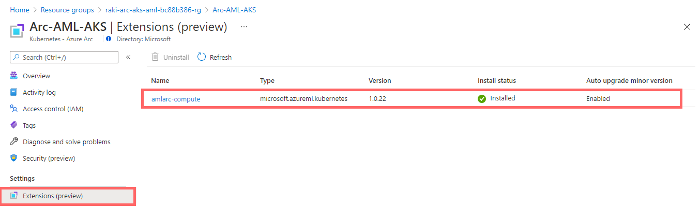

## Train, Deploy and call inference on an image classification model - MNIST dataset from Azure Blob Storage

The following README will guide you on how to deploy an end-to-end Machine Learning pipeline using [Azure Arc-enabled machine learning](https://docs.microsoft.com/en-us/azure/machine-learning/how-to-attach-arc-kubernetes) deployed on [Azure Kubernetes Service (AKS)](https://docs.microsoft.com/en-us/azure/aks/intro-kubernetes) cluster using [Azure ARM Templates](https://docs.microsoft.com/en-us/azure/azure-resource-manager/templates/overview).

By the end of this guide, you will have:

- An AKS cluster onboarded with Azure Arc
- A Microsoft Windows Server 2022 (Datacenter) Azure client VM (with optional steps outlined to remote access via [Azure Bastion](https://docs.microsoft.com/en-us/azure/bastion/bastion-overview) for increased Security Posture)
- Azure Machine Learning with:

  - Attached [Kubernetes (Preview) Compute](https://docs.microsoft.com/en-us/azure/machine-learning/how-to-attach-compute-targets#kubernetes) (Azure Arc)
  - Model Training Run performed on Kubernetes Cluster - using [Azure CLI](https://docs.microsoft.com/en-us/cli/azure/ml/job?view=azure-cli-latest#az_ml_job_create)
  - [Model Registered](https://docs.microsoft.com/en-us/azure/machine-learning/concept-model-management-and-deployment#register-and-track-ml-models) on Azure ML Studio (via [`pickle`](https://docs.python.org/3/library/pickle.html) file)
  - Model Inference endpoint (pod) deployed on Kubernetes Cluster - using [Azure CLI](https://docs.microsoft.com/en-us/cli/azure/ml/endpoint?view=azure-cli-latest#az_ml_endpoint_create)
  - Model Inference endpoint (pod) invoked using:

    1. [Azure CLI](https://docs.microsoft.com/en-us/cli/azure/ml/endpoint?view=azure-cli-latest#az_ml_endpoint_invoke) using `az ml endpoint invoke`; and,
    2. [PowerShell native RESTful methods](https://docs.microsoft.com/en-us/powershell/module/microsoft.powershell.utility/invoke-restmethod?view=powershell-7.1).

    The point of the second method is to demonstrate that the inference pod can be called from any downstream business applications against the deployed model's REST API endpoint (i.e. we're simulating this using PowerShell).


> **Note: Currently, Azure Arc-enabled machine learning is in [public preview](https://github.com/Azure/AML-Kubernetes)**.

To demonstrate the various architecture components, the ML pipeline we deploy is an Image Classification model trained using [scikit-learn](https://scikit-learn.org/stable/modules/generated/sklearn.linear_model.LogisticRegression.html) on the common [MNIST database of handwritten digits](https://docs.microsoft.com/en-us/azure/open-datasets/dataset-mnist?tabs=azureml-opendatasets) - a Jupyter Notebook representation of the training pipeline can be found [here](https://github.com/Azure/AML-Kubernetes/blob/master/examples/simple-train-sdk/img-classification-training.ipynb), and a visual representation of the model's inference capabilities is summarized as follows:


## Prerequisites

- Clone the Azure Arc Jumpstart repository

  ```shell
  git clone https://github.com/microsoft/azure_arc.git
  ```

- [Install or update Azure CLI to version 2.25.0 and above](https://docs.microsoft.com/en-us/cli/azure/install-azure-cli?view=azure-cli-latest). Use the below command to check your current installed version.

  ```shell
  az --version
  ```

- [Generate SSH Key](https://docs.microsoft.com/en-us/azure/virtual-machines/linux/create-ssh-keys-detailed) (or use existing ssh key).

- Create Azure service principal (SP)

  To be able to complete the scenario and its related automation, Azure service principal assigned with the “Contributor” role is required. To create it, login to your Azure account run the below command (this can also be done in [Azure Cloud Shell](https://shell.azure.com/).

  ```shell
  az login
  az ad sp create-for-rbac -n "<Unique SP Name>" --role contributor
  ```

  For example:

  ```shell
  az ad sp create-for-rbac -n "http://AzureArcML" --role contributor
  ```

  Output should look like this:

  ```json
  {
    "appId": "XXXXXXXXXXXXXXXXXXXXXXXXXXXX",
    "displayName": "AzureArcML",
    "name": "http://AzureArcML",
    "password": "XXXXXXXXXXXXXXXXXXXXXXXXXXXX",
    "tenant": "XXXXXXXXXXXXXXXXXXXXXXXXXXXX"
  }
  ```

  > **Note: It is optional, but highly recommended, to scope the SP to a specific [Azure subscription](https://docs.microsoft.com/en-us/cli/azure/ad/sp?view=azure-cli-latest).**

## Automation Flow

For you to get familiar with the automation and deployment flow, below is an explanation.

- User is editing the ARM template parameters file (1-time edit). These parameters values are being used throughout the deployment.

- Main [_azuredeploy_](https://github.com/microsoft/azure_arc/blob/main/azure_arc_ml_jumpstart/aks/arm_template/azuredeploy.json) ARM template will initiate the deployment of the linked ARM templates:

  - [_VNET_](https://github.com/microsoft/azure_arc/blob/main/azure_arc_ml_jumpstart/aks/arm_template/VNET.json) - Deploys a Virtual Network with a single subnet - used by our clientVM.
  - [_aks_](https://github.com/microsoft/azure_arc/blob/main/azure_arc_ml_jumpstart/aks/arm_template/aks.json) - Deploys the AKS cluster where all the Azure Arc ML services will be deployed.
  - [_clientVm_](https://github.com/microsoft/azure_arc/blob/main/azure_arc_ml_jumpstart/aks/arm_template/clientVm.json) - Deploys the client Windows VM. This is where all user interactions with the environment are made from.
  - [_logAnalytics_](https://github.com/microsoft/azure_arc/blob/main/azure_arc_ml_jumpstart/aks/arm_template/logAnalytics.json) - Deploys Azure Log Analytics workspace to support various logs uploads.

User remotes into client Windows VM (using Public IP, or optionally using Bastion), which automatically kicks off the [_AzureMLLogonScript_](https://github.com/microsoft/azure_arc/blob/main/azure_arc_ml_jumpstart/aks/arm_template/artifacts/AzureMLLogonScript.ps1) PowerShell script that deploys and configure Azure Arc-enabled machine learning services on the AKS cluster, including the various Azure ML [operators](https://kubernetes.io/docs/concepts/extend-kubernetes/operator/), training pod and the inference pod.

## Deployment

As mentioned, this deployment will leverage ARM templates. You will deploy a single template that will initiate the entire automation for this scenario.

- The deployment is using the ARM template parameters file. Before initiating the deployment, edit the [_azuredeploy.parameters.json_](https://github.com/microsoft/azure_arc/blob/main/azure_arc_ml_jumpstart/aks/arm_template/azuredeploy.parameters.json) file located in your local cloned repository folder. An example parameters file is located [here](https://github.com/microsoft/azure_arc/blob/main/azure_arc_ml_jumpstart/aks/arm_template/artifacts/azuredeploy.parameters.example.json).

  - `sshRSAPublicKey` - Your SSH public key
  - `spnClientId` - Your Azure service principal id
  - `spnClientSecret` - Your Azure service principal secret
  - `spnTenantId` - Your Azure tenant id
  - `windowsAdminUsername` - Client Windows VM Administrator name
  - `windowsAdminPassword` - Client Windows VM Password. Password must have 3 of the following: 1 lower case character, 1 upper case character, 1 number, and 1 special character. The value must be between 12 and 123 characters long.
  - `myIpAddress` - Your local public IP address. This is used to allow remote RDP and SSH connections to the client Windows VM and AKS cluster.
  - `logAnalyticsWorkspaceName` - Unique name for the deployment log analytics workspace.
  - `kubernetesVersion` - AKS version
  - `dnsPrefix` - AKS unique DNS prefix

- To deploy the ARM template, navigate to the local cloned [deployment folder](https://github.com/microsoft/azure_arc/blob/main/azure_arc_ml_jumpstart/aks/arm_template) and run the below command:

  ```shell
  az group create --name <Name of the Azure resource group> --location <Azure Region>
  az deployment group create \
  --resource-group <Name of the Azure resource group> \
  --name <The name of this deployment> \
  --template-uri https://raw.githubusercontent.com/microsoft/azure_arc/main/azure_arc_ml_jumpstart/aks/arm_template/azuredeploy.json \
  --parameters <The *azuredeploy.parameters.json* parameters file location>
  ```

  > **Note: Make sure that you are using the same Azure resource group name as the one you've just used in the _azuredeploy.parameters.json_ file**

  For example:

  ```shell
  az group create --name Arc-ML-Demo --location "East US"
  az deployment group create \
  --resource-group Arc-ML-Demo \
  --name arcml \
  --template-uri https://raw.githubusercontent.com/microsoft/azure_arc/main/azure_arc_ml_jumpstart/aks/arm_template/azuredeploy.json \
  --parameters azuredeploy.parameters.json
  --parameters templateBaseUrl="https://raw.githubusercontent.com/your--github--handle/azure_arc/main/azure_arc_ml_jumpstart/aks/arm_template/"
  ```

  > **Note: The deployment time for this scenario can take ~10-15min**

- Once the above deployment is kicked off - you also have the option to deploy an Azure Bastion to access the Client VM. This is specially useful for enterprise environments where access to Port 3389 is restricted from Public IP's (e.g. using preventative [Azure Policies](https://docs.microsoft.com/en-us/azure/virtual-network/policy-reference#azure-virtual-network)).

  > **Note: Using Azure Bastion is completely optional for this scenario - if your environment allows RDP from your Public IP, feel free to skip this step**

  To deploy Azure Bastion on the VNET (which should already be deployed via the ARM template above) - run the below commands:

  ```shell
    az network vnet subnet create -g Arc-ML-Demo --vnet-name "Arc-ML-VNet" -n "AzureBastionSubnet" --address-prefixes 172.16.2.0/27
    az network public-ip create -g Arc-ML-Demo --name "Bastion-PIP" --sku Standard --location eastus
    az network bastion create --name "Arc-Client-Bastion" --public-ip-address "Bastion-PIP" -g Arc-ML-Demo --vnet-name "Arc-ML-VNet" --location eastus
  ```

- Once Azure resources have been provisioned, you will be able to see it in Azure portal. At this point, the resource group should have **8 various Azure resources (+2 with Bastion)** deployed.

  

  

## Windows Login & Post Deployment

- Now that first phase of the automation is completed, it is time to RDP to the client VM - either using it's public IP:

  

  Or by using Bastion:
  

- At first login, as mentioned in the "Automation Flow" section above, the [_AzureMLLogonScript_](https://github.com/microsoft/azure_arc/blob/main/azure_arc_ml_jumpstart/aks/arm_template/artifacts/AzureMLLogonScript.ps1) PowerShell logon script will start it's run.

- Let the script run its course and **do not close** the PowerShell session, this will be done for you once completed. Once the script finishes it's run, the logon script PowerShell session will be closed, the Windows wallpaper will change, the Model Training will be completed, the Inference Pod will be deployed, and ready to call for Model inference.

  The `AzureMLLogonScript.ps1` automation script run is visually annotated (where applicable) to showcase each logical step of the deployment process, depicted as follows:

  

  > **Note: For visualizing the deployment flow, the automation script deploys [Weave Scope](https://www.weave.works/oss/scope/) pods in the K8s cluster and launches edge against the Load Balancer IP. Note that this is not core to the Azure ML or Azure Arc flow - but is included for visualization purposes.**

  **1. Onboard AKS Cluster to Azure Arc**

  

  

  **2. Enabling Azure Arc-enabled Machine Learning components (k8s-extension with Training, Inference)**

  

  

  

  

  **3. Train model using Azure Machine Learning CLI**

  

  

  

  **4. Deploy inference endpoint on Kubernetes Cluster**

  

  

  

  **5. Invoke Inference with sample JSON payload**

  

- Since this scenario is deploying the Azure Machine Learning components, you will also notice additional newly deployed Azure resources in the resources group:


## Cluster extensions

In this scenario, the Azure Arc-enabled machine learning services cluster extension was deployed and used throughout this scenario in order to deploy the machine learning components.

- In order to view cluster extensions, click on the Azure Arc-enabled Kubernetes resource Extensions settings.

  

## Cleanup

- If you want to delete the entire environment, first, go into Azure Machine Learning Studio, and delete the inference endpoint from _within_ the Studio (and **not** from the Resource Group):

  

  

- Then, delete the remaining resources from the resource group - in the Azure portal:

  

## Known Issues

- Deleting the **2** Inference Endpoint resources are not supported from Azure Portal at this time - doing so may return the following error:

  

  Please follow the steps outlined earlier from within the Azure ML studio to delete the 2 resources.
