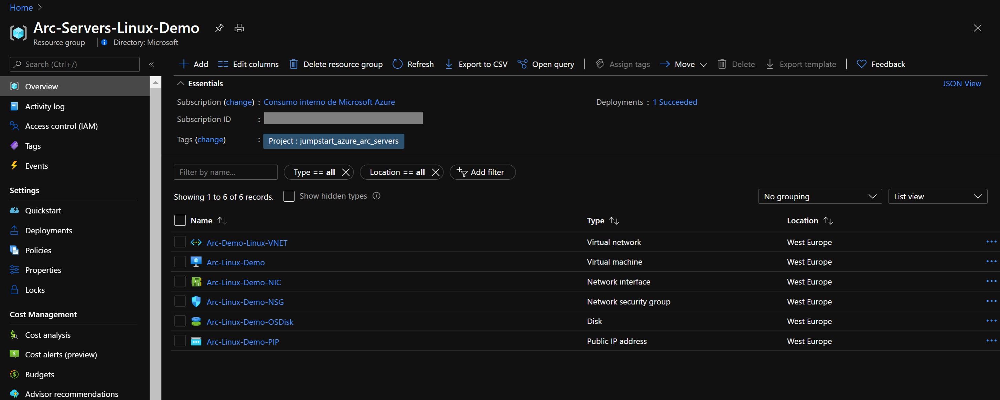
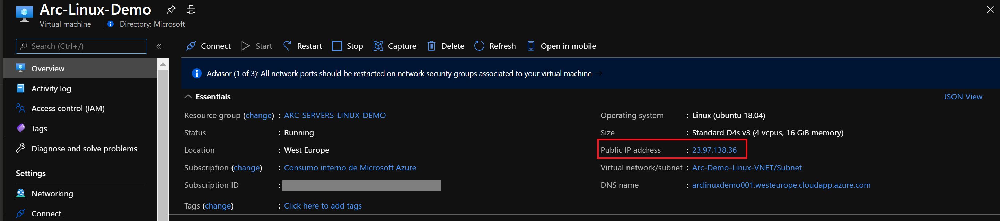

## Deploy an Ubuntu Azure Virtual Machine and connect it to Azure Arc using ARM Template

The following README will guide you on how to automatically onboard a Azure Ubuntu VM on to Azure Arc using [Azure ARM Template](https://docs.microsoft.com/en-us/azure/azure-resource-manager/templates/overview). The provided ARM template is responsible of creating the Azure resources as well as executing the Azure Arc onboard script on the VM.

Azure VMs are leveraging the [Azure Instance Metadata Service (IMDS)](https://docs.microsoft.com/en-us/azure/virtual-machines/windows/instance-metadata-service) by default. By projecting an Azure VM as an Azure Arc-enabled server, a "conflict" is created which will not allow for the Azure Arc server resources to be represented as one when the IMDS is being used and instead, the Azure Arc server will still "act" as a native Azure VM.

However, **for demo purposes only**, the below guide will allow you to use and onboard Azure VMs to Azure Arc and by doing so, you will be able to simulate a server which is deployed outside of Azure (i.e "on-premises" or in other cloud platforms)

> **Note: It is not expected for an Azure VM to be projected as an Azure Arc-enabled server. The below scenario is unsupported and should ONLY be used for demo and testing purposes.**

## Prerequisites

* Clone the Azure Arc Jumpstart repository

    ```shell
    git clone https://github.com/microsoft/azure_arc.git
    ```

* [Install or update Azure CLI to version 2.25.0 and above](https://docs.microsoft.com/en-us/cli/azure/install-azure-cli?view=azure-cli-latest). Use the below command to check your current installed version.

  ```shell
  az --version
  ```

* In case you don't already have one, you can [Create a free Azure account](https://azure.microsoft.com/en-us/free/).

* Create Azure service principal (SP).

    To be able to complete the scenario and its related automation, Azure service principal assigned with the “Contributor” role is required. To create it, login to your Azure account run the below command (this can also be done in [Azure Cloud Shell](https://shell.azure.com/)).

    ```shell
    az login
    az ad sp create-for-rbac -n "<Unique SP Name>" --role contributor
    ```

    For example:

    ```shell
    az ad sp create-for-rbac -n "http://AzureArcServers" --role contributor
    ```

    Output should look like this:

    ```json
    {
    "appId": "XXXXXXXXXXXXXXXXXXXXXXXXXXXX",
    "displayName": "AzureArcServers",
    "name": "http://AzureArcServers",
    "password": "XXXXXXXXXXXXXXXXXXXXXXXXXXXX",
    "tenant": "XXXXXXXXXXXXXXXXXXXXXXXXXXXX"
    }
    ```

    > **Note: It is optional, but highly recommended, to scope the SP to a specific [Azure subscription](https://docs.microsoft.com/en-us/cli/azure/ad/sp?view=azure-cli-latest).**

## Automation Flow

For you to get familiar with the automation and deployment flow, below is an explanation.

1. User is editing the ARM template parameters file (1-time edit). These parameters values are being used throughout the deployment.

2. The ARM template includes an Azure VM custom script extension which will deploy the the [*install_arc_agent.sh*](https://github.com/microsoft/azure_arc/blob/main/azure_arc_servers_jumpstart/azure/linux/arm_template/scripts/install_arc_agent.sh) Shell script.

3. In order to allow the Azure VM to successfully be projected as an Azure Arc-enabled server, the script will:

    1. Set local OS environment variables.

    2. Generate a ~/.bash_profile file that will be initialized at user's first login to configure the environment. This script will:

        * Stop and disable the "Linux Azure Guest Agent" service.

        * Create a new OS Firewall rule to block Azure IMDS outbound traffic to the *169.254.169.254* remote address.

        * Install the Azure Arc connected machine agent.

        * Remove the ~/.bash_profile file so it will not run after first login.

4. User SSH to Linux VM which will start the *~/.bash_profile* script execution and will onboard the VM to Azure Arc

    > **Note: The [*install_arc_agent.sh*](https://github.com/microsoft/azure_arc/blob/main/azure_arc_servers_jumpstart/azure/linux/arm_template/scripts/install_arc_agent.sh) shell script will enable the OS firewall and set up new rules for incoming and outgoing connections. By default all incoming and outgoing traffic will be allowed, except blocking Azure IMDS outbound traffic to the *169.254.169.254* remote address.**

## Deployment

As mentioned, this deployment will leverage ARM templates. You will deploy a single template, responsible for creating all the Azure resources in a single resource group as well onboarding the created VM to Azure Arc.

* Before deploying the ARM template, login to Azure using AZ CLI with the ```az login``` command.

* The deployment is using the ARM template parameters file. Before initiating the deployment, edit the [*azuredeploy.parameters.json*](https://github.com/microsoft/azure_arc/blob/main/azure_arc_servers_jumpstart/azure/linux/arm_template/azuredeploy.parameters.json) file located in your local cloned repository folder. An example parameters file is located [here](https://github.com/microsoft/azure_arc/blob/main/azure_arc_servers_jumpstart/azure/linux/arm_template/azuredeploy.parameters.example.json).

* To deploy the ARM template, navigate to the local cloned [deployment folder](https://github.com/microsoft/azure_arc/tree/main/azure_arc_servers_jumpstart/azure/linux/arm_template) and run the below command:

    ```shell
    az group create --name <Name of the Azure resource group> --location <Azure region> --tags "Project=jumpstart_azure_arc_servers"
    az deployment group create \
    --resource-group <Name of the Azure resource group> \
    --name <The name of this deployment> \
    --template-uri https://raw.githubusercontent.com/microsoft/azure_arc/main/azure_arc_servers_jumpstart/azure/linux/arm_template/azuredeploy.json \
    --parameters <The *azuredeploy.parameters.json* parameters file location>
    ```

    > **Note: make sure that you are using the same Azure resource group name as the one you've just used in the *azuredeploy.parameters.json* file**

    For example:

    ```shell
    az group create --name Arc-Servers-Linux-Demo --location "westeurope" --tags "Project=jumpstart_azure_arc_servers"
    az deployment group create \
    --resource-group Arc-Servers-Linux-Demo \
    --name arclinuxdemo \
    --template-uri https://raw.githubusercontent.com/microsoft/azure_arc/main/azure_arc_servers_jumpstart/azure/linux/arm_template/azuredeploy.json \
    --parameters azuredeploy.parameters.json
    ```

* Once Azure resources has been provisioned, you will be able to see it in Azure portal.

    

    

## Linux Login & Post Deployment

* Now that the Linux VM is created, it is time to login to it. Using its public IP, SSH to the VM.

    

* At first login, as mentioned in the "Automation Flow" section, a logon script will get executed. This script was created as part of the automated deployment process.

* Let the script to run its course and **do not close** the SSH session, this will be done for you once completed.

    

    

    

* Upon successful run, a new Azure Arc-enabled server will be added to the resource group.

    

    

## Cleanup

To delete the entire deployment, simply delete the resource group from the Azure portal.


