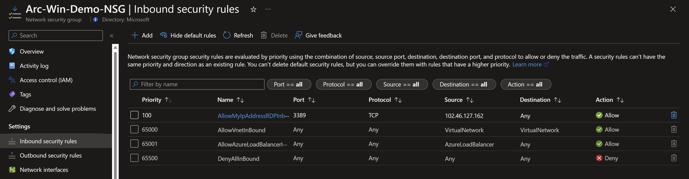

## Deploy a Windows Azure Virtual Machine and connect it to Azure Arc using an ARM Template

The following Jumpstart scenario will guide you on how to automatically onboard a Azure Windows VM on to Azure Arc using [Azure ARM Template](https://docs.microsoft.com/azure/azure-resource-manager/templates/overview). The provided ARM template is responsible of creating the Azure resources as well as executing the Azure Arc onboard script on the VM.

Azure VMs are leveraging the [Azure Instance Metadata Service (IMDS)](https://docs.microsoft.com/azure/virtual-machines/windows/instance-metadata-service) by default. By projecting an Azure VM as an Azure Arc-enabled server, a "conflict" is created which will not allow for the Azure Arc server resources to be represented as one when the IMDS is being used and instead, the Azure Arc server will still "act" as a native Azure VM.

However, **for demo purposes only**, the below guide will allow you to use and onboard Azure VMs to Azure Arc and by doing so, you will be able to simulate a server which is deployed outside of Azure (i.e "on-premises" or in other cloud platforms)

> **NOTE: It is not expected for an Azure VM to be projected as an Azure Arc-enabled server. The below scenario is unsupported and should ONLY be used for demo and testing purposes.**

## Prerequisites

- [Install or update Azure CLI to version 2.42.0 and above](https://docs.microsoft.com/cli/azure/install-azure-cli?view=azure-cli-latest). Use the below command to check your current installed version.

  ```shell
  az --version
  ```

- In case you don't already have one, you can [Create a free Azure account](https://azure.microsoft.com/free/).

- Create Azure service principal (SP)

    To be able to complete the scenario and its related automation, Azure service principal assigned with the “Contributor” role is required. To create it, login to your Azure account run the below command (this can also be done in [Azure Cloud Shell](https://shell.azure.com/)).

    ```shell
    az login
    subscriptionId=$(az account show --query id --output tsv)
    az ad sp create-for-rbac -n "<Unique SP Name>" --role "Contributor" --scopes /subscriptions/$subscriptionId
    ```

    For example:

    ```shell
    az login
    subscriptionId=$(az account show --query id --output tsv)
    az ad sp create-for-rbac -n "JumpstartArc" --role "Contributor" --scopes /subscriptions/$subscriptionId
    ```

    Output should look like this:

    ```json
    {
    "appId": "XXXXXXXXXXXXXXXXXXXXXXXXXXXX",
    "displayName": "JumpstartArc",
    "password": "XXXXXXXXXXXXXXXXXXXXXXXXXXXX",
    "tenant": "XXXXXXXXXXXXXXXXXXXXXXXXXXXX"
    }
    ```

    > **NOTE: If you create multiple subsequent role assignments on the same service principal, your client secret (password) will be destroyed and recreated each time. Therefore, make sure you grab the correct password**.

    > **NOTE: The Jumpstart scenarios are designed with as much ease of use in-mind and adhering to security-related best practices whenever possible. It is optional but highly recommended to scope the service principal to a specific [Azure subscription and resource group](https://docs.microsoft.com/cli/azure/ad/sp?view=azure-cli-latest) as well considering using a [less privileged service principal account](https://docs.microsoft.com/azure/role-based-access-control/best-practices)**

- Azure Arc-enabled servers depends on the following Azure resource providers in your subscription in order to use this service. Registration is an asynchronous process, and registration may take approximately 10 minutes.

  - Microsoft.HybridCompute
  - Microsoft.GuestConfiguration
  - Microsoft.HybridConnectivity

      ```shell
      az provider register --namespace 'Microsoft.HybridCompute'
      az provider register --namespace 'Microsoft.GuestConfiguration'
      az provider register --namespace 'Microsoft.HybridConnectivity'
      ```

      You can monitor the registration process with the following commands:

      ```shell
      az provider show --namespace 'Microsoft.HybridCompute'
      az provider show --namespace 'Microsoft.GuestConfiguration'
      az provider show --namespace 'Microsoft.HybridConnectivity'
      ```

## Deployment Options and Automation Flow

This Jumpstart scenario provides multiple paths for deploying and configuring resources. Deployment options include:

- Azure portal
- ARM template via Azure CLI

For you to get familiar with the automation and deployment flow, below is an explanation.

1. User provides the ARM template parameter values, either via the portal or editing the parameters file. These parameter values are used throughout the deployment.

2. The ARM template incl. an Azure VM custom script extension which will deploy the the [*install_arc_agent.ps1*](https://github.com/microsoft/azure_arc/blob/main/azure_arc_servers_jumpstart/azure/windows/arm_template/scripts/install_arc_agent.ps1) PowerShell script.

3. In order to allow the Azure VM to successfully be projected as an Azure Arc-enabled server, the script will:

    1. Set local OS environment variables.

    2. Generate a local OS logon script named *LogonScript.ps1*. This script will:

        - Create the *LogonScript.log* file.

        - Stop and disable the "Windows Azure Guest Agent" service.

        - Create a new Windows Firewall rule to block Azure IMDS outbound traffic to the *169.254.169.254- remote address.

        - Unregister the logon script Windows schedule task so it will not run after first login.

    3. Disable and prevent Windows Server Manager from running on startup.

4. User RDP or connect using Azure Bastion to Windows VM which will start the *LogonScript* script execution and will onboard the VM to Azure Arc.

## Deployment Option 1: Azure portal

- Click the <a href="https://portal.azure.com/#create/Microsoft.Template/uri/https%3A%2F%2Fraw.githubusercontent.com%2Fmicrosoft%2Fazure_arc%2Fmain%2Fazure_arc_servers_jumpstart%2Fazure%2Fwindows%2Farm_template%2Fazuredeploy.json" target="_blank"></a> button and enter values for the the ARM template parameters.

  

  

## Deployment Option 2: ARM template with Azure CLI

As mentioned, this deployment will leverage ARM templates. You will deploy a single template, responsible for creating all the Azure resources in a single resource group as well onboarding the created VM to Azure Arc.

- Clone the Azure Arc Jumpstart repository

    ```shell
    git clone https://github.com/microsoft/azure_arc.git
    ```

- Before deploying the ARM template, login to Azure using Azure CLI with the ```az login``` command.

- The deployment is using the ARM template parameters file. Before initiating the deployment, edit the [*azuredeploy.parameters.json*](https://github.com/microsoft/azure_arc/blob/main/azure_arc_servers_jumpstart/azure/windows/arm_template/azuredeploy.parameters.json) file located in your local cloned repository folder. An example parameters file is located [here](https://github.com/microsoft/azure_arc/blob/main/azure_arc_servers_jumpstart/azure/windows/arm_template/azuredeploy.parameters.example.json).

- To deploy the ARM template, navigate to the local cloned [deployment folder](https://github.com/microsoft/azure_arc/tree/main/azure_arc_servers_jumpstart/azure/windows/arm_template) and run the below command:

    ```shell
    az group create --name <Name of the Azure resource group> --location <Azure Region> --tags "Project=jumpstart_azure_arc_servers"
    az deployment group create \
    --resource-group <Name of the Azure resource group> \
    --name <The name of this deployment> \
    --template-uri https://raw.githubusercontent.com/microsoft/azure_arc/main/azure_arc_servers_jumpstart/azure/windows/arm_template/azuredeploy.json \
    --parameters <The *azuredeploy.parameters.json* parameters file location>
    ```

    > **NOTE: Make sure that you are using the same Azure resource group name as the one you've just used in the *azuredeploy.parameters.json* file**

    For example:

    ```shell
    az group create --name Arc-Servers-Win-Demo --location "East US" --tags "Project=jumpstart_azure_arc_servers"
    az deployment group create \
    --resource-group Arc-Servers-Win-Demo \
    --name arcwinsrvdemo \
    --template-uri https://raw.githubusercontent.com/microsoft/azure_arc/main/azure_arc_servers_jumpstart/azure/windows/arm_template/azuredeploy.json \
    --parameters azuredeploy.parameters.json
    ```

    > **NOTE: If you receive an error message stating that the requested VM size is not available in the desired location (as an example: 'Standard_D8s_v3'), it means that there is currently a capacity restriction for that specific VM size in that particular region. Capacity restrictions can occur due to various reasons, such as high demand or maintenance activities. Microsoft Azure periodically adjusts the available capacity in each region based on usage patterns and resource availability. To continue deploying this scenario, please try to re-run the deployment using another region.**

- Once Azure resources has been provisioned, you will be able to see it in Azure portal.

    

    

## Windows Login & Post Deployment

Various options are available to connect to _Arc-Data-Client_ VM, depending on the parameters you supplied during deployment.

- [RDP](https://azurearcjumpstart.io/azure_arc_jumpstart/azure_arc_servers/azure/azure_arm_template_win/#connecting-directly-with-rdp) - available after configuring access to port 3389 on the _Arc-Win-Demo-NSG_, or by enabling [Just-in-Time access (JIT)](https://azurearcjumpstart.io/azure_arc_jumpstart/azure_arc_servers/azure/azure_arm_template_win/#connect-using-just-in-time-access-jit).
- [Azure Bastion](https://azurearcjumpstart.io/azure_arc_jumpstart/azure_arc_servers/azure/azure_arm_template_win/#connect-using-azure-bastion) - available if ```true``` was the value of your _`deployBastion`_ parameter during deployment.

### Connecting directly with RDP

By design, port 3389 is not allowed on the network security group. Therefore, you must create an NSG rule to allow inbound 3389.

- Open the _Arc-Win-Demo-NSG_ resource in Azure portal and click "Add" to add a new rule.

  

  

- Specify the IP address that you will be connecting from and select RDP as the service with "Allow" set as the action. You can retrieve your public IP address by accessing [https://icanhazip.com](https://icanhazip.com) or [https://whatismyip.com](https://whatismyip.com).

  

  

  

### Connect using Azure Bastion

- If you have chosen to deploy Azure Bastion in your deployment, use it to connect to the VM.

  

  > **NOTE: When using Azure Bastion, the desktop background image is not visible. Therefore some screenshots in this guide may not exactly match your experience if you are connecting with Azure Bastion.**

### Connect using just-in-time access (JIT)

If you already have [Microsoft Defender for Cloud](https://docs.microsoft.com/azure/defender-for-cloud/just-in-time-access-usage?tabs=jit-config-asc%2Cjit-request-asc) enabled on your subscription and would like to use JIT to access the Client VM, use the following steps:

- In the Client VM configuration pane, enable just-in-time. This will enable the default settings.

  

  

### Post Deployment

- At first login, as mentioned in the "Automation Flow" section, a logon script will get executed. This script was created as part of the automated deployment process.

- Let the script to run its course and **do not close** the Powershell session, this will be done for you once completed.

    > **NOTE: The script run time is ~1-2min long.**

    

    

    

    

- Upon successful run, a new Azure Arc-enabled server will be added to the resource group.


## Cleanup

To delete the entire deployment, simply delete the resource group from the Azure portal.


